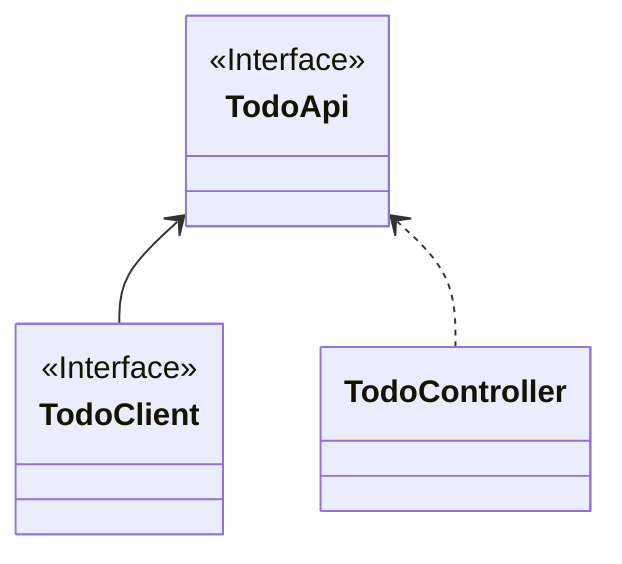

# CoApi - HTTP Client that supports both reactive programming and synchronous programming models

[中文文档](./README.zh-CN.md)

[](https://github.com/Ahoo-Wang/CoApi/blob/mvp/LICENSE)
[](https://github.com/Ahoo-Wang/CoApi/releases)
[](https://maven-badges.herokuapp.com/maven-central/me.ahoo.coapi/coapi-api)
[](https://app.codacy.com/gh/Ahoo-Wang/CoApi/dashboard?utm_source=gh&utm_medium=referral&utm_content=&utm_campaign=Badge_grade)
[](https://codecov.io/gh/Ahoo-Wang/CoApi)
[](https://github.com/Ahoo-Wang/CoApi)
[](https://deepwiki.com/Ahoo-Wang/CoApi)

In Spring Framework 6, a new HTTP client, [Spring6 HTTP Interface](https://docs.spring.io/spring-framework/reference/integration/rest-clients.html#rest-http-interface), has been introduced. This interface allows developers to define HTTP services as Java interfaces using the `@HttpExchange` annotation.

However, the current *Spring* ecosystem does not yet provide support for automatic configuration, and developers need to implement the configuration themselves.

While the *Spring* ecosystem already has [Spring Cloud OpenFeign](https://github.com/spring-cloud/spring-cloud-openfeign), it lacks support for the reactive programming model. To address this, *Spring Cloud OpenFeign* recommends an alternative solution, [feign-reactive](https://github.com/PlaytikaOSS/feign-reactive). However, this alternative is currently not actively maintained and does not support Spring Boot 3.2.x.

**CoApi** is here to help with zero-boilerplate code auto-configuration similar to *Spring Cloud OpenFeign*, as well as support for both reactive and synchronous programming models. Developers only need to define the interface, and it is easy to use.

## Installation

> Use *Gradle(Kotlin)* to install dependencies

```kotlin
implementation("me.ahoo.coapi:coapi-spring-boot-starter")
```

> Use *Gradle(Groovy)* to install dependencies

```groovy
implementation 'me.ahoo.coapi:coapi-spring-boot-starter'
```

> Use *Maven* to install dependencies

```xml
<dependency>
    <groupId>me.ahoo.coapi</groupId>
    <artifactId>coapi-spring-boot-starter</artifactId>
    <version>${coapi.version}</version>
</dependency>
```

## Usage

### Define `CoApi` - a third-party interface

> `baseUrl` : Define the base address of the request, which can be obtained from the configuration file, for example: `baseUrl = "${github.url}"`, `github.url` is the configuration item in the configuration file

```java
@CoApi(baseUrl = "${github.url}")
public interface GitHubApiClient {

    @GetExchange("repos/{owner}/{repo}/issues")
    Flux<Issue> getIssue(@PathVariable String owner, @PathVariable String repo);
}
```

> Configuration：

```yaml
github:
  url: https://api.github.com
```

### Define `CoApi` - Client Load Balancing

```java
@CoApi(serviceId = "github-service")
public interface ServiceApiClient {

    @GetExchange("repos/{owner}/{repo}/issues")
    Flux<Issue> getIssue(@PathVariable String owner, @PathVariable String repo);
}
```

### Using `CoApi`

```kotlin
@RestController
class GithubController(
    private val gitHubApiClient: GitHubApiClient,
    private val serviceApiClient: ServiceApiClient
) {

    @GetMapping("/baseUrl")
    fun baseUrl(): Flux<Issue> {
        return gitHubApiClient.getIssue("Ahoo-Wang", "CoApi")
    }

    @GetMapping("/serviceId")
    fun serviceId(): Flux<Issue> {
        return serviceApiClient.getIssue("Ahoo-Wang", "CoApi")
    }
}
```

## Case Reference

[Example](./example)

### Service Provider

[Example-Provider](./example/example-provider-server)



- `TodoApi` : A common contract between the client consumer and the service provider is defined to prevent the risk of duplicate redundant definitions and to eliminate inconsistencies between the service provider implementation and the client SDK.
- `TodoClient` :The client consumer accesses the service provider's API via `TodoClient`.
- `TodoController` : The service provider is responsible for implementing the `TodoApi` interface.

#### Define API

```kotlin
@HttpExchange("todo")
interface TodoApi {

    @GetExchange
    fun getTodo(): Flux<Todo>
}
```

#### Define Client

```kotlin
@CoApi(serviceId = "provider-service")
interface TodoClient : TodoApi
```

#### Implement API

```kotlin
@RestController
class TodoController : TodoApi {
    override fun getTodo(): Flux<Todo> {
        return Flux.range(1, 10)
            .map {
                Todo("todo-$it")
            }
    }
}
```

### Service Consumer

[Example-Consumer](./example/example-consumer-server)

The service consumer turns on the automatic configuration of the `CoApi` via the `@EnableCoApi` annotation.

```kotlin
@EnableCoApi(clients = [TodoClient::class])
@SpringBootApplication
class ConsumerServer
```

```kotlin
@RestController
class TodoController(private val todoClient: TodoClient) {

    @GetExchange
    fun getProviderTodo(): Flux<Todo> {
        return todoClient.getTodo()
    }
}
```