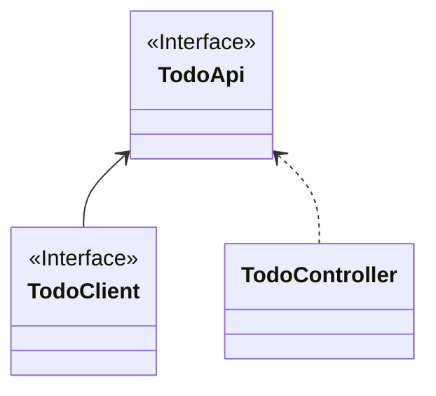

# CoApi - 同时支持响应式编程和同步编程模型的 HTTP 客户端

[英文文档](./README.md)

[](https://github.com/Ahoo-Wang/CoApi/blob/mvp/LICENSE)
[](https://github.com/Ahoo-Wang/CoApi/releases)
[](https://maven-badges.herokuapp.com/maven-central/me.ahoo.coapi/coapi-api)
[](https://app.codacy.com/gh/Ahoo-Wang/CoApi/dashboard?utm_source=gh&utm_medium=referral&utm_content=&utm_campaign=Badge_grade)
[](https://codecov.io/gh/Ahoo-Wang/CoApi)
[](https://github.com/Ahoo-Wang/CoApi)

在 Spring Framework 6 中，引入了全新的 HTTP 客户端 - [Spring6 HTTP Interface](https://docs.spring.io/spring-framework/reference/integration/rest-clients.html#rest-http-interface)。
该接口允许开发者通过使用 `@HttpExchange` 注解将 HTTP 服务定义为 Java 接口。

然而，当前 *Spring* 生态尚未提供自动配置的支持，需要开发者自己实现配置。

虽然 *Spring* 生态中已经存在 [Spring Cloud OpenFeign](https://github.com/spring-cloud/spring-cloud-openfeign) ，但它并未支持响应式编程模型。
为解决这个问题，*Spring Cloud OpenFeign* 推荐了替代方案 [feign-reactive](https://github.com/PlaytikaOSS/feign-reactive)。然而，这个替代方案目前已处于不积极维护状态，并且不支持 Spring Boot `3.2.x`。

**CoApi** 应运而生，它提供了类似于 *Spring Cloud OpenFeign* 的零样板代码自动配置的支持，同时支持响应式编程模型和同步编程模型。开发者只需定义接口，即可轻松使用。

## 安装

> 使用 *Gradle(Kotlin)* 安装依赖

```kotlin
implementation("me.ahoo.coapi:coapi-spring-boot-starter")
```

> 使用 *Gradle(Groovy)* 安装依赖

```groovy
implementation 'me.ahoo.coapi:coapi-spring-boot-starter'
```

> 使用 *Maven* 安装依赖

```xml
<dependency>
    <groupId>me.ahoo.coapi</groupId>
    <artifactId>coapi-spring-boot-starter</artifactId>
    <version>${coapi.version}</version>
</dependency>
```

## 使用

### 定义 `CoApi` - 第三方接口

> `baseUrl` ： 定义请求的基础地址，该参数可以从配置文件中获取，如：`baseUrl = "${github.url}"`，`github.url` 是配置文件中的配置项

```java
@CoApi(baseUrl = "${github.url}")
public interface GitHubApiClient {

    @GetExchange("repos/{owner}/{repo}/issues")
    Flux<Issue> getIssue(@PathVariable String owner, @PathVariable String repo);
}
```

> 配置文件：

```yaml
github:
  url: https://api.github.com
```

### 定义 `CoApi` - 客户端负载均衡

```java
@CoApi(serviceId = "github-service")
public interface ServiceApiClient {

    @GetExchange("repos/{owner}/{repo}/issues")
    Flux<Issue> getIssue(@PathVariable String owner, @PathVariable String repo);
}
```

### 使用 `CoApi`

```kotlin
@RestController
class GithubController(
    private val gitHubApiClient: GitHubApiClient,
    private val serviceApiClient: ServiceApiClient
) {

    @GetMapping("/baseUrl")
    fun baseUrl(): Flux<Issue> {
        return gitHubApiClient.getIssue("Ahoo-Wang", "CoApi")
    }

    @GetMapping("/serviceId")
    fun serviceId(): Flux<Issue> {
        return serviceApiClient.getIssue("Ahoo-Wang", "CoApi")
    }
}
```

## 案例参考

[Example](./example)

### 服务提供者

[Example-Provider](./example/example-provider-server)



- `TodoApi` : 规定了客户端消费方与服务提供者之间的共同契约，旨在防范重复冗余定义的风险，同时消除了服务提供者实现与客户端 SDK 的不一致性。
- `TodoClient` : 客户端消费方通过 `TodoClient` 访问服务提供者的API。
- `TodoController` : 服务提供者负责实现 `TodoApi` 接口。

#### 定义 API

```kotlin
@HttpExchange("todo")
interface TodoApi {

    @GetExchange
    fun getTodo(): Flux<Todo>
}
```

#### 定义 Client

```kotlin
@CoApi(serviceId = "provider-service")
interface TodoClient : TodoApi
```

#### 实现 API

```kotlin
@RestController
class TodoController : TodoApi {
    override fun getTodo(): Flux<Todo> {
        return Flux.range(1, 10)
            .map {
                Todo("todo-$it")
            }
    }
}
```

### 服务消费者

[Example-Consumer](./example/example-consumer-server)

服务消费者通过 `@EnableCoApi` 注解开启 `CoApi` 的自动配置。

```kotlin
@EnableCoApi(clients = [TodoClient::class])
@SpringBootApplication
class ConsumerServer
```

```kotlin
@RestController
class TodoController(private val todoClient: TodoClient) {

    @GetExchange
    fun getProviderTodo(): Flux<Todo> {
        return todoClient.getTodo()
    }
}
```