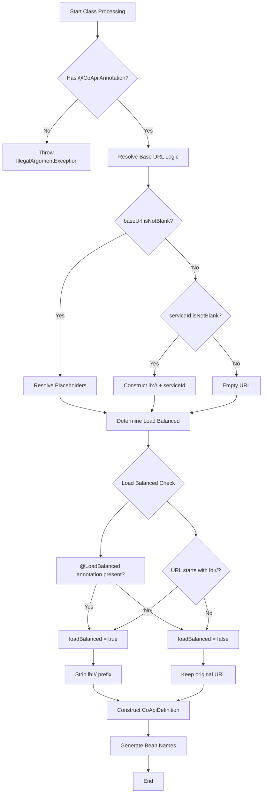
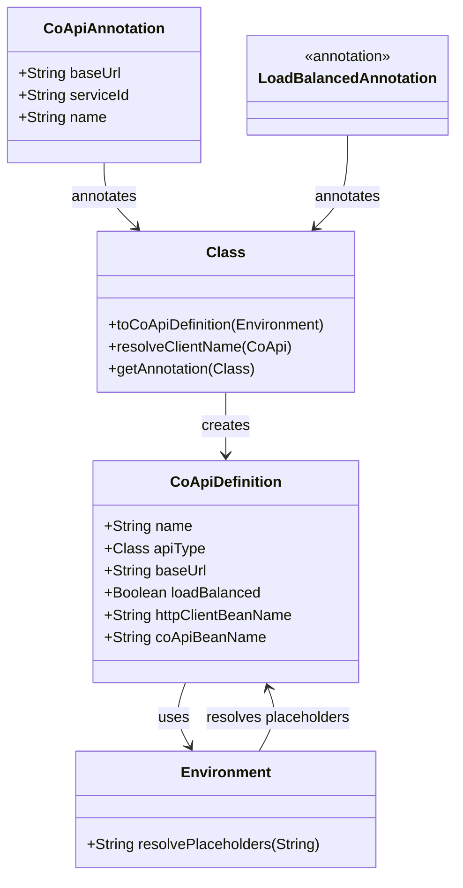
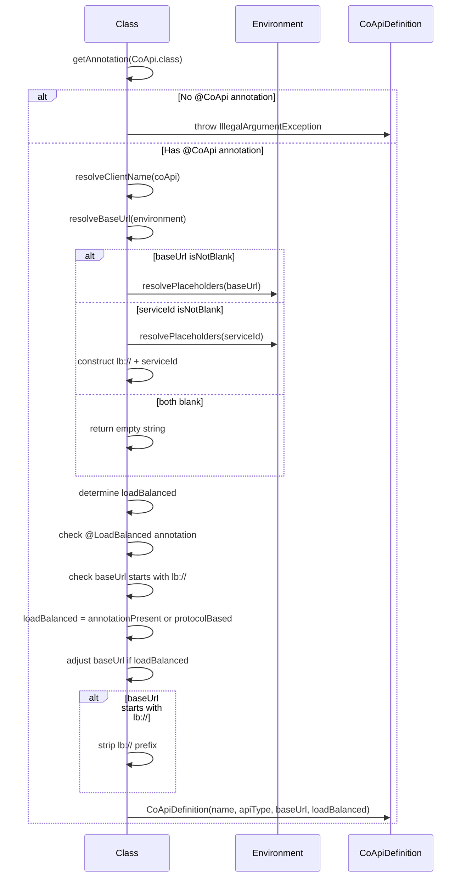
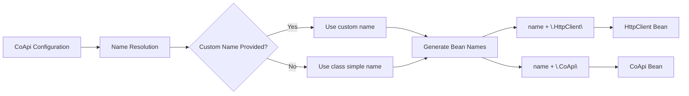

# Annotations

## Overview

CoApi provides a sophisticated annotation-based configuration system that simplifies the integration of distributed service clients. These annotations enable developers to define service endpoints, configure load balancing, and manage service discovery with minimal boilerplate code. The annotation system is designed to be intuitive while providing powerful configuration options for various deployment scenarios.

## At-a-Glance

| Annotation | Target | Purpose | Key Parameters | Default Behavior |
|------------|--------|---------|---------------|-----------------|
| `@CoApi` | Class | Define a service client | `baseUrl`, `serviceId`, `name` | Auto-registers as @Component |
| `@LoadBalanced` | Class | Mark interface as load-balanced | (none) | Requires explicit annotation or `lb://` prefix |

## Core Annotations

### @CoApi Annotation

The `@CoApi` annotation is the cornerstone of the CoApi configuration system. It marks a class as a service client and provides essential configuration parameters.

```kotlin
@Target(AnnotationTarget.CLASS)
@Component
annotation class CoApi(
    val baseUrl: String = "",
    val serviceId: String = "",
    val name: String = ""
)
```

**Key Features:**
- **Automatic Component Registration**: The `@Component` meta-annotation ensures Spring picks up annotated classes during component scanning
- **Flexible URL Configuration**: Supports multiple URL resolution strategies
- **Placeholder Support**: Enables environment variable substitution using `${...}` syntax
- **Protocol Support**: Handles both `lb://` (load-balanced) and `http://` (direct) protocols

**Usage Examples:**

```kotlin
// Direct HTTP connection
@CoApi(baseUrl = "https://api.github.com")
interface GitHubApiClient {
    @GetExchange("repos/{owner}/{repo}/issues")
    fun getIssue(@PathVariable owner: String, @PathVariable repo: String): Flux<Issue>
}

// Load-balanced service with placeholder
@CoApi(baseUrl = "${github.url}")
interface GitHubApiClient {
    // ...
}

// Service-based load balancing
@CoApi(serviceId = "github-service")
interface GitHubApiClient {
    // ...
}

// Custom naming
@CoApi(name = "CustomApi", baseUrl = "lb://github-service")
interface CustomApiClient {
    // ...
}
```

### @LoadBalanced Annotation

The `@LoadBalanced` annotation provides explicit load balancing configuration:

```kotlin
@Target(AnnotationTarget.CLASS)
annotation class LoadBalanced
```

**Purpose:**
- Marks an interface as load-balanced even when not using `lb://` protocol
- Takes precedence over URL-based load balancing determination
- Useful for services that require load balancing but use direct HTTP connections

## URL Resolution Flow

The CoApi system employs a sophisticated URL resolution algorithm that determines the final service endpoint based on annotation configuration:



## Class Hierarchy and Relationships

The annotation system creates a clear hierarchy of components that work together to provide service client functionality:



## Parameter Flow and Processing

The annotation processing follows a systematic flow to transform declarative configuration into runtime-ready service definitions:



## Configuration Examples

### Test Case Analysis

The CoApi system includes comprehensive test cases that demonstrate various configuration scenarios:

```kotlin
// Test Case 1: lb:// protocol
@CoApi(baseUrl = "lb://order-service")
interface LBMockApi

// Result: loadBalanced=true, baseUrl="http://order-service"

// Test Case 2: serviceId configuration
@CoApi(serviceId = "order-service")
interface MockServiceApi

// Result: loadBalanced=true, baseUrl="http://order-service"

// Test Case 3: Empty configuration with @LoadBalanced
@CoApi
@LoadBalanced
interface MockEmptyApi

// Result: loadBalanced=true, baseUrl=""
```

### Real-world Usage Examples

**GitHub API Client with Environment Configuration:**
```kotlin
@CoApi(baseUrl = "${github.url}", name = "GitHubApi")
interface GitHubApiClient {
    @GetExchange("repos/{owner}/{repo}/issues")
    fun getIssue(@PathVariable owner: String, @PathVariable repo: String): Flux<Issue>
}
```

**Service API Client with Service Discovery:**
```kotlin
@CoApi(serviceId = "github-service")
interface ServiceApiClient {
    @GetExchange("repos/{owner}/{repo}/issues")
    fun getIssue(@PathVariable owner: String, @PathVariable repo: String): Flux<Issue>
}
```

## Bean Generation

The annotation system automatically generates Spring bean names based on the configuration:



## Best Practices

1. **Use Descriptive Names**: Always provide meaningful `name` parameters when working with multiple services
2. **Leverage Environment Variables**: Use `${...}` placeholders for configuration that varies between environments
3. **Explicit Load Balancing**: Use `@LoadBalanced` for services that need load balancing regardless of protocol
4. **Protocol Selection**: Use `lb://` for service-discovery-based load balancing and `http://` for direct connections
5. **Error Handling**: Always ensure `@CoApi` annotation is present on service client interfaces

## References

### Source Files
- [api/src/main/kotlin/me/ahoo/coapi/api/CoApi.kt](https://github.com/Ahoo-Wang/CoApi/blob/main/api/src/main/kotlin/me/ahoo/coapi/api/CoApi.kt) - Main CoApi annotation definition
- [api/src/main/kotlin/me/ahoo/coapi/api/LoadBalanced.kt](https://github.com/Ahoo-Wang/CoApi/blob/main/api/src/main/kotlin/me/ahoo/coapi/api/LoadBalanced.kt) - Load balancing annotation
- [spring/src/main/kotlin/me/ahoo/coapi/spring/CoApiDefinition.kt](https://github.com/Ahoo-Wang/CoApi/blob/main/spring/src/main/kotlin/me/ahoo/coapi/spring/CoApiDefinition.kt) - Configuration parsing logic
- [spring/src/test/kotlin/me/ahoo/coapi/spring/CoApiDefinitionTest.kt](https://github.com/Ahoo-Wang/CoApi/blob/main/spring/src/test/kotlin/me/ahoo/coapi/spring/CoApiDefinitionTest.kt) - Test cases
- [example/example-consumer-client/src/main/kotlin/me/ahoo/coapi/example/consumer/client/GitHubApiClient.kt](https://github.com/Ahoo-Wang/CoApi/blob/main/example/example-consumer-client/src/main/kotlin/me/ahoo/coapi/example/consumer/client/GitHubApiClient.kt) - Example implementation
- [example/example-consumer-client/src/main/kotlin/me/ahoo/coapi/example/consumer/client/ServiceApiClient.kt](https://github.com/Ahoo-Wang/CoApi/blob/main/example/example-consumer-client/src/main/kotlin/me/ahoo/coapi/example/consumer/client/ServiceApiClient.kt) - Service discovery example

### Related Pages
- [Configuration](../getting-started/configuration.md) - Detailed configuration guide
- [Service Discovery](./load-balancing.md) - Load balancing and service discovery
- [Testing](.md) - Testing strategies for CoApi clients
- [Examples](./examples.md) - Complete usage examples
