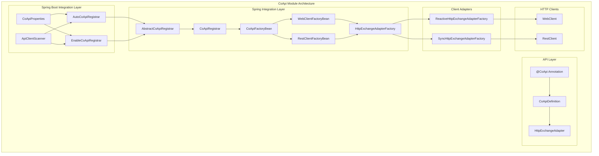
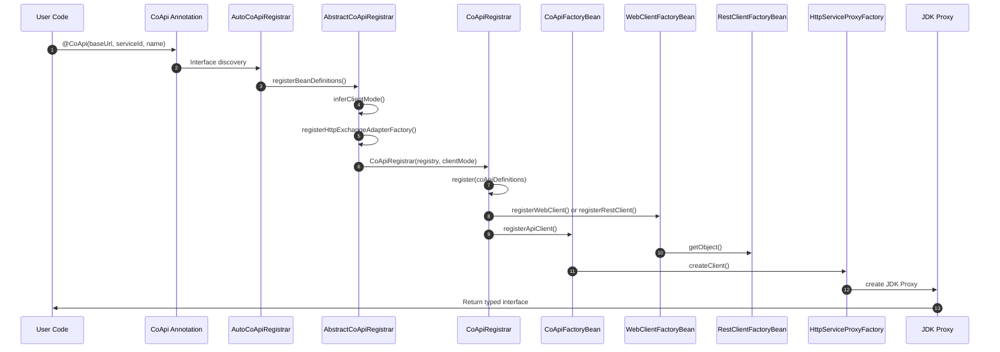
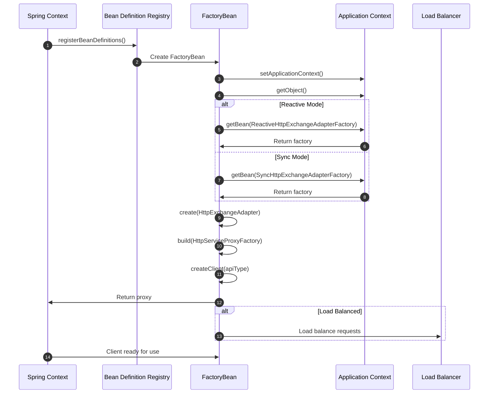
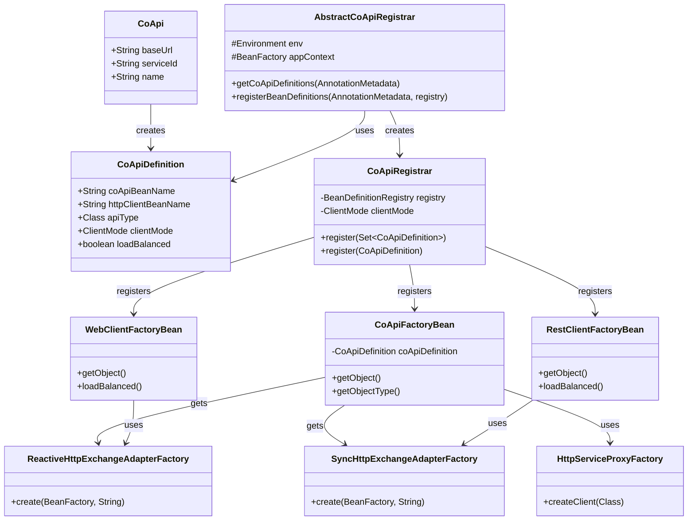
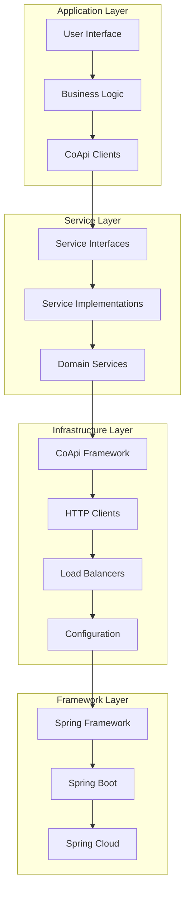

# Architecture Overview

CoApi's architecture is designed to provide a seamless, type-safe HTTP client framework that integrates deeply with Spring ecosystem while maintaining flexibility for various deployment scenarios. The architecture addresses the common challenges of REST API client development by providing automatic discovery, configuration management, and support for both reactive and synchronous programming models.

## Overview

CoApi exists to solve the fundamental problem of creating type-safe HTTP clients in Spring applications without the boilerplate code typically associated with manual HTTP client configuration. By leveraging Spring's auto-configuration capabilities and annotation-driven programming model, CoApi reduces the complexity of integrating with external services while providing enterprise-grade features like load balancing, circuit breaking, and configuration management.

The architecture follows a modular design that separates concerns across three main layers: the API layer (for interface definitions), the Spring integration layer (for dependency injection and lifecycle management), and the Spring Boot integration layer (for auto-configuration and sensible defaults).

## At-a-Glance

| Component | Responsibility | Key Features | Source |
|----------|---------------|---------------|--------|
| `@CoApi` | Interface definition and configuration | Type-safe HTTP clients, service discovery, load balancing | [CoApi.kt](https://github.com/Ahoo-Wang/CoApi/blob/main/api/src/main/kotlin/me/ahoo/coapi/api/CoApi.kt#L61) |
| `AbstractCoApiRegistrar` | Base registration logic | Client mode inference, factory registration | [AbstractCoApiRegistrar.kt](https://github.com/Ahoo-Wang/CoApi/blob/main/spring/src/main/kotlin/me/ahoo/coapi/spring/AbstractCoApiRegistrar.kt#L28) |
| `CoApiRegistrar` | Individual client registration | Bean definition creation, factory bean registration | [CoApiRegistrar.kt](https://github.com/Ahoo-Wang/CoApi/blob/main/spring/src/main/kotlin/me/ahoo/coapi/spring/CoApiRegistrar.kt#L22) |
| `CoApiFactoryBean` | Proxy creation | JDK proxy generation, service proxy factory | [CoApiFactoryBean.kt](https://github.com/Ahoo-Wang/CoApi/blob/main/spring/src/main/kotlin/me/ahoo/coapi/spring/CoApiFactoryBean.kt#L21) |
| `HttpClientFactoryBean` | HTTP client configuration | WebClient/RestClient creation, filter application | [WebClientFactoryBean.kt](https://github.com/Ahoo-Wang/CoApi/blob/main/spring/src/main/kotlin/me/ahoo/coapi/spring/client/reactive/WebClientFactoryBean.kt#L20) |

## Module Architecture

## Registration Flow

The registration process is the heart of CoApi's architecture, automatically discovering and configuring HTTP clients based on annotations and configuration. This sequence diagram illustrates the complete registration flow:

<!-- Sources: [AutoCoApiRegistrar.kt](https://github.com/Ahoo-Wang/CoApi/blob/main/spring-boot-starter/src/main/kotlin/me/ahoo/coapi/spring/boot/starter/AutoCoApiRegistrar.kt#L28), [AbstractCoApiRegistrar.kt](https://github.com/Ahoo-Wang/CoApi/blob/main/spring/src/main/kotlin/me/ahoo/coapi/spring/AbstractCoApiRegistrar.kt#L42), [CoApiRegistrar.kt](https://github.com/Ahoo-Wang/CoApi/blob/main/spring/src/main/kotlin/me/ahoo/coapi/spring/CoApiRegistrar.kt#L27), [CoApiFactoryBean.kt](https://github.com/Ahoo-Wang/CoApi/blob/main/spring/src/main/kotlin/me/ahoo/coapi/spring/CoApiFactoryBean.kt#L26), [WebClientFactoryBean.kt](https://github.com/Ahoo-Wang/CoApi/blob/main/spring/src/main/kotlin/me/ahoo/coapi/spring/client/reactive/WebClientFactoryBean.kt#L23) -->

## Bean Lifecycle

The Spring bean lifecycle is carefully managed to ensure proper initialization and dependency injection:

<!-- Sources: [CoApiFactoryBean.kt](https://github.com/Ahoo-Wang/CoApi/blob/main/spring/src/main/kotlin/me/ahoo/coapi/spring/CoApiFactoryBean.kt#L40), [AbstractCoApiRegistrar.kt](https://github.com/Ahoo-Wang/CoApi/blob/main/spring/src/main/kotlin/me/ahoo/coapi/spring/AbstractCoApiRegistrar.kt#L52), [CoApiFactoryBean.kt](https://github.com/Ahoo-Wang/CoApi/blob/main/spring/src/main/kotlin/me/ahoo/coapi/spring/CoApiFactoryBean.kt#L26) -->

## Class Diagram

The class hierarchy shows the relationships between key components:

<!-- Sources: [CoApi.kt](https://github.com/Ahoo-Wang/CoApi/blob/main/api/src/main/kotlin/me/ahoo/coapi/api/CoApi.kt#L63), [CoApiDefinition.kt](https://github.com/Ahoo-Wang/CoApi/blob/main/spring/src/main/kotlin/me/ahoo/coapi/spring/CoApiDefinition.kt), [AbstractCoApiRegistrar.kt](https://github.com/Ahoo-Wang/CoApi/blob/main/spring/src/main/kotlin/me/ahoo/coapi/spring/AbstractCoApiRegistrar.kt#L28), [CoApiRegistrar.kt](https://github.com/Ahoo-Wang/CoApi/blob/main/spring/src/main/kotlin/me/ahoo/coapi/spring/CoApiRegistrar.kt#L22), [CoApiFactoryBean.kt](https://github.com/Ahoo-Wang/CoApi/blob/main/spring/src/main/kotlin/me/ahoo/coapi/spring/CoApiFactoryBean.kt#L21), [WebClientFactoryBean.kt](https://github.com/Ahoo-Wang/CoApi/blob/main/spring/src/main/kotlin/me/ahoo/coapi/spring/client/reactive/WebClientFactoryBean.kt#L20), [RestClientFactoryBean.kt](https://github.com/Ahoo-Wang/CoApi/blob/main/spring/src/main/kotlin/me/ahoo/coapi/spring/client/sync/RestClientFactoryBean.kt#L21) -->

## Layered Architecture

The architecture follows a clean layered approach with clear separation of concerns:

<!-- Sources: [CoApi.kt](https://github.com/Ahoo-Wang/CoApi/blob/main/api/src/main/kotlin/me/ahoo/coapi/api/CoApi.kt#L14), [AbstractCoApiRegistrar.kt](https://github.com/Ahoo-Wang/CoApi/blob/main/spring/src/main/kotlin/me/ahoo/coapi/spring/AbstractCoApiRegistrar.kt#L14), [CoApiRegistrar.kt](https://github.com/Ahoo-Wang/CoApi/blob/main/spring/src/main/kotlin/me/ahoo/coapi/spring/CoApiRegistrar.kt#L14) -->

## Key Design Patterns

CoApi's architecture implements several design patterns to ensure maintainability and extensibility:

### 1. Factory Pattern
Factory beans are used to create complex objects like HTTP clients and proxies with proper configuration.

### 2. Strategy Pattern
Different client modes (reactive vs sync) are handled using the Strategy pattern with different factory implementations.

### 3. Template Method Pattern
Abstract factory classes provide common functionality while allowing specific implementations.

### 4. Proxy Pattern
JDK proxies are used to create type-safe interfaces that delegate to HTTP clients.

### 5. Builder Pattern
HttpServiceProxyFactory and client builders use the Builder pattern for fluent configuration.

## Cross-References

- [Getting Started](../getting-started/index.md) - Introduction to CoApi basics
- [Configuration Reference](../getting-started/configuration.md) - Complete configuration guide
- [Client Modes](
- [Spring Boot Integration](.md) - Spring Boot specific patterns
- [Annotations](./annotations/annotations.md) - Annotation-based configuration

## References

### Source Files

- [CoApi.kt](https://github.com/Ahoo-Wang/CoApi/blob/main/api/src/main/kotlin/me/ahoo/coapi/api/CoApi.kt) - Main annotation interface
- [AutoCoApiRegistrar.kt](https://github.com/Ahoo-Wang/CoApi/blob/main/spring-boot-starter/src/main/kotlin/me/ahoo/coapi/spring/boot/starter/AutoCoApiRegistrar.kt) - Auto-configuration registration
- [EnableCoApiRegistrar.kt](https://github.com/Ahoo-Wang/CoApi/blob/main/spring/src/main/kotlin/me/ahoo/coapi/spring/EnableCoApiRegistrar.kt) - Manual registration
- [AbstractCoApiRegistrar.kt](https://github.com/Ahoo-Wang/CoApi/blob/main/spring/src/main/kotlin/me/ahoo/coapi/spring/AbstractCoApiRegistrar.kt) - Base registration logic
- [CoApiRegistrar.kt](https://github.com/Ahoo-Wang/CoApi/blob/main/spring/src/main/kotlin/me/ahoo/coapi/spring/CoApiRegistrar.kt) - Individual client registration
- [CoApiFactoryBean.kt](https://github.com/Ahoo-Wang/CoApi/blob/main/spring/src/main/kotlin/me/ahoo/coapi/spring/CoApiFactoryBean.kt) - Proxy creation factory
- [WebClientFactoryBean.kt](https://github.com/Ahoo-Wang/CoApi/blob/main/spring/src/main/kotlin/me/ahoo/coapi/spring/client/reactive/WebClientFactoryBean.kt) - Reactive HTTP client factory
- [RestClientFactoryBean.kt](https://github.com/Ahoo-Wang/CoApi/blob/main/spring/src/main/kotlin/me/ahoo/coapi/spring/client/sync/RestClientFactoryBean.kt) - Synchronous HTTP client factory

### Related Pages

- [Module Architecture](
- [Registration Process](
- [Bean Lifecycle](
- [Design Patterns](
- [Performance Considerations](.md) - Performance optimization guidelines
