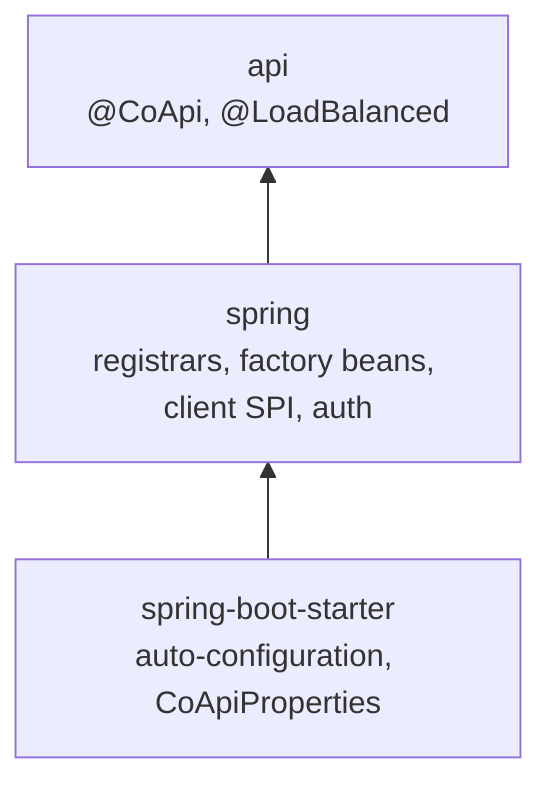
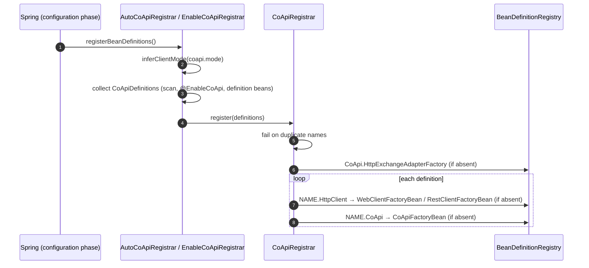

# Architecture

This page is for people changing CoApi itself. To use CoApi, start with the [Quick Start](../getting-started/quick-start.md).

## Modules

```mermaid
graph BT
    api["api<br>@CoApi, @LoadBalanced"]
    spring["spring<br>registrars, factory beans, client SPI, auth"]
    starter["spring-boot-starter<br>auto-configuration, CoApiProperties"]
    spring --> api
    starter --> spring
```

| Module | Depends on | Owns |
|--------|------------|------|
| `api` | `spring-context` (compile only) | The annotations. Nothing else, so client modules stay light. |
| `spring` | `api`, `spring-web` | Everything that works without Spring Boot. Optional feature variants: `reactiveSupport` (WebClient), `lbSupport` (Spring Cloud Commons), `jwtSupport` (java-jwt). |
| `spring-boot-starter` | `spring`, `spring-boot-starter` | Classpath scanning, `coapi.*` binding, `CoApiDefinition` bean collection. Optional feature variants: `reactiveSupport`, `syncSupport`. |
| `bom`, `dependencies` | | Published version alignment, and the internal version platform for the build |

The optional dependencies in `spring` are why load-balancing and reactive classes are only touched when they are needed. See [design rules](#design-rules).

## Registration flow

```mermaid
sequenceDiagram
    autonumber
    participant Boot as Spring (configuration phase)
    participant R as AutoCoApiRegistrar / EnableCoApiRegistrar
    participant CR as CoApiRegistrar
    participant Reg as BeanDefinitionRegistry
    Boot->>R: registerBeanDefinitions()
    R->>R: inferClientMode(coapi.mode)
    R->>R: collect CoApiDefinitions (scan, @EnableCoApi, definition beans)
    R->>CR: register(definitions)
    CR->>CR: fail on duplicate names
    CR->>Reg: CoApi.HttpExchangeAdapterFactory (if absent)
    loop each definition
        CR->>Reg: NAME.HttpClient → WebClientFactoryBean / RestClientFactoryBean (if absent)
        CR->>Reg: NAME.CoApi → CoApiFactoryBean (if absent)
    end
```

- `AbstractCoApiRegistrar` is a template. Subclasses only decide **which** definitions exist, and `CoApiRegistrar` decides **how** they are registered.
- `AutoCoApiRegistrar` (starter) scans the auto-configuration packages plus `coapi.base-packages`, loading classes with the application's bean class loader (this matters under DevTools). It also collects static `CoApiDefinition` beans. It binds `coapi.base-packages` directly with `Binder`, because it runs before `CoApiProperties` exists.
- `EnableCoApiRegistrar` (spring) reads `@EnableCoApi(clients)`.
- `CoApiDefinition.toCoApiDefinition()` parses the annotation: name, placeholder resolution, `serviceId` → `lb://`, then `normalize()` (`lb://` → `http://` + `loadBalanced`).

## Bean graph per client

At runtime, when the proxy is first needed:

1. `CoApiFactoryBean` looks up the `HttpExchangeAdapterFactory`: the unique bean, else the `@Primary` one, else the one named `CoApi.HttpExchangeAdapterFactory`.
2. The adapter factory fetches the `<name>.HttpClient` bean, which triggers `WebClientFactoryBean` / `RestClientFactoryBean`:
   1. `effectiveDefinition()` = `ClientProperties.resolve(definition)` → `CoApiDefinition.withOverrides()`;
   2. builder bean → base URL → configured filters/interceptors (by name, then type) → load balancer if `loadBalanced` → ordered `*BuilderCustomizer` beans → `build()`.
3. The adapter wraps the client, and `HttpServiceProxyFactory` creates the interface proxy.

## Design rules

These rules are deliberate. Keep them when changing code.

- **Applications can override every bean.** `CoApiRegistrar` never replaces an existing bean definition.
- **One owner per rule.** URL and load-balancing precedence lives only in `CoApiDefinition` (`normalize`, `withOverrides`). Factory beans and customizers consume the effective definition, and never re-derive it.
- **Optional dependencies stay optional.** Spring Cloud types are referenced only from the `internal` `LoadBalanced*BuilderCustomizer` classes, which are loaded only for load-balanced clients. Before loading them, `requireLoadBalancerSupport` turns a would-be `NoClassDefFoundError` into an actionable message.
- **Fail fast at startup** with messages that name the client and the fix: invalid mode, duplicate name, unresolvable placeholder, missing load balancer, non-static `CoApiDefinition` bean.
- **Extension by composition.** Factory beans are final. Behavior is added through customizer beans and the optional `ClientProperties` / `ReactiveClientProperties` / `SyncClientProperties` roles, each with an `Empty` fallback.

## Where to change what

| Change | Files | Tests |
|--------|-------|-------|
| URL / load-balancing precedence | `spring/.../CoApiDefinition.kt` | `CoApiDefinitionTest`, `ClientPropertiesTest` |
| Client build pipeline | `spring/.../client/reactive/WebClientFactoryBean.kt`, `spring/.../client/sync/RestClientFactoryBean.kt`, `AbstractHttpClientFactoryBean.kt` | `WebClientFactoryBeanTest`, `RestClientFactoryBeanTest` |
| Mode selection | `spring/.../ClientMode.kt` | `ClientModeTest` |
| Bean registration | `spring/.../CoApiRegistrar.kt` | `CoApiRegistrarTest`, `CoApiContextTest` |
| Scanning / Boot properties | `spring-boot-starter/.../AutoCoApiRegistrar.kt`, `CoApiProperties.kt` | `CoApiAutoConfigurationTest`, `CoApiPropertiesTest` |
| Auth filters | `spring/.../client/reactive/auth/` | `auth/*Test` |

Process, CI gates and release steps are in [CONTRIBUTING.md](https://github.com/Ahoo-Wang/CoApi/blob/main/CONTRIBUTING.md).
