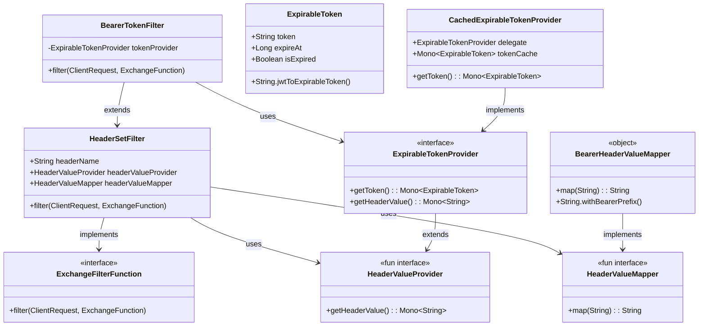
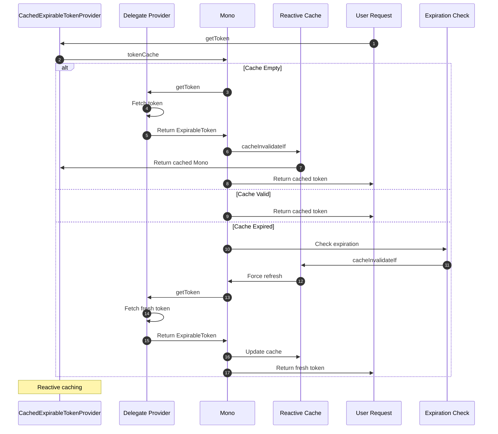
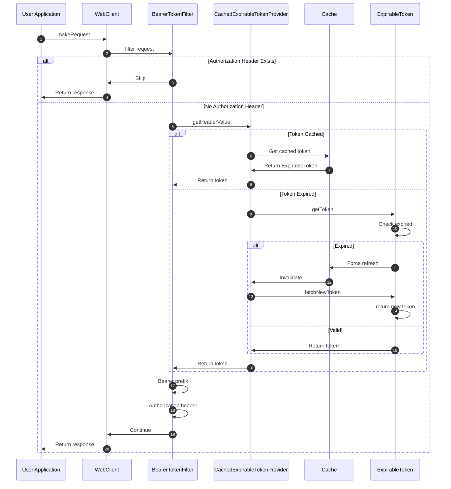
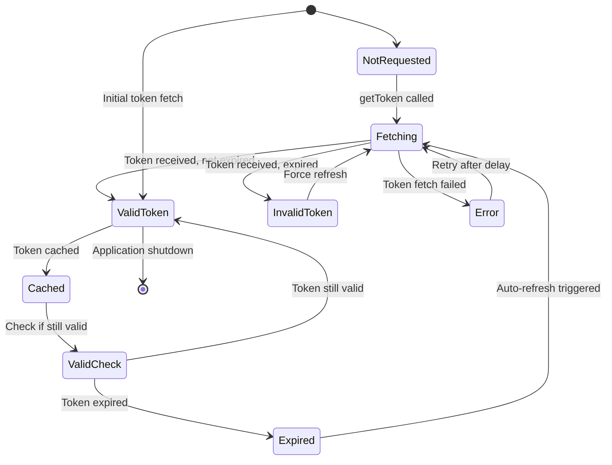

# Authentication

CoApi provides a robust authentication system that integrates seamlessly with Spring WebFlux reactive programming model. The authentication framework supports token-based authentication with automatic caching and expiry management, ensuring secure and efficient communication with external APIs while maintaining type safety and reactive principles.

## Overview

The authentication system in CoApi is designed to handle the common requirements of modern API authentication, particularly JWT (JSON Web Token) based authentication with Bearer tokens. The framework provides reusable components that can be easily configured and composed to meet various authentication scenarios, from simple static tokens to complex dynamic token providers with automatic refresh capabilities.

The authentication layer leverages Spring WebFlux's reactive programming model throughout, ensuring non-blocking operation and efficient resource utilization. The architecture follows a modular design with clear separation of concerns between token providers, header mappers, and request filters.

## At-a-Glance

| Component | Responsibility | Key Features | Source |
|----------|---------------|---------------|--------|
| `HeaderSetFilter` | Generic header injection on requests | Configurable header names, value providers, mappers | [HeaderSetFilter.kt:22](https://github.com/Ahoo-Wang/CoApi/blob/main/spring/src/main/kotlin/me/ahoo/coapi/spring/client/reactive/auth/HeaderSetFilter.kt#L22) |
| `BearerTokenFilter` | Authorization header injection | Bearer token prefix, token provider integration | [BearerTokenFilter.kt:18](https://github.com/Ahoo-Wang/CoApi/blob/main/spring/src/main/kotlin/me/ahoo/coapi/spring/client/reactive/auth/BearerTokenFilter.kt#L18) |
| `ExpirableToken` | Token with expiration information | JWT expiry detection, time-based validation | [ExpirableToken.kt:19](https://github.com/Ahoo-Wang/CoApi/blob/main/spring/src/main/kotlin/me/ahoo/coapi/spring/client/reactive/auth/ExpirableTokenProvider.kt#L19) |
| `ExpirableTokenProvider` | Token provider interface | Reactive token fetching, header value mapping | [ExpirableTokenProvider.kt:33](https://github.com/Ahoo-Wang/CoApi/blob/main/spring/src/main/kotlin/me/ahoo/coapi/spring/client/reactive/auth/ExpirableTokenProvider.kt#L33) |
| `CachedExpirableTokenProvider` | Cached token provider | Reactive caching, automatic expiry invalidation | [CachedExpirableTokenProvider.kt:19](https://github.com/Ahoo-Wang/CoApi/blob/main/spring/src/main/kotlin/me/ahoo/coapi/spring/client/reactive/auth/CachedExpirableTokenProvider.kt#L19) |

## Class Hierarchy

The authentication framework follows a clean inheritance hierarchy with clear responsibilities:



## Token Caching Flow

The reactive caching mechanism ensures efficient token management while maintaining thread safety and automatic invalidation:



## Request Authentication Flow

The complete authentication flow demonstrates how Bearer tokens are automatically added to HTTP requests:



## JWT Expiry Check State Diagram

The token management system handles JWT expiry checks through a state machine approach:



## Core Components

### HeaderSetFilter

The `HeaderSetFilter` is a generic reactive filter that can set any header on HTTP requests. It follows the Spring WebFlux `ExchangeFilterFunction` interface and provides a flexible way to inject headers into requests.

```kotlin
open class HeaderSetFilter(
    private val headerName: String,
    private val headerValueProvider: HeaderValueProvider,
    private val headerValueMapper: HeaderValueMapper = HeaderValueMapper.IDENTITY
) : ExchangeFilterFunction {
    override fun filter(request: ClientRequest, next: ExchangeFunction): Mono<ClientResponse> {
        if (request.headers().containsHeader(headerName)) {
            return next.exchange(request)
        }
        return headerValueProvider.getHeaderValue()
            .map { headerValue ->
                ClientRequest.from(request)
                    .headers { headers ->
                        headers[headerName] = headerValueMapper.map(headerValue)
                    }
                    .build()
            }
            .flatMap { next.exchange(it) }
    }
}
```

The filter first checks if the header already exists in the request to avoid overwriting existing values. If the header is not present, it retrieves the header value from the provider, maps it using the configured mapper, and sets it on the request before proceeding to the next exchange function.

### BearerTokenFilter

The `BearerTokenFilter` is a specialized version of `HeaderSetFilter` that specifically handles Bearer token authentication. It extends the base filter with pre-configured values for the `Authorization` header and the Bearer token prefix.

```kotlin
class BearerTokenFilter(tokenProvider: ExpirableTokenProvider) :
    HeaderSetFilter(
        headerName = HttpHeaders.AUTHORIZATION,
        headerValueProvider = tokenProvider,
        headerValueMapper = BearerHeaderValueMapper
    )
```

The `BearerHeaderValueMapper` ensures that all token values are prefixed with "Bearer " according to the OAuth 2.0 Bearer Token specification.

### ExpirableToken

The `ExpirableToken` data class wraps a token string with its expiration timestamp, providing convenient methods for checking if the token has expired.

```kotlin
data class ExpirableToken(val token: String, val expireAt: Long) {
    val isExpired: Boolean
        get() = System.currentTimeMillis() > expireAt

    companion object {
        private val jwtParser = JWT()
        fun String.jwtToExpirableToken(): ExpirableToken {
            val decodedJWT = jwtParser.decodeJwt(this)
            val expiresAt = checkNotNull(decodedJWT.expiresAt)
            return ExpirableToken(this, expiresAt.time)
        }
    }
}
```

The companion object provides a convenient extension function to convert JWT strings to `ExpirableToken` instances by decoding the JWT and extracting the expiration timestamp.

### CachedExpirableTokenProvider

The `CachedExpirableTokenProvider` implements reactive caching using Project Reactor's `Mono.cacheInvalidateIf` operator. This provides thread-safe caching with automatic invalidation when tokens expire.

```kotlin
class CachedExpirableTokenProvider(tokenProvider: ExpirableTokenProvider) : ExpirableTokenProvider {
    private val tokenCache: Mono<ExpirableToken> = tokenProvider.getToken()
        .cacheInvalidateIf {
            log.debug { "CacheInvalidateIf - isExpired:${it.isExpired}" }
            it.isExpired
        }

    override fun getToken(): Mono<ExpirableToken> {
        return tokenCache
    }
}
```

The cache automatically invalidates and refreshes tokens when they expire, ensuring that always-valid tokens are used without manual intervention.

## Configuration Examples

### Basic Bearer Token Authentication

```kotlin
@Configuration
class AuthenticationConfig {
    
    @Bean
    fun tokenProvider(): ExpirableTokenProvider {
        return object : ExpirableTokenProvider {
            override fun getToken(): Mono<ExpirableToken> {
                return Mono.just(
                    ExpirableToken(
                        token = "your.jwt.token",
                        expireAt = System.currentTimeMillis() + 3600000 // 1 hour
                    )
                )
            }
        }
    }
    
    @Bean
    fun authenticationFilter(): BearerTokenFilter {
        return BearerTokenFilter(tokenProvider())
    }
}
```

### Dynamic Token Provider with JWT Decoding

```kotlin
@Configuration
class DynamicAuthenticationConfig {
    
    @Bean
    fun jwtTokenProvider(): ExpirableTokenProvider {
        return object : ExpirableTokenProvider {
            override fun getToken(): Mono<ExpirableToken> {
                return Mono.fromCallable {
                    // Fetch token from external source (e.g., OAuth service)
                    val jwtToken = fetchTokenFromAuthService()
                    jwtToken.jwtToExpirableToken()
                }
            }
            
            private fun fetchTokenFromAuthService(): String {
                // Implementation to fetch JWT from authentication service
                return "dynamic.jwt.token"
            }
        }
    }
    
    @Bean
    fun cachedTokenProvider(): ExpirableTokenProvider {
        return CachedExpirableTokenProvider(jwtTokenProvider())
    }
}
```

### WebClient Integration

```kotlin
@Configuration
class WebClientConfig {
    
    @Bean
    fun webClient(builder: WebClient.Builder): WebClient {
        return builder
            .filter(authenticationFilter())
            .build()
    }
    
    @Bean
    fun authenticationFilter(): ExchangeFilterFunction {
        return BearerTokenFilter(cachedTokenProvider())
    }
}
```

## Cross-References

- [Getting Started](../getting-started/index.md) - Introduction to CoApi basics
- [Client Modes](./client-modes.md) - Understanding reactive vs sync operation
- [Spring Boot Integration](.md) - Spring Boot specific patterns
- [Configuration Reference](../getting-started/configuration.md) - Complete configuration guide
- [Annotations](./annotations.md) - Annotation-based configuration

## References

### Source Files

- [HeaderSetFilter.kt](https://github.com/Ahoo-Wang/CoApi/blob/main/spring/src/main/kotlin/me/ahoo/coapi/spring/client/reactive/auth/HeaderSetFilter.kt) - Generic header injection filter
- [BearerTokenFilter.kt](https://github.com/Ahoo-Wang/CoApi/blob/main/spring/src/main/kotlin/me/ahoo/coapi/spring/client/reactive/auth/BearerTokenFilter.kt) - Bearer token authentication filter
- [ExpirableToken.kt](https://github.com/Ahoo-Wang/CoApi/blob/main/spring/src/main/kotlin/me/ahoo/coapi/spring/client/reactive/auth/ExpirableTokenProvider.kt) - Token with expiration support
- [CachedExpirableTokenProvider.kt](https://github.com/Ahoo-Wang/CoApi/blob/main/spring/src/main/kotlin/me/ahoo/coapi/spring/client/reactive/auth/CachedExpirableTokenProvider.kt) - Reactive caching implementation
- [BearerHeaderValueMapper.kt](https://github.com/Ahoo-Wang/CoApi/blob/main/spring/src/main/kotlin/me/ahoo/coapi/spring/client/reactive/auth/BearerTokenFilter.kt) - Bearer token prefix mapping

### Related Pages

- [Client Modes](./client-modes.md) - Understanding reactive vs sync operation
- [Configuration Reference](../getting-started/configuration.md) - Complete configuration guide
- [Spring Boot Integration](.md) - Spring Boot specific patterns
- [Load Balancing](./load-balancing.md) - Load balancing integration
- [Architecture Overview](./architecture.md) - System architecture and design
