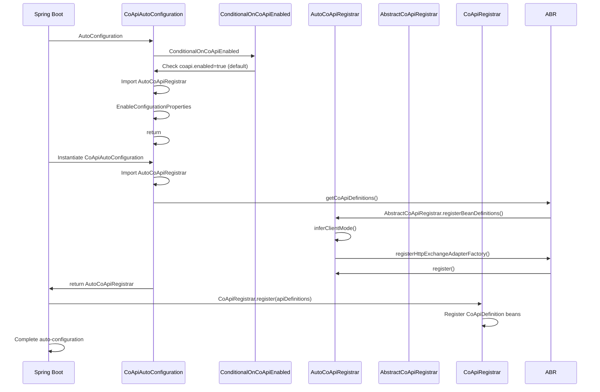
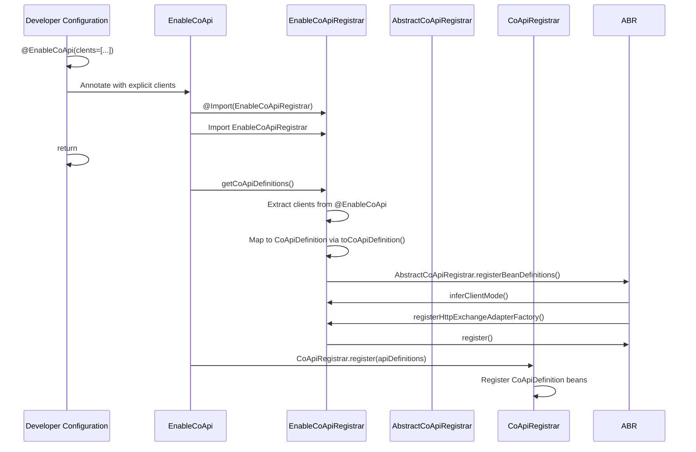
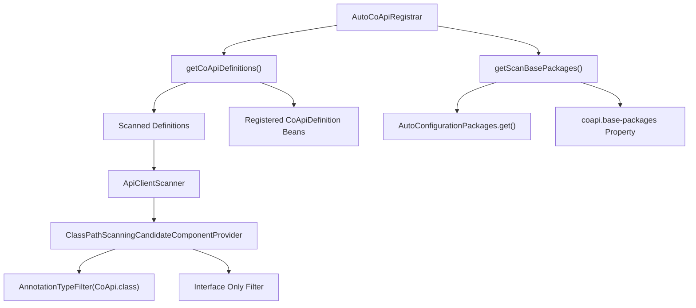
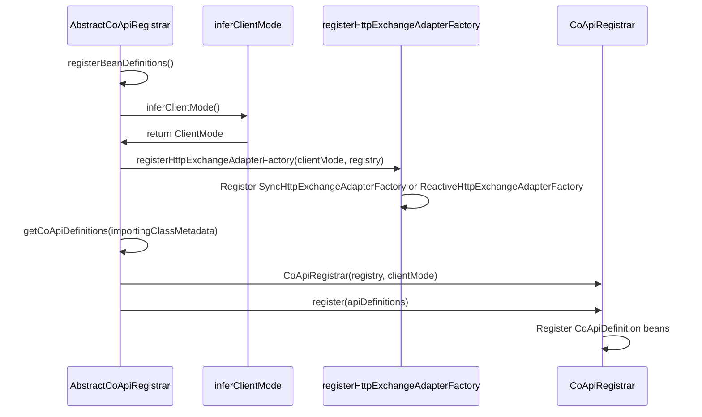
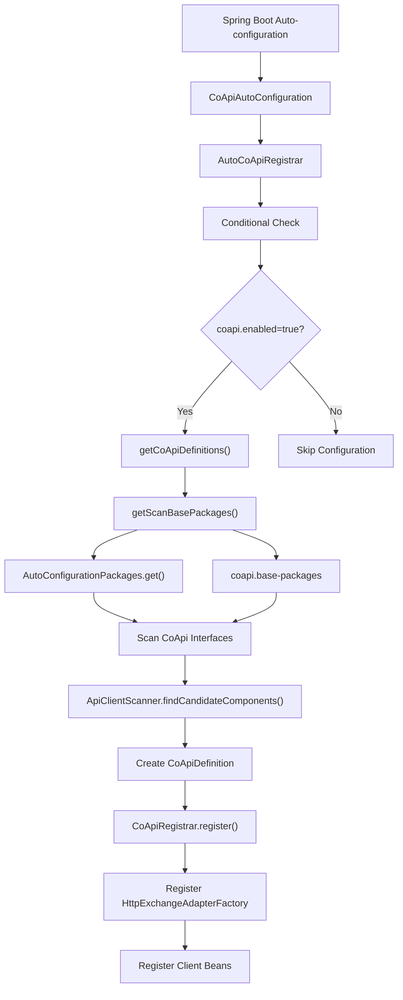

# Auto-configuration

CoApi provides comprehensive Spring Boot auto-configuration that simplifies the setup process while maintaining flexibility for custom configurations. The framework supports two distinct activation paths to accommodate different use cases and development preferences.

## Overview

CoApi's auto-configuration system is designed to automatically detect and configure CoApi clients based on classpath scanning and explicit configuration. The system leverages Spring Boot's conditional configuration mechanism to ensure that CoApi components are only registered when needed, providing a seamless integration experience.

The auto-configuration is built around a modular architecture that combines automatic scanning with manual configuration options, allowing developers to choose the approach that best fits their application architecture.

## At-a-Glance

| Feature | Auto Configuration | Manual Configuration |
|---------|-------------------|---------------------|
| **Activation** | Spring Boot auto-configuration | `@EnableCoApi` annotation |
| **Scanning** | Automatic classpath scanning | Explicit client specification |
| **Base Packages** | `@SpringBootApplication` + `coapi.base-packages` | Annotation attributes |
| **Flexibility** | High (combines scanning + registered beans) | Medium (explicit control) |
| **Setup Complexity** | Low (zero configuration) | Low (minimal annotation setup) |

## Activation Paths

### Auto (Spring Boot) Configuration Path



### Manual Configuration Path



## Auto-Configuration Components

### CoApiAutoConfiguration

The main auto-configuration class that orchestrates the entire setup process:

```kotlin
@AutoConfiguration
@ConditionalOnCoApiEnabled
@Import(AutoCoApiRegistrar::class)
@EnableConfigurationProperties(CoApiProperties::class)
class CoApiAutoConfiguration
```

This class serves as the entry point for automatic configuration and delegates the actual registration to specialized components.

[`spring-boot-starter/src/main/kotlin/me/ahoo/coapi/spring/boot/starter/CoApiAutoConfiguration.kt:20`](https://github.com/Ahoo-Wang/CoApi/blob/main/spring-boot-starter/src/main/kotlin/me/ahoo/coapi/spring/boot/starter/CoApiAutoConfiguration.kt#L20)

### ConditionalOnCoApiEnabled

Controls whether CoApi auto-configuration should be enabled:

```kotlin
@ConditionalOnProperty(
    value = [ConditionalOnCoApiEnabled.ENABLED_KEY],
    matchIfMissing = true,
    havingValue = "true",
)
annotation class ConditionalOnCoApiEnabled {
    companion object {
        const val ENABLED_KEY: String = COAPI_PREFIX + ENABLED_SUFFIX_KEY
    }
}
```

The configuration is enabled by default and can be disabled by setting `coapi.enabled=false` in application properties.

[`spring-boot-starter/src/main/kotlin/me/ahoo/coapi/spring/boot/starter/ConditionalOnCoApiEnabled.kt:18`](https://github.com/Ahoo-Wang/CoApi/blob/main/spring-boot-starter/src/main/kotlin/me/ahoo/coapi/spring/boot/starter/ConditionalOnCoApiEnabled.kt#L18)

### AutoCoApiRegistrar

Handles automatic scanning and registration of CoApi clients:



The registrar combines automatically scanned interface definitions with any explicitly registered `CoApiDefinition` beans.

```kotlin
private fun getScanBasePackages(): Set<String> {
    val coApiBasePackages = getCoApiBasePackages()
    if (AutoConfigurationPackages.has(appContext).not()) {
        return coApiBasePackages
    }
    return AutoConfigurationPackages.get(appContext).toSet() + coApiBasePackages
}
```

[`spring-boot-starter/src/main/kotlin/me/ahoo/coapi/spring/boot/starter/AutoCoApiRegistrar.kt:48`](https://github.com/Ahoo-Wang/CoApi/blob/main/spring-boot-starter/src/main/kotlin/me/ahoo/coapi/spring/boot/starter/AutoCoApiRegistrar.kt#L48)

### EnableCoApiRegistrar

Handles manual configuration through the `@EnableCoApi` annotation:

```kotlin
@Suppress("UNCHECKED_CAST")
override fun getCoApiDefinitions(importingClassMetadata: AnnotationMetadata): Set<CoApiDefinition> {
    val enableCoApi =
        importingClassMetadata.getAnnotationAttributes(EnableCoApi::class.java.name) ?: return emptySet()
    val clients = enableCoApi[EnableCoApi::clients.name] as Array<Class<*>>
    return clients.map { clientType ->
        clientType.toCoApiDefinition(env)
    }.toSet()
}
```

[`spring/src/main/kotlin/me/ahoo/coapi/spring/EnableCoApiRegistrar.kt:22`](https://github.com/Ahoo-Wang/CoApi/blob/main/spring/src/main/kotlin/me/ahoo/coapi/spring/EnableCoApiRegistrar.kt#L22)

### AbstractCoApiRegistrar

Provides the template method pattern for bean registration:



The abstract class implements the Spring `ImportBeanDefinitionRegistrar` interface and provides a structured approach to bean registration.

```kotlin
override fun registerBeanDefinitions(importingClassMetadata: AnnotationMetadata, registry: BeanDefinitionRegistry) {
    val clientMode = inferClientMode {
        env.getProperty(it)
    }
    registerHttpExchangeAdapterFactory(clientMode, registry)
    val coApiRegistrar = CoApiRegistrar(registry, clientMode)
    val apiDefinitions = getCoApiDefinitions(importingClassMetadata)
    coApiRegistrar.register(apiDefinitions)
}
```

[`spring/src/main/kotlin/me/ahoo/coapi/spring/AbstractCoApiRegistrar.kt:42`](https://github.com/Ahoo-Wang/CoApi/blob/main/spring/src/main/kotlin/me/ahoo/coapi/spring/AbstractCoApiRegistrar.kt#L42)

## Classpath Scanning Process

The automatic scanning process uses a specialized component scanner that finds interfaces annotated with `@CoApi`:

```kotlin
class ApiClientScanner(useDefaultFilters: Boolean, environment: Environment) :
    ClassPathScanningCandidateComponentProvider(useDefaultFilters, environment) {
    init {
        addIncludeFilter(AnnotationTypeFilter(CoApi::class.java))
    }

    override fun isCandidateComponent(beanDefinition: AnnotatedBeanDefinition): Boolean {
        return beanDefinition.metadata.isInterface
    }
}
```

[`spring-boot-starter/src/main/kotlin/me/ahoo/coapi/spring/boot/starter/AutoCoApiRegistrar.kt:72`](https://github.com/Ahoo-Wang/CoApi/blob/main/spring-boot-starter/src/main/kotlin/me/ahoo/coapi/spring/boot/starter/AutoCoApiRegistrar.kt#L72)

The scanning combines multiple base package sources:

1. **Spring Boot Auto-configuration packages**: Automatically detected from the main application class
2. **CoApi-specific packages**: Configured via `coapi.base-packages` property
3. **Supports both single string and array notation**:
   - Single package: `coapi.base-packages=com.example.clients`
   - Multiple packages: `coapi.base-packages[0]=com.example.clients,coapi.base-packages[1]=com.example.external`

## Bean Registration Sequence



## Configuration Properties

The auto-configuration supports several properties through `CoApiProperties`:

| Property | Default | Description |
|----------|---------|-------------|
| `coapi.enabled` | `true` | Enable/disable CoApi auto-configuration |
| `coapi.base-packages` | (empty) | Comma-separated list of base packages to scan |
| `coapi.client-mode` | `reactive` | Client mode: `sync` or `reactive` |

## Spring Boot Auto-configuration Registration

The auto-configuration is registered in the Spring Boot auto-configuration metadata:

```properties
# META-INF/spring/org.springframework.boot.autoconfigure.AutoConfiguration.imports
me.ahoo.coapi.spring.boot.starter.CoApiAutoConfiguration
```

[`spring-boot-starter/src/main/resources/META-INF/spring/org.springframework.boot.autoconfigure.AutoConfiguration.imports:1`](https://github.com/Ahoo-Wang/CoApi/blob/main/spring-boot-starter/src/main/resources/META-INF/spring/org.springframework.boot.autoconfigure.AutoConfiguration.imports#L1)

This ensures that Spring Boot automatically discovers and includes the CoApi auto-configuration when the starter dependency is present in the classpath.

## References

1. [Spring Boot Auto-Configuration Documentation](https://docs.spring.io/spring-boot/docs/current/reference/htmlsingle/#boot-features-auto-configuration)
2. [Spring Boot @Conditional Annotations](https://docs.spring.io/spring-boot/docs/current/reference/htmlsingle/#boot-features-conditional-on-property)
3. [Spring ClassPathScanningCandidateComponentProvider](https://docs.spring.io/spring-framework/docs/current/javadoc-api/org/springframework/context/annotation/ClassPathScanningCandidateComponentProvider.html)
4. [Spring ImportBeanDefinitionRegistrar Interface](https://docs.spring.io/spring-framework/docs/current/javadoc-api/org/springframework/context/annotation/ImportBeanDefinitionRegistrar.html)
5. [CoApi @EnableCoApi Annotation](.././annotations.md)
6. [CoApi Client Configuration](.././customization

## Related Pages

- [Client Configuration](./customization
- [Api Annotation](./annotations.md) - Using the @CoApi annotation
- [Properties Configuration](../getting-started/configuration.md) - CoApi properties configuration
- [Spring Integration](.md) - Advanced Spring integration patterns
