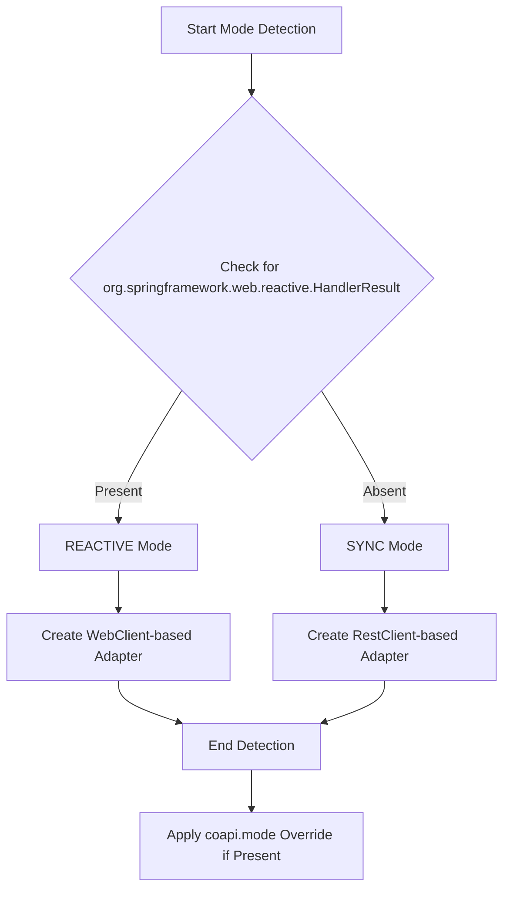
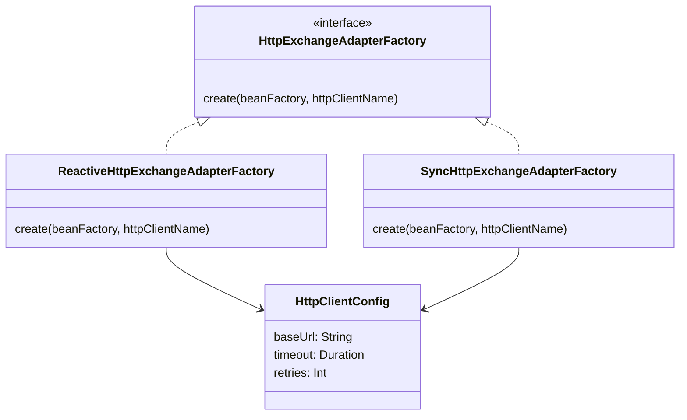
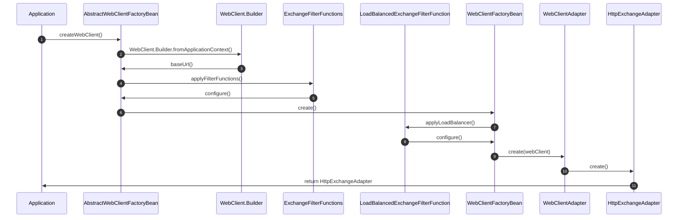
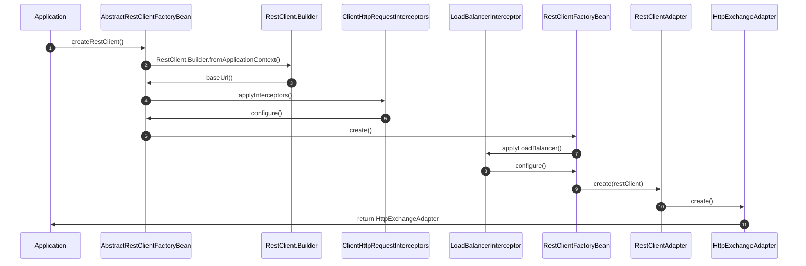
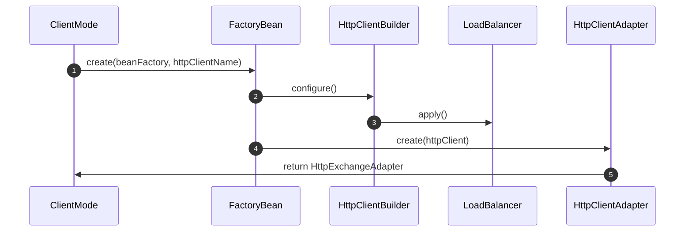

# Client Modes

CoApi provides flexible client modes to support different programming paradigms and performance requirements. The framework automatically detects the appropriate mode based on the classpath or allows explicit configuration.

## Overview

ClientMode determines how HTTP requests are executed and managed in CoApi applications. The framework supports three modes:

- **REACTIVE**: Asynchronous, non-blocking WebClient-based HTTP requests
- **SYNC**: Synchronous, blocking RestClient-based HTTP requests  
- **AUTO**: Intelligent mode inference based on classpath detection

The AUTO mode is the default behavior that adapts to the available Spring Web dependencies, making it ideal for applications that need to work across different environments without manual configuration.

## At-a-Glance

| Mode | HTTP Client | Type | Dependencies | Performance |
|------|-------------|------|--------------|-------------|
| REACTIVE | WebClient | Asynchronous | spring-boot-webclient | High throughput |
| SYNC | RestClient | Synchronous | spring-boot-web | Low latency |
| AUTO | WebClient/RestClient | Hybrid | Both | Context-dependent |

## Mode Detection Logic

The AUTO mode uses intelligent detection to determine the appropriate client type based on available dependencies:



### Detection Process

The AUTO mode detection is implemented in [ClientMode.kt](https://github.com/Ahoo-Wang/CoApi/blob/main/spring/src/main/kotlin/me/ahoo/coapi/spring/ClientMode.kt):

```kotlin
enum class ClientMode {
    REACTIVE, SYNC, AUTO;
    
    companion object {
        fun detect(): ClientMode {
            return try {
                Class.forName("org.springframework.web.reactive.HandlerResult")
                REACTIVE
            } catch (e: ClassNotFoundException) {
                SYNC
            }
        }
    }
}
```

## Architecture Overview

The client mode architecture follows a SPI (Service Provider Interface) pattern with factory adapters:



The HttpExchangeAdapterFactory interface provides a unified way to create HTTP exchange adapters regardless of the underlying client implementation:

```kotlin
// spring/src/main/kotlin/me/ahoo/coapi/spring/HttpExchangeAdapterFactory.kt
interface HttpExchangeAdapterFactory {
    fun create(beanFactory: BeanFactory, httpClientName: String): HttpExchangeAdapter
}
```

## Reactive Stack Implementation

The reactive stack uses WebClient for non-blocking HTTP requests with comprehensive integration for reactive programming paradigms.



### FactoryBean Hierarchy

The reactive stack follows this inheritance hierarchy:

- **AbstractWebClientFactoryBean**: Base class configuring WebClient.Builder
  - Gets WebClient.Builder from Spring application context
  - Applies ExchangeFilterFunctions from ClientProperties
  - Applies WebClientBuilderCustomizer beans
  - Sets baseUrl and timeouts

- **WebClientFactoryBean**: Extends with load balancer support
  - Adds LoadBalancedExchangeFilterFunction when load balancer is available
  - Configures reactive retry mechanisms
  - Enables circuit breaker integration

- **WebClientAdapter**: Converts WebClient to HttpExchangeAdapter
  - Implements HttpExchangeAdapter interface
  - Handles request/response mapping
  - Supports reactive streams integration

```kotlin
// spring/src/main/kotlin/me/ahoo/coapi/spring/client/reactive/AbstractWebClientFactoryBean.kt
abstract class AbstractWebClientFactoryBean : FactoryBean<WebClient> {
    override fun getObject(): WebClient {
        val builder = webClientBuilder()
            .baseUrl(clientProperties.baseUrl)
        
        clientProperties.filterFunctions.forEach { filterFunction ->
            builder.filter(filterFunction)
        }
        
        return builder.build()
    }
}
```

## Sync Stack Implementation

The sync stack provides traditional synchronous HTTP requests using RestClient with straightforward configuration and excellent performance for common use cases.



### FactoryBean Hierarchy

The sync stack follows this inheritance hierarchy:

- **AbstractRestClientFactoryBean**: Base class configuring RestClient.Builder
  - Gets RestClient.Builder from Spring application context
  - Applies ClientHttpRequestInterceptors from ClientProperties
  - Applies RestClientBuilderCustomizer beans
  - Sets baseUrl and timeouts

- **RestClientFactoryBean**: Extends with load balancer support
  - Adds LoadBalancerInterceptor when load balancer is available
  - Configures retry mechanisms
  - Enables connection pooling optimization

- **RestClientAdapter**: Converts RestClient to HttpExchangeAdapter
  - Implements HttpExchangeAdapter interface
  - Handles request/response mapping
  - Provides blocking I/O operations

```kotlin
// spring/src/main/kotlin/me/ahoo/coapi/spring/client/sync/AbstractRestClientFactoryBean.kt
abstract class AbstractRestClientFactoryBean : FactoryBean<RestClient> {
    override fun getObject(): RestClient {
        val builder = restClientBuilder()
            .baseUrl(clientProperties.baseUrl)
        
        clientProperties.interceptors.forEach { interceptor ->
            builder.requestInterceptor(interceptor)
        }
        
        return builder.build()
    }
}
```

## Adapter Creation

Both reactive and sync stacks implement their respective factory adapters:



The factory adapters create the appropriate adapters:

```kotlin
// spring/src/main/kotlin/me/ahoo/coapi/spring/client/reactive/ReactiveHttpExchangeAdapterFactory.kt
class ReactiveHttpExchangeAdapterFactory : HttpExchangeAdapterFactory {
    override fun create(beanFactory: BeanFactory, httpClientName: String): HttpExchangeAdapter {
        val webClient = WebClientFactoryBean().create(beanFactory, httpClientName)
        return WebClientAdapter.create(webClient)
    }
}

// spring/src/main/kotlin/me/ahoo/coapi/spring/client/sync/SyncHttpExchangeAdapterFactory.kt
class SyncHttpExchangeAdapterFactory : HttpExchangeAdapterFactory {
    override fun create(beanFactory: BeanFactory, httpClientName: String): HttpExchangeAdapter {
        val restClient = RestClientFactoryBean().create(beanFactory, httpClientName)
        return RestClientAdapter.create(restClient)
    }
}
```

## Configuration Properties

CoApi supports comprehensive configuration through properties:

```properties
# Client mode configuration (auto, reactive, sync)
coapi.mode=auto

# Base URL for all HTTP requests
coapi.client.base-url=https://api.example.com

# Timeout configuration
coapi.client.timeout=30s
coapi.client.read-timeout=60s
coapi.client.connect-timeout=10s

# Retry configuration
coapi.client.retries=3
coapi.client.retry-backoff=exponential
coapi.client.retry-backoff-initial=100ms
coapi.client.retry-backoff-max=2s

# Load balancer configuration
coapi.client.load-balancer.enabled=true
coapi.client.load-balancer.strategy=round-robin
```

## Feature Variants

Gradle feature variants enable selective dependency inclusion:

```kotlin
// spring/build.gradle.kts
features {
    reactiveSupport {
        usingSourceSet(sourceSets.getByName("main"))
        api("org.springframework.boot:spring-boot-starter-webflux")
    }
    lbSupport {
        usingSourceSet(sourceSets.getByName("main"))
        api("org.springframework.cloud:spring-cloud-starter-loadbalancer")
    }
    jwtSupport {
        usingSourceSet(sourceSets.getByName("main"))
        api("io.jsonwebtoken:jjwt-api:0.11.5")
    }
}
```

### Available Features

- **reactiveSupport**: Enables WebClient-based reactive client with `spring-boot-webclient`
- **lbSupport**: Adds load balancer support with `spring-cloud-commons`
- **jwtSupport**: Includes JWT authentication support with `java.jwt`

## Performance Characteristics

### Reactive Mode Benefits

- **High Throughput**: Non-blocking I/O allows handling thousands of concurrent connections
- **Resource Efficiency**: Minimal thread usage under high load
- **Backpressure Support**: Built-in flow control for reactive streams
- **Integration with Reactive Ecosystem**: Seamless integration with Project Reactor, RxJava

### Sync Mode Benefits

- **Low Latency**: Direct blocking I/O for simple use cases
- **Simplicity**: Traditional programming model
- **Better Debugging**: Straightforward stack traces
- **Lower Learning Curve**: Familiar to most Java developers

## Migration Between Modes

Migrating between modes is straightforward due to the adapter pattern:

1. **Switch from SYNC to REACTIVE**: 
   - Add `spring-boot-starter-webflux` dependency
   - Update client configuration if needed
   - No code changes required in application logic

2. **Switch from REACTIVE to SYNC**:
   - Remove `spring-boot-starter-webflux`
   - Add `spring-boot-starter-web` (if not already present)
   - No code changes required in application logic

3. **Use AUTO mode for compatibility**:
   - Works with both dependency sets
   - Automatically selects appropriate mode
   - Best for library and multi-environment applications

## Best Practices

### Mode Selection Guidelines

- **Choose REACTIVE when**:
  - Building high-throughput microservices
  - Working with reactive databases (R2DBC)
  - Needing to handle thousands of concurrent connections
  - Integrating with reactive APIs

- **Choose SYNC when**:
  - Building simple CRUD applications
  - Needing maximum request performance
  - Working with synchronous databases (JDBC)
  - Developing traditional web applications

- **Choose AUTO when**:
  - Building libraries that need broad compatibility
  - Working across different deployment environments
  - Wanting to avoid dependency conflicts
  - Needing to support both reactive and sync consumers

### Configuration Tips

- Always specify timeouts for production environments
- Use load balancer features for distributed systems
- Implement retry strategies for unreliable services
- Enable logging for debugging HTTP interactions
- Use connection pooling for better performance

## References

1. [ClientMode.kt](https://github.com/Ahoo-Wang/CoApi/blob/main/spring/src/main/kotlin/me/ahoo/coapi/spring/ClientMode.kt) - Client mode detection and enum definition
2. [HttpExchangeAdapterFactory.kt](https://github.com/Ahoo-Wang/CoApi/blob/main/spring/src/main/kotlin/me/ahoo/coapi/spring/HttpExchangeAdapterFactory.kt) - SPI interface for adapter factories
3. [ReactiveHttpExchangeAdapterFactory.kt](https://github.com/Ahoo-Wang/CoApi/blob/main/spring/src/main/kotlin/me/ahoo/coapi/spring/client/reactive/ReactiveHttpExchangeAdapterFactory.kt) - WebClient adapter factory implementation
4. [AbstractWebClientFactoryBean.kt](https://github.com/Ahoo-Wang/CoApi/blob/main/spring/src/main/kotlin/me/ahoo/coapi/spring/client/reactive/AbstractWebClientFactoryBean.kt) - WebClient configuration base class
5. [AbstractRestClientFactoryBean.kt](https://github.com/Ahoo-Wang/CoApi/blob/main/spring/src/main/kotlin/me/ahoo/coapi/spring/client/sync/AbstractRestClientFactoryBean.kt) - RestClient configuration base class
6. [Spring build.gradle.kts](https://github.com/Ahoo-Wang/CoApi/blob/main/spring/build.gradle.kts) - Gradle feature variants configuration

## Related Pages

- [HTTP Client Configuration](../getting-started/configuration.md) - Detailed configuration options and properties
- [Load Balancing](./load-balancing.md) - Load balancer integration and configuration
- [Retry Mechanisms](.md) - Retry strategies and backoff algorithms
- [Authentication](./authentication.md) - JWT and other authentication methods
- [Monitoring](.md) - Metrics and logging for HTTP clients
