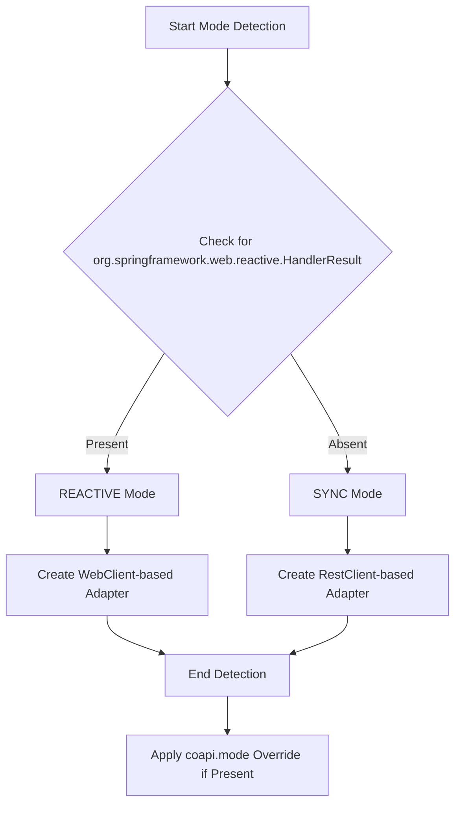
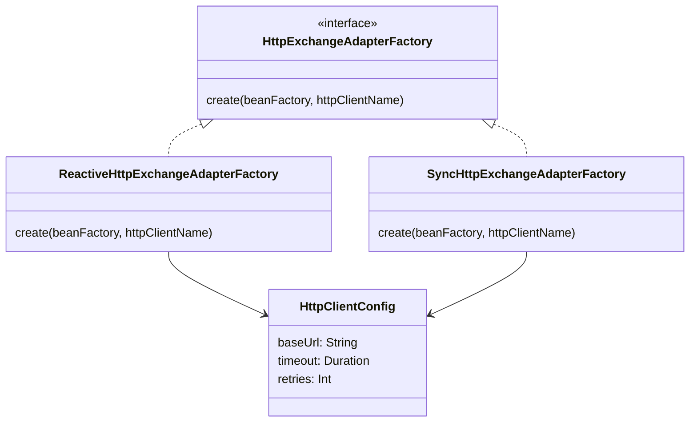
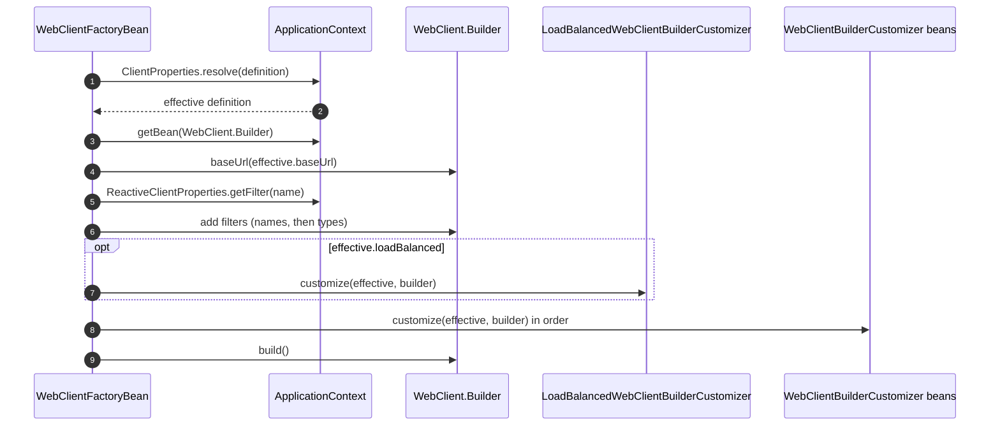
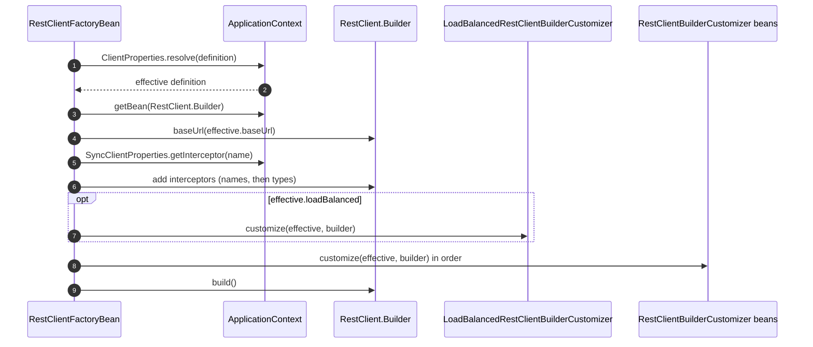
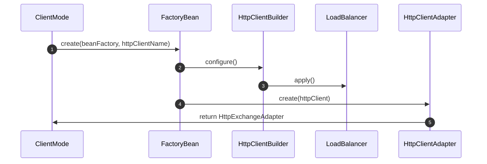

# Client Modes

CoApi provides flexible client modes to support different programming paradigms and performance requirements. The framework automatically detects the appropriate mode based on the classpath or allows explicit configuration.

## Overview

ClientMode determines how HTTP requests are executed and managed in CoApi applications. The framework supports three modes:

- **REACTIVE**: Asynchronous, non-blocking WebClient-based HTTP requests
- **SYNC**: Synchronous, blocking RestClient-based HTTP requests  
- **AUTO**: Intelligent mode inference based on classpath detection

The AUTO mode is the default behavior that adapts to the available Spring Web dependencies, making it ideal for applications that need to work across different environments without manual configuration.

## At-a-Glance

| Mode | HTTP Client | Type | Dependencies | Performance |
|------|-------------|------|--------------|-------------|
| REACTIVE | WebClient | Asynchronous | spring-boot-webclient | High throughput |
| SYNC | RestClient | Synchronous | spring-boot-web | Low latency |
| AUTO | WebClient/RestClient | Hybrid | Both | Context-dependent |

## Mode Detection Logic

The AUTO mode uses intelligent detection to determine the appropriate client type based on available dependencies:


```mermaid
flowchart TD
    A[Start Mode Detection] --> B{"Check for org.springframework.web.reactive.HandlerResult"}
    B -->|Present| C[REACTIVE Mode]
    B -->|Absent| D[SYNC Mode]
    C --> E[Create WebClient-based Adapter]
    D --> F[Create RestClient-based Adapter]
    E --> G[End Detection]
    F --> G
    G --> H[Apply coapi.mode Override if Present]
```

### Detection Process

The AUTO mode detection is implemented in [ClientMode.kt](https://github.com/Ahoo-Wang/CoApi/blob/main/spring/src/main/kotlin/me/ahoo/coapi/spring/ClientMode.kt):

```kotlin
enum class ClientMode {
    REACTIVE, SYNC, AUTO;
    
    companion object {
        fun detect(): ClientMode {
            return try {
                Class.forName("org.springframework.web.reactive.HandlerResult")
                REACTIVE
            } catch (e: ClassNotFoundException) {
                SYNC
            }
        }
    }
}
```

## Architecture Overview

The client mode architecture follows a SPI (Service Provider Interface) pattern with factory adapters:


```mermaid
classDiagram
    class HttpExchangeAdapterFactory {
        <<interface>>
        create(beanFactory, httpClientName)
    }
    
    class ReactiveHttpExchangeAdapterFactory {
        create(beanFactory, httpClientName)
    }
    
    class SyncHttpExchangeAdapterFactory {
        create(beanFactory, httpClientName)
    }
    
    class HttpClientConfig {
        baseUrl: String
        timeout: Duration
        retries: Int
    }
    
    HttpExchangeAdapterFactory <|.. ReactiveHttpExchangeAdapterFactory
    HttpExchangeAdapterFactory <|.. SyncHttpExchangeAdapterFactory
    ReactiveHttpExchangeAdapterFactory --> HttpClientConfig
    SyncHttpExchangeAdapterFactory --> HttpClientConfig
```

The HttpExchangeAdapterFactory interface provides a unified way to create HTTP exchange adapters regardless of the underlying client implementation:

```kotlin
// spring/src/main/kotlin/me/ahoo/coapi/spring/HttpExchangeAdapterFactory.kt
interface HttpExchangeAdapterFactory {
    fun create(beanFactory: BeanFactory, httpClientName: String): HttpExchangeAdapter
}
```

## Reactive Stack Implementation

The reactive stack builds one `WebClient` per CoApi client with [WebClientFactoryBean](https://github.com/Ahoo-Wang/CoApi/blob/main/spring/src/main/kotlin/me/ahoo/coapi/spring/client/reactive/WebClientFactoryBean.kt#L30):


```mermaid
sequenceDiagram
    autonumber
    participant FB as WebClientFactoryBean
    participant CTX as ApplicationContext
    participant B as WebClient.Builder
    participant LB as LoadBalancedWebClientBuilderCustomizer
    participant C as WebClientBuilderCustomizer beans

    FB->>CTX: ClientProperties.resolve(definition)
    CTX-->>FB: effective definition
    FB->>CTX: getBean(WebClient.Builder)
    FB->>B: baseUrl(effective.baseUrl)
    FB->>CTX: ReactiveClientProperties.getFilter(name)
    FB->>B: add filters (names, then types)
    opt effective.loadBalanced
        FB->>LB: customize(effective, builder)
    end
    FB->>C: customize(effective, builder) in order
    FB->>B: build()
```
<!-- Sources: spring/src/main/kotlin/me/ahoo/coapi/spring/client/reactive/WebClientFactoryBean.kt:32-45 -->

## Sync Stack Implementation

The sync stack builds one `RestClient` per CoApi client with [RestClientFactoryBean](https://github.com/Ahoo-Wang/CoApi/blob/main/spring/src/main/kotlin/me/ahoo/coapi/spring/client/sync/RestClientFactoryBean.kt#L30):


```mermaid
sequenceDiagram
    autonumber
    participant FB as RestClientFactoryBean
    participant CTX as ApplicationContext
    participant B as RestClient.Builder
    participant LB as LoadBalancedRestClientBuilderCustomizer
    participant C as RestClientBuilderCustomizer beans

    FB->>CTX: ClientProperties.resolve(definition)
    CTX-->>FB: effective definition
    FB->>CTX: getBean(RestClient.Builder)
    FB->>B: baseUrl(effective.baseUrl)
    FB->>CTX: SyncClientProperties.getInterceptor(name)
    FB->>B: add interceptors (names, then types)
    opt effective.loadBalanced
        FB->>LB: customize(effective, builder)
    end
    FB->>C: customize(effective, builder) in order
    FB->>B: build()
```
<!-- Sources: spring/src/main/kotlin/me/ahoo/coapi/spring/client/sync/RestClientFactoryBean.kt:32-50 -->

### Factory Bean Structure

Since v3.0.0 there is one flat factory bean per client type:

- **[AbstractHttpClientFactoryBean](https://github.com/Ahoo-Wang/CoApi/blob/main/spring/src/main/kotlin/me/ahoo/coapi/spring/client/AbstractHttpClientFactoryBean.kt#L29)** — shared plumbing: resolves the effective definition (optional `ClientProperties`), resolves filter/interceptor beans, collects the ordered customizer beans, and fails fast when a load-balanced client lacks Spring Cloud LoadBalancer.
- **`WebClientFactoryBean`** / **`RestClientFactoryBean`** — final classes that build the client in the order shown above.
- **`LoadBalancedWebClientBuilderCustomizer`** / **`LoadBalancedRestClientBuilderCustomizer`** — internal, applied only to load-balanced clients (see [Load Balancing](./load-balancing.md)).

Both factory beans require exactly one `WebClient.Builder` / `RestClient.Builder` bean by type. Extend clients through `WebClientBuilderCustomizer` / `RestClientBuilderCustomizer` beans (see [Customization](./customization.md)) — the factory beans are not designed for subclassing.

## Adapter Creation

Both reactive and sync stacks implement their respective factory adapters:


```mermaid
sequenceDiagram
    autonumber
    participant ClientMode
    participant FactoryBean
    participant HttpClientBuilder
    participant LoadBalancer
    participant HttpClientAdapter
    
    ClientMode->>FactoryBean: create(beanFactory, httpClientName)
    FactoryBean->>HttpClientBuilder: configure()
    HttpClientBuilder->>LoadBalancer: apply()
    FactoryBean->>HttpClientAdapter: create(httpClient)
    HttpClientAdapter->>ClientMode: return HttpExchangeAdapter
```

The factory adapters create the appropriate adapters:

```kotlin
// spring/src/main/kotlin/me/ahoo/coapi/spring/client/reactive/ReactiveHttpExchangeAdapterFactory.kt
class ReactiveHttpExchangeAdapterFactory : HttpExchangeAdapterFactory {
    override fun create(beanFactory: BeanFactory, httpClientName: String): HttpExchangeAdapter {
        val webClient = WebClientFactoryBean().create(beanFactory, httpClientName)
        return WebClientAdapter.create(webClient)
    }
}

// spring/src/main/kotlin/me/ahoo/coapi/spring/client/sync/SyncHttpExchangeAdapterFactory.kt
class SyncHttpExchangeAdapterFactory : HttpExchangeAdapterFactory {
    override fun create(beanFactory: BeanFactory, httpClientName: String): HttpExchangeAdapter {
        val restClient = RestClientFactoryBean().create(beanFactory, httpClientName)
        return RestClientAdapter.create(restClient)
    }
}
```

## Configuration Properties

CoApi supports comprehensive configuration through properties:

```properties
# Client mode (AUTO, REACTIVE, SYNC); since v2.2.0 an invalid value fails
# startup with the offending value and the valid options listed
coapi.mode=auto

# Enable/disable CoApi auto-configuration
coapi.enabled=true

# Extra packages to scan for @CoApi interfaces (comma-separated or indexed)
coapi.base-packages=com.example.clients

# Per-client overrides - see the Configuration Reference for the full set
coapi.clients.MyApiClient.base-url=https://api.example.com
coapi.clients.MyApiClient.load-balanced=false
```

## Feature Variants

Gradle feature variants enable selective dependency inclusion:

```kotlin
// spring/build.gradle.kts
features {
    reactiveSupport {
        usingSourceSet(sourceSets.getByName("main"))
        api("org.springframework.boot:spring-boot-starter-webflux")
    }
    lbSupport {
        usingSourceSet(sourceSets.getByName("main"))
        api("org.springframework.cloud:spring-cloud-starter-loadbalancer")
    }
    jwtSupport {
        usingSourceSet(sourceSets.getByName("main"))
        api("io.jsonwebtoken:jjwt-api:0.11.5")
    }
}
```

### Available Features

- **reactiveSupport**: Enables WebClient-based reactive client with `spring-boot-webclient`
- **lbSupport**: Adds load balancer support with `spring-cloud-commons`
- **jwtSupport**: Includes JWT authentication support with `java.jwt`

## Performance Characteristics

### Reactive Mode Benefits

- **High Throughput**: Non-blocking I/O allows handling thousands of concurrent connections
- **Resource Efficiency**: Minimal thread usage under high load
- **Backpressure Support**: Built-in flow control for reactive streams
- **Integration with Reactive Ecosystem**: Seamless integration with Project Reactor, RxJava

### Sync Mode Benefits

- **Low Latency**: Direct blocking I/O for simple use cases
- **Simplicity**: Traditional programming model
- **Better Debugging**: Straightforward stack traces
- **Lower Learning Curve**: Familiar to most Java developers

## Migration Between Modes

Migrating between modes is straightforward due to the adapter pattern:

1. **Switch from SYNC to REACTIVE**: 
   - Add `spring-boot-starter-webflux` dependency
   - Update client configuration if needed
   - No code changes required in application logic

2. **Switch from REACTIVE to SYNC**:
   - Remove `spring-boot-starter-webflux`
   - Add `spring-boot-starter-web` (if not already present)
   - No code changes required in application logic

3. **Use AUTO mode for compatibility**:
   - Works with both dependency sets
   - Automatically selects appropriate mode
   - Best for library and multi-environment applications

## Best Practices

### Mode Selection Guidelines

- **Choose REACTIVE when**:
  - Building high-throughput microservices
  - Working with reactive databases (R2DBC)
  - Needing to handle thousands of concurrent connections
  - Integrating with reactive APIs

- **Choose SYNC when**:
  - Building simple CRUD applications
  - Needing maximum request performance
  - Working with synchronous databases (JDBC)
  - Developing traditional web applications

- **Choose AUTO when**:
  - Building libraries that need broad compatibility
  - Working across different deployment environments
  - Wanting to avoid dependency conflicts
  - Needing to support both reactive and sync consumers

### Configuration Tips

- Always specify timeouts for production environments
- Use load balancer features for distributed systems
- Implement retry strategies for unreliable services
- Enable logging for debugging HTTP interactions
- Use connection pooling for better performance

## References

1. [ClientMode.kt](https://github.com/Ahoo-Wang/CoApi/blob/main/spring/src/main/kotlin/me/ahoo/coapi/spring/ClientMode.kt) - Client mode detection and enum definition
2. [HttpExchangeAdapterFactory.kt](https://github.com/Ahoo-Wang/CoApi/blob/main/spring/src/main/kotlin/me/ahoo/coapi/spring/HttpExchangeAdapterFactory.kt) - SPI interface for adapter factories
3. [ReactiveHttpExchangeAdapterFactory.kt](https://github.com/Ahoo-Wang/CoApi/blob/main/spring/src/main/kotlin/me/ahoo/coapi/spring/client/reactive/ReactiveHttpExchangeAdapterFactory.kt) - WebClient adapter factory implementation
4. [WebClientFactoryBean.kt](https://github.com/Ahoo-Wang/CoApi/blob/main/spring/src/main/kotlin/me/ahoo/coapi/spring/client/reactive/WebClientFactoryBean.kt) - WebClient configuration base class
5. [RestClientFactoryBean.kt](https://github.com/Ahoo-Wang/CoApi/blob/main/spring/src/main/kotlin/me/ahoo/coapi/spring/client/sync/RestClientFactoryBean.kt) - RestClient configuration base class
6. [Spring build.gradle.kts](https://github.com/Ahoo-Wang/CoApi/blob/main/spring/build.gradle.kts) - Gradle feature variants configuration

## Related Pages

- [HTTP Client Configuration](../getting-started/configuration.md) - Detailed configuration options and properties
- [Load Balancing](./load-balancing.md) - Load balancer integration and configuration
- [Retry Mechanisms](.md) - Retry strategies and backoff algorithms
- [Authentication](./authentication.md) - JWT and other authentication methods
- [Monitoring](.md) - Metrics and logging for HTTP clients
