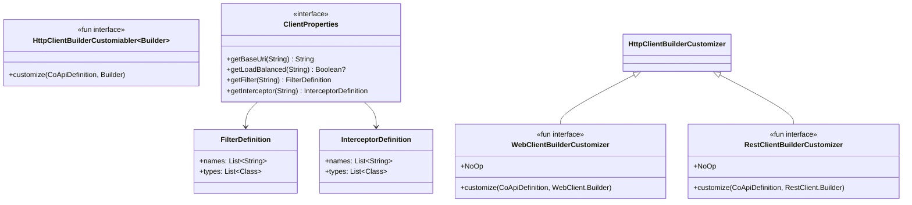
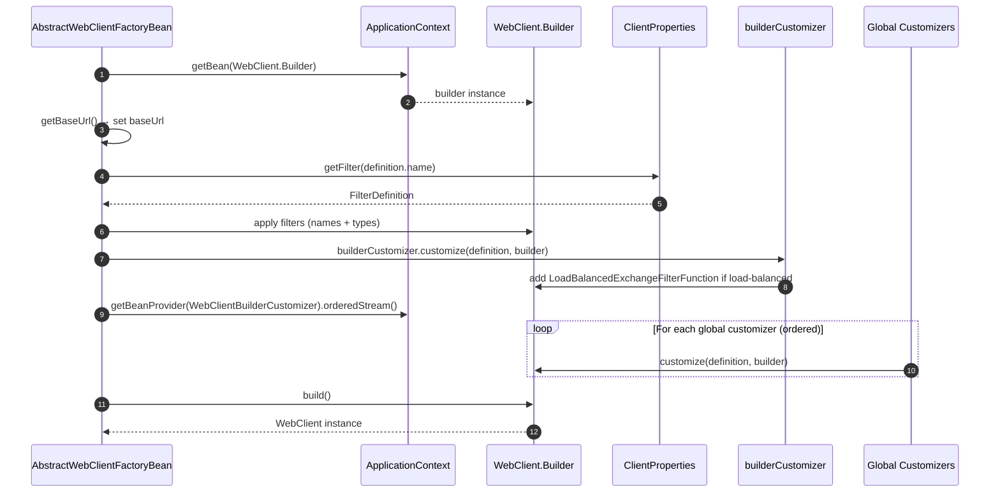
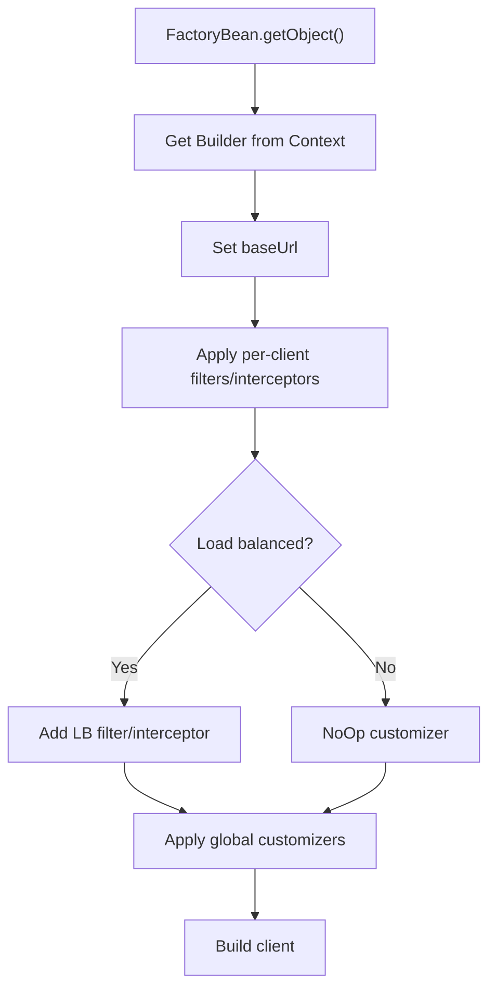

# Customization & Extensibility

## Overview

CoApi's HTTP clients are not black boxes. The library exposes a layered customization SPI that lets you intercept and modify the client builder at three points: (1) per-client YAML configuration for filters and interceptors, (2) per-type builder customizers for load balancing and protocol-specific tweaks, and (3) global customizer beans applied to all clients in order. This design means common concerns (connection pooling, metrics, tracing) can be applied globally while client-specific overrides (auth headers, timeouts) target individual interfaces.

## At a Glance

| Customization Point | Interface | Scope | Key File | Source |
|---------------------|-----------|-------|----------|--------|
| Base SPI | `HttpClientBuilderCustomizer<Builder>` | All clients | [HttpClientBuilderCustomizer.kt](https://github.com/Ahoo-Wang/CoApi/blob/main/spring/src/main/kotlin/me/ahoo/coapi/spring/client/HttpClientBuilderCustomizer.kt) | [HttpClientBuilderCustomizer.kt](https://github.com/Ahoo-Wang/CoApi/blob/main/spring/src/main/kotlin/me/ahoo/coapi/spring/client/HttpClientBuilderCustomizer.kt#L18) |
| Reactive customizer | `WebClientBuilderCustomizer` | WebClient clients | [WebClientBuilderCustomizer.kt](https://github.com/Ahoo-Wang/CoApi/blob/main/spring/src/main/kotlin/me/ahoo/coapi/spring/client/reactive/WebClientBuilderCustomizer.kt) | [WebClientBuilderCustomizer.kt](https://github.com/Ahoo-Wang/CoApi/blob/main/spring/src/main/kotlin/me/ahoo/coapi/spring/client/reactive/WebClientBuilderCustomizer.kt#L20) |
| Sync customizer | `RestClientBuilderCustomizer` | RestClient clients | [RestClientBuilderCustomizer.kt](https://github.com/Ahoo-Wang/CoApi/blob/main/spring/src/main/kotlin/me/ahoo/coapi/spring/client/sync/RestClientBuilderCustomizer.kt) | [RestClientBuilderCustomizer.kt](https://github.com/Ahoo-Wang/CoApi/blob/main/spring/src/main/kotlin/me/ahoo/coapi/spring/client/sync/RestClientBuilderCustomizer.kt#L20) |
| Per-client config | `ClientProperties` | Individual clients | [ClientProperties.kt](https://github.com/Ahoo-Wang/CoApi/blob/main/spring/src/main/kotlin/me/ahoo/coapi/spring/client/ClientProperties.kt) | [ClientProperties.kt](https://github.com/Ahoo-Wang/CoApi/blob/main/spring/src/main/kotlin/me/ahoo/coapi/spring/client/ClientProperties.kt#L19) |
| Per-client filters | `FilterDefinition` / `InterceptorDefinition` | Individual clients | [ClientProperties.kt](https://github.com/Ahoo-Wang/CoApi/blob/main/spring/src/main/kotlin/me/ahoo/coapi/spring/client/ClientProperties.kt) | [ClientProperties.kt](https://github.com/Ahoo-Wang/CoApi/blob/main/spring/src/main/kotlin/me/ahoo/coapi/spring/client/ClientProperties.kt#L25) |

## Customizer Class Hierarchy


<!-- Sources: spring/src/main/kotlin/me/ahoo/coapi/spring/client/HttpClientBuilderCustomizer.kt:18, spring/src/main/kotlin/me/ahoo/coapi/spring/client/reactive/WebClientBuilderCustomizer.kt:20, spring/src/main/kotlin/me/ahoo/coapi/spring/client/sync/RestClientBuilderCustomizer.kt:20, spring/src/main/kotlin/me/ahoo/coapi/spring/client/ClientProperties.kt:19 -->

## Customizer Invocation Order

When a `WebClient` or `RestClient` bean is created, customizers are applied in a strict order:


<!-- Sources: spring/src/main/kotlin/me/ahoo/coapi/spring/client/reactive/AbstractWebClientFactoryBean.kt:38-54, spring/src/main/kotlin/me/ahoo/coapi/spring/client/reactive/WebClientFactoryBean.kt:30-43 -->

The invocation order in [AbstractWebClientFactoryBean.getObject()](https://github.com/Ahoo-Wang/CoApi/blob/main/spring/src/main/kotlin/me/ahoo/coapi/spring/client/reactive/AbstractWebClientFactoryBean.kt#L38):

| Order | Step | What | Configurable? |
|-------|------|------|---------------|
| 1 | Get builder | `WebClient.Builder` from ApplicationContext | No |
| 2 | Set base URL | `getBaseUrl()` — properties override annotation | Via `coapi.clients.<name>.base-url` |
| 3 | Apply filters | `FilterDefinition` from `ClientProperties` | Via YAML |
| 4 | Per-type customizer | Load balancing filter or `NoOp` | Automatic |
| 5 | Global customizers | All `WebClientBuilderCustomizer` beans, ordered | Register as Spring bean |

## Customizer Decision Flow


<!-- Sources: spring/src/main/kotlin/me/ahoo/coapi/spring/client/reactive/AbstractWebClientFactoryBean.kt:38-54, spring/src/main/kotlin/me/ahoo/coapi/spring/client/sync/AbstractRestClientFactoryBean.kt:34-56 -->

## Per-Client Filter Configuration

Filters and interceptors are configured per client via YAML properties. The `ClientProperties` interface provides typed access:

**Reactive (WebClient) filters:**
```yaml
coapi:
  clients:
    MyApiClient:
      reactive:
        filter:
          names:
            - myAuthFilter
          types:
            - com.example.LoggingExchangeFilterFunction
```

**Sync (RestClient) interceptors:**
```yaml
coapi:
  clients:
    MyApiClient:
      sync:
        interceptor:
          names:
            - myAuthInterceptor
          types:
            - com.example.LoggingInterceptor
```

Filter resolution in [AbstractWebClientFactoryBean](https://github.com/Ahoo-Wang/CoApi/blob/main/spring/src/main/kotlin/me/ahoo/coapi/spring/client/reactive/AbstractWebClientFactoryBean.kt):
- **names** → resolved as beans from `ApplicationContext` by name
- **types** → resolved as beans from `ApplicationContext` by class type

## Example: Connection Pool Customizer

A real-world example from the consumer server demonstrates per-client connection pooling:

```kotlin
@Service
class ConsumerWebClientBuilderCustomizer : WebClientBuilderCustomizer {
    override fun customize(
        coApiDefinition: CoApiDefinition,
        builder: WebClient.Builder
    ) {
        val connectionProvider = ConnectionProvider.builder(coApiDefinition.name)
            .maxConnections(500)
            .maxIdleTime(Duration.ofSeconds(20))
            .maxLifeTime(Duration.ofSeconds(60))
            .pendingAcquireTimeout(Duration.ofSeconds(60))
            .evictInBackground(Duration.ofSeconds(120))
            .build()
        val httpClient = HttpClient.create(connectionProvider)
        builder.clientConnector(ReactorClientHttpConnector(httpClient))
    }
}
```
<!-- Source: example/example-consumer-server/src/main/kotlin/me/ahoo/coapi/example/consumer/ConsumerWebClientBuilderCustomizer.kt:26-46 -->

Key points:
- Registered as `@Service` so Spring discovers it as a global customizer
- Uses `coApiDefinition.name` to create a named connection pool per client
- Applied to **all** `@CoApi` clients via `getBeanProvider().orderedStream()`

## Example: Per-Client Auth Filter

Configure a filter for a specific client without affecting others:

```yaml
coapi:
  clients:
    SecureApiClient:
      base-url: https://api.example.com
      reactive:
        filter:
          types:
            - com.example.BearerTokenFilter
```

Or register the filter by bean name:

```yaml
coapi:
  clients:
    SecureApiClient:
      reactive:
        filter:
          names:
            - bearerTokenFilter
```

## YAML Configuration Reference

| Property | Type | Default | Description |
|----------|------|---------|-------------|
| `coapi.clients.<name>.base-url` | String | `""` | Override annotation's baseUrl |
| `coapi.clients.<name>.load-balanced` | Boolean | `null` | Override load balancing |
| `coapi.clients.<name>.reactive.filter.names` | List | `[]` | Filter bean names |
| `coapi.clients.<name>.reactive.filter.types` | List | `[]` | Filter class types |
| `coapi.clients.<name>.sync.interceptor.names` | List | `[]` | Interceptor bean names |
| `coapi.clients.<name>.sync.interceptor.types` | List | `[]` | Interceptor class types |

## Related Pages

- [Client Modes (Reactive & Sync)](./client-modes.md) — WebClient vs RestClient internals
- [Load Balancing](./load-balancing.md) — LB filter/interceptor integration
- [Authentication](./authentication.md) — BearerTokenFilter and JWT caching
- [Configuration Reference](../getting-started/configuration.md) — all YAML properties

## References

1. [HttpClientBuilderCustomizer.kt](https://github.com/Ahoo-Wang/CoApi/blob/main/spring/src/main/kotlin/me/ahoo/coapi/spring/client/HttpClientBuilderCustomizer.kt) — `spring/src/main/kotlin/me/ahoo/coapi/spring/client/HttpClientBuilderCustomizer.kt`
2. [WebClientBuilderCustomizer.kt](https://github.com/Ahoo-Wang/CoApi/blob/main/spring/src/main/kotlin/me/ahoo/coapi/spring/client/reactive/WebClientBuilderCustomizer.kt) — `spring/src/main/kotlin/me/ahoo/coapi/spring/client/reactive/WebClientBuilderCustomizer.kt`
3. [RestClientBuilderCustomizer.kt](https://github.com/Ahoo-Wang/CoApi/blob/main/spring/src/main/kotlin/me/ahoo/coapi/spring/client/sync/RestClientBuilderCustomizer.kt) — `spring/src/main/kotlin/me/ahoo/coapi/spring/client/sync/RestClientBuilderCustomizer.kt`
4. [ClientProperties.kt](https://github.com/Ahoo-Wang/CoApi/blob/main/spring/src/main/kotlin/me/ahoo/coapi/spring/client/ClientProperties.kt) — `spring/src/main/kotlin/me/ahoo/coapi/spring/client/ClientProperties.kt`
5. [AbstractWebClientFactoryBean.kt](https://github.com/Ahoo-Wang/CoApi/blob/main/spring/src/main/kotlin/me/ahoo/coapi/spring/client/reactive/AbstractWebClientFactoryBean.kt) — `spring/src/main/kotlin/me/ahoo/coapi/spring/client/reactive/AbstractWebClientFactoryBean.kt`
6. [AbstractRestClientFactoryBean.kt](https://github.com/Ahoo-Wang/CoApi/blob/main/spring/src/main/kotlin/me/ahoo/coapi/spring/client/sync/AbstractRestClientFactoryBean.kt) — `spring/src/main/kotlin/me/ahoo/coapi/spring/client/sync/AbstractRestClientFactoryBean.kt`
7. [ConsumerWebClientBuilderCustomizer.kt](https://github.com/Ahoo-Wang/CoApi/blob/main/example/example-consumer-server/src/main/kotlin/me/ahoo/coapi/example/consumer/ConsumerWebClientBuilderCustomizer.kt) — `example/example-consumer-server/src/main/kotlin/.../ConsumerWebClientBuilderCustomizer.kt`
