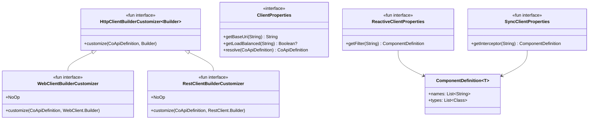
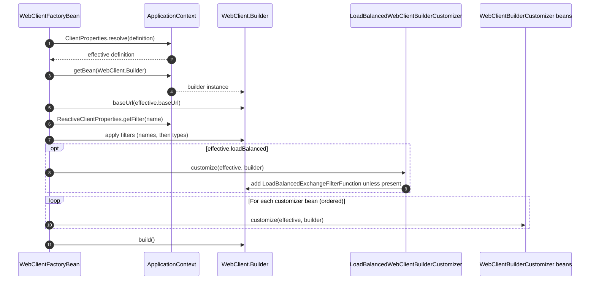
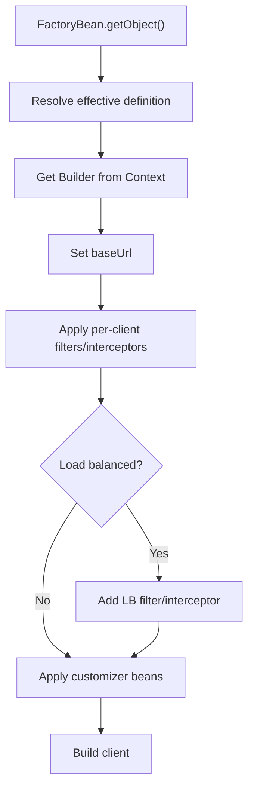

# Customization & Extensibility

## Overview

CoApi's HTTP clients are not black boxes. The library exposes a layered customization SPI that lets you intercept and modify the client builder at three points: (1) per-client YAML configuration for filters and interceptors, (2) per-type builder customizers for load balancing and protocol-specific tweaks, and (3) global customizer beans applied to all clients in order. This design means common concerns (connection pooling, metrics, tracing) can be applied globally while client-specific overrides (auth headers, timeouts) target individual interfaces.

## At a Glance

| Customization Point | Interface | Scope | Key File | Source |
|---------------------|-----------|-------|----------|--------|
| Base SPI | `HttpClientBuilderCustomizer<Builder>` | All clients | [HttpClientBuilderCustomizer.kt](https://github.com/Ahoo-Wang/CoApi/blob/main/spring/src/main/kotlin/me/ahoo/coapi/spring/client/HttpClientBuilderCustomizer.kt) | [HttpClientBuilderCustomizer.kt](https://github.com/Ahoo-Wang/CoApi/blob/main/spring/src/main/kotlin/me/ahoo/coapi/spring/client/HttpClientBuilderCustomizer.kt#L18) |
| Reactive customizer | `WebClientBuilderCustomizer` | WebClient clients | [WebClientBuilderCustomizer.kt](https://github.com/Ahoo-Wang/CoApi/blob/main/spring/src/main/kotlin/me/ahoo/coapi/spring/client/reactive/WebClientBuilderCustomizer.kt) | [WebClientBuilderCustomizer.kt](https://github.com/Ahoo-Wang/CoApi/blob/main/spring/src/main/kotlin/me/ahoo/coapi/spring/client/reactive/WebClientBuilderCustomizer.kt#L20) |
| Sync customizer | `RestClientBuilderCustomizer` | RestClient clients | [RestClientBuilderCustomizer.kt](https://github.com/Ahoo-Wang/CoApi/blob/main/spring/src/main/kotlin/me/ahoo/coapi/spring/client/sync/RestClientBuilderCustomizer.kt) | [RestClientBuilderCustomizer.kt](https://github.com/Ahoo-Wang/CoApi/blob/main/spring/src/main/kotlin/me/ahoo/coapi/spring/client/sync/RestClientBuilderCustomizer.kt#L20) |
| Per-client endpoint | `ClientProperties` | Individual clients | [ClientProperties.kt](https://github.com/Ahoo-Wang/CoApi/blob/main/spring/src/main/kotlin/me/ahoo/coapi/spring/client/ClientProperties.kt) | [ClientProperties.kt](https://github.com/Ahoo-Wang/CoApi/blob/main/spring/src/main/kotlin/me/ahoo/coapi/spring/client/ClientProperties.kt#L24) |
| Per-client filters | `ReactiveClientProperties` → `ComponentDefinition<ExchangeFilterFunction>` | WebClient clients | [ReactiveClientProperties.kt](https://github.com/Ahoo-Wang/CoApi/blob/main/spring/src/main/kotlin/me/ahoo/coapi/spring/client/reactive/ReactiveClientProperties.kt) | [ReactiveClientProperties.kt](https://github.com/Ahoo-Wang/CoApi/blob/main/spring/src/main/kotlin/me/ahoo/coapi/spring/client/reactive/ReactiveClientProperties.kt#L24) |
| Per-client interceptors | `SyncClientProperties` → `ComponentDefinition<ClientHttpRequestInterceptor>` | RestClient clients | [SyncClientProperties.kt](https://github.com/Ahoo-Wang/CoApi/blob/main/spring/src/main/kotlin/me/ahoo/coapi/spring/client/sync/SyncClientProperties.kt) | [SyncClientProperties.kt](https://github.com/Ahoo-Wang/CoApi/blob/main/spring/src/main/kotlin/me/ahoo/coapi/spring/client/sync/SyncClientProperties.kt#L24) |

## Customizer Class Hierarchy


```mermaid
classDiagram
    class HttpClientBuilderCustomizer~Builder~ {
        <<fun interface>>
        +customize(CoApiDefinition, Builder)
    }
    class WebClientBuilderCustomizer {
        <<fun interface>>
        +customize(CoApiDefinition, WebClient.Builder)
        +NoOp
    }
    class RestClientBuilderCustomizer {
        <<fun interface>>
        +customize(CoApiDefinition, RestClient.Builder)
        +NoOp
    }
    class ClientProperties {
        <<interface>>
        +getBaseUri(String) String
        +getLoadBalanced(String) Boolean?
        +resolve(CoApiDefinition) CoApiDefinition
    }
    class ReactiveClientProperties {
        <<fun interface>>
        +getFilter(String) ComponentDefinition
    }
    class SyncClientProperties {
        <<fun interface>>
        +getInterceptor(String) ComponentDefinition
    }
    class ComponentDefinition~T~ {
        +names: List~String~
        +types: List~Class~
    }

    HttpClientBuilderCustomizer <|-- WebClientBuilderCustomizer
    HttpClientBuilderCustomizer <|-- RestClientBuilderCustomizer
    ReactiveClientProperties --> ComponentDefinition
    SyncClientProperties --> ComponentDefinition
```
<!-- Sources: spring/src/main/kotlin/me/ahoo/coapi/spring/client/HttpClientBuilderCustomizer.kt:24, spring/src/main/kotlin/me/ahoo/coapi/spring/client/ClientProperties.kt:24, spring/src/main/kotlin/me/ahoo/coapi/spring/client/reactive/ReactiveClientProperties.kt:22, spring/src/main/kotlin/me/ahoo/coapi/spring/client/sync/SyncClientProperties.kt:22, spring/src/main/kotlin/me/ahoo/coapi/spring/client/ComponentDefinition.kt:20 -->

Since v3.0.0 the mode-specific settings live in their own role interfaces: a sync-only application never sees a reactive type in `ClientProperties`. All three are optional beans; `CoApiProperties` (Spring Boot) implements all of them, and without Spring Boot each one falls back to its `Empty` implementation.

## Customizer Invocation Order

When a `WebClient` or `RestClient` bean is created, customizers are applied in a strict order:


```mermaid
sequenceDiagram
    autonumber
    participant FB as WebClientFactoryBean
    participant CTX as ApplicationContext
    participant Builder as WebClient.Builder
    participant LB as LoadBalancedWebClientBuilderCustomizer
    participant Global as WebClientBuilderCustomizer beans

    FB->>CTX: ClientProperties.resolve(definition)
    CTX-->>FB: effective definition
    FB->>CTX: getBean(WebClient.Builder)
    CTX-->>Builder: builder instance
    FB->>Builder: baseUrl(effective.baseUrl)
    FB->>CTX: ReactiveClientProperties.getFilter(name)
    FB->>Builder: apply filters (names, then types)
    opt effective.loadBalanced
        FB->>LB: customize(effective, builder)
        LB->>Builder: add LoadBalancedExchangeFilterFunction unless present
    end
    loop For each customizer bean (ordered)
        FB->>Global: customize(effective, builder)
    end
    FB->>Builder: build()
```
<!-- Sources: spring/src/main/kotlin/me/ahoo/coapi/spring/client/reactive/WebClientFactoryBean.kt:32-45 -->

The invocation order in [WebClientFactoryBean.getObject()](https://github.com/Ahoo-Wang/CoApi/blob/main/spring/src/main/kotlin/me/ahoo/coapi/spring/client/reactive/WebClientFactoryBean.kt#L32) (`RestClientFactoryBean` is symmetric with interceptors):

| Order | Step | What | Configurable? |
|-------|------|------|---------------|
| 1 | Resolve effective definition | `ClientProperties.resolve(definition)` — `coapi.clients.<name>.*` overrides the annotation | Via YAML |
| 2 | Get builder | `WebClient.Builder` from ApplicationContext | No |
| 3 | Set base URL | `effective.baseUrl` | Via `coapi.clients.<name>.base-url` |
| 4 | Apply filters | `ComponentDefinition` from `ReactiveClientProperties` | Via YAML |
| 5 | Load balancing | Only when `effective.loadBalanced` | Automatic |
| 6 | Customizer beans | All `WebClientBuilderCustomizer` beans, ordered | Register as Spring bean |

Customizers receive the **effective** definition (since v3.0.0): `coApiDefinition.baseUrl` and `coApiDefinition.loadBalanced` already reflect the `coapi.clients.<name>.*` overrides.

## Customizer Decision Flow


```mermaid
flowchart TD
    A["FactoryBean.getObject()"] --> A2["Resolve effective definition"]
    A2 --> B["Get Builder from Context"]
    B --> C[Set baseUrl]
    C --> D[Apply per-client filters/interceptors]
    D --> E{Load balanced?}
    E -->|Yes| F[Add LB filter/interceptor]
    E -->|No| H[Apply customizer beans]
    F --> H
    H --> I[Build client]

```
<!-- Sources: spring/src/main/kotlin/me/ahoo/coapi/spring/client/reactive/WebClientFactoryBean.kt:32-45, spring/src/main/kotlin/me/ahoo/coapi/spring/client/sync/RestClientFactoryBean.kt:32-50 -->

## Per-Client Filter Configuration

Filters and interceptors are configured per client via YAML properties; `ReactiveClientProperties` and `SyncClientProperties` provide typed access:

**Reactive (WebClient) filters:**
```yaml
coapi:
  clients:
    MyApiClient:
      reactive:
        filter:
          names:
            - myAuthFilter
          types:
            - com.example.LoggingExchangeFilterFunction
```

**Sync (RestClient) interceptors:**
```yaml
coapi:
  clients:
    MyApiClient:
      sync:
        interceptor:
          names:
            - myAuthInterceptor
          types:
            - com.example.LoggingInterceptor
```

Resolution in [AbstractHttpClientFactoryBean](https://github.com/Ahoo-Wang/CoApi/blob/main/spring/src/main/kotlin/me/ahoo/coapi/spring/client/AbstractHttpClientFactoryBean.kt) (all names first, then all types):
- **names** → resolved as beans from `ApplicationContext` by name
- **types** → resolved as beans from `ApplicationContext` by class type

## Example: Connection Pool Customizer

A real-world example from the consumer server demonstrates per-client connection pooling:

```kotlin
@Service
class ConsumerWebClientBuilderCustomizer : WebClientBuilderCustomizer {
    override fun customize(
        coApiDefinition: CoApiDefinition,
        builder: WebClient.Builder
    ) {
        val connectionProvider = ConnectionProvider.builder(coApiDefinition.name)
            .maxConnections(500)
            .maxIdleTime(Duration.ofSeconds(20))
            .maxLifeTime(Duration.ofSeconds(60))
            .pendingAcquireTimeout(Duration.ofSeconds(60))
            .evictInBackground(Duration.ofSeconds(120))
            .build()
        val httpClient = HttpClient.create(connectionProvider)
        builder.clientConnector(ReactorClientHttpConnector(httpClient))
    }
}
```
<!-- Source: example/example-consumer-server/src/main/kotlin/me/ahoo/coapi/example/consumer/ConsumerWebClientBuilderCustomizer.kt:26-46 -->

Key points:
- Registered as `@Service` so Spring discovers it as a global customizer
- Uses `coApiDefinition.name` to create a named connection pool per client
- Applied to **all** `@CoApi` clients via `getBeanProvider().orderedStream()`

## Example: Per-Client Auth Filter

Configure a filter for a specific client without affecting others:

```yaml
coapi:
  clients:
    SecureApiClient:
      base-url: https://api.example.com
      reactive:
        filter:
          types:
            - com.example.BearerTokenFilter
```

Or register the filter by bean name:

```yaml
coapi:
  clients:
    SecureApiClient:
      reactive:
        filter:
          names:
            - bearerTokenFilter
```

## Custom HttpExchangeAdapterFactory

`HttpExchangeAdapterFactory` decides how an HTTP client bean (WebClient or RestClient) is turned into the `HttpExchangeAdapter` that powers the interface proxy. You can replace the default factory with your own bean — for example to wrap adapters with metrics or tracing:

```kotlin
@Configuration(proxyBeanMethods = false)
class MyCoApiConfiguration {
    @Bean
    fun customHttpExchangeAdapterFactory(): HttpExchangeAdapterFactory =
        HttpExchangeAdapterFactory { beanFactory, httpClientName ->
            val webClient = beanFactory.getBean(httpClientName, WebClient::class.java)
            MetricsWebClientAdapter.wrap(WebClientAdapter.create(webClient))
        }
}
```

Resolution order in [CoApiFactoryBean](https://github.com/Ahoo-Wang/CoApi/blob/main/spring/src/main/kotlin/me/ahoo/coapi/spring/CoApiFactoryBean.kt) (since v2.1.1):

| Scenario | Factory used |
|----------|--------------|
| Exactly one `HttpExchangeAdapterFactory` bean | That bean |
| Multiple candidates, one marked `@Primary` | The `@Primary` bean |
| Multiple candidates, none primary | The bean registered under the standard name `CoApi.HttpExchangeAdapterFactory` (the registrar default) |

Registering a custom factory under the standard bean name replaces the default outright; a custom factory under any other name takes effect only when it is the single candidate or marked `@Primary`. Before v2.1.1, multiple non-primary candidates failed startup with `NoUniqueBeanDefinitionException`.

## YAML Configuration Reference

| Property | Type | Default | Description |
|----------|------|---------|-------------|
| `coapi.clients.<name>.base-url` | String | `""` | Override annotation's baseUrl |
| `coapi.clients.<name>.load-balanced` | Boolean | `null` | Override load balancing (`true` enables, `false` disables; unset falls back to the annotation) |
| `coapi.clients.<name>.reactive.filter.names` | List | `[]` | Filter bean names |
| `coapi.clients.<name>.reactive.filter.types` | List | `[]` | Filter class types |
| `coapi.clients.<name>.sync.interceptor.names` | List | `[]` | Interceptor bean names |
| `coapi.clients.<name>.sync.interceptor.types` | List | `[]` | Interceptor class types |

## Related Pages

- [Client Modes (Reactive & Sync)](./client-modes.md) — WebClient vs RestClient internals
- [Load Balancing](./load-balancing.md) — LB filter/interceptor integration
- [Authentication](./authentication.md) — BearerTokenFilter and JWT caching
- [Configuration Reference](../getting-started/configuration.md) — all YAML properties

## References

1. [HttpClientBuilderCustomizer.kt](https://github.com/Ahoo-Wang/CoApi/blob/main/spring/src/main/kotlin/me/ahoo/coapi/spring/client/HttpClientBuilderCustomizer.kt) — `spring/src/main/kotlin/me/ahoo/coapi/spring/client/HttpClientBuilderCustomizer.kt`
2. [WebClientBuilderCustomizer.kt](https://github.com/Ahoo-Wang/CoApi/blob/main/spring/src/main/kotlin/me/ahoo/coapi/spring/client/reactive/WebClientBuilderCustomizer.kt) — `spring/src/main/kotlin/me/ahoo/coapi/spring/client/reactive/WebClientBuilderCustomizer.kt`
3. [RestClientBuilderCustomizer.kt](https://github.com/Ahoo-Wang/CoApi/blob/main/spring/src/main/kotlin/me/ahoo/coapi/spring/client/sync/RestClientBuilderCustomizer.kt) — `spring/src/main/kotlin/me/ahoo/coapi/spring/client/sync/RestClientBuilderCustomizer.kt`
4. [ClientProperties.kt](https://github.com/Ahoo-Wang/CoApi/blob/main/spring/src/main/kotlin/me/ahoo/coapi/spring/client/ClientProperties.kt) — `spring/src/main/kotlin/me/ahoo/coapi/spring/client/ClientProperties.kt`
5. [WebClientFactoryBean.kt](https://github.com/Ahoo-Wang/CoApi/blob/main/spring/src/main/kotlin/me/ahoo/coapi/spring/client/reactive/WebClientFactoryBean.kt) — `spring/src/main/kotlin/me/ahoo/coapi/spring/client/reactive/WebClientFactoryBean.kt`
6. [RestClientFactoryBean.kt](https://github.com/Ahoo-Wang/CoApi/blob/main/spring/src/main/kotlin/me/ahoo/coapi/spring/client/sync/RestClientFactoryBean.kt) — `spring/src/main/kotlin/me/ahoo/coapi/spring/client/sync/RestClientFactoryBean.kt`
7. [ConsumerWebClientBuilderCustomizer.kt](https://github.com/Ahoo-Wang/CoApi/blob/main/example/example-consumer-server/src/main/kotlin/me/ahoo/coapi/example/consumer/ConsumerWebClientBuilderCustomizer.kt) — `example/example-consumer-server/src/main/kotlin/.../ConsumerWebClientBuilderCustomizer.kt`
