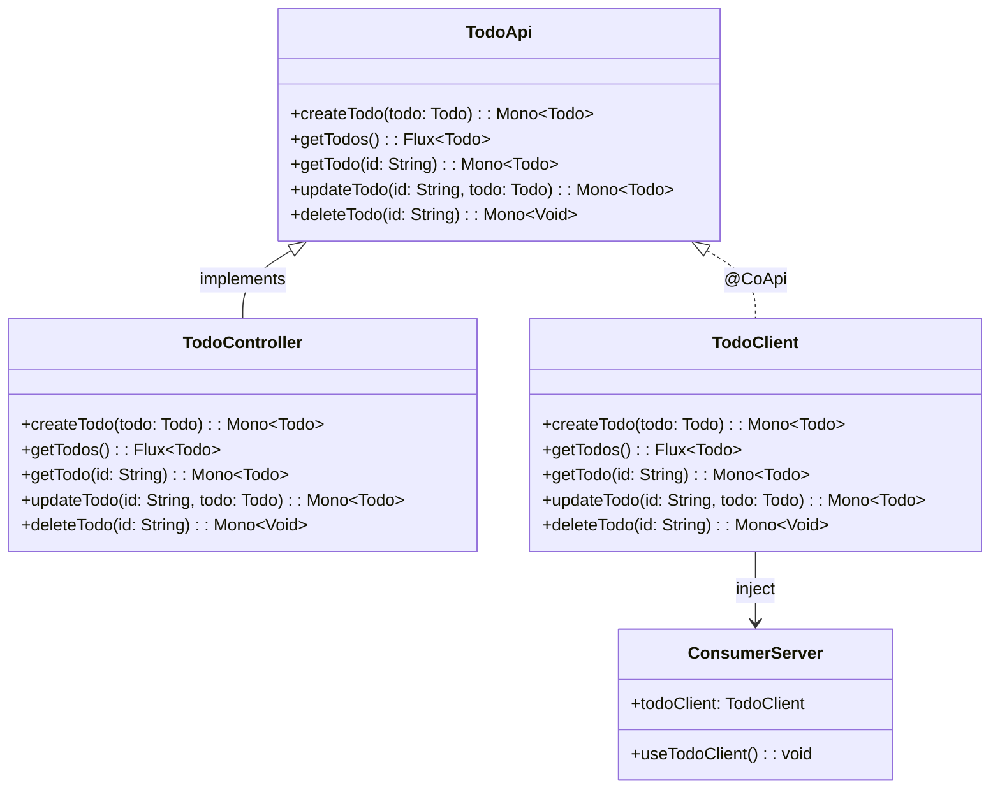
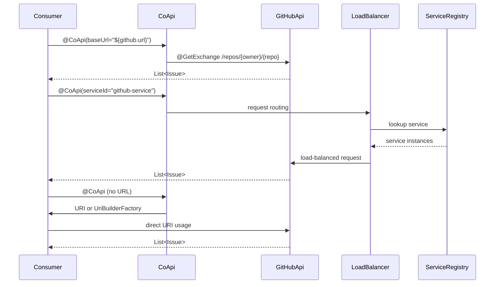
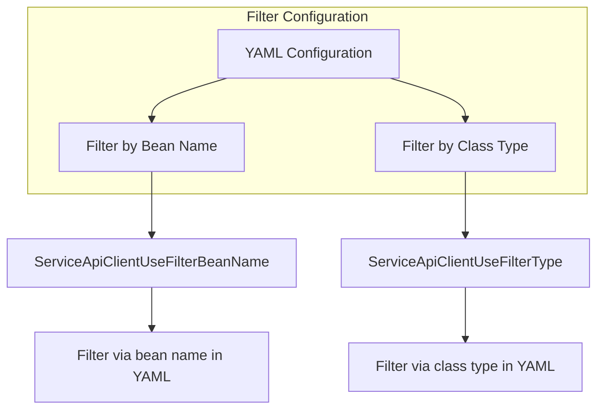
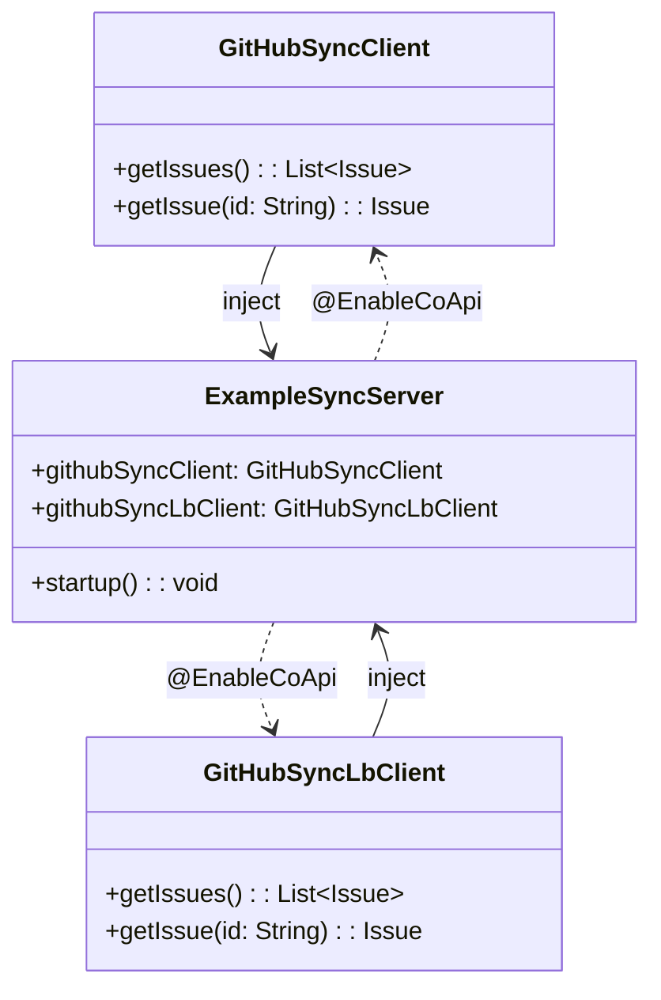
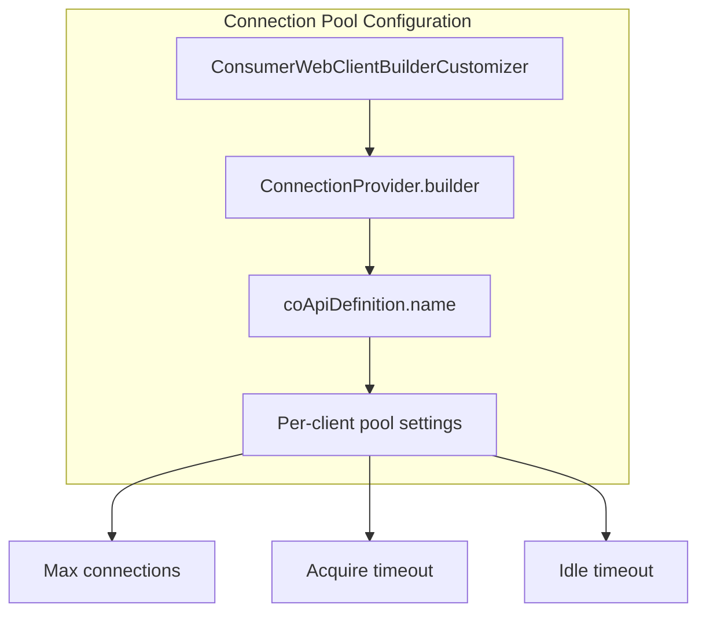

# Examples & Patterns

## Overview

CoApi provides flexible patterns for building type-safe HTTP clients and servers. This page explores practical examples covering provider-consumer architectures, third-party API integration, filter configuration, sync clients, and connection pool customization. These patterns demonstrate how CoApi maintains consistency between contracts and implementations while supporting various deployment scenarios.

## At a Glance

| Pattern | Key Components | Use Case | Key Benefits |
|---------|---------------|----------|-------------|
| Provider-Consumer | Shared API, Provider Server, Consumer Server | Internal microservices | Single contract prevents inconsistency |
| Third-Party API | @CoApi with different configurations | External service integration | Flexible URL and load-balancing options |
| Filter Configuration | YAML-based filtering | Service selection | Fine-grained client routing control |
| Sync Java | @EnableCoApi with Java clients | Synchronous operations | Traditional Java integration |
| Connection Pool | WebClientBuilderCustomizer | Performance tuning | Per-client resource optimization |

## Provider-Consumer Pattern

The primary pattern involves a shared API contract that prevents inconsistency between provider and consumer services.

**Components:**

1. **Shared API Module** (`example-provider-api`) - Defines the contract
   - [`TodoApi.kt`](https://github.com/Ahoo-Wang/CoApi/blob/main/example/example-provider-api/src/main/kotlin/me/ahoo/coapi/example/provider/api/TodoApi.kt) with `@HttpExchange` annotations

2. **Provider Server** (`example-provider-server`) - Implements the contract
   - [`TodoController.kt`](https://github.com/Ahoo-Wang/CoApi/blob/main/example/example-provider-server/src/main/kotlin/me/ahoo/coapi/example/provider/TodoController.kt) implements `TodoApi`

3. **Consumer Server** (`example-consumer-server`) - Uses the client
   - Injects `TodoClient` and calls methods defined in `TodoApi`

**Benefit:** Single contract prevents inconsistency between provider and consumer implementations.

## Third-Party API Client

CoApi supports multiple approaches for integrating third-party APIs:

**Client Types:**

1. **GitHubApiClient** - Direct base URL configuration
   - [`GitHubApiClient.kt`](https://github.com/Ahoo-Wang/CoApi/blob/main/example/example-consumer-client/src/main/kotlin/me/ahoo/coapi/example/consumer/client/GitHubApiClient.kt)
   - `@CoApi(baseUrl = "${github.url}")` with `@GetExchange`

2. **ServiceApiClient** - Load-balanced service discovery
   - [`ServiceApiClient.kt`](https://github.com/Ahoo-Wang/CoApi/blob/main/example/example-consumer-client/src/main/kotlin/me/ahoo/coapi/example/consumer/client/ServiceApiClient.kt)
   - `@CoApi(serviceId = "github-service", name = "GitHubApi")`

3. **UriApiClient** - Direct URI usage
   - [`UriApiClient.kt`](https://github.com/Ahoo-Wang/CoApi/blob/main/example/example-consumer-client/src/main/kotlin/me/ahoo/coapi/example/consumer/client/UriApiClient.kt)
   - `@CoApi` (no URL) - uses `URI` or `UriBuilderFactory` directly

## Filter Configuration Patterns

CoApi provides flexible filtering mechanisms for service selection:

**Filter Types:**

1. **ServiceApiClientUseFilterBeanName** - Filter by bean name via YAML
2. **ServiceApiClientUseFilterType** - Filter by class type via YAML

Both patterns allow fine-grained control over service selection in complex deployments.

## Sync Java Example

CoApi supports both reactive and synchronous Java clients:

**Components:**

1. **GitHubSyncClient** (Java) - Direct URL configuration
   - Returns `List<Issue>`

2. **GitHubSyncLbClient** (Java) - Load-balanced configuration  
   - Returns `List<Issue>`

3. **ExampleSyncServer** - Configuration
   - [`GitHubSyncClient.java`](https://github.com/Ahoo-Wang/CoApi/blob/main/example/example-sync/src/main/java/me/ahoo/coapi/example/sync/GitHubSyncClient.java)
   - `@EnableCoApi(clients = [GitHubSyncClient::class])`

## Connection Pool Customization

For performance optimization, CoApi allows per-client connection pool configuration:

**Implementation:**
- [`ConsumerWebClientBuilderCustomizer.kt`](https://github.com/Ahoo-Wang/CoApi/blob/main/example/example-consumer-server/src/main/kotlin/me/ahoo/coapi/example/consumer/ConsumerWebClientBuilderCustomizer.kt)
- Uses `ConnectionProvider.builder(coApiDefinition.name)` for per-client configuration

## References

1. [TodoApi Interface](https://github.com/Ahoo-Wang/CoApi/blob/main/example/example-provider-api/src/main/kotlin/me/ahoo/coapi/example/provider/api/TodoApi.kt) - Shared API contract definition
2. [TodoClient Interface](https://github.com/Ahoo-Wang/CoApi/blob/main/example/example-provider-api/src/main/kotlin/me/ahoo/coapi/example/provider/client/TodoClient.kt) - Consumer-side client implementation
3. [TodoController](https://github.com/Ahoo-Wang/CoApi/blob/main/example/example-provider-server/src/main/kotlin/me/ahoo/coapi/example/provider/TodoController.kt) - Provider-side controller implementation
4. [GitHubApiClient](https://github.com/Ahoo-Wang/CoApi/blob/main/example/example-consumer-client/src/main/kotlin/me/ahoo/coapi/example/consumer/client/GitHubApiClient.kt) - Third-party API client with base URL
5. [ServiceApiClient](https://github.com/Ahoo-Wang/CoApi/blob/main/example/example-consumer-client/src/main/kotlin/me/ahoo/coapi/example/consumer/client/ServiceApiClient.kt) - Load-balanced service client
6. [UriApiClient](https://github.com/Ahoo-Wang/CoApi/blob/main/example/example-consumer-client/src/main/kotlin/me/ahoo/coapi/example/consumer/client/UriApiClient.kt) - URI-based client
7. [ConsumerServer](https://github.com/Ahoo-Wang/CoApi/blob/main/example/example-consumer-server/src/main/kotlin/me/ahoo/coapi/example/consumer/ConsumerServer.kt) - Consumer application configuration
8. [ConsumerWebClientBuilderCustomizer](https://github.com/Ahoo-Wang/CoApi/blob/main/example/example-consumer-server/src/main/kotlin/me/ahoo/coapi/example/consumer/ConsumerWebClientBuilderCustomizer.kt) - Connection pool customization
9. [GitHubSyncClient](https://github.com/Ahoo-Wang/CoApi/blob/main/example/example-sync/src/main/java/me/ahoo/coapi/example/sync/GitHubSyncClient.java) - Synchronous Java client

## Related Pages

- [Getting Started](../getting-started.md) - Basic setup and configuration
- [Configuration](../getting-started/configuration.md) - Detailed configuration options
- [Advanced Topics](.md) - Advanced patterns and customizations
- [Best Practices](.md) - Recommended approaches and patterns
- [Troubleshooting](.md) - Common issues and solutions
