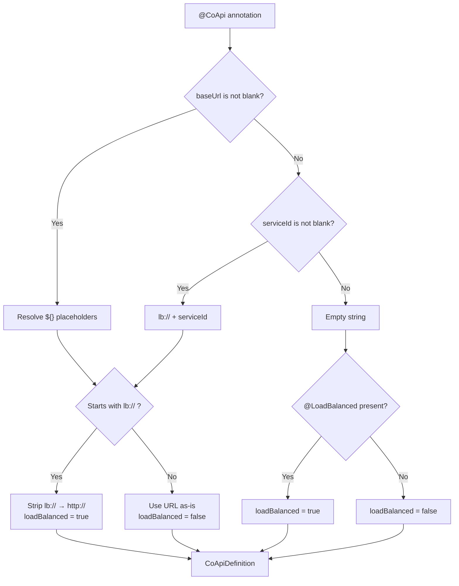
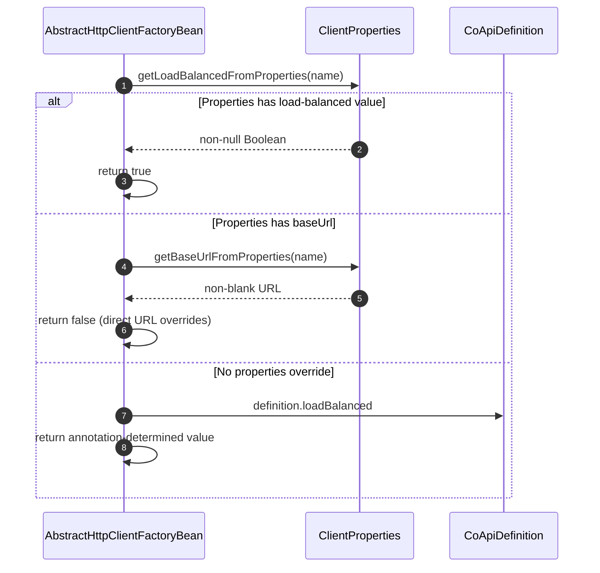
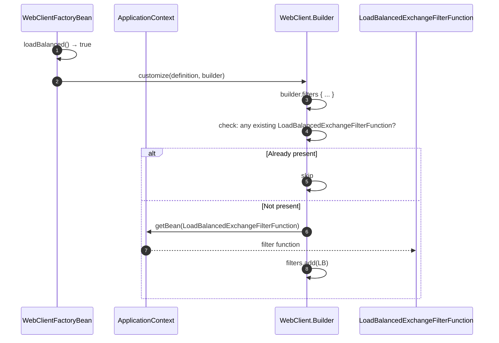
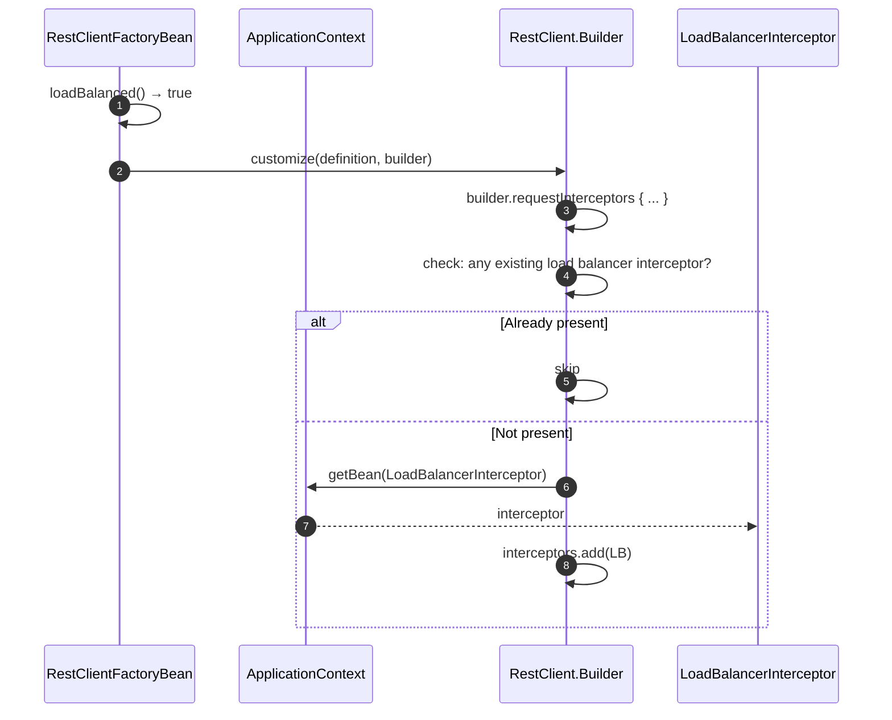

# Client-Side Load Balancing

## Overview

In microservice architectures, services need to call other services without hardcoding hostnames. CoApi integrates with Spring Cloud LoadBalancer to provide client-side load balancing: the HTTP client itself selects which service instance to call. This eliminates the need for an external load balancer and gives the application direct control over instance selection, retries, and circuit breaking.

CoApi provides three ways to opt into load balancing, all resolving to the same mechanism: a `LoadBalancedExchangeFilterFunction` (reactive) or `LoadBalancerInterceptor` (sync) is added to the HTTP client's filter/interceptor chain.

## At a Glance

| Mechanism | Annotation | Resolved URL | Load Balanced | Source |
|-----------|-----------|--------------|---------------|--------|
| Service ID | `@CoApi(serviceId = "svc")` | `http://svc` | Yes | [CoApi.kt](https://github.com/Ahoo-Wang/CoApi/blob/main/api/src/main/kotlin/me/ahoo/coapi/api/CoApi.kt#L46) |
| LB Protocol | `@CoApi(baseUrl = "lb://svc")` | `http://svc` | Yes | [CoApi.kt](https://github.com/Ahoo-Wang/CoApi/blob/main/api/src/main/kotlin/me/ahoo/coapi/api/CoApi.kt#L38) |
| Annotation | `@CoApi @LoadBalanced` | Empty | Yes | [LoadBalanced.kt](https://github.com/Ahoo-Wang/CoApi/blob/main/api/src/main/kotlin/me/ahoo/coapi/api/LoadBalanced.kt#L17) |
| Properties | `coapi.clients.<name>.load-balanced=true` | Per properties | Yes | [CoApiProperties.kt](https://github.com/Ahoo-Wang/CoApi/blob/main/spring-boot-starter/src/main/kotlin/me/ahoo/coapi/spring/boot/starter/CoApiProperties.kt#L54) |
| Direct URL | `@CoApi(baseUrl = "http://...")` | As specified | No | [CoApi.kt](https://github.com/Ahoo-Wang/CoApi/blob/main/api/src/main/kotlin/me/ahoo/coapi/api/CoApi.kt#L38) |

## URL Resolution Flow

When `toCoApiDefinition()` parses the annotation, it resolves the base URL and determines load balancing:


<!-- Sources: spring/src/main/kotlin/me/ahoo/coapi/spring/CoApiDefinition.kt:70-97, api/src/main/kotlin/me/ahoo/coapi/api/LoadBalanced.kt:17 -->

The resolution logic in [CoApiDefinition.kt:70-97](https://github.com/Ahoo-Wang/CoApi/blob/main/spring/src/main/kotlin/me/ahoo/coapi/spring/CoApiDefinition.kt#L70-L97):

| Input | Resolved URL | loadBalanced |
|-------|-------------|--------------|
| `@CoApi(baseUrl = "lb://order-service")` | `http://order-service` | `true` |
| `@CoApi(serviceId = "order-service")` | `http://order-service` | `true` |
| `@CoApi @LoadBalanced` | `""` (empty) | `true` |
| `@CoApi(baseUrl = "\${github.url}")` | resolved value | `false` |

## Runtime Load Balancing Decision

At bean creation time, `AbstractHttpClientFactoryBean.loadBalanced()` applies a precedence order:


<!-- Sources: spring/src/main/kotlin/me/ahoo/coapi/spring/client/AbstractHttpClientFactoryBean.kt:42-56 -->

**Precedence** ([AbstractHttpClientFactoryBean.kt:42-56](https://github.com/Ahoo-Wang/CoApi/blob/main/spring/src/main/kotlin/me/ahoo/coapi/spring/client/AbstractHttpClientFactoryBean.kt#L42-L56)):

| Priority | Source | Effect |
|----------|--------|--------|
| 1 (highest) | `coapi.clients.<name>.load-balanced` | Override to `true` |
| 2 | `coapi.clients.<name>.base-url` (non-blank) | Forces non-load-balanced |
| 3 (lowest) | `@CoApi` / `@LoadBalanced` annotation | Default from annotation |

## WebClient Load Balancing

For the reactive stack, [WebClientFactoryBean](https://github.com/Ahoo-Wang/CoApi/blob/main/spring/src/main/kotlin/me/ahoo/coapi/spring/client/reactive/WebClientFactoryBean.kt) adds `LoadBalancedExchangeFilterFunction`:


<!-- Sources: spring/src/main/kotlin/me/ahoo/coapi/spring/client/reactive/WebClientFactoryBean.kt:30-43 -->

The `LoadBalancedWebClientBuilderCustomizer` inner class ([WebClientFactoryBean.kt:34-43](https://github.com/Ahoo-Wang/CoApi/blob/main/spring/src/main/kotlin/me/ahoo/coapi/spring/client/reactive/WebClientFactoryBean.kt#L34-L43)) checks for duplicates before adding, ensuring idempotency.

## RestClient Load Balancing

For the synchronous stack, [RestClientFactoryBean](https://github.com/Ahoo-Wang/CoApi/blob/main/spring/src/main/kotlin/me/ahoo/coapi/spring/client/sync/RestClientFactoryBean.kt) adds `LoadBalancerInterceptor`:


<!-- Sources: spring/src/main/kotlin/me/ahoo/coapi/spring/client/sync/RestClientFactoryBean.kt:30-43 -->

## Per-Client Filter & Interceptor Configuration

Beyond load balancing, CoApi supports per-client filter/interceptor chains via YAML properties:

```yaml
coapi:
  clients:
    ServiceApiClientUseFilterBeanName:
      reactive:
        filter:
          names:
            - loadBalancerExchangeFilterFunction
    ServiceApiClientUseFilterType:
      reactive:
        filter:
          types:
            - org.springframework.cloud.client.loadbalancer.reactive.LoadBalancedExchangeFilterFunction
```

| Property | Type | Applies To | Source |
|----------|------|-----------|--------|
| `coapi.clients.<name>.reactive.filter.names` | Bean names | WebClient (reactive) | [CoApiProperties.kt](https://github.com/Ahoo-Wang/CoApi/blob/main/spring-boot-starter/src/main/kotlin/me/ahoo/coapi/spring/boot/starter/CoApiProperties.kt#L59) |
| `coapi.clients.<name>.reactive.filter.types` | Class types | WebClient (reactive) | [CoApiProperties.kt](https://github.com/Ahoo-Wang/CoApi/blob/main/spring-boot-starter/src/main/kotlin/me/ahoo/coapi/spring/boot/starter/CoApiProperties.kt#L59) |
| `coapi.clients.<name>.sync.interceptor.names` | Bean names | RestClient (sync) | [CoApiProperties.kt](https://github.com/Ahoo-Wang/CoApi/blob/main/spring-boot-starter/src/main/kotlin/me/ahoo/coapi/spring/boot/starter/CoApiProperties.kt#L62) |
| `coapi.clients.<name>.sync.interceptor.types` | Class types | RestClient (sync) | [CoApiProperties.kt](https://github.com/Ahoo-Wang/CoApi/blob/main/spring-boot-starter/src/main/kotlin/me/ahoo/coapi/spring/boot/starter/CoApiProperties.kt#L62) |

Filter resolution in [AbstractWebClientFactoryBean.kt](https://github.com/Ahoo-Wang/CoApi/blob/main/spring/src/main/kotlin/me/ahoo/coapi/spring/client/reactive/AbstractWebClientFactoryBean.kt) resolves bean names and types from `ApplicationContext`.

## Service Discovery Configuration

CoApi works with any Spring Cloud `DiscoveryClient`. A simple in-memory configuration for development:

```yaml
spring:
  cloud:
    discovery:
      client:
        simple:
          instances:
            github-service:
              - host: api.github.com
                secure: true
                port: 443
            provider-service:
              - host: localhost
                port: 8010
```

## Requirements

| Requirement | How |
|-------------|-----|
| `spring-cloud-starter-loadbalancer` on classpath | Gradle/Maven dependency |
| Service instances registered | Spring Cloud DiscoveryClient or SimpleDiscoveryClient |
| Load balancing enabled in CoApi | `serviceId`, `lb://`, `@LoadBalanced`, or property |

## Related Pages

- [Annotations (@CoApi, @LoadBalanced)](./annotations.md) — annotation parameters and URL resolution
- [Client Modes (Reactive & Sync)](./client-modes.md) — WebClient vs RestClient internals
- [Customization & Extensibility](./customization.md) — customizer SPI and filter chains
- [Configuration Reference](../getting-started/configuration.md) — all YAML properties

## References

1. [CoApi.kt](https://github.com/Ahoo-Wang/CoApi/blob/main/api/src/main/kotlin/me/ahoo/coapi/api/CoApi.kt) — `api/src/main/kotlin/me/ahoo/coapi/api/CoApi.kt`
2. [LoadBalanced.kt](https://github.com/Ahoo-Wang/CoApi/blob/main/api/src/main/kotlin/me/ahoo/coapi/api/LoadBalanced.kt) — `api/src/main/kotlin/me/ahoo/coapi/api/LoadBalanced.kt`
3. [CoApiDefinition.kt](https://github.com/Ahoo-Wang/CoApi/blob/main/spring/src/main/kotlin/me/ahoo/coapi/spring/CoApiDefinition.kt) — `spring/src/main/kotlin/me/ahoo/coapi/spring/CoApiDefinition.kt`
4. [AbstractHttpClientFactoryBean.kt](https://github.com/Ahoo-Wang/CoApi/blob/main/spring/src/main/kotlin/me/ahoo/coapi/spring/client/AbstractHttpClientFactoryBean.kt) — `spring/src/main/kotlin/me/ahoo/coapi/spring/client/AbstractHttpClientFactoryBean.kt`
5. [WebClientFactoryBean.kt](https://github.com/Ahoo-Wang/CoApi/blob/main/spring/src/main/kotlin/me/ahoo/coapi/spring/client/reactive/WebClientFactoryBean.kt) — `spring/src/main/kotlin/me/ahoo/coapi/spring/client/reactive/WebClientFactoryBean.kt`
6. [RestClientFactoryBean.kt](https://github.com/Ahoo-Wang/CoApi/blob/main/spring/src/main/kotlin/me/ahoo/coapi/spring/client/sync/RestClientFactoryBean.kt) — `spring/src/main/kotlin/me/ahoo/coapi/spring/client/sync/RestClientFactoryBean.kt`
7. [CoApiProperties.kt](https://github.com/Ahoo-Wang/CoApi/blob/main/spring-boot-starter/src/main/kotlin/me/ahoo/coapi/spring/boot/starter/CoApiProperties.kt) — `spring-boot-starter/src/main/kotlin/.../CoApiProperties.kt`
8. [consumer application.yaml](https://github.com/Ahoo-Wang/CoApi/blob/main/example/example-consumer-server/src/main/resources/application.yaml) — `example/example-consumer-server/src/main/resources/application.yaml`
