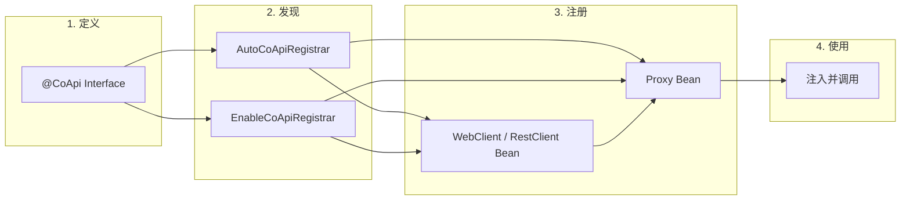
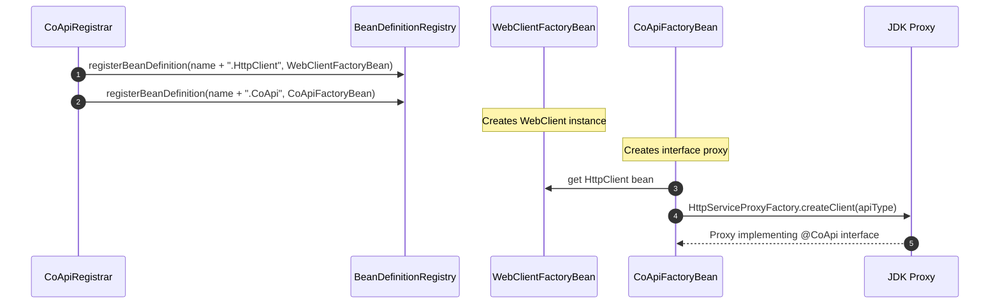
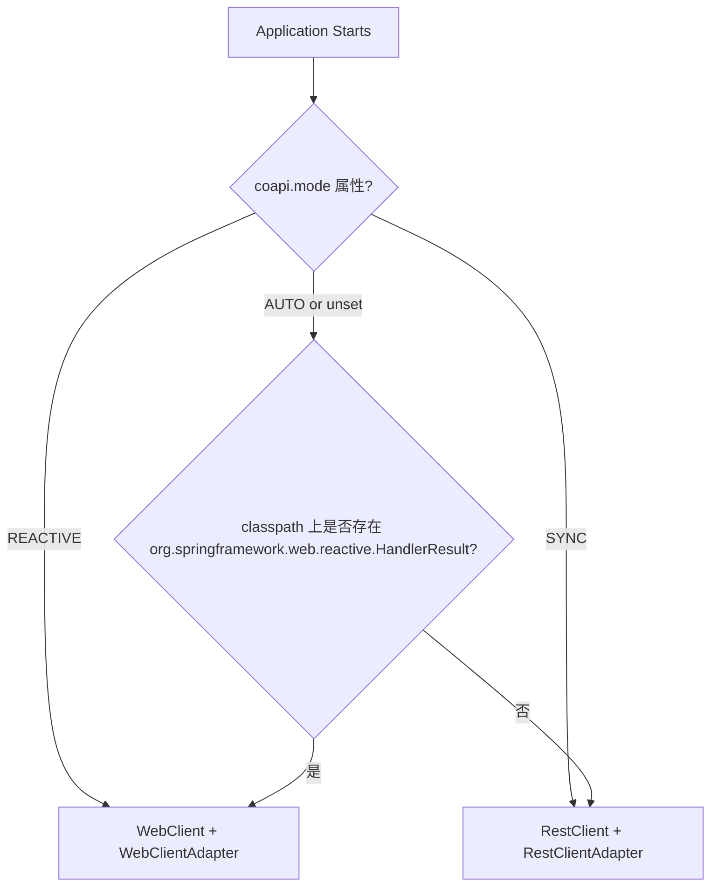
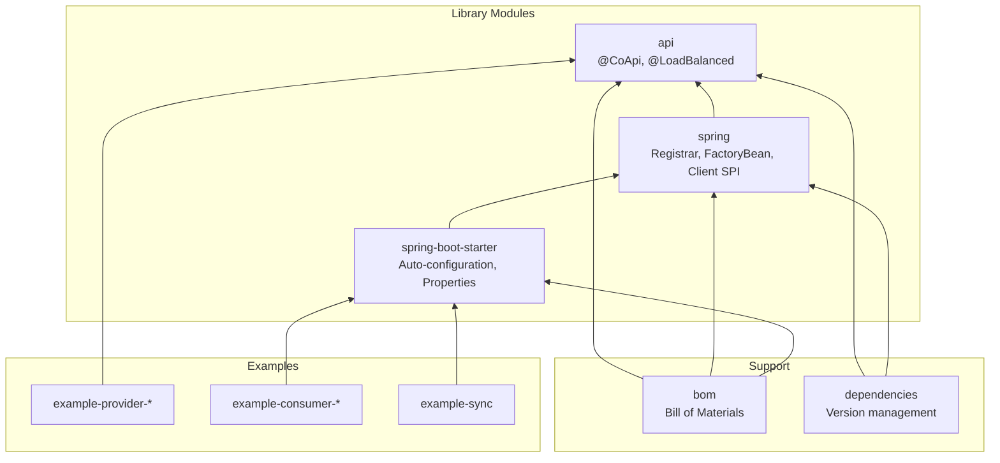

# CoApi 是什么？

## 概述

CoApi 诞生的原因是 Spring 6 引入了 HTTP Interface（`@HttpExchange`），但留下了一个关键缺口：没有自动配置。开发者必须手动连接 `HttpServiceProxyFactory`，在 `WebClient` 和 `RestClient` 之间做出选择，处理 URL 解析，并管理 bean 生命周期。与此同时，Spring Cloud 中事实上的声明式 HTTP 客户端标准 OpenFeign 缺乏响应式编程支持。其推荐的替代品 `feign-reactive` 已停止维护，且与 Spring Boot 3.2+ 不兼容。

CoApi 通过注解驱动、零样板自动配置填补了这个空白。定义一个接口，用 `@CoApi` 注解标记，CoApi 自动注册 HTTP 客户端 bean、JDK 代理及所有支持基础设施。它通过单一注解同时支持响应式（`WebClient`）和同步（`RestClient`）模型，并通过 Spring Cloud LoadBalancer 集成客户端负载均衡。

## 一览

| 组件 | 职责 | 关键文件 | 源码 |
|-----------|----------------|----------|--------|
| `@CoApi` | 将接口标记为 HTTP 客户端，提供 `baseUrl`/`serviceId`/`name` | [CoApi.kt](https://github.com/Ahoo-Wang/CoApi/blob/main/api/src/main/kotlin/me/ahoo/coapi/api/CoApi.kt) | [api/src/main/kotlin/.../CoApi.kt:38](https://github.com/Ahoo-Wang/CoApi/blob/main/api/src/main/kotlin/me/ahoo/coapi/api/CoApi.kt#L38) |
| `@LoadBalanced` | 标记接口启用客户端负载均衡 | [LoadBalanced.kt](https://github.com/Ahoo-Wang/CoApi/blob/main/api/src/main/kotlin/me/ahoo/coapi/api/LoadBalanced.kt) | [api/src/main/kotlin/.../LoadBalanced.kt:17](https://github.com/Ahoo-Wang/CoApi/blob/main/api/src/main/kotlin/me/ahoo/coapi/api/LoadBalanced.kt#L17) |
| `CoApiDefinition` | 解析后的元数据：name、apiType、baseUrl、loadBalanced | [CoApiDefinition.kt](https://github.com/Ahoo-Wang/CoApi/blob/main/spring/src/main/kotlin/me/ahoo/coapi/spring/CoApiDefinition.kt) | [spring/src/main/kotlin/.../CoApiDefinition.kt:24](https://github.com/Ahoo-Wang/CoApi/blob/main/spring/src/main/kotlin/me/ahoo/coapi/spring/CoApiDefinition.kt#L24) |
| `CoApiRegistrar` | 为每个接口注册 WebClient/RestClient + 代理 bean | [CoApiRegistrar.kt](https://github.com/Ahoo-Wang/CoApi/blob/main/spring/src/main/kotlin/me/ahoo/coapi/spring/CoApiRegistrar.kt) | [spring/src/main/kotlin/.../CoApiRegistrar.kt:22](https://github.com/Ahoo-Wang/CoApi/blob/main/spring/src/main/kotlin/me/ahoo/coapi/spring/CoApiRegistrar.kt#L22) |
| `CoApiFactoryBean` | 通过 `HttpServiceProxyFactory` 创建 JDK 代理 | [CoApiFactoryBean.kt](https://github.com/Ahoo-Wang/CoApi/blob/main/spring/src/main/kotlin/me/ahoo/coapi/spring/CoApiFactoryBean.kt) | [spring/src/main/kotlin/.../CoApiFactoryBean.kt:21](https://github.com/Ahoo-Wang/CoApi/blob/main/spring/src/main/kotlin/me/ahoo/coapi/spring/CoApiFactoryBean.kt#L21) |
| `CoApiAutoConfiguration` | Boot 自动配置入口点 | [CoApiAutoConfiguration.kt](https://github.com/Ahoo-Wang/CoApi/blob/main/spring-boot-starter/src/main/kotlin/me/ahoo/coapi/spring/boot/starter/CoApiAutoConfiguration.kt) | [spring-boot-starter/.../CoApiAutoConfiguration.kt:24](https://github.com/Ahoo-Wang/CoApi/blob/main/spring-boot-starter/src/main/kotlin/me/ahoo/coapi/spring/boot/starter/CoApiAutoConfiguration.kt#L24) |

## 为什么选择 CoApi？

Spring 生态系统中声明式 HTTP 客户端有三种方法。以下是它们的对比：

| 特性 | CoApi | Spring Cloud OpenFeign | 手动 HTTP Interface |
|---------|-------|----------------------|----------------------|
| 自动配置 | 零配置 | 零配置 | 每个客户端需手动设置 |
| 响应式支持（WebClient） | 内置 | 无 | 手动 |
| 同步支持（RestClient） | 内置 | 内置 | 手动 |
| 负载均衡 | 内置 | 内置 | 手动 |
| Spring Boot 4.x / Spring 7.x | 支持 | 支持 | 支持 |
| 注解驱动 | `@CoApi` | `@FeignClient` | 仅 `@HttpExchange` |
| 双模式切换 | `coapi.mode` 属性 | 不适用 | 需要修改代码 |

## 工作原理

<!-- Sources: api/src/main/kotlin/me/ahoo/coapi/api/CoApi.kt:38, spring/src/main/kotlin/me/ahoo/coapi/spring/CoApiRegistrar.kt:22, spring-boot-starter/src/main/kotlin/me/ahoo/coapi/spring/boot/starter/AutoCoApiRegistrar.kt:30 -->

## 每个接口两个 Bean 的模式

CoApi 为每个 `@CoApi` 注解的接口注册 **两个 bean**：

<!-- Sources: spring/src/main/kotlin/me/ahoo/coapi/spring/CoApiRegistrar.kt:33-87, spring/src/main/kotlin/me/ahoo/coapi/spring/CoApiFactoryBean.kt:26-34 -->

1. **HTTP 客户端 Bean**（`name.HttpClient`）— 一个配置了基础 URL、过滤器/拦截器以及可选负载均衡的 `WebClient` 或 `RestClient`。
2. **代理 Bean**（`name.CoApi`）— 由 Spring 的 `HttpServiceProxyFactory` 生成的实现注解接口的 JDK 动态代理。

## 客户端模式推断

<!-- Sources: spring/src/main/kotlin/me/ahoo/coapi/spring/ClientMode.kt:16-39, spring/src/main/kotlin/me/ahoo/coapi/spring/AbstractCoApiRegistrar.kt:42-50 -->

## 模块架构

<!-- Sources: settings.gradle.kts:26-45, bom/build.gradle.kts:14-23, dependencies/build.gradle.kts:14-23 -->

## 版本兼容性

| CoApi 版本 | Spring Boot | Spring Framework | JDK |
|---------------|-------------|------------------|-----|
| 1.x | 3.2.x | 6.x | 17+ |
| 2.x | 4.x | 7.x | 17+ |

当前版本：**2.0.1**（[gradle.properties:21](https://github.com/Ahoo-Wang/CoApi/blob/main/gradle.properties#L21)）

## 关键特性

- **零样板** — 一个注解，完全自动配置
- **双模式** — 通过属性或类路径推断在响应式（`WebClient`）和同步（`RestClient`）之间切换
- **负载均衡** — 与 Spring Cloud LoadBalancer 集成
- **可定制** — `WebClientBuilderCustomizer` / `RestClientBuilderCustomizer` SPI 支持全局和每个客户端的自定义
- **认证** — 内置带 JWT 感知的 `CachedExpirableTokenProvider` 的 `BearerTokenFilter`
- **过滤器/拦截器** — 可通过 YAML 属性配置每个客户端的过滤器链

## 相关页面

- [安装与设置](./installation.md) — 将 CoApi 添加到您的项目
- [快速开始](./quick-start.md) — 定义您的第一个 HTTP 客户端
- [配置参考](./configuration.md) — 所有属性详解
- [架构概述](../deep-dive/architecture.md) — 深入了解注册流程

## 参考资料

1. [CoApi 注解](https://github.com/Ahoo-Wang/CoApi/blob/main/api/src/main/kotlin/me/ahoo/coapi/api/CoApi.kt) — `api/src/main/kotlin/me/ahoo/coapi/api/CoApi.kt`
2. [CoApiDefinition](https://github.com/Ahoo-Wang/CoApi/blob/main/spring/src/main/kotlin/me/ahoo/coapi/spring/CoApiDefinition.kt) — `spring/src/main/kotlin/me/ahoo/coapi/spring/CoApiDefinition.kt`
3. [CoApiRegistrar](https://github.com/Ahoo-Wang/CoApi/blob/main/spring/src/main/kotlin/me/ahoo/coapi/spring/CoApiRegistrar.kt) — `spring/src/main/kotlin/me/ahoo/coapi/spring/CoApiRegistrar.kt`
4. [CoApiFactoryBean](https://github.com/Ahoo-Wang/CoApi/blob/main/spring/src/main/kotlin/me/ahoo/coapi/spring/CoApiFactoryBean.kt) — `spring/src/main/kotlin/me/ahoo/coapi/spring/CoApiFactoryBean.kt`
5. [ClientMode](https://github.com/Ahoo-Wang/CoApi/blob/main/spring/src/main/kotlin/me/ahoo/coapi/spring/ClientMode.kt) — `spring/src/main/kotlin/me/ahoo/coapi/spring/ClientMode.kt`
6. [README.md](https://github.com/Ahoo-Wang/CoApi/blob/main/README.md) — 项目概览和使用示例
