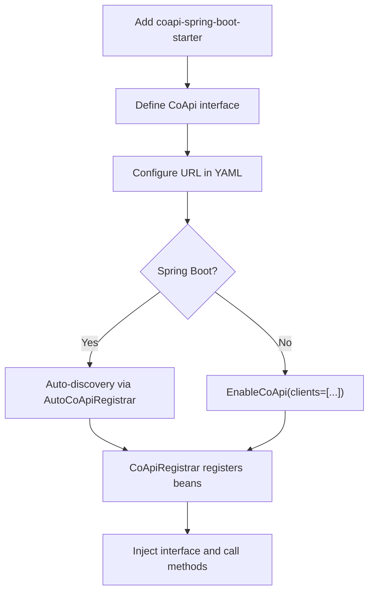
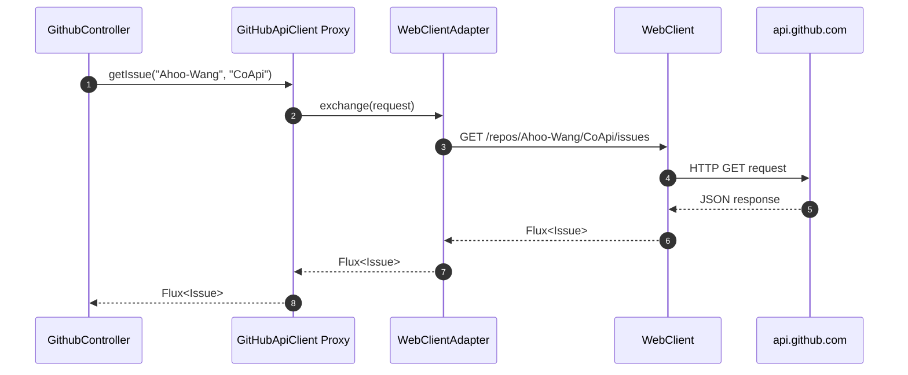
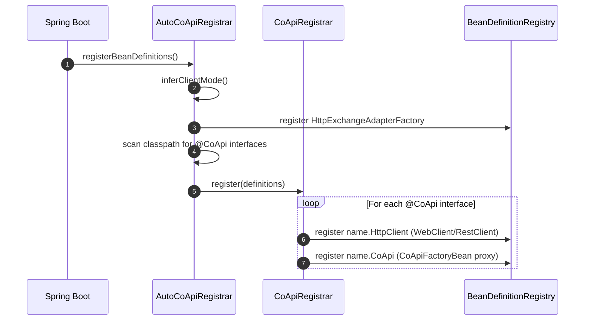

# 快速开始

## 概述

CoApi 将 HTTP 客户端设置精简到极致：用 `@HttpExchange` 方法定义一个 Java 或 Kotlin 接口，用 `@CoApi` 注解标记接口，Spring Boot 自动配置处理其余一切。无需手动构建 `WebClient` 或 `RestClient`，无需设置代理工厂，无需样板代码。

## 一览

| 步骤 | 操作 | 关键文件 | 源码 |
|------|------|----------|--------|
| 1. 添加依赖 | `coapi-spring-boot-starter` | [spring-boot-starter/build.gradle.kts](https://github.com/Ahoo-Wang/CoApi/blob/main/spring-boot-starter/build.gradle.kts) | [spring-boot-starter/build.gradle.kts:29](https://github.com/Ahoo-Wang/CoApi/blob/main/spring-boot-starter/build.gradle.kts#L29) |
| 2. 定义接口 | `@CoApi` + `@GetExchange` | [GitHubApiClient.kt](https://github.com/Ahoo-Wang/CoApi/blob/main/example/example-consumer-client/src/main/kotlin/me/ahoo/coapi/example/consumer/client/GitHubApiClient.kt) | [example/.../GitHubApiClient.kt:21](https://github.com/Ahoo-Wang/CoApi/blob/main/example/example-consumer-client/src/main/kotlin/me/ahoo/coapi/example/consumer/client/GitHubApiClient.kt#L21) |
| 3. 配置 URL | `application.yaml` | [application.yaml](https://github.com/Ahoo-Wang/CoApi/blob/main/example/example-consumer-server/src/main/resources/application.yaml) | [example/.../application.yaml:3](https://github.com/Ahoo-Wang/CoApi/blob/main/example/example-consumer-server/src/main/resources/application.yaml#L3) |
| 4. 注入并使用 | 构造函数注入 | [GithubController.kt](https://github.com/Ahoo-Wang/CoApi/blob/main/example/example-consumer-server/src/main/kotlin/me/ahoo/coapi/example/consumer/GithubController.kt) | [example/.../GithubController.kt:32](https://github.com/Ahoo-Wang/CoApi/blob/main/example/example-consumer-server/src/main/kotlin/me/ahoo/coapi/example/consumer/GithubController.kt#L32) |

## 步骤 1：添加依赖

**Gradle（Kotlin DSL）：**
```kotlin
implementation("me.ahoo.coapi:coapi-spring-boot-starter")
```

**Maven：**
```xml
<dependency>
    <groupId>me.ahoo.coapi</groupId>
    <artifactId>coapi-spring-boot-starter</artifactId>
    <version>2.0.1</version>
</dependency>
```

如需负载均衡，还需添加：
```kotlin
implementation("org.springframework.cloud:spring-cloud-starter-loadbalancer")
```

## 步骤 2：定义接口

```kotlin
@CoApi(baseUrl = "\${github.url}")
interface GitHubApiClient {

    @GetExchange("repos/{owner}/{repo}/issues")
    fun getIssue(@PathVariable owner: String, @PathVariable repo: String): Flux<Issue>
}

data class Issue(val url: String)
```

`@CoApi` 注解完成三件事：
1. 将此接口标记为 HTTP 客户端（也充当 `@Component`）
2. 定义基础 URL（支持 `${...}` 属性占位符）
3. 触发自动配置以注册 bean

## 步骤 3：配置 URL

```yaml
# application.yaml
github:
  url: https://api.github.com
```

`@CoApi(baseUrl)` 中的 `${github.url}` 占位符会针对 Spring 的 `Environment` 进行解析。

## 步骤 4：启用并使用

**Spring Boot（自动配置）**：无需其他操作。CoApi 会自动发现应用程序基础包中的 `@CoApi` 接口。

**非 Boot / 显式模式**：添加 `@EnableCoApi`：
```kotlin
@EnableCoApi(clients = [GitHubApiClient::class])
@SpringBootApplication
class MyApplication
```

**注入到任何组件中：**
```kotlin
@RestController
class GithubController(private val gitHubApiClient: GitHubApiClient) {

    @GetMapping("/issues")
    fun getIssues(): Flux<Issue> {
        return gitHubApiClient.getIssue("Ahoo-Wang", "CoApi")
    }
}
```

## 设置流程


<!-- Sources: example/example-consumer-client/src/main/kotlin/me/ahoo/coapi/example/consumer/client/GitHubApiClient.kt:21, spring/src/main/kotlin/me/ahoo/coapi/spring/EnableCoApi.kt:21, spring-boot-starter/src/main/kotlin/me/ahoo/coapi/spring/boot/starter/AutoCoApiRegistrar.kt:30 -->

## 请求流程


<!-- Sources: spring/src/main/kotlin/me/ahoo/coapi/spring/CoApiFactoryBean.kt:26-34, spring/src/main/kotlin/me/ahoo/coapi/spring/client/reactive/ReactiveHttpExchangeAdapterFactory.kt:20-26 -->

## Bean 注册


<!-- Sources: spring-boot-starter/src/main/kotlin/me/ahoo/coapi/spring/boot/starter/AutoCoApiRegistrar.kt:47-56, spring/src/main/kotlin/me/ahoo/coapi/spring/CoApiRegistrar.kt:27-87, spring/src/main/kotlin/me/ahoo/coapi/spring/AbstractCoApiRegistrar.kt:42-50 -->

## 常见变体

### 负载均衡客户端

```kotlin
@CoApi(serviceId = "github-service")
interface ServiceApiClient {
    @GetExchange("repos/{owner}/{repo}/issues")
    fun getIssue(@PathVariable owner: String, @PathVariable repo: String): Flux<Issue>
}
```

配置服务实例：
```yaml
spring:
  cloud:
    discovery:
      client:
        simple:
          instances:
            github-service:
              - host: api.github.com
                secure: true
                port: 443
```

### 同步客户端（Java）

```java
@CoApi(baseUrl = "${github.url}")
public interface GitHubSyncClient {
    @GetExchange("repos/{owner}/{repo}/issues")
    List<Issue> getIssue(@PathVariable String owner, @PathVariable String repo);
}
```

设置 `coapi.mode=SYNC` 以切换到基于 `RestClient` 的模式。返回 `List<T>` 而不是 `Flux<T>`。

### 共享 API 契约模式

定义提供者和消费者都依赖的共享 API 接口：

```kotlin
// Shared module: example-provider-api
@HttpExchange("todo")
interface TodoApi {
    @GetExchange
    fun getTodo(): Flux<Todo>
}

// Consumer module
@CoApi(serviceId = "provider-service")
interface TodoClient : TodoApi

// Provider module
@RestController
class TodoController : TodoApi {
    override fun getTodo(): Flux<Todo> = Flux.just(Todo("Hello"))
}
```

## 相关页面

- [什么是 CoApi？](./overview.md) — CoApi 存在的原因
- [安装与设置](./installation.md) — 详细的依赖管理
- [配置参考](./configuration.md) — 所有属性
- [架构概述](../deep-dive/architecture.md) — 内部注册工作原理
- [示例与模式](../deep-dive/examples.md) — 完整的示例演练

## 参考资料

1. [GitHubApiClient 示例](https://github.com/Ahoo-Wang/CoApi/blob/main/example/example-consumer-client/src/main/kotlin/me/ahoo/coapi/example/consumer/client/GitHubApiClient.kt) — `example/example-consumer-client/src/main/kotlin/.../GitHubApiClient.kt`
2. [ConsumerServer](https://github.com/Ahoo-Wang/CoApi/blob/main/example/example-consumer-server/src/main/kotlin/me/ahoo/coapi/example/consumer/ConsumerServer.kt) — `example/example-consumer-server/src/main/kotlin/.../ConsumerServer.kt`
3. [GithubController](https://github.com/Ahoo-Wang/CoApi/blob/main/example/example-consumer-server/src/main/kotlin/me/ahoo/coapi/example/consumer/GithubController.kt) — `example/example-consumer-server/src/main/kotlin/.../GithubController.kt`
4. [Consumer application.yaml](https://github.com/Ahoo-Wang/CoApi/blob/main/example/example-consumer-server/src/main/resources/application.yaml) — `example/example-consumer-server/src/main/resources/application.yaml`
5. [CoApi 注解](https://github.com/Ahoo-Wang/CoApi/blob/main/api/src/main/kotlin/me/ahoo/coapi/api/CoApi.kt) — `api/src/main/kotlin/me/ahoo/coapi/api/CoApi.kt`
6. [EnableCoApi 注解](https://github.com/Ahoo-Wang/CoApi/blob/main/spring/src/main/kotlin/me/ahoo/coapi/spring/EnableCoApi.kt) — `spring/src/main/kotlin/me/ahoo/coapi/spring/EnableCoApi.kt`
