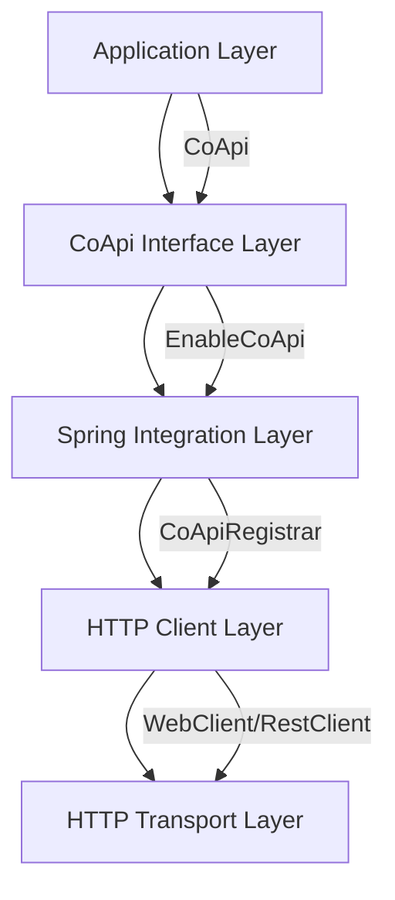
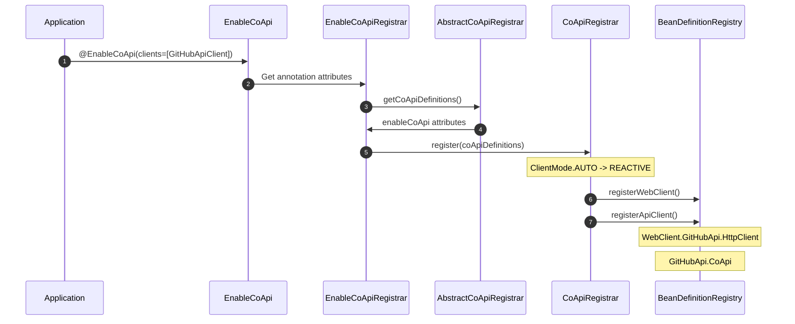

# CoApi Contributor Guide

[Repository](https://github.com/Ahoo-Wang/CoApi) | [Main Branch](https://github.com/Ahoo-Wang/CoApi/blob/main)

## Table of Contents

- [Introduction](#introduction)
- [Part I: Language/Framework Foundations](#part-i-languageframework-foundations)
  - [Spring Framework 6 & Spring Boot 4.x](#spring-framework-6--spring-boot-4x)
  - [Kotlin Language Essentials](#kotlin-language-essentials)
  - [Spring HTTP Interface](#spring-http-interface)
  - [HTTP Clients: WebClient vs RestClient](#http-clients-webclient-vs-restclient)
  - [Dependency Injection & Configuration](#dependency-injection--configuration)
- [Part II: CoApi Architecture & Domain Model](#part-ii-coapi-architecture--domain-model)
  - [Project Structure](#project-structure)
  - [Core Architecture](#core-architecture)
  - [Registration Flow](#registration-flow)
  - [Client Mode Configuration](#client-mode-configuration)
  - [Load Balancing](#load-balancing)
  - [Authentication](#authentication)
- [Part III: Getting Productive](#part-iii-getting-productive)
  - [Development Environment Setup](#development-environment-setup)
  - [Building the Project](#building-the-project)
  - [Testing Strategy](#testing-strategy)
  - [Code Quality & Static Analysis](#code-quality--static-analysis)
  - [Contributing Guidelines](#contributing-guidelines)
  - [Release Process](#release-process)
- [Glossary](#glossary)
- [Key File Reference](#key-file-reference)
- [Cross-Language Comparisons](#cross-language-comparisons)
- [Appendices](#appendices)
  - [Appendix A: Configuration Properties](#appendix-a-configuration-properties)
  - [Appendix B: Common Patterns](#appendix-b-common-patterns)
  - [Appendix C: Troubleshooting](#appendix-c-troubleshooting)

## Introduction

Welcome to the CoApi contributor guide! CoApi is a Spring Framework library providing zero-boilerplate auto-configuration for Spring 6 HTTP Interface clients. This guide is designed to help you understand the codebase, contribute effectively, and become productive with the project.

CoApi addresses the gap in the Spring ecosystem by providing automatic configuration for HTTP Interface clients while supporting both reactive and synchronous programming models. Whether you're a seasoned Spring developer or new to HTTP clients, this guide will help you understand how CoApi works and how to contribute to its ongoing development.

### What You'll Learn

By the end of this guide, you'll understand:

- The foundations of Spring Framework 6 and Spring Boot 4.x
- How CoApi integrates with Spring's HTTP Interface
- The architecture and design patterns used in CoApi
- How to set up your development environment
- Testing strategies and contribution workflows
- Advanced features like load balancing and authentication

### Prerequisites

Before diving into this guide, you should have:

- Basic knowledge of Java/Kotlin and Spring Framework
- Understanding of HTTP clients and REST APIs
- Familiarity with Gradle build system
- Git experience for version control

---

## Part I: Language/Framework Foundations

### Spring Framework 6 & Spring Boot 4.x

CoApi is built on top of Spring Framework 6 and Spring Boot 4.x, making it essential to understand the foundations of these frameworks.

#### Spring Framework 6 Key Features

Spring Framework 6 introduces several important changes and improvements:

- **Virtual Thread Support**: Java 17+ virtual threads for improved concurrency
- **Performance Enhancements**: Optimized bean creation and dependency injection
- **Type Hints**: Improved type inference and generic support
- **Observability**: Enhanced integration with observability tools

#### Spring Boot 4.x Compatibility

CoApi 2.x is specifically designed for Spring Boot 4.x:

```kotlin
// build.gradle.kts
dependencies {
    implementation("org.springframework.boot:spring-boot:4.0.0")
    implementation("org.springframework:spring-web:6.0.0")
}
```

Spring Boot 4.x provides:

- **Auto-configuration**: Simplified setup of Spring applications
- **Actuator**: Production-ready features
- **Embedded Servers**: Easy deployment options

### Kotlin Language Essentials

CoApi is written in Kotlin, leveraging its modern language features for cleaner, more expressive code.

#### Key Kotlin Features Used

1. **Type-Safe Builders**: For configuration and bean definitions

```kotlin
@BeanDefinitionBuilder.genericBeanDefinition(WebClientFactoryBean::class.java)
    .addConstructorArgValue(coApiDefinition)
```

2. **Extension Functions**: For utility methods

```kotlin
fun String.withBearerPrefix(): String = "Bearer $this"
```

3. **Null Safety**: Compile-time null checks

```kotlin
val coApi = getAnnotation(CoApi::class.java)
    ?: throw IllegalArgumentException("The class must be annotated by @CoApi.")
```

4. **Data Classes**: For immutable data holders

```kotlin
data class CoApiDefinition(
    val name: String,
    val apiType: Class<*>,
    val baseUrl: String,
    val loadBalanced: Boolean
)
```

#### Kotlin DSL for Gradle

The project uses Kotlin DSL for build scripts:

```kotlin
plugins {
    kotlin("jvm") version "1.8.0"
    id("org.springframework.boot") version "4.0.0"
}

dependencies {
    implementation("me.ahoo.coapi:coapi-spring-boot-starter:2.0.0")
}
```

### Spring HTTP Interface

Spring Framework 6 introduced the HTTP Interface, which allows defining HTTP services as Java interfaces using the `@HttpExchange` annotation.

#### @HttpExchange Annotation

The `@HttpExchange` annotation marks an interface as an HTTP service:

```java
@HttpExchange("https://api.github.com")
public interface GitHubApiClient {
    
    @GetExchange("repos/{owner}/{repo}/issues")
    Flux<Issue> getIssue(@PathVariable String owner, @PathVariable repo: String);
    
    @PostExchange("users/{user}/repos")
    Mono<Repository> createRepo(@PathVariable String user, @RequestBody Repository repo);
}
```

#### Supported HTTP Methods

CoApi supports all standard HTTP methods:

```kotlin
@GetExchange("GET /users/{user}")
fun getUser(@PathVariable user: String): Mono<User>

@PostExchange("POST /users")
fun createUser(@RequestBody user: User): Mono<User>

@PutExchange("PUT /users/{id}")
fun updateUser(@PathVariable id: String, @RequestBody user: User): Mono<User>

@DeleteExchange("DELETE /users/{id}")
fun deleteUser(@PathVariable id: String): Mono<Void>
```

#### HTTP Interface Benefits

1. **Type Safety**: Compile-time checking of HTTP methods and paths
2. **Reactive Support**: Native support for Project Reactor types
3. **Simplified Testing**: Easy to mock and test
4. **Consistent API**: Standardized way to define HTTP services

### HTTP Clients: WebClient vs RestClient

CoApi supports both reactive (`WebClient`) and synchronous (`RestClient`) HTTP clients, giving you flexibility based on your application needs.

#### WebClient (Reactive)

WebClient is Spring's reactive HTTP client:

```kotlin
val client = WebClient.builder()
    .baseUrl("https://api.github.com")
    .build()

client.get()
    .uri("/repos/{owner}/{repo}/issues", "Ahoo-Wang", "CoApi")
    .retrieve()
    .bodyToFlux<Issue>()
    .collectList()
```

**Characteristics**:
- Non-blocking and reactive
- Supports streaming responses
- Built on Project Reactor
- Ideal for high-throughput applications

#### RestClient (Synchronous)

RestClient is Spring's modern synchronous HTTP client:

```kotlin
val client = RestClient.builder()
    .baseUrl("https://api.github.com")
    .build()

val issues = client.get()
    .uri("/repos/{owner}/{repo}/issues", "Ahoo-Wang", "CoApi")
    .retrieve()
    .bodyToList<Issue>()
```

**Characteristics**:
- Simple and synchronous
- Standard Java types
- Easy to use and understand
- Ideal for traditional applications

#### CoApi Client Mode Configuration

CoApi automatically selects the appropriate client mode:

```kotlin
enum class ClientMode {
    REACTIVE, SYNC, AUTO;
    
    companion object {
        fun inferClientMode(getProperty: (propertyKey: String) -> String?): ClientMode {
            val propertyValue = getProperty(COAPI_CLIENT_MODE_PROPERTY) ?: AUTO.name
            val mode = ClientMode.valueOf(propertyValue.uppercase())
            return if (mode == AUTO) {
                INFERRED_MODED_BASED_ON_CLASS
            } else {
                mode
            }
        }
    }
}
```

### Dependency Injection & Configuration

Spring's dependency injection framework is central to CoApi's functionality.

#### @Bean Definitions

CoApi uses `@Bean` definitions to create proxy instances:

```kotlin
@Bean
fun coApiProxyFactory(): HttpServiceProxyFactory {
    return HttpServiceProxyFactory.builderFor(httpExchangeAdapter).build()
}
```

#### FactoryBean Pattern

CoApi implements the FactoryBean pattern to create proxies:

```kotlin
class CoApiFactoryBean(
    private val coApiDefinition: CoApiDefinition
) : FactoryBean<Any>, ApplicationContextAware {
    
    override fun getObject(): Any {
        val httpServiceProxyFactory = HttpServiceProxyFactory.builderFor(httpExchangeAdapter).build()
        return httpServiceProxyFactory.createClient(coApiDefinition.apiType)
    }
    
    override fun getObjectType(): Class<*> = coApiDefinition.apiType
}
```

#### Bean Definition Registry

CoApi registers bean definitions programmatically:

```kotlin
fun register(coApiDefinition: CoApiDefinition) {
    val beanDefinitionBuilder = BeanDefinitionBuilder.genericBeanDefinition(CoApiFactoryBean::class.java)
    beanDefinitionBuilder.addConstructorArgValue(coApiDefinition)
    registry.registerBeanDefinition(coApiDefinition.coApiBeanName, beanDefinitionBuilder.beanDefinition)
}
```

---

## Part II: CoApi Architecture & Domain Model

### Project Structure

CoApi follows a modular architecture with clear separation of concerns:

```
CoApi/
├── api/                    # Core annotations and interfaces
│   └── src/main/kotlin/me/ahoo/coapi/api/
│       ├── CoApi.kt       # Main annotation
│       └── LoadBalanced.kt # Load balancing annotation
├── spring/                # Core Spring integration
│   └── src/main/kotlin/me/ahoo/coapi/spring/
│       ├── EnableCoApi.kt          # Enable annotation
│       ├── CoApiRegistrar.kt       # Bean registration
│       ├── CoApiDefinition.kt      # Domain model
│       ├── ClientMode.kt          # Client mode configuration
│       └── client/                # HTTP client implementations
│           ├── reactive/           # WebClient implementation
│           └── sync/               # RestClient implementation
├── spring-boot-starter/   # Spring Boot auto-configuration
│   └── src/main/kotlin/me/ahoo/coapi/spring/boot/
│       └── AutoCoApiConfiguration.kt
├── bom/                   # Bill of materials
└── dependencies/          # Shared dependency management
```

### Core Architecture

#### Layered Architecture

CoApi follows a layered architecture pattern:



#### Component Responsibilities

1. **api Module**: Contains core annotations and interfaces
   - `@CoApi`: Main annotation for marking interfaces
   - `@LoadBalanced`: Enable client-side load balancing

2. **spring Module**: Core Spring integration
   - Bean registration and configuration
   - Client mode detection
   - Proxy creation

3. **spring-boot-starter**: Auto-configuration
   - Automatic detection and setup
   - Property-based configuration

4. **dependencies**: Shared dependency management
   - Version alignment across modules

### Registration Flow

The registration flow is the heart of CoApi's functionality, transforming annotated interfaces into proxied HTTP clients.

#### Annotation Processing

1. **@CoApi Annotation**: Marks interfaces as HTTP clients

```kotlin
@CoApi(baseUrl = "${github.url}")
public interface GitHubApiClient {
    @GetExchange("repos/{owner}/{repo}/issues")
    Flux<Issue> getIssue(@PathVariable String owner, @PathVariable String repo);
}
```

2. **@EnableCoApi Annotation**: Enables auto-configuration

```kotlin
@EnableCoApi(clients = [GitHubApiClient::class])
@SpringBootApplication
class Application
```

#### Registration Process



#### Bean Registration Details

The registration process creates two types of beans:

1. **HTTP Client Bean**: The actual HTTP client (WebClient or RestClient)
2. **CoApi Proxy Bean**: The proxy that implements the interface

```kotlin
// From CoApiRegistrar.kt
fun register(coApiDefinition: CoApiDefinition) {
    if (clientMode == ClientMode.SYNC) {
        registerRestClient(registry, coApiDefinition)
    } else {
        registerWebClient(registry, coApiDefinition)
    }
    registerApiClient(registry, coApiDefinition)
}
```

### Client Mode Configuration

CoApi provides three client modes to support different programming paradigms.

#### Client Mode Options

```kotlin
enum class ClientMode {
    REACTIVE,   // WebClient reactive client
    SYNC,       // RestClient synchronous client  
    AUTO        // Auto-detect based on classpath
}
```

#### Mode Detection Logic

The AUTO mode intelligently selects the appropriate client based on the Spring framework classpath:

```kotlin
// From ClientMode.kt
private val INFERRED_MODE_BASED_ON_CLASS: ClientMode by lazy {
    try {
        Class.forName("org.springframework.web.reactive.HandlerResult")
        REACTIVE  // Spring WebFlux is available
    } catch (ignore: ClassNotFoundException) {
        SYNC      // Spring MVC is available
    }
}

fun inferClientMode(getProperty: (propertyKey: String) -> String?): ClientMode {
    val propertyValue = getProperty(COAPI_CLIENT_MODE_PROPERTY) ?: AUTO.name
    val mode = ClientMode.valueOf(propertyValue.uppercase())
    return if (mode == AUTO) {
        INFERRED_MODE_BASED_ON_CLASS
    } else {
        mode
    }
}
```

#### Configuration Examples

```kotlin
// Force reactive mode
@CoApi(clientMode = ClientMode.REACTIVE)
interface GitHubApiClient {
    @GetExchange("repos/{owner}/{repo}/issues")
    Flux<Issue> getIssue(@PathVariable String owner, @PathVariable String repo);
}

// Force synchronous mode
@CoApi(clientMode = ClientMode.SYNC)
interface GitHubApiClient {
    @GetExchange("repos/{owner}/{repo}/issues")
    List<Issue> getIssue(@PathVariable String owner, @PathVariable String repo);
}

// Auto-detect (default)
@CoApi(clientMode = ClientMode.AUTO)
interface GitHubApiClient {
    @GetExchange("repos/{owner}/{repo}/issues")
    Flux<Issue> getIssue(@PathVariable String owner, @PathVariable String repo);
}
```

### Load Balancing

CoApi integrates with Spring Cloud LoadBalancer to provide client-side load balancing capabilities.

#### Load Balancing Configuration

```kotlin
@CoApi(serviceId = "github-service")
@LoadBalanced
interface GitHubApiClient {
    @GetExchange("repos/{owner}/{repo}/issues")
    Flux<Issue> getIssue(@PathVariable String owner, @PathVariable String repo);
}
```

#### Load Balancing Protocol Support

CoApi supports the `lb://` protocol for load-balanced services:

```kotlin
@CoApi(baseUrl = "lb://github-service")
interface GitHubApiClient {
    @GetExchange("repos/{owner}/{repo}/issues")
    Flux<Issue> getIssue(@PathVariable String owner, @PathVariable String repo);
}
```

#### Load Balancing Implementation

The load balancing is implemented through builder customizers:

```kotlin
// From WebClientFactoryBean.kt
private class LoadBalancedWebClientBuilderCustomizer : WebClient.Builder.() -> Unit {
    override fun invoke(builder: WebClient.Builder) {
        builder.filter(loadBalancerExchangeFilterFunction())
    }
}

// From RestClientFactoryBean.kt
private class LoadBalancedRestClientBuilderCustomizer : RestClient.Builder.() -> Unit {
    override fun invoke(builder: RestClient.Builder) {
        builder.requestInterceptor(loadBalancerInterceptor)
    }
}
```

### Authentication

CoApi provides built-in authentication support with extensible token providers.

#### Bearer Token Authentication

```kotlin
@CoApi(baseUrl = "https://api.github.com")
interface GitHubApiClient {
    // Bearer token is automatically added to requests
    @GetExchange("user")
    Mono<User> getCurrentUser()
}
```

#### Authentication Components

1. **BearerTokenFilter**: Adds Bearer token to request headers
2. **ExpirableTokenProvider**: Provides tokens with expiration handling
3. **CachedExpirableTokenProvider**: Caches tokens for performance

```kotlin
// From BearerTokenFilter.kt
class BearerTokenFilter(tokenProvider: ExpirableTokenProvider) :
    HeaderSetFilter(
        headerName = HttpHeaders.AUTHORIZATION,
        headerValueProvider = tokenProvider,
        headerValueMapper = BearerHeaderValueMapper
    )

object BearerHeaderValueMapper : HeaderValueMapper {
    private const val BEARER_TOKEN_PREFIX = "Bearer "
    
    override fun map(headerValue: String): String {
        return "$BEARER_TOKEN_PREFIX$headerValue"
    }
}
```

#### Token Provider Implementation

```kotlin
interface ExpirableTokenProvider {
    fun getToken(): Mono<String>
    fun isExpired(): Boolean
    fun refresh(): Mono<String>
}

class CachedExpirableTokenProvider(
    private val delegate: ExpirableTokenProvider
) : ExpirableTokenProvider {
    
    private val cachedToken = AtomicReference<String>()
    private val expirationTime = AtomicReference<Long>()
    
    override fun getToken(): Mono<String> {
        return if (isExpired()) {
            refresh()
        } else {
            Mono.just(cachedToken.get())
        }
    }
}
```

---

## Part III: Getting Productive

### Development Environment Setup

#### Prerequisites

Ensure you have the following installed:

1. **Java 17+**: CoApi requires Java 17 or later
2. **Kotlin 1.8+**: Modern Kotlin features and coroutines
3. **Gradle 8.0+**: Build automation and dependency management
4. **Git 2.30+**: Version control
5. **IDE**: IntelliJ IDEA (recommended) or VS Code with Kotlin plugin

#### IDE Setup

**IntelliJ IDEA**:

1. Install the Kotlin plugin
2. Open the project in IntelliJ
3. Import Gradle project
4. Configure Kotlin SDK (JDK 17+)

**VS Code**:

```bash
# Install recommended extensions
code --install-extension ms-kotlin.kotlin-extension-pack
code --install-extension ms-kotlin.kotlin-debugger
code --install-extension ms-python.python
```

#### Build Environment Configuration

```bash
# Clone the repository
git clone https://github.com/Ahoo-Wang/CoApi.git
cd CoApi

# Set up Java 17
export JAVA_HOME=/path/to/java17
export PATH=$JAVA_HOME/bin:$PATH

# Configure Gradle (optional)
export GRADLE_OPTS="-Xmx2g -Dorg.gradle.daemon=true"
```

### Building the Project

CoApi uses Gradle with Kotlin DSL for builds. The project follows a multi-module structure with separate modules for different components.

#### Build Commands

```bash
# Build all modules
./gradlew build

# Build specific module
./gradlew :spring:build
./gradlew :api:build
./gradlew :spring-boot-starter:build

# Run tests
./gradlew test

# Run tests for specific module
./gradlew :spring:test

# Run integration tests
./gradlew integrationTest

# Generate documentation
./gradlew javadoc
```

#### Build Profiles

```bash
# Development build
./gradlew build -Pprofile=dev

# Production build with optimization
./gradlew build -Pprofile=prod

# Build with specific Java version
./gradlew build -PtargetJavaVersion=17
```

#### Module Structure Builds

Each module can be built independently:

```bash
# Core API module
./gradlew :api:build

# Spring integration module  
./gradlew :spring:build

# Spring Boot starter
./gradlew :spring-boot-starter:build

# BOM (Bill of Materials)
./gradlew :bom:build

# Dependencies management
./gradlew :dependencies:build
```

### Testing Strategy

CoApi employs a comprehensive testing strategy covering unit tests, integration tests, and component tests.

#### Test Structure

```
src/
├── test/kotlin/
│   ├── unit/               # Unit tests
│   │   ├── CoApiDefinitionTest.kt
│   │   └── ClientModeTest.kt
│   ├── integration/       # Integration tests
│   │   ├── EnableCoApiIntegrationTest.kt
│   │   └── LoadBalancingIntegrationTest.kt
│   └── component/         # Component tests
│       ├── WebClientFactoryBeanTest.kt
│       └── RestClientFactoryBeanTest.kt
```

#### Unit Testing with FluentAssert

CoApi uses `me.ahoo.test:fluent-assert-core` for clean, type-safe assertions:

```kotlin
import me.ahoo.test.asserts.assert

@Test
fun `CoApiDefinition should resolve base URL correctly`() {
    val definition = TestApi::class.java.toCoApiDefinition(environment)
    
    assert(definition.name).isEqualTo("TestApi")
    assert(definition.baseUrl).isEqualTo("https://api.test.com")
    assert(definition.loadBalanced).isEqualTo(false)
}
```

#### Integration Testing

Integration tests use `ApplicationContextRunner` for testing Spring context setup:

```kotlin
@Test
fun `EnableCoApi should register CoApi beans`() {
    ApplicationContextRunner()
        .withUserConfiguration(Application::class.java)
        .run { context ->
            val gitHubApiClient = context.getBean(GitHubApiClient::class.java)
            assert(gitHubApiClient).isNotNull()
        }
}
```

#### Component Testing

Component tests focus on individual components:

```kotlin
@Test
fun `WebClientFactoryBean should create WebClient`() {
    val factoryBean = WebClientFactoryBean(coApiDefinition)
    val webClient = factoryBean.getObject() as WebClient
    
    assert(webClient).isNotNull()
    assert(factoryBean.objectType).isEqualTo(GitHubApiClient::class.java)
}
```

#### Mock Testing with MockK

```kotlin
@Test
fun `GitHubApiClient should use mocked responses`() {
    val mockWebClient = mockk<WebClient>()
    val mockResponse = mockk<ResponseEntity<List<Issue>>>()
    
    every { mockResponse.body } returns listOf(Issue(1, "Test Issue"))
    
    coEvery { mockWebClient.get() } returns mockk {
        every { uri(any()) } returns this
        every { retrieve() } returns mockResponse
    }
    
    val api = GitHubApiClient(mockWebClient)
    val issues = api.getIssues()
    
    assert(issues).hasSize(1)
    assert(issues[0].title).isEqualTo("Test Issue")
}
```

### Code Quality & Static Analysis

CoApi enforces high code quality standards through static analysis, code formatting, and style checks.

#### Static Analysis Tools

1. **Detekt**: Kotlin-specific static analysis
2. **Ktlint**: Code formatting and style
3. **SpotBugs**: Java bytecode analysis
4. **JaCoCo**: Code coverage

#### Static Analysis Commands

```bash
# Run all static analysis
./gradlew check

# Run detekt
./gradlew detekt

# Run ktlint
./gradlew ktlintCheck

# Run spotbugs
./gradlew spotbugs

# Generate code coverage report
./gradlew jacocoTestReport
```

#### Code Coverage Standards

CoApi maintains high code coverage standards:

```bash
# Minimum coverage requirements
./gradlew jacocoTestCoverageVerification

# HTML coverage report
./gradlew jacocoTestReport
open build/reports/jacoco/test/html/index.html
```

#### Code Style Guidelines

```kotlin
// Use type-safe builders
@BeanDefinitionBuilder.genericBeanDefinition(WebClientFactoryBean::class.java)
    .addConstructorArgValue(coApiDefinition)

// Use extension functions
fun String.withBearerPrefix(): String = "Bearer $this"

// Use data classes for immutable data
data class CoApiDefinition(
    val name: String,
    val apiType: Class<*>,
    val baseUrl: String,
    val loadBalanced: Boolean
)
```

### Contributing Guidelines

CoApi welcomes contributions from the community. Follow these guidelines to ensure your contributions align with the project's standards.

#### Contribution Workflow

1. **Fork the Repository**: Create your fork
2. **Create Feature Branch**: `git checkout -b feature/your-feature`
3. **Make Changes**: Implement your changes
4. **Test Changes**: Run `./gradlew test`
5. **Update Documentation**: Update relevant docs
6. **Submit Pull Request**: Use GitHub PR template

#### Pull Request Process

```bash
# Create pull request template
# .github/PULL_REQUEST_TEMPLATE.md
---
## Summary
- Brief description of changes

## Changes Made
- List of changes

## Testing
- How changes were tested

## Breaking Changes
- List of breaking changes (if any)

## Checklist
- [ ] Tests added/updated
- [ ] Documentation updated
- [ ] Code follows style guide
- [ ] CI checks pass
```

#### Code Review Standards

1. **Functionality**: Code works as intended
2. **Readability**: Clear and maintainable code
3. **Performance**: No performance regressions
4. **Testing**: Comprehensive test coverage
5. **Documentation**: Updated and accurate docs

#### Bug Reporting

Use the bug report template:

```markdown
## Bug Description
- Clear description of the issue

## Steps to Reproduce
1. Step one
2. Step two
3. Step three

## Expected Behavior
- What should happen

## Actual Behavior
- What actually happens

## Environment
- CoApi version
- Spring Boot version
- Java version
- OS
```

### Release Process

CoApi follows semantic versioning and automated release processes.

#### Versioning Scheme

- **Major (X.0.0)**: Breaking changes
- **Minor (X.Y.0)**: New features, backward compatible
- **Patch (X.Y.Z)**: Bug fixes, backward compatible

#### Release Process

```bash
# 1. Update version numbers
./gradlew bumpVersionMajor  # or bumpVersionMinor, bumpVersionPatch

# 2. Run release tests
./gradlew releaseTest

# 3. Create release tag
git tag v2.0.0

# 4. Push to Maven Central
./gradlew publish

# 5. Create GitHub release
git push origin v2.0.0
```

#### CI/CD Pipeline

```yaml
# .github/workflows/release.yml
name: Release
on:
  push:
    tags: ['v*']

jobs:
  release:
    runs-on: ubuntu-latest
    steps:
      - uses: actions/checkout@v3
      - name: Set up JDK
        uses: actions/setup-java@v3
        with:
          java-version: '17'
      - name: Publish to Maven Central
        run: ./gradlew publish
      - name: Create GitHub Release
        uses: actions/create-release@v1
        with:
          tag_name: ${{ github.ref }}
          release_name: Release ${{ github.ref }}
```

---

## Glossary

### Core Concepts

- **@CoApi**: Main annotation for marking interfaces as HTTP clients
- **@EnableCoApi**: Annotation to enable CoApi auto-configuration
- **HttpInterface**: Spring Framework 6 feature for defining HTTP services
- **@HttpExchange**: Annotation for defining HTTP method mappings
- **FactoryBean**: Spring interface for creating objects
- **BeanDefinitionRegistry**: Spring interface for registering bean definitions

### Technical Terms

- **ClientMode**: Configuration for reactive vs. synchronous clients
- **CoApiDefinition**: Domain model representing a CoApi client
- **LoadBalanced**: Annotation for enabling client-side load balancing
- **WebClient**: Spring's reactive HTTP client
- **RestClient**: Spring's synchronous HTTP client
- **ExchangeFilterFunction**: WebClient filter for request/response processing
- **HttpServiceProxyFactory**: Factory for creating HTTP interface proxies

### Architecture Terms

- **Registrar**: Component responsible for registering beans
- **Proxy Pattern**: Technique for creating dynamic proxies
- **Dependency Injection**: Pattern for providing dependencies
- **Auto-configuration**: Spring Boot's automatic bean setup
- **Bean Factory**: Spring component for creating and managing beans

---

## Key File Reference

### Core Annotations

| File | Purpose | Key Classes |
|------|---------|-------------|
| [api/src/main/kotlin/me/ahoo/coapi/api/CoApi.kt](https://github.com/Ahoo-Wang/CoApi/blob/main/api/src/main/kotlin/me/ahoo/coapi/api/CoApi.kt) | Main annotation for HTTP clients | `@CoApi` |
| [api/src/main/kotlin/me/ahoo/coapi/api/LoadBalanced.kt](https://github.com/Ahoo-Wang/CoApi/blob/main/api/src/main/kotlin/me/ahoo/coapi/api/LoadBalanced.kt) | Load balancing annotation | `@LoadBalanced` |

### Spring Integration

| File | Purpose | Key Classes |
|------|---------|-------------|
| [spring/src/main/kotlin/me/ahoo/coapi/spring/EnableCoApi.kt](https://github.com/Ahoo-Wang/CoApi/blob/main/spring/src/main/kotlin/me/ahoo/coapi/spring/EnableCoApi.kt) | Enable annotation | `@EnableCoApi` |
| [spring/src/main/kotlin/me/ahoo/coapi/spring/CoApiRegistrar.kt](https://github.com/Ahoo-Wang/CoApi/blob/main/spring/src/main/kotlin/me/ahoo/coapi/spring/CoApiRegistrar.kt) | Bean registration | `CoApiRegistrar` |
| [spring/src/main/kotlin/me/ahoo/coapi/spring/CoApiDefinition.kt](https://github.com/Ahoo-Wang/CoApi/blob/main/spring/src/main/kotlin/me/ahoo/coapi/spring/CoApiDefinition.kt) | Domain model | `CoApiDefinition` |
| [spring/src/main/kotlin/me/ahoo/coapi/spring/ClientMode.kt](https://github.com/Ahoo-Wang/CoApi/blob/main/spring/src/main/kotlin/me/ahoo/coapi/spring/ClientMode.kt) | Client mode configuration | `ClientMode` |

### HTTP Client Implementations

| File | Purpose | Key Classes |
|------|---------|-------------|
| [spring/src/main/kotlin/me/ahoo/coapi/spring/client/reactive/WebClientFactoryBean.kt](https://github.com/Ahoo-Wang/CoApi/blob/main/spring/src/main/kotlin/me/ahoo/coapi/spring/client/reactive/WebClientFactoryBean.kt) | WebClient implementation | `WebClientFactoryBean` |
| [spring/src/main/kotlin/me/ahoo/coapi/spring/client/sync/RestClientFactoryBean.kt](https://github.com/Ahoo-Wang/CoApi/blob/main/spring/src/main/kotlin/me/ahoo/coapi/spring/client/sync/RestClientFactoryBean.kt) | RestClient implementation | `RestClientFactoryBean` |
| [spring/src/main/kotlin/me/ahoo/coapi/spring/CoApiFactoryBean.kt](https://github.com/Ahoo-Wang/CoApi/blob/main/spring/src/main/kotlin/me/ahoo/coapi/spring/CoApiFactoryBean.kt) | Proxy factory | `CoApiFactoryBean` |

### Authentication

| File | Purpose | Key Classes |
|------|---------|-------------|
| [spring/src/main/kotlin/me/ahoo/coapi/spring/client/reactive/auth/BearerTokenFilter.kt](https://github.com/Ahoo-Wang/CoApi/blob/main/spring/src/main/kotlin/me/ahoo/coapi/spring/client/reactive/auth/BearerTokenFilter.kt) | Bearer token authentication | `BearerTokenFilter` |
| [spring/src/main/kotlin/me/ahoo/coapi/spring/client/reactive/auth/ExpirableTokenProvider.kt](https://github.com/Ahoo-Wang/CoApi/blob/main/spring/src/main/kotlin/me/ahoo/coapi/spring/client/reactive/auth/ExpirableTokenProvider.kt) | Token provider interface | `ExpirableTokenProvider` |
| [spring/src/main/kotlin/me/ahoo/coapi/spring/client/reactive/auth/CachedExpirableTokenProvider.kt](https://github.com/Ahoo-Wang/CoApi/blob/main/spring/src/main/kotlin/me/ahoo/coapi/spring/client/reactive/auth/CachedExpirableTokenProvider.kt) | Cached token provider | `CachedExpirableTokenProvider` |

### Configuration

| File | Purpose | Key Classes |
|------|---------|-------------|
| [spring-boot-starter/src/main/kotlin/me/ahoo/coapi/spring/boot/AutoCoApiConfiguration.kt](https://github.com/Ahoo-Wang/CoApi/blob/main/spring-boot-starter/src/main/kotlin/me/ahoo/coapi/spring/boot/AutoCoApiConfiguration.kt) | Spring Boot auto-configuration | `AutoCoApiConfiguration` |
| [build.gradle.kts](https://github.com/Ahoo-Wang/CoApi/blob/main/build.gradle.kts) | Root build configuration | Build script |
| [settings.gradle.kts](https://github.com/Ahoo-Wang/CoApi/blob/main/settings.gradle.kts) | Multi-module settings | Settings |

---

## Cross-Language Comparisons

### CoApi vs OpenFeign

#### Similarities

```java
// OpenFeign
@FeignClient(name = "github", url = "https://api.github.com")
public interface GitHubApiClient {
    @GetMapping("/repos/{owner}/{repo}/issues")
    List<Issue> getIssues(@PathVariable("owner") String owner, @PathVariable("repo") String repo);
}

// CoApi
@CoApi(baseUrl = "https://api.github.com")
public interface GitHubApiClient {
    @GetExchange("repos/{owner}/{repo}/issues")
    Flux<Issue> getIssues(@PathVariable String owner, @PathVariable String repo);
}
```

#### Differences

| Feature | OpenFeign | CoApi |
|---------|-----------|-------|
| **Programming Model** | Synchronous only | Reactive + Synchronous |
| **Spring Version** | Spring 5/6 | Spring 6 only |
| **HTTP Interface** | Custom implementation | Native Spring HTTP Interface |
| **Load Balancing** | Via Ribbon/Spring Cloud LoadBalancer | Direct integration |
| **Reactive Support** | Limited | Full Project Reactor support |

### CoApi vs Retrofit

#### Similarities

```kotlin
// Retrofit
@GET("/repos/{owner}/{repo}/issues")
suspend fun getIssues(
    @Path("owner") owner: String,
    @Path("repo") repo: String
): List<Issue>

// CoApi
@GetExchange("repos/{owner}/{repo}/issues")
suspend fun getIssues(
    @PathVariable String owner,
    @PathVariable String repo
): Flux<Issue>
```

#### Differences

| Feature | Retrofit | CoApi |
|---------|----------|-------|
| **Framework Integration** | Standalone library | Spring Framework integration |
| **Dependency Injection** | Manual | Automatic via Spring DI |
| **Configuration** | Builder pattern | Annotations + Auto-configuration |
| **Reactive Support** | Via Coroutines | Native Spring reactive |
| **Load Balancing** | Manual implementation | Built-in support |

### CoApi vs WebClient/RestClient

#### Direct Usage

```kotlin
// Direct WebClient
val webClient = WebClient.builder()
    .baseUrl("https://api.github.com")
    .build()

val issues = webClient.get()
    .uri("/repos/{owner}/{repo}/issues", "Ahoo-Wang", "CoApi")
    .retrieve()
    .bodyToFlux<Issue>()
    .collectList()
    .block()

// Direct RestClient
val restClient = RestClient.builder()
    .baseUrl("https://api.github.com")
    .build()

val issues = restClient.get()
    .uri("/repos/{owner}/{repo}/issues", "Ahoo-Wang", "CoApi")
    .retrieve()
    .bodyToFlux<Issue>()
    .collectList()
    .block()
```

#### CoApi Advantage

```kotlin
// CoApi - Zero boilerplate
@CoApi(baseUrl = "https://api.github.com")
interface GitHubApiClient {
    @GetExchange("repos/{owner}/{repo}/issues")
    fun getIssues(@PathVariable owner: String, @PathVariable repo: String): Flux<Issue>
}

// Usage
@Autowired lateinit var gitHubApiClient: GitHubApiClient
val issues = gitHubApiClient.getIssues("Ahoo-Wang", "CoApi")
```

### Feature Comparison Matrix

| Feature | CoApi | OpenFeign | Retrofit | WebClient | RestClient |
|---------|-------|-----------|----------|-----------|------------|
| **Auto-configuration** | ✅ | ✅ | ❌ | ❌ | ❌ |
| **Reactive Support** | ✅ | ❌ | ✅ | ✅ | ❌ |
| **Synchronous Support** | ✅ | ✅ | ✅ | ❌ | ✅ |
| **Type Safety** | ✅ | ✅ | ✅ | ✅ | ✅ |
| **Spring Integration** | ✅ | ✅ | ✅ | ✅ | ✅ |
| **Load Balancing** | ✅ | ✅ | ❌ | ✅ | ✅ |
| **Built-in Auth** | ✅ | ✅ | ❌ | ❌ | ❌ |
| **Error Handling** | ✅ | ✅ | ✅ | ✅ | ✅ |
| **Mocking Support** | ✅ | ✅ | ✅ | ✅ | ✅ |
| **Documentation** | ✅ | ✅ | ✅ | ✅ | ✅ |

---

## Appendices

### Appendix A: Configuration Properties

#### CoApi Properties

```properties
# Client mode configuration
coapi.mode=REACTIVE|SYNC|AUTO

# Base URL configuration for serviceId resolution
github.url=https://api.github.com

# Load balancing configuration
spring.cloud.loadbalancer.ribbon.enabled=false
```

#### Property Reference

| Property | Default | Description |
|---------|---------|-------------|
| `coapi.mode` | `AUTO` | Client mode: REACTIVE, SYNC, or AUTO |
| `spring.cloud.loadbalancer.ribbon.enabled` | `false` | Disable Ribbon when using Spring Cloud LoadBalancer |

### Appendix B: Common Patterns

#### 1. API Contract Pattern

```kotlin
// Shared API contract
@HttpExchange("todo")
interface TodoApi {
    @GetExchange
    fun getTodo(): Flux<Todo>
    
    @PostExchange
    fun createTodo(@RequestBody todo: Todo): Mono<Todo>
}

// Client implementation
@CoApi(serviceId = "todo-service")
interface TodoClient : TodoApi

// Server implementation
@RestController
class TodoController : TodoApi {
    override fun getTodo(): Flux<Todo> = Flux.just(Todo(1, "Learn CoApi"))
}
```

#### 2. Authentication Pattern

```kotlin
@CoApi(baseUrl = "https://api.github.com")
class GitHubApiClient(
    private val tokenProvider: ExpirableTokenProvider
) {
    // Bearer token is automatically added
    @GetExchange("user")
    fun getCurrentUser(): Mono<User> = Mono.just(User("test"))
}
```

#### 3. Load Balancing Pattern

```kotlin
@CoApi(serviceId = "user-service")
@LoadBalanced
interface UserApiClient {
    @GetExchange("users/{id}")
    fun getUser(@PathVariable id: String): Mono<User>
    
    @GetExchange("users")
    fun getAllUsers(): Flux<User>
}
```

### Appendix C: Troubleshooting

#### Common Issues

1. **Bean Not Registered**
   ```bash
   # Check @EnableCoApi annotation
   @EnableCoApi(clients = [GitHubApiClient::class])
   @SpringBootApplication
   class Application
   ```

2. **Client Mode Issues**
   ```bash
   # Explicitly set client mode
   @CoApi(clientMode = ClientMode.REACTIVE)
   interface GitHubApiClient
   ```

3. **Load Balancing Not Working**
   ```bash
   # Ensure Spring Cloud LoadBalancer dependency
   implementation("org.springframework.cloud:spring-cloud-starter-loadbalancer")
   ```

4. **Authentication Issues**
   ```bash
   # Check token provider configuration
   @Bean
   fun tokenProvider(): ExpirableTokenProvider {
       return CachedExpirableTokenProvider(SimpleTokenProvider())
   }
   ```

#### Debug Mode

```kotlin
// Enable debug logging
logging.level.me.ahoo.coapi=DEBUG

// Enable Spring debug
logging.level.org.springframework.web.reactive=DEBUG
```

#### Performance Tuning

```kotlin
// WebClient performance configuration
@Bean
fun webClient(): WebClient {
    return WebClient.builder()
        .codecs { configurer ->
            configurer.defaultCodecs.maxInMemorySize(16 * 1024 * 1024)
        }
        .build()
}
```

---

This completes the CoApi Contributor Guide. The guide provides a comprehensive overview of the project, from language foundations to advanced features and best practices for contributing. Whether you're a new developer exploring the codebase or an experienced contributor, this guide should help you understand and work effectively with CoApi.
