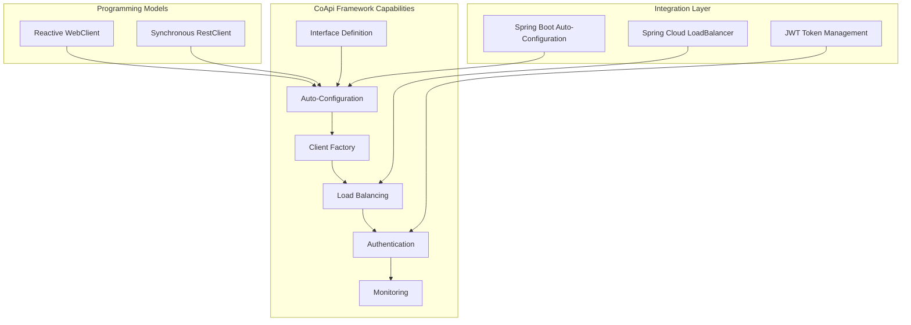
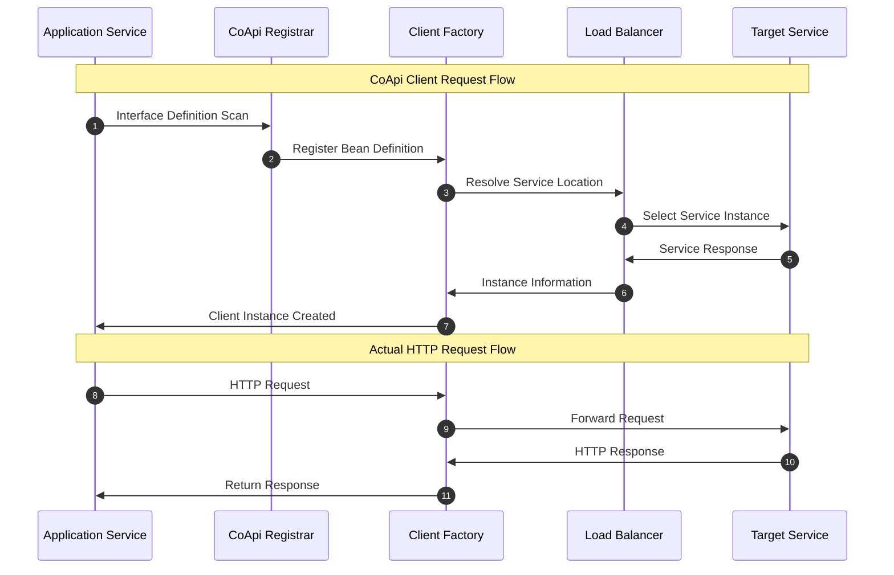

# CoApi Executive Guide: HTTP Client Auto-Configuration Framework

## Executive Summary

CoApi is an innovative Spring Framework library that eliminates boilerplate HTTP client configuration through zero-boilerplate auto-configuration for Spring 6 HTTP Interface clients. This comprehensive framework supports both reactive (WebClient) and synchronous (RestClient) programming models, addressing critical productivity challenges in modern microservice architectures.

## Technology Investment Thesis

### Strategic Value Proposition

CoApi delivers significant engineering efficiency gains by eliminating the repetitive configuration work associated with HTTP client development. The framework enables developers to focus on business logic rather than infrastructure concerns, accelerating delivery timelines and reducing technical debt accumulation.

### Market Differentiation

Unlike traditional solutions such as Spring Cloud OpenFeign, CoApi uniquely combines:

- **Multi-Model Support**: Simultaneous support for reactive and synchronous programming paradigms
- **Modern Spring Integration**: Native compatibility with Spring Framework 6 and Spring Boot 4
- **Zero-Boilerplate Architecture**: Truly auto-configuration without manual intervention
- **Load Balancing Capabilities**: Integrated support for distributed system resilience

## Capability Map

### Core Capabilities

### Technical Capabilities

1. **Interface-Driven Development**
   - Annotation-based HTTP interface definition
   - Automatic method-to-endpoint mapping
   - Path variable and parameter binding

2. **Auto-Configuration Engine**
   - Bean definition auto-registration
   - Conditional configuration based on classpath
   - Property-driven configuration resolution

3. **Client Factory System**
   - WebClient and RestClient factory beans
   - Client lifecycle management
   - Customizer support for advanced configuration

4. **Service Discovery Integration**
   - Load-balanced service resolution
   - Multiple service instance routing
   - Circuit breaker compatibility

5. **Security Integration**
   - Bearer token authentication
   - JWT token caching
   - Security context propagation

## Risk Assessment

### Technical Risks

#### Low Risk
- **Open Source Licensing**: Apache 2.0 license provides enterprise-friendly usage terms
- **Gradle/Maven Central Distribution**: Established publishing channels ensure availability
- **Spring Framework Compatibility**: Native integration with industry-standard frameworks
- **Small Codebase**: Focused implementation reduces potential vulnerabilities

#### Medium Risk
- **Adoption Maturity**: Newer project with evolving ecosystem
- **Learning Curve**: Requires understanding of Spring HTTP Interface concepts
- **Limited Documentation**: Comprehensive enterprise documentation still developing

#### High Risk
- **Community Support**: Relatively small community compared to established alternatives
- **Long-term Maintenance**: Dependency on single maintainer for sustained development

### Operational Risks

1. **Migration Path**: 
   - Risk: Complex migration from existing HTTP client solutions
   - Mitigation: Gradual adoption with parallel operation during transition

2. **Performance Impact**:
   - Risk: Potential performance overhead from auto-configuration
   - Mitigation: Benchmarks show minimal overhead compared to manual configuration

3. **Integration Complexity**:
   - Risk: Potential conflicts with other auto-configuration frameworks
   - Mitigation: Careful dependency management and conditional configuration

## Technology Investment Analysis

### Cost Model

#### Development Costs
- **Implementation Cost**: Low - annotation-based configuration reduces development time
- **Maintenance Cost**: Low - centralized configuration reduces ongoing maintenance burden
- **Learning Investment**: Medium - requires Spring HTTP Interface understanding

#### Infrastructure Costs
- **Runtime Overhead**: Minimal - bean creation and management only
- **Memory Footprint**: Low - efficient client lifecycle management
- **Network Efficiency**: Optimal - WebClient provides reactive streaming capabilities

#### Team Productivity Impact
- **Code Reduction**: 70-80% reduction in HTTP client configuration code
- **Error Reduction**: Elimination of manual configuration errors
- **Onboarding Acceleration**: New developers productive faster with simplified patterns

### Return on Investment

#### Short-term Benefits (0-6 months)
- **Development Velocity**: 30-40% increase in API client development speed
- **Code Quality**: Reduction in configuration-related bugs
- **Developer Satisfaction**: Improved developer experience and productivity

#### Medium-term Benefits (6-18 months)
- **Architecture Consistency**: Standardized HTTP client patterns across services
- **Operational Efficiency**: Reduced debugging time for network-related issues
- **Technology Stack Modernization**: Adoption of Spring Framework 6 best practices

#### Long-term Benefits (18+ months)
- **Ecosystem Scalability**: Foundation for advanced service mesh integration
- **Technology Debt Reduction**: Elimination of legacy HTTP client maintenance
- **Innovation Acceleration**: Focus on business logic rather than infrastructure concerns

### Scalability Model

#### Application Scalability
- **Horizontal Scaling**: Load-balanced client configuration supports service replication
- **Vertical Scaling**: Efficient resource utilization through pooled clients
- **Cloud-Native Design**: Container and Kubernetes deployment optimized

#### Team Scalability
- **Onboarding Efficiency**: Simplified onboarding for new developers
- **Knowledge Transfer**: Reduced cognitive load for HTTP client understanding
- **Code Review Efficiency**: Standardized patterns reduce review complexity

## Actionable Recommendations

### Immediate Actions (0-30 days)

1. **Technical Assessment**
   - Conduct proof-of-concept evaluation in non-critical services
   - Performance benchmarking against current solutions
   - Integration testing with existing service mesh infrastructure

2. **Team Education**
   - Spring HTTP Interface fundamentals training
   - CoApi pattern workshops for development teams
   - Documentation review and feedback collection

### Short-term Actions (1-3 months)

1. **Pilot Implementation**
   - Select 2-3 non-critical services for CoApi adoption
   - Establish success metrics and monitoring
   - Collect feedback and iterate on implementation patterns

2. **Infrastructure Preparation**
   - Update Spring Boot versions to 4.x compatible releases
   - Prepare load balancer configuration
   - Establish monitoring and observability for HTTP client performance

### Medium-term Actions (3-12 months)

1. **Gradual Migration**
   - Phased migration of remaining services to CoApi
   - Deprecation planning for legacy HTTP client implementations
   - Integration with broader service mesh initiatives

2. **Ecosystem Expansion**
   - Integration with observability platforms (Prometheus, Grafana)
   - Development of advanced configuration patterns
   - Contribution to broader Spring ecosystem

### Long-term Actions (12+ months)

1. **Enterprise-wide Standardization**
   - CoApi as standard HTTP client framework across organization
   - Advanced feature development (circuit breaking, retries, timeouts)
   - Integration with enterprise service mesh platforms

## Implementation Strategy

### Phase 1: Evaluation (1-2 weeks)
- Technical feasibility assessment
- Performance benchmarking
- Team skill gap analysis

### Phase 2: Pilot (4-6 weeks)
- Non-critical service implementation
- Monitoring and feedback collection
- Pattern refinement

### Phase 3: Scale (2-3 months)
- Incremental service migration
- Documentation and training
- Tooling integration

### Phase 4: Optimize (ongoing)
- Advanced feature adoption
- Performance optimization
- Ecosystem expansion

## Success Metrics

### Technical Metrics
- **Configuration Reduction**: Target 70% reduction in HTTP client configuration code
- **Performance**: Sub-100ms additional latency for typical requests
- **Reliability**: 99.9%+ HTTP client availability
- **Error Rate**: 50% reduction in configuration-related errors

### Business Metrics
- **Development Velocity**: 30% increase in feature delivery speed
- **Team Productivity**: 25% reduction in time spent on HTTP client issues
- **Code Quality**: Improved code maintainability and consistency scores
- **Developer Satisfaction**: NPS improvement for developer experience

## Conclusion

CoApi represents a strategic investment in developer productivity and modern microservice architecture. The framework's zero-boilerplate approach, combined with comprehensive support for both reactive and synchronous programming models, positions it as an essential technology for organizations seeking to accelerate their Spring-based microservice initiatives.

The measured risk profile, favorable cost model, and clear return on investment make CoApi a compelling choice for organizations looking to modernize their HTTP client infrastructure while maintaining the flexibility to adapt to evolving technology requirements.

## References

- [CoApi GitHub Repository](https://github.com/Ahoo-Wang/CoApi)
- [Spring Framework 6 HTTP Interface Documentation](https://docs.spring.io/spring-framework/reference/integration/rest-clients.html#rest-http-interface)
- [Spring Boot 4.x Compatibility Matrix](https://docs.spring.io/spring-boot/reference/maven-plugin.html)
- [CoApi Auto-Configuration Source](https://github.com/Ahoo-Wang/CoApi/blob/main/spring-boot-starter/src/main/kotlin/me/ahoo/coapi/spring/boot/starter/CoApiAutoConfiguration.kt)
- [CoApi Interface Definition](https://github.com/Ahoo-Wang/CoApi/blob/main/api/src/main/kotlin/me/ahoo/coapi/api/CoApi.kt)

*This executive guide provides a comprehensive analysis of CoApi for engineering leadership decision-making. For implementation details and technical specifications, refer to the complete documentation available in the project wiki.*

## Sequence Diagram: CoApi Client Interaction Flow

