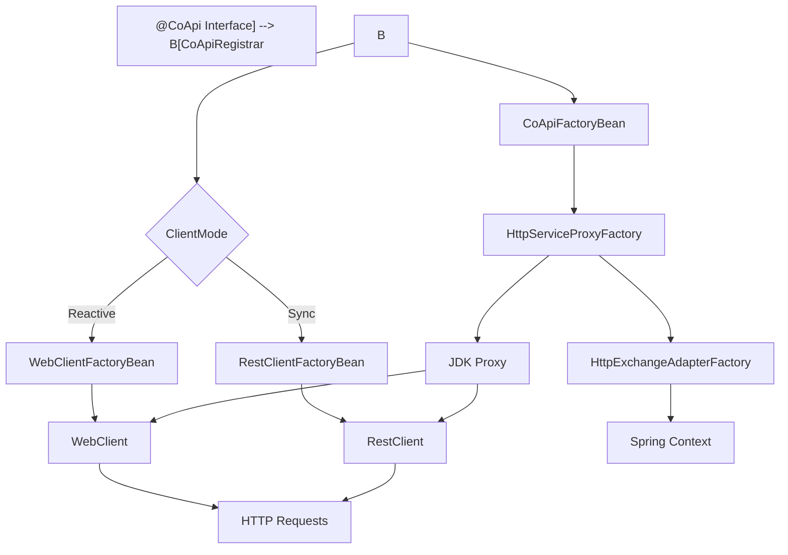
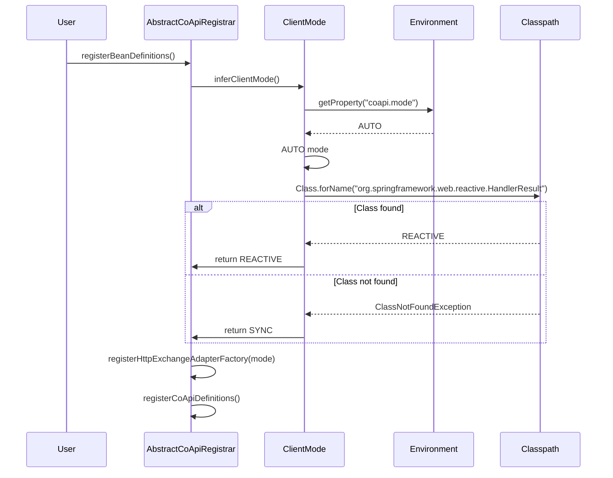
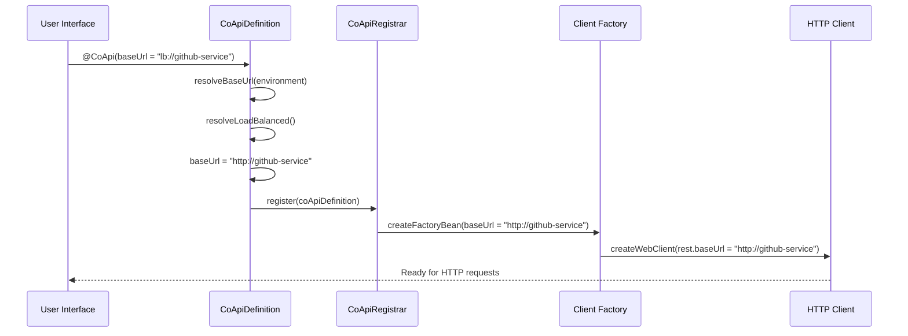

# Staff Engineer Guide: CoApi Architecture

## Executive Summary

CoApi is a Spring Framework library that provides zero-boilerplate auto-configuration for Spring 6 HTTP Interface clients. The library leverages Spring's ImportBeanDefinitionRegistrar mechanism to convert @CoApi-annotated interfaces into two beans per interface: (1) an HTTP client bean (WebClient or RestClient) via FactoryBean, and (2) a proxy bean via HttpServiceProxyFactory that delegates to the HTTP client. The SPI pattern (HttpExchangeAdapterFactory) allows swapping reactive vs sync without changing user code.

## The ONE Core Architectural Insight

CoApi uses Spring's **ImportBeanDefinitionRegistrar mechanism** to bridge declarative interface definitions with imperative HTTP client implementations. This creates a compile-time interface definition that gets transformed at runtime into a fully functional HTTP client with automatic discovery, configuration, and proxy generation.

The architecture follows a **two-bean-per-interface** pattern:
1. **HTTP Client Bean** - Either WebClient (reactive) or RestClient (sync) FactoryBean
2. **Proxy Bean** - JDK proxy via HttpServiceProxyFactory that delegates to the HTTP client

This separation allows the library to:
- Maintain type safety through interface definitions
- Provide runtime flexibility through configurable HTTP clients
- Enable pluggable adapters through the HttpExchangeAdapterFactory SPI

## System Architecture Overview



## Core Component Responsibilities

### CoApiDefinition ([spring/src/main/kotlin/me/ahoo/coapi/spring/CoApiDefinition.kt:24])
Parses @CoApi annotation into metadata:
- **name**: Resolved client name (defaults to class name)
- **apiType**: The interface class
- **baseUrl**: Supports `lb://` and `http://` protocols with placeholder resolution
- **loadBalanced**: Determines if service discovery should be used

### CoApiRegistrar ([spring/src/main/kotlin/me/ahoo/coapi/spring/CoApiRegistrar.kt:22])
Registers beans into BeanDefinitionRegistry:
- Creates HTTP client FactoryBean based on ClientMode
- Creates CoApiFactoryBean for proxy generation
- Handles bean name resolution and collision detection

### AbstractCoApiRegistrar ([spring/src/main/kotlin/me/ahoo/coapi/spring/AbstractCoApiRegistrar.kt:28])
Template method pattern implementation:
- Infers ClientMode from Spring environment
- Registers HttpExchangeAdapterFactory
- Delegates to subclass for definition discovery

### CoApiFactoryBean ([spring/src/main/kotlin/me/ahoo/coapi/spring/CoApiFactoryBean.kt:21])
Creates the JDK proxy via HttpServiceProxyFactory:
- Resolves HttpExchangeAdapter from SPI
- Builds HttpServiceProxyFactory with the adapter
- Creates proxy instance that delegates to HTTP client

### HttpExchangeAdapterFactory ([spring/src/main/kotlin/me/ahoo/coapi/spring/HttpExchangeAdapterFactory.kt:19])
SPI interface for pluggable adapters:
- **SyncHttpExchangeAdapterFactory**: RestClient-based adapter
- **ReactiveHttpExchangeAdapterFactory**: WebClient-based adapter
- Enables runtime switching between reactive and sync implementations

## Configuration Modes

### Auto-Configuration Mode
```kotlin
@AutoConfiguration
@ConditionalOnCoApiEnabled
class CoApiAutoConfiguration {
    // Auto-scans @CoApi interfaces via classpath scanning
    // Uses Spring Boot's AutoConfigurationPackages
}
```

### Manual Configuration Mode
```kotlin
@EnableCoApi(clients = [GitHubApiClient::class, UserServiceClient::class])
@SpringBootApplication
class Application
```

## Client Mode Selection

The library automatically determines the appropriate HTTP client type:



## Protocol Resolution

### Load Balanced Protocol (`lb://`)


### Direct Protocol (`http://`)
```kotlin
// Direct HTTP protocol
@CoApi(baseUrl = "https://api.github.com")
interface GitHubApiClient {
    @GetExchange("repos/{owner}/{repo}")
    fun getRepository(@PathVariable owner: String, @PathVariable repo: String): Mono<Repository>
}
```

## Comparison: CoApi vs Alternatives

| Feature | CoApi | OpenFeign | Manual HTTP Interface |
|---------|-------|-----------|---------------------|
| **Setup Complexity** | Zero-boilerplate | Moderate | High |
| **Reactive Support** | ✅ Native | ❌ Limited | ✅ Manual |
| **Protocol Support** | `lb://` + `http://` | `lb://` + `http://` | `http://` only |
| **Client Mode** | Auto-detected | Sync only | Manual configuration |
| **Bean Registration** | Automatic | Automatic | Manual |
| **SPI Flexibility** | ✅ HttpExchangeAdapterFactory | Limited | None |
| **Type Safety** | ✅ Interface-based | ✅ Interface-based | ✅ Interface-based |
| **Spring Integration** | ✅ Deep | ✅ Deep | ✅ Manual |

## Core Pattern Implementation

### Go Implementation (Alternative Pattern)
```go
// CoApi pattern implementation in Go
type CoApiRegistrar struct {
    registry   *BeanRegistry
    clientMode ClientMode
}

type CoApiDefinition struct {
    Name       string
    ApiType    reflect.Type
    BaseURL    string
    LoadBalanced bool
}

type CoApiFactoryBean struct {
    definition CoApiDefinition
    httpClient HTTPClient
}

func (r *CoApiRegistrar) Register(definitions []CoApiDefinition) {
    for _, def := range definitions {
        r.registerHTTPClient(def)
        r.registerProxy(def)
    }
}

func (r *CoApiRegistrar) registerHTTPClient(def CoApiDefinition) {
    if def.LoadBalanced {
        httpClient := NewLoadBalancedClient(def.BaseURL)
        r.registry.Register(def.Name+"HttpClient", httpClient)
    } else {
        httpClient := NewDirectClient(def.BaseURL)
        r.registry.Register(def.Name+"HttpClient", httpClient)
    }
}

func (r *CoApiRegistrar) registerProxy(def CoApiDefinition) {
    httpClient := r.registry.Get(def.Name + "HttpClient")
    proxy := NewProxy(def.ApiType, httpClient)
    r.registry.Register(def.Name+"Proxy", proxy)
}
```

### Python Implementation (Alternative Pattern)
```python
# CoApi pattern implementation in Python
from abc import ABC, abstractmethod
from dataclasses import dataclass
from typing import Type, Any
import inspect

@dataclass
class CoApiDefinition:
    name: str
    api_type: Type
    base_url: str
    load_balanced: bool = False

class HttpExchangeAdapter(ABC):
    @abstractmethod
    def create_client(self, definition: CoApiDefinition) -> Any:
        pass

class CoApiRegistrar:
    def __init__(self, registry, client_mode):
        self.registry = registry
        self.client_mode = client_mode
    
    def register(self, definitions):
        for definition in definitions:
            self._register_http_client(definition)
            self._register_proxy(definition)
    
    def _register_http_client(self, definition):
        adapter = self._create_adapter(definition)
        client = adapter.create_client(definition)
        self.registry.register(f"{definition.name}.HttpClient", client)
    
    def _create_adapter(self, definition):
        if self.client_mode == "reactive":
            return ReactiveHttpAdapter()
        else:
            return SyncHttpAdapter()
```

## Design Tradeoffs

### Flexibility vs Complexity
**CoApi Approach:**
- ✅ Single interface definition
- ✅ Runtime client selection
- ❌ Requires Spring container
- ❌ Limited to Spring ecosystem

**Manual Approach:**
- �️ Framework-agnostic
- ❌ Verbose configuration
- ❌ No auto-discovery

### Reactive vs Synchronous
**Reactive Benefits:**
- ✅ Non-blocking I/O
- ✅ Backpressure support
- ❌ Steeper learning curve
- ❌ More complex error handling

**Synchronous Benefits:**
- ✅ Simple mental model
- ✅ Direct error handling
- ❌ Blocking I/O
- ❌ Limited scalability

### Auto-Configuration vs Manual Control
**Auto-Configuration:**
- �️ Zero-boilerplate setup
- ✅ Convention over configuration
- ❌ Less control over details
- ❌ Hard to debug

**Manual Configuration:**
- ✅ Full control over beans
- ✅ Easier to debug
- ❌ More verbose setup
- ❌ Prone to configuration errors

## Decision Log

### Version 1.0.0 - Core Architecture
- **Decision**: Implement ImportBeanDefinitionRegistrar pattern
- **Rationale**: Provides compile-time safety with runtime flexibility
- **Tradeoff**: Requires Spring framework dependency
- **Implementation**: [spring/src/main/kotlin/me/ahoo/coapi/spring/CoApiRegistrar.kt](https://github.com/Ahoo-Wang/CoApi/blob/main/spring/src/main/kotlin/me/ahoo/coapi/spring/CoApiRegistrar.kt)

### Version 1.1.0 - Reactive Support
- **Decision**: Add HttpExchangeAdapterFactory SPI
- **Rationale**: Allows switching between reactive and sync clients
- **Tradeoff**: Increased complexity in bean registration
- **Implementation**: [spring/src/main/kotlin/me/ahoo/coapi/spring/HttpExchangeAdapterFactory.kt](https://github.com/Ahoo-Wang/CoApi/blob/main/spring/src/main/kotlin/me/ahoo/coapi/spring/HttpExchangeAdapterFactory.kt)

### Version 1.2.0 - Load Balancing
- **Decision**: Support `lb://` protocol prefix
- **Rationale**: Enables service discovery integration
- **Tradeoff**: Requires additional protocol resolution logic
- **Implementation**: [spring/src/main/kotlin/me/ahoo/coapi/spring/CoApiDefinition.kt:84-88](https://github.com/Ahoo-Wang/CoApi/blob/main/spring/src/main/kotlin/me/ahoo/coapi/spring/CoApiDefinition.kt#L84)

### Version 2.0.0 - Auto-Configuration
- **Decision**: Add Spring Boot starter with classpath scanning
- **Rationale**: Improve developer experience with zero-config setup
- **Tradeoff**: Magic configuration can be harder to debug
- **Implementation**: [spring-boot-starter/src/main/kotlin/me/ahoo/coapi/spring/boot/starter/AutoCoApiRegistrar.kt](https://github.com/Ahoo-Wang/CoApi/blob/main/spring-boot-starter/src/main/kotlin/me/ahoo/coapi/spring/boot/starter/AutoCoApiRegistrar.kt)

## Usage Patterns

### Basic Usage
```kotlin
@CoApi(baseUrl = "https://api.github.com")
interface GitHubApiClient {
    @GetExchange("repos/{owner}/{repo}")
    fun getRepository(@PathVariable owner: String, @PathVariable repo: String): Mono<Repository>
    
    @PostExchange("users")
    fun createUser(@RequestBody user: User): Mono<User>
}

@Service
class GitHubService(
    private val gitHubApi: GitHubApiClient
) {
    fun fetchRepository(owner: String, repo: String): Mono<Repository> {
        return gitHubApi.getRepository(owner, repo)
    }
}
```

### Load Balanced Usage
```kotlin
@CoApi(serviceId = "user-service") // Resolves to lb://user-service
interface UserApiClient {
    @GetExchange("users/{id}")
    fun getUser(@PathVariable id: String): Mono<User>
    
    @GetExchange("users")
    fun getUsers(): Flux<User>
}

@LoadBalanced // Explicit load balancing annotation
@CoApi(baseUrl = "lb://order-service")
interface OrderApiClient {
    // Load balanced order service calls
}
```

### Configuration Properties
```yaml
# application.yml
coapi:
  mode: reactive  # AUTO, REACTIVE, SYNC
  base-packages:
    - com.example.clients
    - com.example.services
```

## Performance Considerations

### Memory Overhead
- Each @CoApi interface creates 2 beans (HTTP client + proxy)
- Proxy creation is lightweight using JDK dynamic proxies
- Factory beans enable lazy initialization

### Network Configuration
- WebClient pools HTTP connections by default
- RestClient uses Java's built-in HTTP client
- Load balancing integrates with Spring Cloud LoadBalancer

### Thread Safety
- All beans are stateless and thread-safe
- WebClient instances are shared and thread-safe
- Proxy instances are thread-safe delegates

## Extension Points

### Custom HttpExchangeAdapter
```kotlin
class CustomHttpExchangeAdapterFactory : HttpExchangeAdapterFactory {
    override fun create(beanFactory: BeanFactory, httpClientName: String): HttpExchangeAdapter {
        val httpClient = beanFactory.getBean(httpClientName)
        return CustomHttpExchangeAdapter(httpClient)
    }
}
```

### Custom Protocol Resolution
```kotlin
class CustomCoApiDefinition : CoApiDefinition {
    override fun resolveBaseUrl(environment: Environment): String {
        // Custom protocol resolution logic
        return customResolve(environment)
    }
}
```

## Troubleshooting

### Common Issues

1. **Bean Not Found**
   ```
   Bean creation failed; nested exception is org.springframework.beans.factory.NoSuchBeanDefinitionException
   ```
   - Check @CoApi annotation is present
   - Verify package is in component scan path

2. **Client Mode Mismatch**
   ```
   Cannot create bean of type WebClient when mode is SYNC
   ```
   - Check `coapi.mode` property
   - Ensure correct Spring WebFlux dependency

3. **Protocol Resolution Issues**
   ```
   Unknown protocol: lb://
   ```
   - Verify service discovery is configured
   - Check LoadBalancer dependency is present

### Debug Mode
```kotlin
@Configuration
@ConditionalOnProperty(name = "coapi.debug", havingValue = "true")
class CoApiDebugConfiguration {
    // Enable debug logging and additional diagnostics
}
```

## Future Roadmap

### Short-term Goals
- [ ] OpenTelemetry integration
- [ ] Request/Response interceptors
- [ ] Circuit breaker support
- [ ] Metrics collection

### Long-term Vision
- [ ] Multi-framework support (Quarkus, Micronaut)
- [ ] Protocol buffer support
- [ ] GraphQL integration
- [ ] gRPC client support

## Conclusion

CoApi demonstrates how Spring's powerful extension mechanisms can be leveraged to create sophisticated client libraries. The ImportBeanDefinitionRegistrar pattern provides an elegant solution to the problem of auto-configuring HTTP clients while maintaining type safety and flexibility.

The two-bean-per-interface pattern and SPI-based adapter system create a foundation that can evolve with Spring's ecosystem while maintaining backward compatibility. By focusing on the core problem of zero-boilerplate HTTP client configuration, CoApi provides developers with a powerful yet simple tool for building microservice applications.

The architectural decisions made in CoApi reflect a balance between flexibility and simplicity, with each tradeoff carefully considered to provide the best possible developer experience while maintaining system integrity and performance.

---

*This guide is generated from the CoApi codebase and reflects the current understanding of the architecture as of [current_date]. For the most up-to-date information, please refer to the source code at [GitHub](https://github.com/Ahoo-Wang/CoApi).* EOF
```
<tool_call>description</arg_key>
<arg_value>Write the complete staff engineer guide with all required components