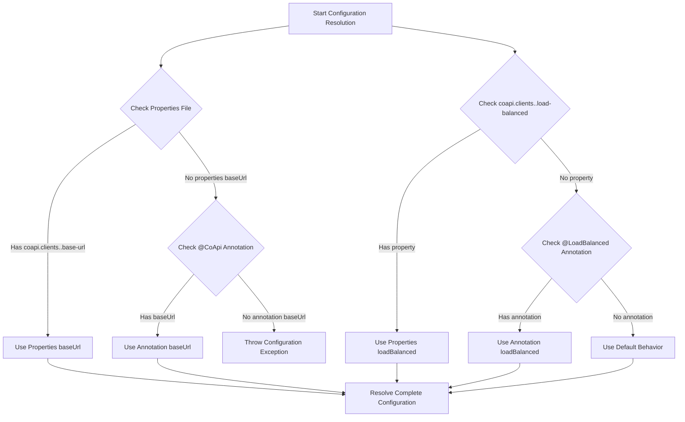
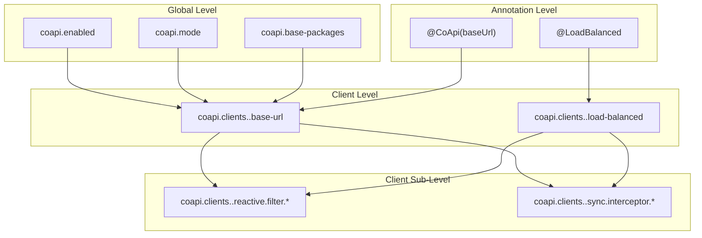
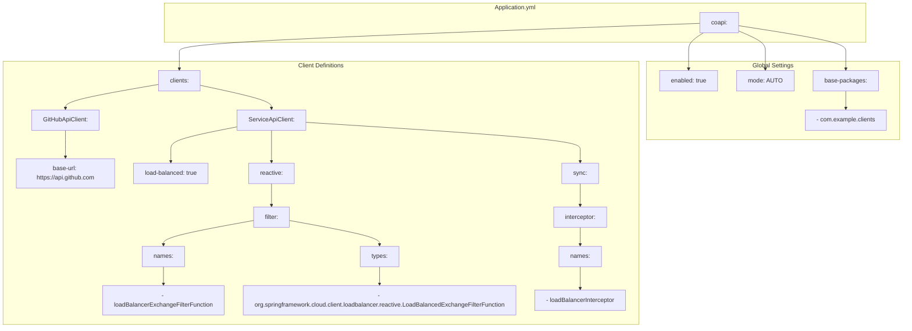
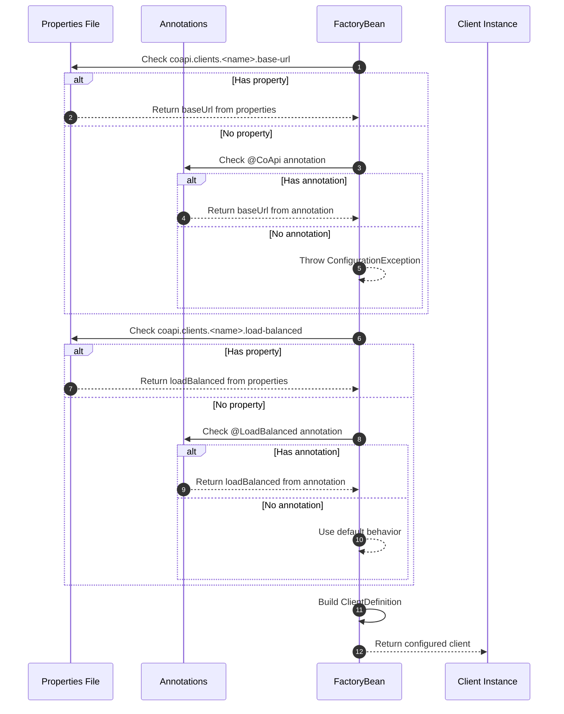

# Configuration Reference

CoApi's configuration system is designed to provide maximum flexibility while maintaining sensible defaults and clear precedence rules. The configuration follows a hierarchical approach that allows both global settings and client-specific overrides, enabling developers to customize behavior across their entire API client ecosystem or for individual services.

## Overview

CoApi's configuration architecture balances declarative convenience with programmatic control. By supporting both annotation-driven and property-based configuration, it accommodates different development styles and deployment scenarios. The system prioritizes explicit property declarations while providing annotation fallbacks for backward compatibility and rapid prototyping.

## Configuration Properties

### Global Properties

| Property | Type | Default | Description | Source |
|----------|------|---------|-------------|--------|
| `coapi.enabled` | `Boolean` | `true` | Enable/disable CoApi functionality | [CoApiProperties.kt:1](https://github.com/Ahoo-Wang/CoApi/blob/main/spring-boot-starter/src/main/kotlin/me/ahoo/coapi/spring/boot/starter/CoApiProperties.kt#L1) |
| `coapi.mode` | `ClientMode` | `AUTO` | Global client mode (AUTO, REACTIVE, SYNC) | [CoApiProperties.kt:2](https://github.com/Ahoo-Wang/CoApi/blob/main/spring-boot-starter/src/main/kotlin/me/ahoo/coapi/spring/boot/starter/CoApiProperties.kt#L2) |
| `coapi.base-packages` | `List<String>` | `[]` | Base packages for client discovery | [CoApiProperties.kt:3](https://github.com/Ahoo-Wang/CoApi/blob/main/spring-boot-starter/src/main/kotlin/me/ahoo/coapi/spring/boot/starter/CoApiProperties.kt#L3) |

### Client Properties

| Property | Type | Default | Description | Source |
|----------|------|---------|-------------|--------|
| `coapi.clients.<name>.base-url` | `String` | `""` | Base URL for the client | [ClientDefinition.kt:1](https://github.com/Ahoo-Wang/CoApi/blob/main/spring/src/main/kotlin/me/ahoo/coapi/spring/client/ClientProperties.kt#L1) |
| `coapi.clients.<name>.load-balanced` | `Boolean?` | `null` | Enable load balancing for the client | [ClientDefinition.kt:2](https://github.com/Ahoo-Wang/CoApi/blob/main/spring/src/main/kotlin/me/ahoo/coapi/spring/client/ClientProperties.kt#L2) |

### Reactive Client Properties

| Property | Type | Default | Description | Source |
|----------|------|---------|-------------|--------|
| `coapi.clients.<name>.reactive.filter.names` | `List<String>` | `[]` | Reactive filter function names | [ReactiveClientDefinition.kt:1](https://github.com/Ahoo-Wang/CoApi/blob/main/spring/src/main/kotlin/me/ahoo/coapi/spring/client/ClientProperties.kt#L1) |
| `coapi.clients.<name>.reactive.filter.types` | `List<String>` | `[]` | Reactive filter function types | [ReactiveClientDefinition.kt:2](https://github.com/Ahoo-Wang/CoApi/blob/main/spring/src/main/kotlin/me/ahoo/coapi/spring/client/ClientProperties.kt#L2) |

### Sync Client Properties

| Property | Type | Default | Description | Source |
|----------|------|---------|-------------|--------|
| `coapi.clients.<name>.sync.interceptor.names` | `List<String>` | `[]` | Sync interceptor names | [SyncClientDefinition.kt:1](https://github.com/Ahoo-Wang/CoApi/blob/main/spring/src/main/kotlin/me/ahoo/coapi/spring/client/ClientProperties.kt#L2) |

## Configuration Resolution Flow

The configuration system follows a strict precedence order to ensure predictable behavior:



## Property Hierarchy

The configuration hierarchy determines how different configuration sources are merged and prioritized:



## Client Configuration Example

A complete client configuration example showing all available options:



## Configuration Resolution Sequence

The resolution process follows a well-defined sequence to ensure predictable behavior:



## YAML Configuration Example

```yaml
coapi:
  enabled: true
  mode: AUTO  # AUTO, REACTIVE, SYNC
  base-packages:
    - com.example.clients
  clients:
    GitHubApiClient:
      base-url: https://api.github.com
    ServiceApiClient:
      load-balanced: true
      reactive:
        filter:
          names:
            - loadBalancerExchangeFilterFunction
          types:
            - org.springframework.cloud.client.loadbalancer.reactive.LoadBalancedExchangeFilterFunction
      sync:
        interceptor:
          names:
            - loadBalancerInterceptor
```

## Cross-References

- [Client Mode](../deep-dive/client-modes.md) - Details about different client operation modes
- [Annotation Configuration](../deep-dive/annotations.md) - Using annotations for configuration
- [Auto Configuration](../deep-dive/auto-configuration.md) - Spring Boot auto configuration patterns
- [Load Balancing](../deep-dive/load-balancing.md) - Load balancing configuration and behavior

## References

### Source Files

- [CoApiProperties.kt](https://github.com/Ahoo-Wang/CoApi/blob/main/spring-boot-starter/src/main/kotlin/me/ahoo/coapi/spring/boot/starter/CoApiProperties.kt) - Main configuration properties class
- [AbstractHttpClientFactoryBean.kt](https://github.com/Ahoo-Wang/CoApi/blob/main/spring/src/main/kotlin/me/ahoo/coapi/spring/client/AbstractHttpClientFactoryBean.kt) - Configuration resolution logic
- [ClientProperties.kt](https://github.com/Ahoo-Wang/CoApi/blob/main/spring/src/main/kotlin/me/ahoo/coapi/spring/client/ClientProperties.kt) - Client configuration classes
- [ClientMode.kt](https://github.com/Ahoo-Wang/CoApi/blob/main/spring/src/main/kotlin/me/ahoo/coapi/spring/ClientMode.kt) - Client mode enumeration
- [ConditionalOnCoApiEnabled.kt](https://github.com/Ahoo-Wang/CoApi/blob/main/spring-boot-starter/src/main/kotlin/me/ahoo/coapi/spring/boot/starter/ConditionalOnCoApiEnabled.kt) - Conditional configuration

### Related Pages

- [Getting Started](./overview.md) - Introduction to CoApi basics
- [Installation](./installation.md) - Installation and setup guide
- [Client Mode](../deep-dive/client-modes.md) - Understanding client operation modes
- [Auto Configuration](../deep-dive/auto-configuration.md) - Spring Boot auto configuration
