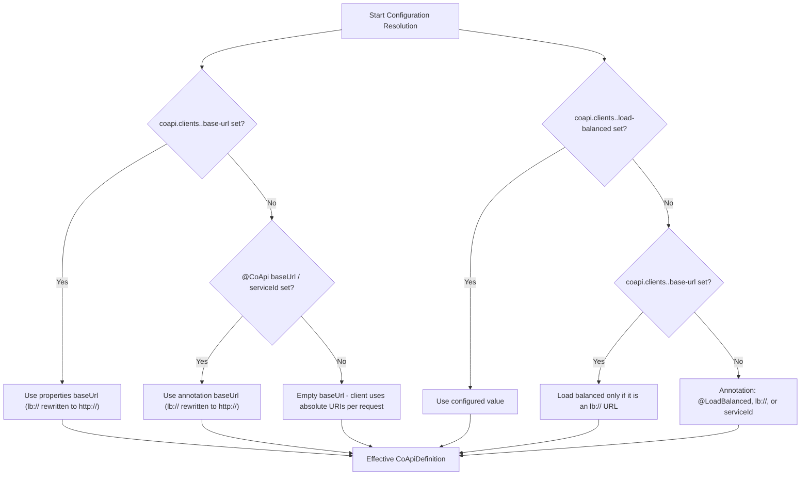
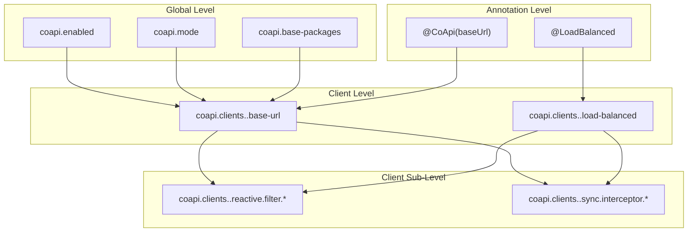
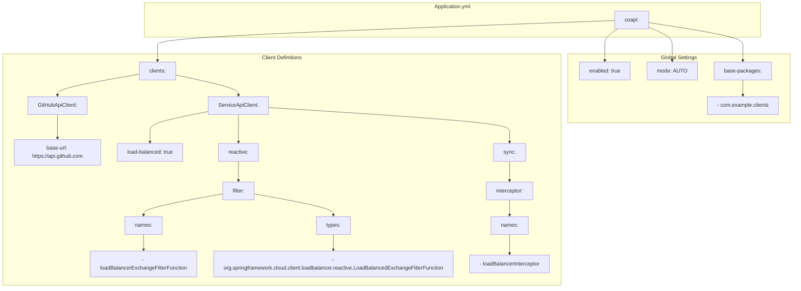
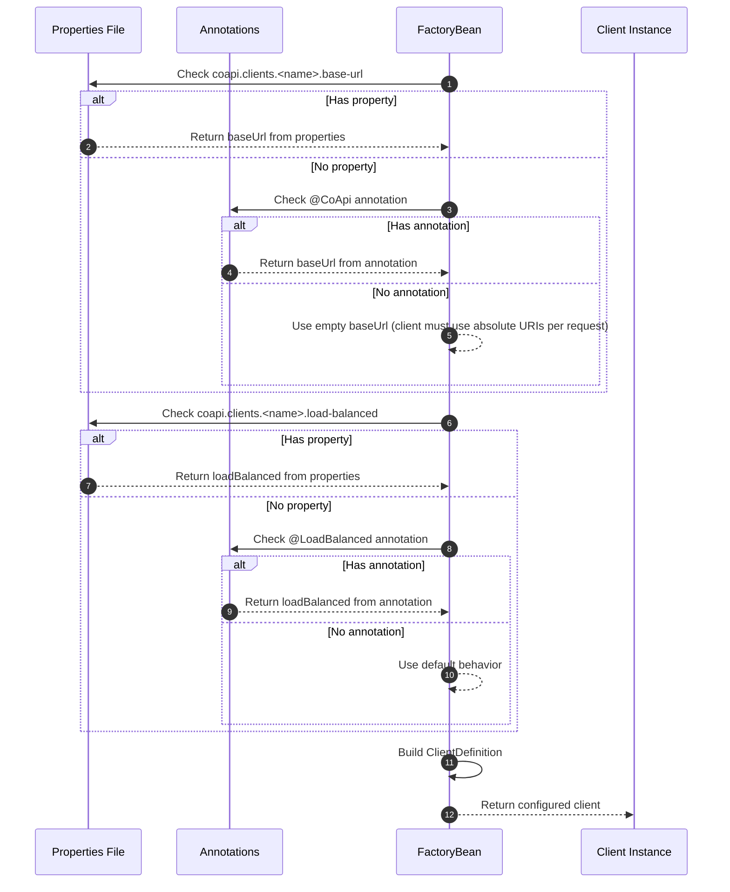

# Configuration Reference

CoApi's configuration system is designed to provide maximum flexibility while maintaining sensible defaults and clear precedence rules. The configuration follows a hierarchical approach that allows both global settings and client-specific overrides, enabling developers to customize behavior across their entire API client ecosystem or for individual services.

## Overview

CoApi's configuration architecture balances declarative convenience with programmatic control. By supporting both annotation-driven and property-based configuration, it accommodates different development styles and deployment scenarios. The system prioritizes explicit property declarations while providing annotation fallbacks for backward compatibility and rapid prototyping.

## Configuration Properties

### Global Properties

| Property | Type | Default | Description | Source |
|----------|------|---------|-------------|--------|
| `coapi.enabled` | `Boolean` | `true` | Enable/disable CoApi functionality | [CoApiProperties.kt](https://github.com/Ahoo-Wang/CoApi/blob/main/spring-boot-starter/src/main/kotlin/me/ahoo/coapi/spring/boot/starter/CoApiProperties.kt#L1) |
| `coapi.mode` | `ClientMode` | `AUTO` | Global client mode (AUTO, REACTIVE, SYNC) | [CoApiProperties.kt](https://github.com/Ahoo-Wang/CoApi/blob/main/spring-boot-starter/src/main/kotlin/me/ahoo/coapi/spring/boot/starter/CoApiProperties.kt#L2) |
| `coapi.base-packages` | `List<String>` | `[]` | Base packages for client discovery | [CoApiProperties.kt](https://github.com/Ahoo-Wang/CoApi/blob/main/spring-boot-starter/src/main/kotlin/me/ahoo/coapi/spring/boot/starter/CoApiProperties.kt#L3) |

### Client Properties

| Property | Type | Default | Description | Source |
|----------|------|---------|-------------|--------|
| `coapi.clients.<name>.base-url` | `String` | `""` | Base URL for the client; overrides the annotation. An `lb://` URL is rewritten to `http://` and enables load balancing (since v2.3.0) | [CoApiDefinition.kt:156](https://github.com/Ahoo-Wang/CoApi/blob/main/spring/src/main/kotlin/me/ahoo/coapi/spring/CoApiDefinition.kt#L156) |
| `coapi.clients.<name>.load-balanced` | `Boolean?` | `null` | Override load balancing (`true` enables, `false` disables; unset follows `base-url`, else the annotation) | [CoApiDefinition.kt:156](https://github.com/Ahoo-Wang/CoApi/blob/main/spring/src/main/kotlin/me/ahoo/coapi/spring/CoApiDefinition.kt#L156) |

::: info
The `<name>` in `coapi.clients.<name>.*` is the `@CoApi` `name` attribute — or the interface simple name when no `name` is set. Setting a custom `name` on the annotation changes the configuration key.

Since v2.2.0, `${...}` placeholders in `@CoApi` `baseUrl`/`serviceId` must resolve in the active environment: an unresolvable placeholder (without a `${name:default}` fallback) fails startup with `Could not resolve placeholder ...` instead of leaking a literal `${...}` into the client base URL and breaking requests at runtime. Duplicate client names also fail startup with the conflicting types listed.
:::

### Reactive Client Properties

| Property | Type | Default | Description | Source |
|----------|------|---------|-------------|--------|
| `coapi.clients.<name>.reactive.filter.names` | `List<String>` | `[]` | `ExchangeFilterFunction` bean names | [CoApiProperties.kt:64](https://github.com/Ahoo-Wang/CoApi/blob/main/spring-boot-starter/src/main/kotlin/me/ahoo/coapi/spring/boot/starter/CoApiProperties.kt#L64) |
| `coapi.clients.<name>.reactive.filter.types` | `List<String>` | `[]` | `ExchangeFilterFunction` bean types (FQCN) | [CoApiProperties.kt:64](https://github.com/Ahoo-Wang/CoApi/blob/main/spring-boot-starter/src/main/kotlin/me/ahoo/coapi/spring/boot/starter/CoApiProperties.kt#L64) |

### Sync Client Properties

| Property | Type | Default | Description | Source |
|----------|------|---------|-------------|--------|
| `coapi.clients.<name>.sync.interceptor.names` | `List<String>` | `[]` | `ClientHttpRequestInterceptor` bean names | [CoApiProperties.kt:68](https://github.com/Ahoo-Wang/CoApi/blob/main/spring-boot-starter/src/main/kotlin/me/ahoo/coapi/spring/boot/starter/CoApiProperties.kt#L68) |
| `coapi.clients.<name>.sync.interceptor.types` | `List<String>` | `[]` | `ClientHttpRequestInterceptor` bean types (FQCN) | [CoApiProperties.kt:68](https://github.com/Ahoo-Wang/CoApi/blob/main/spring-boot-starter/src/main/kotlin/me/ahoo/coapi/spring/boot/starter/CoApiProperties.kt#L68) |

## Configuration Resolution Flow

The configuration system follows a strict precedence order to ensure predictable behavior:


```mermaid
flowchart TD
    A[Start Configuration Resolution] --> B{"coapi.clients.<name>.base-url set?"}
    B -->|Yes| C["Use properties baseUrl (lb:// rewritten to http://)"]
    B -->|No| D{"@CoApi baseUrl / serviceId set?"}
    D -->|Yes| E["Use annotation baseUrl (lb:// rewritten to http://)"]
    D -->|No| F[Empty baseUrl - client uses absolute URIs per request]

    A --> G{"coapi.clients.<name>.load-balanced set?"}
    G -->|Yes| H[Use configured value]
    G -->|No| I{"coapi.clients.<name>.base-url set?"}
    I -->|Yes| J["Load balanced only if it is an lb:// URL"]
    I -->|No| K["Annotation: @LoadBalanced, lb://, or serviceId"]

    C --> L[Effective CoApiDefinition]
    E --> L
    F --> L
    H --> L
    J --> L
    K --> L
```
<!-- Sources: spring/src/main/kotlin/me/ahoo/coapi/spring/CoApiDefinition.kt:144-166 -->

## Property Hierarchy

The configuration hierarchy determines how different configuration sources are merged and prioritized:


```mermaid
graph TD
    subgraph "Global Level"
        A[coapi.enabled]
        B[coapi.mode]
        C[coapi.base-packages]
    end
    
    subgraph "Client Level"
        D[coapi.clients.<name>.base-url]
        E[coapi.clients.<name>.load-balanced]
    end
    
    subgraph "Client Sub-Level"
        F[coapi.clients.<name>.reactive.filter.*]
        G[coapi.clients.<name>.sync.interceptor.*]
    end
    
    subgraph "Annotation Level"
        H["@CoApi(baseUrl)"]
        I["@LoadBalanced"]
    end
    
    A --> D
    B --> D
    C --> D
    D --> F
    D --> G
    E --> F
    E --> G
    H --> D
    I --> E
    
```

## Client Configuration Example

A complete client configuration example showing all available options:


```mermaid
graph TB
    subgraph "Application.yml"
        A["coapi:"]
    end
    
    subgraph "Global Settings"
        B["enabled: true"]
        C["mode: AUTO"]
        D["base-packages:"]
        E[ - com.example.clients]
    end
    
    subgraph "Client Definitions"
        F["clients:"]
        G["GitHubApiClient:"]
        H["base-url: https://api.github.com"]
        I["ServiceApiClient:"]
        J["load-balanced: true"]
        K["reactive:"]
        L["filter:"]
        M["names:"]
        N[ - loadBalancerExchangeFilterFunction]
        O["types:"]
        P[" - org.springframework.cloud.client.loadbalancer.reactive.LoadBalancedExchangeFilterFunction"]
        Q["sync:"]
        R["interceptor:"]
        S["names:"]
        T[ - loadBalancerInterceptor]
    end
    
    A --> B
    A --> C
    A --> D
    D --> E
    A --> F
    F --> G
    G --> H
    F --> I
    I --> J
    I --> K
    K --> L
    L --> M
    M --> N
    L --> O
    O --> P
    I --> Q
    Q --> R
    R --> S
    S --> T
    
```

## Configuration Resolution Sequence

The resolution process follows a well-defined sequence to ensure predictable behavior:


```mermaid
sequenceDiagram
    participant P as Properties File
    participant A as Annotations
    participant F as FactoryBean
    participant C as Client Instance
    
    autonumber
    
    F->>P: Check coapi.clients.<name>.base-url
    alt Has property
        P-->>F: Return baseUrl from properties
    else No property
        F->>A: Check @CoApi annotation
        alt Has annotation
            A-->>F: Return baseUrl from annotation
        else No annotation
            F-->>F: Use empty baseUrl (client must use absolute URIs per request)
        end
    end
    
    F->>P: Check coapi.clients.<name>.load-balanced
    alt Has property
        P-->>F: Return loadBalanced from properties
    else No property
        F->>A: Check @LoadBalanced annotation
        alt Has annotation
            A-->>F: Return loadBalanced from annotation
        else No annotation
            F-->>F: Use default behavior
        end
    end
    
    F->>F: Build ClientDefinition
    F-->>C: Return configured client
```

## YAML Configuration Example

```yaml
coapi:
  enabled: true
  mode: AUTO  # AUTO, REACTIVE, SYNC
  base-packages:
    - com.example.clients
  clients:
    GitHubApiClient:
      base-url: https://api.github.com
    ServiceApiClient:
      load-balanced: true
      reactive:
        filter:
          names:
            - loadBalancerExchangeFilterFunction
          types:
            - org.springframework.cloud.client.loadbalancer.reactive.LoadBalancedExchangeFilterFunction
      sync:
        interceptor:
          names:
            - loadBalancerInterceptor
```

## Cross-References

- [Client Mode](../deep-dive/client-modes.md) - Details about different client operation modes
- [Annotation Configuration](../deep-dive/annotations.md) - Using annotations for configuration
- [Auto Configuration](../deep-dive/auto-configuration.md) - Spring Boot auto configuration patterns
- [Load Balancing](../deep-dive/load-balancing.md) - Load balancing configuration and behavior

## References

### Source Files

- [CoApiProperties.kt](https://github.com/Ahoo-Wang/CoApi/blob/main/spring-boot-starter/src/main/kotlin/me/ahoo/coapi/spring/boot/starter/CoApiProperties.kt) - Main configuration properties class
- [CoApiDefinition.kt](https://github.com/Ahoo-Wang/CoApi/blob/main/spring/src/main/kotlin/me/ahoo/coapi/spring/CoApiDefinition.kt) - Configuration override rules (`withOverrides`)
- [ClientProperties.kt](https://github.com/Ahoo-Wang/CoApi/blob/main/spring/src/main/kotlin/me/ahoo/coapi/spring/client/ClientProperties.kt) - Client configuration SPI (`ClientProperties`, `ReactiveClientProperties`, `SyncClientProperties`)
- [ClientMode.kt](https://github.com/Ahoo-Wang/CoApi/blob/main/spring/src/main/kotlin/me/ahoo/coapi/spring/ClientMode.kt) - Client mode enumeration
- [ConditionalOnCoApiEnabled.kt](https://github.com/Ahoo-Wang/CoApi/blob/main/spring-boot-starter/src/main/kotlin/me/ahoo/coapi/spring/boot/starter/ConditionalOnCoApiEnabled.kt) - Conditional configuration

### Related Pages

- [Getting Started](./overview.md) - Introduction to CoApi basics
- [Installation](./installation.md) - Installation and setup guide
- [Client Mode](../deep-dive/client-modes.md) - Understanding client operation modes
- [Auto Configuration](../deep-dive/auto-configuration.md) - Spring Boot auto configuration
