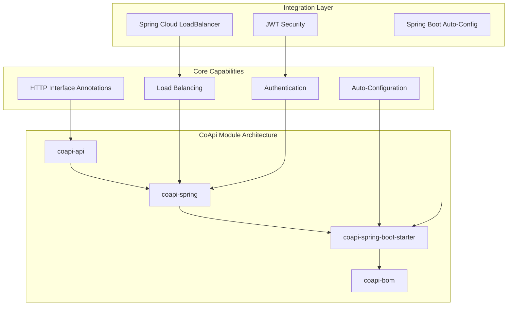
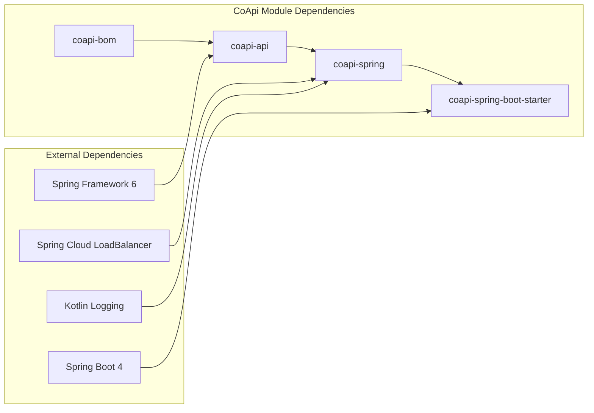
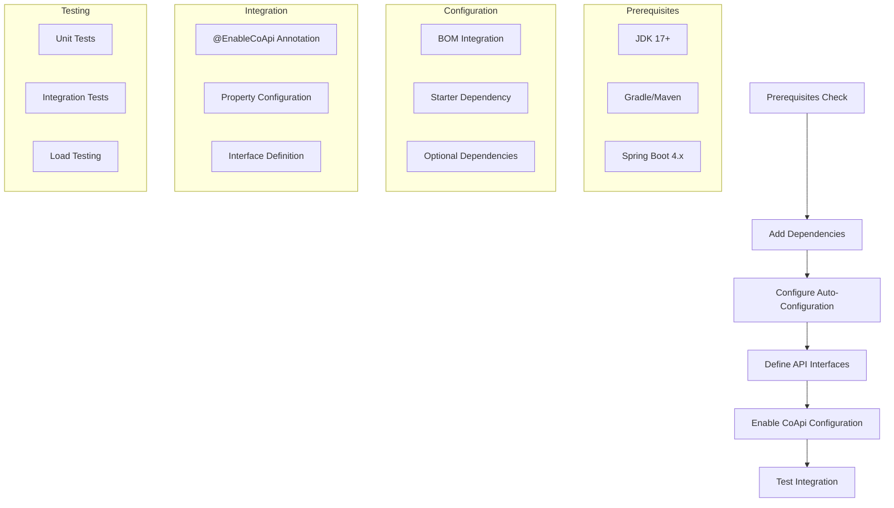

# Installation & Setup

## Overview

Proper installation and configuration of CoApi is essential for leveraging its zero-boilerplate auto-configuration capabilities in Spring Boot applications. This guide provides a comprehensive walkthrough for setting up CoApi with both reactive and synchronous programming models, ensuring seamless integration with modern Spring ecosystems and maximizing developer productivity through automated HTTP client management.

## At-a-Glance

| Component | Version | Status | Description |
|-----------|---------|--------|-------------|
| **CoApi Core** | 2.0.1 | ✅ Active | Base HTTP interface definitions and annotations |
| **Spring Integration** | 2.0.1 | ✅ Active | Spring-specific auto-configuration and utilities |
| **Spring Boot Starter** | 2.0.1 | ✅ Active | Auto-configured Spring Boot integration |
| **BOM (Bill of Materials)** | 2.0.1 | ✅ Active | Centralized version management |
| **JDK Requirement** | 17+ | ✅ Required | Java 17 or higher required |
| **Spring Boot** | 4.x | ✅ Compatible | CoApi 2.x supports Spring Boot 4.x |

## Prerequisites

### System Requirements

- **Java Development Kit**: JDK 17 or higher
- **Build Tool**: Gradle 8.x or Maven 3.8+
- **Spring Boot**: 4.x for CoApi 2.x compatibility
- **IDE**: IntelliJ IDEA, Eclipse, or VSCode with Java support

### Spring Boot Version Compatibility

> **CoApi 1.x** → Spring Boot 3.2.x  
> **CoApi 2.x** → Spring Boot 4.x

## Module Architecture

CoApi is organized into several key modules that work together to provide comprehensive HTTP client functionality:



## Dependency Management

### BOM Usage

The CoApi BOM (Bill of Materials) provides centralized version management:

```xml
<!-- pom.xml -->
<dependencyManagement>
    <dependencies>
        <dependency>
            <groupId>me.ahoo.coapi</groupId>
            <artifactId>coapi-bom</artifactId>
            <version>2.0.1</version>
            <type>pom</type>
            <scope>import</scope>
        </dependency>
    </dependencies>
</dependencyManagement>
```

### Gradle Kotlin DSL

Using the CoApi BOM with Gradle Kotlin DSL:

```kotlin
// build.gradle.kts
dependencies {
    api(platform("me.ahoo.coapi:coapi-bom:2.0.1"))
    implementation("me.ahoo.coapi:coapi-spring-boot-starter")
}
```

## Module Dependencies



## Installation Instructions

### Gradle Kotlin DSL

Add the CoApi starter to your dependencies:

```kotlin
// build.gradle.kts
dependencies {
    implementation("me.ahoo.coapi:coapi-spring-boot-starter")
    
    // Optional: Load balancing support
    implementation("org.springframework.cloud:spring-cloud-starter-loadbalancer")
}
```

### Gradle Groovy DSL

```groovy
// build.gradle
dependencies {
    implementation 'me.ahoo.coapi:coapi-spring-boot-starter'
    
    // Optional: Load balancing support
    implementation 'org.springframework.cloud:spring-cloud-starter-loadbalancer'
}
```

### Maven XML

```xml
<!-- pom.xml -->
<dependencies>
    <dependency>
        <groupId>me.ahoo.coapi</groupId>
        <artifactId>coapi-spring-boot-starter</artifactId>
        <version>2.0.1</version>
    </dependency>
    
    <!-- Optional: Load balancing support -->
    <dependency>
        <groupId>org.springframework.cloud</groupId>
        <artifactId>spring-cloud-starter-loadbalancer</artifactId>
    </dependency>
</dependencies>
```

### BOM Configuration

Add the BOM to your dependency management:

```xml
<!-- pom.xml -->
<dependencyManagement>
    <dependencies>
        <dependency>
            <groupId>me.ahoo.coapi</groupId>
            <artifactId>coapi-bom</artifactId>
            <version>2.0.1</version>
            <type>pom</type>
            <scope>import</scope>
        </dependency>
    </dependencies>
</dependencyManagement>
```

## Gradle Toolchain Configuration

For optimal compatibility, configure Java 17 in your Gradle build:

```kotlin
// build.gradle.kts
java {
    toolchain {
        languageVersion = JavaLanguageVersion.of(17)
    }
}

// Optional: Configure kotlin jvm target
kotlin {
    jvmToolchain(17)
}
```

## Setup Process



## Configuration Examples

### Basic Setup

```kotlin
@SpringBootApplication
@EnableCoApi(clients = [GitHubApiClient::class])
class Application
```

```java
@CoApi(baseUrl = "${github.url}")
public interface GitHubApiClient {
    @GetExchange("repos/{owner}/{repo}/issues")
    Flux<Issue> getIssue(@PathVariable String owner, @PathVariable String repo);
}
```

### Load Balancing Setup

```kotlin
// Add load balancer dependency
implementation("org.springframework.cloud:spring-cloud-starter-loadbalancer")

@CoApi(serviceId = "github-service")
public interface GitHubApiClient {
    @GetExchange("repos/{owner}/{repo}/issues")
    Flux<Issue> getIssue(@PathVariable String owner, @PathVariable String repo);
}
```

### Configuration Properties

```yaml
# application.yml
github:
  url: https://api.github.com

spring:
  cloud:
    loadbalancer:
      ribbon:
        enabled: false
```

## Optional Dependencies

### Load Balancing Support

For distributed system resilience, include the Spring Cloud LoadBalancer:

```kotlin
implementation("org.springframework.cloud:spring-cloud-starter-loadbalancer")
```

### Reactive Web Support

If using reactive programming models, include Spring WebFlux:

```kotlin
implementation("org.springframework.boot:spring-boot-starter-webflux")
```

### JWT Authentication

For JWT-based authentication, include the optional JWT support:

```kotlin
implementation("org.springframework.boot:spring-boot-starter-security")
```

## Troubleshooting

### Common Issues

1. **Version Compatibility**: Ensure CoApi 2.x is used with Spring Boot 4.x
2. **Missing Dependencies**: Verify all required dependencies are in the build configuration
3. **Auto-Configuration**: Confirm `@EnableCoApi` is properly configured
4. **Java Version**: Use JDK 17+ for optimal compatibility

### Debug Mode

Enable debug logging for troubleshooting:

```yaml
# application.yml
logging:
  level:
    me.ahoo.coapi: DEBUG
```

## Next Steps

After completing the installation, proceed with:

1. [Basic Usage Guide](../usage/basic-usage.md) - Learn how to define and use CoApi interfaces
2. [Advanced Configuration](../advanced/configuration.md) - Explore advanced configuration options
3. [Examples](../examples/) - View practical implementation examples
4. [Migration Guide](../migration/) - Migrate from other HTTP client frameworks

## References

| Source File | Description |
|------------|-------------|
| [gradle.properties:20-21](https://github.com/Ahoo-Wang/CoApi/blob/main/gradle.properties#L20) | Group and version configuration |
| [bom/build.gradle.kts:14-23](https://github.com/Ahoo-Wang/CoApi/blob/main/bom/build.gradle.kts#L14) | BOM dependency constraints |
| [dependencies/build.gradle.kts:14-23](https://github.com/Ahoo-Wang/CoApi/blob/main/dependencies/build.gradle.kts#L14) | Dependency management setup |
| [api/build.gradle.kts:14-16](https://github.com/Ahoo-Wang/CoApi/blob/main/api/build.gradle.kts#L14) | Core API module dependencies |
| [spring/build.gradle.kts:29-41](https://github.com/Ahoo-Wang/CoApi/blob/main/spring/build.gradle.kts#L29) | Spring integration dependencies |
| [spring-boot-starter/build.gradle.kts:28-41](https://github.com/Ahoo-Wang/CoApi/blob/main/spring-boot-starter/build.gradle.kts#L28) | Spring Boot starter configuration |

## Related Pages

- [Getting Started](../) - Main getting started guide
- [Quick Start](../quick-start.md) - 5-minute setup tutorial
- [Configuration](../configuration/) - Detailed configuration options
- [Examples](../examples/) - Working code examples
- [FAQ](../faq/) - Frequently asked questions
