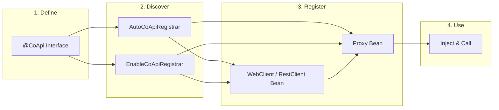
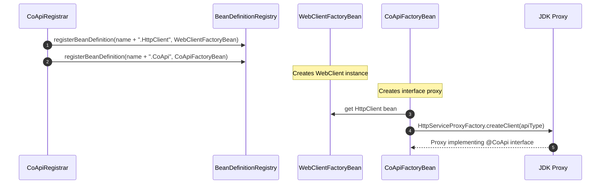
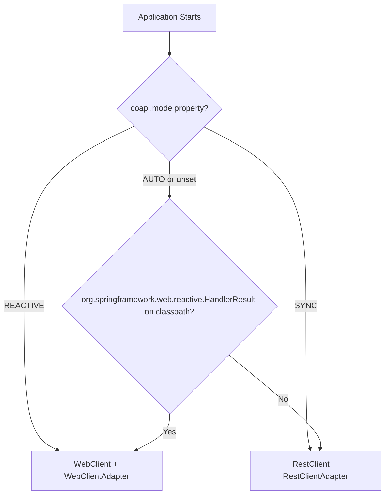
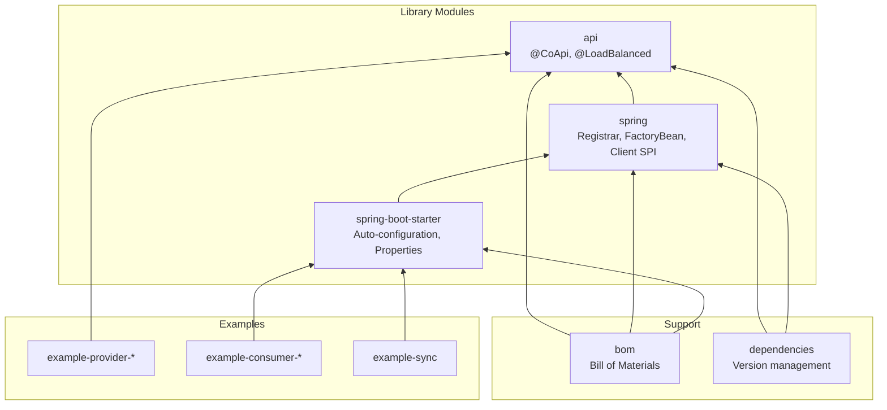

# What is CoApi?

## Overview

CoApi exists because Spring 6 introduced the HTTP Interface (`@HttpExchange`) but left a critical gap: there is no auto-configuration. Developers must manually wire `HttpServiceProxyFactory`, choose between `WebClient` and `RestClient`, handle URL resolution, and manage bean lifecycles. Meanwhile, OpenFeign — the de facto standard for declarative HTTP clients in Spring Cloud — lacks reactive programming support. Its recommended alternative, `feign-reactive`, is unmaintained and incompatible with Spring Boot 3.2+.

CoApi fills this gap with annotation-driven, zero-boilerplate auto-configuration. Define an interface, annotate it with `@CoApi`, and CoApi automatically registers the HTTP client bean, the JDK proxy, and all supporting infrastructure. It supports both reactive (`WebClient`) and synchronous (`RestClient`) models with a single annotation, and integrates client-side load balancing via Spring Cloud LoadBalancer.

## At a Glance

| Component | Responsibility | Key File | Source |
|-----------|----------------|----------|--------|
| `@CoApi` | Marks interfaces as HTTP clients, provides `baseUrl`/`serviceId`/`name` | [CoApi.kt](https://github.com/Ahoo-Wang/CoApi/blob/main/api/src/main/kotlin/me/ahoo/coapi/api/CoApi.kt) | [api/src/main/kotlin/.../CoApi.kt:38](https://github.com/Ahoo-Wang/CoApi/blob/main/api/src/main/kotlin/me/ahoo/coapi/api/CoApi.kt#L38) |
| `@LoadBalanced` | Marks interface for client-side load balancing | [LoadBalanced.kt](https://github.com/Ahoo-Wang/CoApi/blob/main/api/src/main/kotlin/me/ahoo/coapi/api/LoadBalanced.kt) | [api/src/main/kotlin/.../LoadBalanced.kt:17](https://github.com/Ahoo-Wang/CoApi/blob/main/api/src/main/kotlin/me/ahoo/coapi/api/LoadBalanced.kt#L17) |
| `CoApiDefinition` | Parsed metadata: name, apiType, baseUrl, loadBalanced | [CoApiDefinition.kt](https://github.com/Ahoo-Wang/CoApi/blob/main/spring/src/main/kotlin/me/ahoo/coapi/spring/CoApiDefinition.kt) | [spring/src/main/kotlin/.../CoApiDefinition.kt:24](https://github.com/Ahoo-Wang/CoApi/blob/main/spring/src/main/kotlin/me/ahoo/coapi/spring/CoApiDefinition.kt#L24) |
| `CoApiRegistrar` | Registers WebClient/RestClient + proxy beans per interface | [CoApiRegistrar.kt](https://github.com/Ahoo-Wang/CoApi/blob/main/spring/src/main/kotlin/me/ahoo/coapi/spring/CoApiRegistrar.kt) | [spring/src/main/kotlin/.../CoApiRegistrar.kt:22](https://github.com/Ahoo-Wang/CoApi/blob/main/spring/src/main/kotlin/me/ahoo/coapi/spring/CoApiRegistrar.kt#L22) |
| `CoApiFactoryBean` | Creates JDK proxy via `HttpServiceProxyFactory` | [CoApiFactoryBean.kt](https://github.com/Ahoo-Wang/CoApi/blob/main/spring/src/main/kotlin/me/ahoo/coapi/spring/CoApiFactoryBean.kt) | [spring/src/main/kotlin/.../CoApiFactoryBean.kt:21](https://github.com/Ahoo-Wang/CoApi/blob/main/spring/src/main/kotlin/me/ahoo/coapi/spring/CoApiFactoryBean.kt#L21) |
| `CoApiAutoConfiguration` | Boot auto-configuration entry point | [CoApiAutoConfiguration.kt](https://github.com/Ahoo-Wang/CoApi/blob/main/spring-boot-starter/src/main/kotlin/me/ahoo/coapi/spring/boot/starter/CoApiAutoConfiguration.kt) | [spring-boot-starter/.../CoApiAutoConfiguration.kt:24](https://github.com/Ahoo-Wang/CoApi/blob/main/spring-boot-starter/src/main/kotlin/me/ahoo/coapi/spring/boot/starter/CoApiAutoConfiguration.kt#L24) |

## Why CoApi?

The Spring ecosystem has three approaches to declarative HTTP clients. Here is how they compare:

| Feature | CoApi | Spring Cloud OpenFeign | Manual HTTP Interface |
|---------|-------|----------------------|----------------------|
| Auto-configuration | Zero config | Zero config | Manual setup per client |
| Reactive support (WebClient) | Built-in | None | Manual |
| Synchronous support (RestClient) | Built-in | Built-in | Manual |
| Load balancing | Built-in | Built-in | Manual |
| Spring Boot 4.x / Spring 7.x | Supported | Supported | Supported |
| Annotation-driven | `@CoApi` | `@FeignClient` | `@HttpExchange` only |
| Dual-mode switching | `coapi.mode` property | N/A | Code change required |

## How It Works

<!-- Sources: api/src/main/kotlin/me/ahoo/coapi/api/CoApi.kt:38, spring/src/main/kotlin/me/ahoo/coapi/spring/CoApiRegistrar.kt:22, spring-boot-starter/src/main/kotlin/me/ahoo/coapi/spring/boot/starter/AutoCoApiRegistrar.kt:30 -->

## The Two-Bean-Per-Interface Pattern

CoApi registers **two beans** for every `@CoApi`-annotated interface:

<!-- Sources: spring/src/main/kotlin/me/ahoo/coapi/spring/CoApiRegistrar.kt:33-87, spring/src/main/kotlin/me/ahoo/coapi/spring/CoApiFactoryBean.kt:26-34 -->

1. **HTTP Client Bean** (`name.HttpClient`) — a `WebClient` or `RestClient` configured with base URL, filters/interceptors, and optional load balancing.
2. **Proxy Bean** (`name.CoApi`) — a JDK dynamic proxy implementing the annotated interface, generated by Spring's `HttpServiceProxyFactory`.

## Client Mode Inference

<!-- Sources: spring/src/main/kotlin/me/ahoo/coapi/spring/ClientMode.kt:16-39, spring/src/main/kotlin/me/ahoo/coapi/spring/AbstractCoApiRegistrar.kt:42-50 -->

## Module Architecture

<!-- Sources: settings.gradle.kts:26-45, bom/build.gradle.kts:14-23, dependencies/build.gradle.kts:14-23 -->

## Version Compatibility

| CoApi Version | Spring Boot | Spring Framework | JDK |
|---------------|-------------|------------------|-----|
| 1.x | 3.2.x | 6.x | 17+ |
| 2.x | 4.x | 7.x | 17+ |

Current version: **2.0.1** ([gradle.properties:21](https://github.com/Ahoo-Wang/CoApi/blob/main/gradle.properties#L21))

## Key Features

- **Zero-boilerplate** — one annotation, full auto-configuration
- **Dual-mode** — reactive (`WebClient`) or synchronous (`RestClient`) via property or classpath inference
- **Load balancing** — integrated with Spring Cloud LoadBalancer
- **Customizable** — `WebClientBuilderCustomizer` / `RestClientBuilderCustomizer` SPI for global and per-client customization
- **Authentication** — built-in `BearerTokenFilter` with JWT-aware `CachedExpirableTokenProvider`
- **Filter/interceptor** — per-client filter chains configurable via YAML properties

## Related Pages

- [Installation & Setup](./installation.md) — add CoApi to your project
- [Quick Start](./quick-start.md) — define your first HTTP client
- [Configuration Reference](./configuration.md) — all properties explained
- [Architecture Overview](../deep-dive/architecture.md) — deep dive into registration flow

## References

1. [CoApi Annotation](https://github.com/Ahoo-Wang/CoApi/blob/main/api/src/main/kotlin/me/ahoo/coapi/api/CoApi.kt) — `api/src/main/kotlin/me/ahoo/coapi/api/CoApi.kt`
2. [CoApiDefinition](https://github.com/Ahoo-Wang/CoApi/blob/main/spring/src/main/kotlin/me/ahoo/coapi/spring/CoApiDefinition.kt) — `spring/src/main/kotlin/me/ahoo/coapi/spring/CoApiDefinition.kt`
3. [CoApiRegistrar](https://github.com/Ahoo-Wang/CoApi/blob/main/spring/src/main/kotlin/me/ahoo/coapi/spring/CoApiRegistrar.kt) — `spring/src/main/kotlin/me/ahoo/coapi/spring/CoApiRegistrar.kt`
4. [CoApiFactoryBean](https://github.com/Ahoo-Wang/CoApi/blob/main/spring/src/main/kotlin/me/ahoo/coapi/spring/CoApiFactoryBean.kt) — `spring/src/main/kotlin/me/ahoo/coapi/spring/CoApiFactoryBean.kt`
5. [ClientMode](https://github.com/Ahoo-Wang/CoApi/blob/main/spring/src/main/kotlin/me/ahoo/coapi/spring/ClientMode.kt) — `spring/src/main/kotlin/me/ahoo/coapi/spring/ClientMode.kt`
6. [README.md](https://github.com/Ahoo-Wang/CoApi/blob/main/README.md) — Project overview and usage examples
