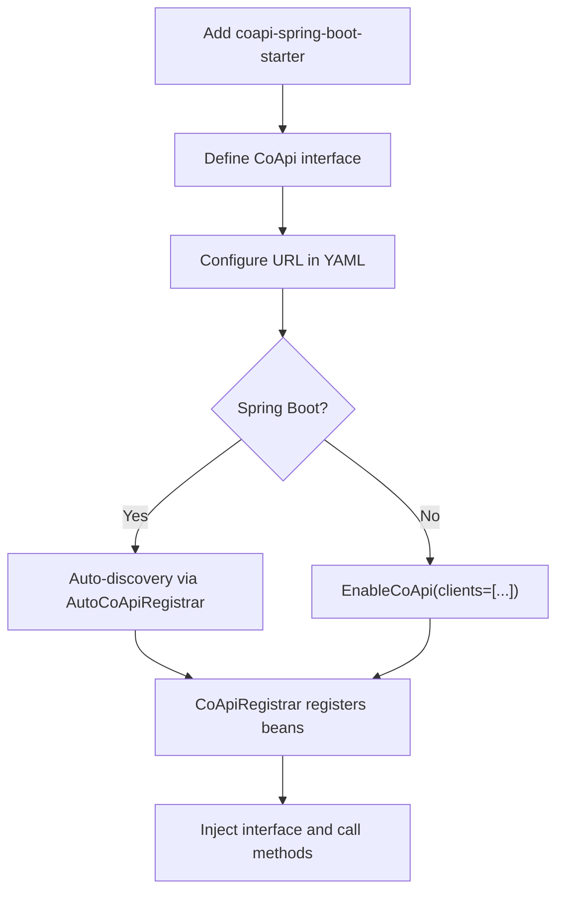
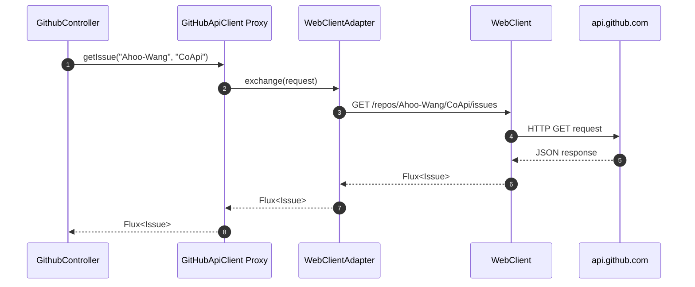
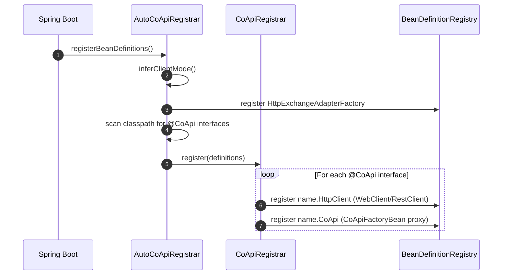

# Quick Start

## Overview

CoApi reduces HTTP client setup to its essence: define a Java or Kotlin interface with `@HttpExchange` methods, annotate the interface with `@CoApi`, and Spring Boot auto-configuration handles the rest. No manual `WebClient` or `RestClient` builders, no proxy factory setup, no boilerplate.

## At a Glance

| Step | What | Key File | Source |
|------|------|----------|--------|
| 1. Add dependency | `coapi-spring-boot-starter` | [spring-boot-starter/build.gradle.kts](https://github.com/Ahoo-Wang/CoApi/blob/main/spring-boot-starter/build.gradle.kts) | [spring-boot-starter/build.gradle.kts:29](https://github.com/Ahoo-Wang/CoApi/blob/main/spring-boot-starter/build.gradle.kts#L29) |
| 2. Define interface | `@CoApi` + `@GetExchange` | [GitHubApiClient.kt](https://github.com/Ahoo-Wang/CoApi/blob/main/example/example-consumer-client/src/main/kotlin/me/ahoo/coapi/example/consumer/client/GitHubApiClient.kt) | [example/.../GitHubApiClient.kt:21](https://github.com/Ahoo-Wang/CoApi/blob/main/example/example-consumer-client/src/main/kotlin/me/ahoo/coapi/example/consumer/client/GitHubApiClient.kt#L21) |
| 3. Configure URL | `application.yaml` | [application.yaml](https://github.com/Ahoo-Wang/CoApi/blob/main/example/example-consumer-server/src/main/resources/application.yaml) | [example/.../application.yaml:3](https://github.com/Ahoo-Wang/CoApi/blob/main/example/example-consumer-server/src/main/resources/application.yaml#L3) |
| 4. Inject & use | Constructor injection | [GithubController.kt](https://github.com/Ahoo-Wang/CoApi/blob/main/example/example-consumer-server/src/main/kotlin/me/ahoo/coapi/example/consumer/GithubController.kt) | [example/.../GithubController.kt:32](https://github.com/Ahoo-Wang/CoApi/blob/main/example/example-consumer-server/src/main/kotlin/me/ahoo/coapi/example/consumer/GithubController.kt#L32) |

## Step 1: Add Dependency

**Gradle (Kotlin DSL):**
```kotlin
implementation("me.ahoo.coapi:coapi-spring-boot-starter")
```

**Maven:**
```xml
<dependency>
    <groupId>me.ahoo.coapi</groupId>
    <artifactId>coapi-spring-boot-starter</artifactId>
    <version>2.0.1</version>
</dependency>
```

For load balancing, also add:
```kotlin
implementation("org.springframework.cloud:spring-cloud-starter-loadbalancer")
```

## Step 2: Define Interface

```kotlin
@CoApi(baseUrl = "\${github.url}")
interface GitHubApiClient {

    @GetExchange("repos/{owner}/{repo}/issues")
    fun getIssue(@PathVariable owner: String, @PathVariable repo: String): Flux<Issue>
}

data class Issue(val url: String)
```

The `@CoApi` annotation does three things:
1. Marks this interface as an HTTP client (also acts as `@Component`)
2. Defines the base URL (supports `${...}` property placeholders)
3. Triggers auto-configuration to register beans

## Step 3: Configure URL

```yaml
# application.yaml
github:
  url: https://api.github.com
```

The `${github.url}` placeholder in `@CoApi(baseUrl)` resolves against Spring's `Environment`.

## Step 4: Enable & Use

**Spring Boot (auto-configuration):** Nothing else needed. CoApi auto-discovers `@CoApi` interfaces in your application's base package.

**Non-Boot / explicit mode:** Add `@EnableCoApi`:
```kotlin
@EnableCoApi(clients = [GitHubApiClient::class])
@SpringBootApplication
class MyApplication
```

**Inject into any component:**
```kotlin
@RestController
class GithubController(private val gitHubApiClient: GitHubApiClient) {

    @GetMapping("/issues")
    fun getIssues(): Flux<Issue> {
        return gitHubApiClient.getIssue("Ahoo-Wang", "CoApi")
    }
}
```

## Setup Flow


<!-- Sources: example/example-consumer-client/src/main/kotlin/me/ahoo/coapi/example/consumer/client/GitHubApiClient.kt:21, spring/src/main/kotlin/me/ahoo/coapi/spring/EnableCoApi.kt:21, spring-boot-starter/src/main/kotlin/me/ahoo/coapi/spring/boot/starter/AutoCoApiRegistrar.kt:30 -->

## Request Flow


<!-- Sources: spring/src/main/kotlin/me/ahoo/coapi/spring/CoApiFactoryBean.kt:26-34, spring/src/main/kotlin/me/ahoo/coapi/spring/client/reactive/ReactiveHttpExchangeAdapterFactory.kt:20-26 -->

## Bean Registration


<!-- Sources: spring-boot-starter/src/main/kotlin/me/ahoo/coapi/spring/boot/starter/AutoCoApiRegistrar.kt:47-56, spring/src/main/kotlin/me/ahoo/coapi/spring/CoApiRegistrar.kt:27-87, spring/src/main/kotlin/me/ahoo/coapi/spring/AbstractCoApiRegistrar.kt:42-50 -->

## Common Variations

### Load-Balanced Client

```kotlin
@CoApi(serviceId = "github-service")
interface ServiceApiClient {
    @GetExchange("repos/{owner}/{repo}/issues")
    fun getIssue(@PathVariable owner: String, @PathVariable repo: String): Flux<Issue>
}
```

Configure service instances:
```yaml
spring:
  cloud:
    discovery:
      client:
        simple:
          instances:
            github-service:
              - host: api.github.com
                secure: true
                port: 443
```

### Synchronous Client (Java)

```java
@CoApi(baseUrl = "${github.url}")
public interface GitHubSyncClient {
    @GetExchange("repos/{owner}/{repo}/issues")
    List<Issue> getIssue(@PathVariable String owner, @PathVariable String repo);
}
```

Set `coapi.mode=SYNC` to switch to `RestClient`-based mode. Return `List<T>` instead of `Flux<T>`.

### Shared API Contract Pattern

Define a shared API interface that both provider and consumer depend on:

```kotlin
// Shared module: example-provider-api
@HttpExchange("todo")
interface TodoApi {
    @GetExchange
    fun getTodo(): Flux<Todo>
}

// Consumer module
@CoApi(serviceId = "provider-service")
interface TodoClient : TodoApi

// Provider module
@RestController
class TodoController : TodoApi {
    override fun getTodo(): Flux<Todo> = Flux.just(Todo("Hello"))
}
```

## Related Pages

- [What is CoApi?](./overview.md) — why CoApi exists
- [Installation & Setup](./installation.md) — detailed dependency management
- [Configuration Reference](./configuration.md) — all properties
- [Architecture Overview](../deep-dive/architecture.md) — how registration works internally
- [Examples & Patterns](../deep-dive/examples.md) — complete example walkthroughs

## References

1. [GitHubApiClient example](https://github.com/Ahoo-Wang/CoApi/blob/main/example/example-consumer-client/src/main/kotlin/me/ahoo/coapi/example/consumer/client/GitHubApiClient.kt) — `example/example-consumer-client/src/main/kotlin/.../GitHubApiClient.kt`
2. [ConsumerServer](https://github.com/Ahoo-Wang/CoApi/blob/main/example/example-consumer-server/src/main/kotlin/me/ahoo/coapi/example/consumer/ConsumerServer.kt) — `example/example-consumer-server/src/main/kotlin/.../ConsumerServer.kt`
3. [GithubController](https://github.com/Ahoo-Wang/CoApi/blob/main/example/example-consumer-server/src/main/kotlin/me/ahoo/coapi/example/consumer/GithubController.kt) — `example/example-consumer-server/src/main/kotlin/.../GithubController.kt`
4. [Consumer application.yaml](https://github.com/Ahoo-Wang/CoApi/blob/main/example/example-consumer-server/src/main/resources/application.yaml) — `example/example-consumer-server/src/main/resources/application.yaml`
5. [CoApi annotation](https://github.com/Ahoo-Wang/CoApi/blob/main/api/src/main/kotlin/me/ahoo/coapi/api/CoApi.kt) — `api/src/main/kotlin/me/ahoo/coapi/api/CoApi.kt`
6. [EnableCoApi annotation](https://github.com/Ahoo-Wang/CoApi/blob/main/spring/src/main/kotlin/me/ahoo/coapi/spring/EnableCoApi.kt) — `spring/src/main/kotlin/me/ahoo/coapi/spring/EnableCoApi.kt`
