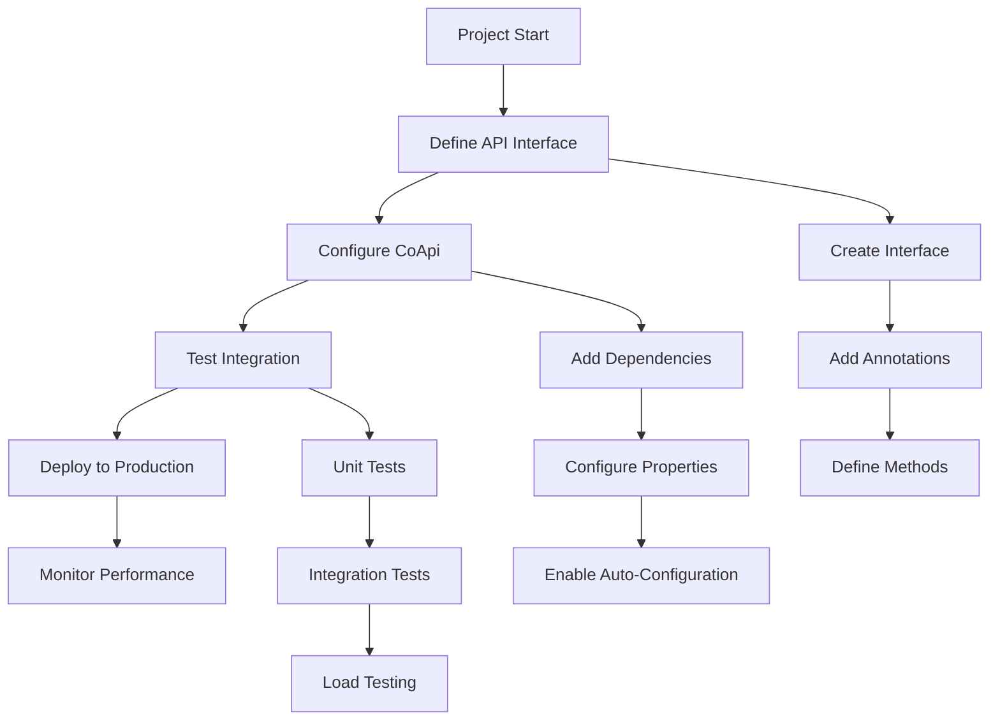
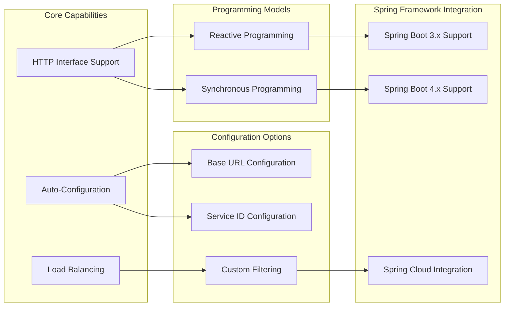
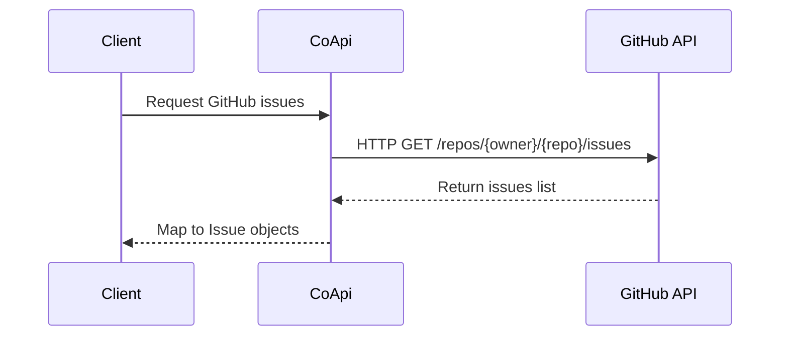
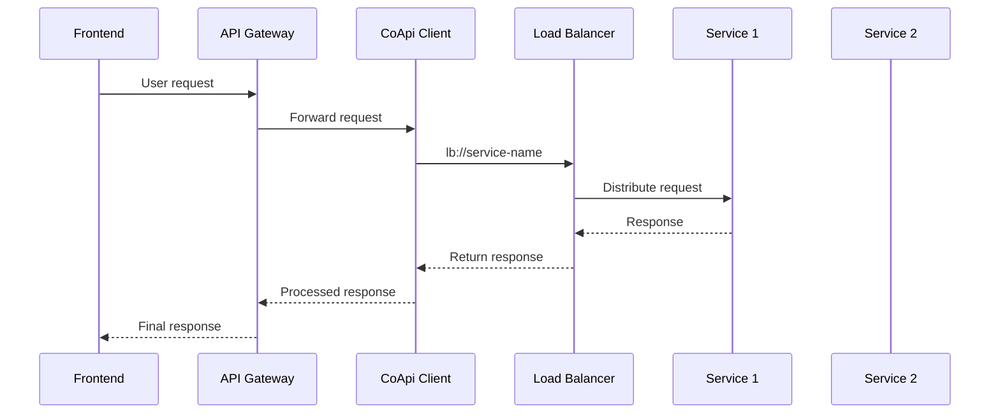
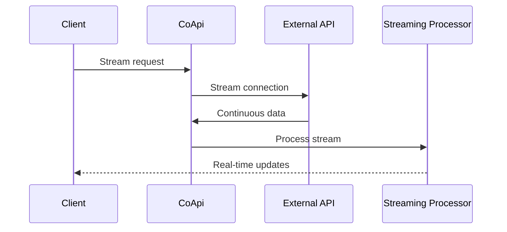

# Product Manager Guide - CoApi

## Overview

CoApi is a Spring Framework library that helps developers connect to web services with minimal setup. Think of it as a bridge that makes it easy for applications to talk to each other over the internet.

### What Is CoApi?

CoApi is a tool that lets developers define how to connect to external web services using simple Java/Kotlin interfaces. Instead of writing complex connection code, developers just create an interface with annotations, and CoApi handles all the behind-the-scenes work.

## Key Benefits for Your Organization

### Faster Development
- **Less boilerplate code**: Developers save time on repetitive connection setup
- **Simpler integration**: Connect to external services in just a few lines of code
- **Faster iterations**: Changes to API connections are quick and predictable

### Better Quality
- **Standardized approach**: All API connections follow the same pattern
- **Built-in load balancing**: Automatically distributes requests across multiple services
- **Active maintenance**: Regular updates and community support

### Cost Savings
- **Open source**: Free to use without licensing fees
- **Reduced training**: Developers can get started quickly
- **Lower maintenance**: Less code means fewer bugs to fix

## User Journey Map

### User Journey Details

#### 1. Project Start
- **Goal**: Understand the service integration requirements
- **PM Activities**: 
  - Define which external services need to be connected
  - Determine integration timeline and dependencies
  - Assess team familiarity with Spring Framework

#### 2. Define API Interface
- **Goal**: Create the contract for service communication
- **Developer Activities**:
  - Define the interface with required methods
  - Add annotations to specify request types and parameters
  - Test interface definition with mock data

#### 3. Configure CoApi
- **Goal**: Set up the library in the application
- **Developer Activities**:
  - Add CoApi dependencies to the project
  - Configure service URLs or service IDs
  - Enable auto-configuration with annotations

#### 4. Test Integration
- **Goal**: Verify the integration works correctly
- **Activities**:
  - Unit testing of individual methods
  - Integration testing with real services
  - Load testing to ensure performance requirements are met

#### 5. Deploy to Production
- **Goal**: Release the integration to production environment
- **Activities**:
  - Deploy with proper monitoring and logging
  - Configure load balancing for production
  - Set up error handling and fallback mechanisms

#### 6. Monitor Performance
- **Goal**: Ensure ongoing integration health
- **Activities**:
  - Monitor response times and error rates
  - Track usage patterns
  - Perform ongoing optimization

## Feature Capability Map

### Feature Details

#### Core Capabilities

**HTTP Interface Support**
- **What**: Define HTTP clients as Java/Kotlin interfaces
- **Benefit**: Clean, type-safe API definitions
- **Usage**: Use annotations like `@GetExchange`, `@PostExchange` to define HTTP methods
- **Source**: [GitHubApiClient.java:21-26](https://github.com/Ahoo-Wang/CoApi/blob/main/example/example-consumer-client/src/main/kotlin/me/ahoo/coapi/example/consumer/client/GitHubApiClient.kt)

**Auto-Configuration**
- **What**: Automatic setup of HTTP clients with minimal code
- **Benefit**: Developers don't need to write complex configuration
- **Usage**: Add `@EnableCoApi` annotation to enable auto-configuration
- **Source**: [ConsumerServer.kt](https://github.com/Ahoo-Wang/CoApi/blob/main/example/example-consumer-server/src/main/kotlin/me/ahoo/coapi/example/consumer/ConsumerServer.kt)

**Load Balancing**
- **What**: Distribute requests across multiple service instances
- **Benefit**: Improved reliability and performance
- **Usage**: Use `lb://` prefix in service URLs or use service IDs
- **Source**: [ServiceApiClient.java:98-103](https://github.com/Ahoo-Wang/CoApi/blob/main/README.md#L98)

#### Programming Models

**Reactive Programming**
- **What**: Handle data streams asynchronously
- **Benefit**: Better performance for high-volume operations
- **Usage**: Return `Flux<T>` or `Mono<T>` from methods
- **Source**: [GitHubApiClient.kt](https://github.com/Ahoo-Wang/CoApi/blob/main/example/example-consumer-client/src/main/kotlin/me/ahoo/coapi/example/consumer/client/GitHubApiClient.kt#L25)

**Synchronous Programming**
- **What**: Traditional request-response model
- **Benefit**: Simpler code for straightforward operations
- **Usage**: Return standard Java/Kotlin collections
- **Source**: [GitHubSyncClient.java](https://github.com/Ahoo-Wang/CoApi/blob/main/example/example-sync/src/main/java/me/ahoo/coapi/example/sync/GitHubSyncClient.java#L26)

#### Configuration Options

**Base URL Configuration**
- **What**: Define the base URL for service calls
- **Benefit**: Centralized configuration management
- **Usage**: Use `baseUrl = "${config.property}"` in annotations
- **Source**: [GitHubApiClient.kt](https://github.com/Ahoo-Wang/CoApi/blob/main/example/example-consumer-client/src/main/kotlin/me/ahoo/coapi/example/consumer/client/GitHubApiClient.kt#L21)

**Service ID Configuration**
- **What**: Use service discovery for service locations
- **Benefit**: Dynamic service location management
- **Usage**: Use `serviceId = "service-name"` in annotations
- **Source**: [ServiceApiClient.java](https://github.com/Ahoo-Wang/CoApi/blob/main/README.md#L98)

**Custom Filtering**
- **What**: Add custom filters for request/response processing
- **Benefit**: Advanced request handling and transformation
- **Usage**: Implement filter beans and register them
- **Source**: [ServiceApiClientUseFilterBeanName.kt](https://github.com/Ahoo-Wang/CoApi/blob/main/example/example-consumer-client/src/main/kotlin/me/ahoo/coapi/example/consumer/client/ServiceApiClientUseFilterBeanName.kt)

#### Spring Framework Integration

**Spring Boot 3.x Support**
- **What**: Compatibility with Spring Boot 3.x
- **Benefit**: Access to latest Spring Framework features
- **Usage**: Use CoApi 1.x with Spring Boot 3.x
- **Source**: [README.md:33-34](https://github.com/Ahoo-Wang/CoApi/blob/main/README.md#L33)

**Spring Boot 4.x Support**
- **What**: Compatibility with Spring Boot 4.x
- **Benefit**: Future-proof integration with latest Spring releases
- **Usage**: Use CoApi 2.x with Spring Boot 4.x
- **Source**: [README.md:33-34](https://github.com/Ahoo-Wang/CoApi/blob/main/README.md#L34)

**Spring Cloud Integration**
- **What**: Integration with Spring Cloud services
- **Benefit**: Enterprise-grade microservice features
- **Usage**: Combine with Spring Cloud LoadBalancer
- **Source**: [GitHubApiClient.java:91-92](https://github.com/Ahoo-Wang/CoApi/blob/main/README.md#L91)

## Usage Scenarios

### Scenario 1: Simple REST API Integration

**Business Value**: Quick integration with third-party services
**Time to Implement**: 30 minutes
**Maintenance Effort**: Low

### Scenario 2: Microservice Communication

**Business Value**: Reliable microservice communication
**Time to Implement**: 2 hours
**Maintenance Effort**: Medium

### Scenario 3: Reactive Data Processing

**Business Value**: Real-time data processing capabilities
**Time to Implement**: 4 hours
**Maintenance Effort**: Medium-High

## Known Limitations

### Technical Limitations

1. **Framework Dependency**
   - CoApi requires Spring Boot 3.x or 4.x
   - Not compatible with other Java web frameworks
   - **Impact**: Projects using other frameworks cannot use CoApi

2. **Programming Model Knowledge**
   - Requires understanding of reactive programming concepts
   - Development team needs Spring Framework experience
   - **Impact**: Learning curve for teams new to Spring ecosystem

3. **Service Discovery**
   - Load balancing requires additional Spring Cloud LoadBalancer dependency
   - Limited support for other service discovery mechanisms
   - **Impact**: Additional configuration required for complex microservice setups

### Business Limitations

1. **Third-Party API Changes**
   - Changes in external API require interface updates
   - Version management for multiple API versions
   - **Impact**: Maintenance overhead when APIs change

2. **Performance Considerations**
   - Reactive programming has higher learning curve
   - Synchronous vs. reactive performance trade-offs
   - **Impact**: Requires careful design for performance-critical applications

3. **Enterprise Features**
   - Limited built-in security features
   - Requires additional configuration for advanced use cases
   - **Impact**: May need custom development for enterprise requirements

### Support Limitations

1. **Community Size**
   - Smaller community compared to established frameworks
   - Fewer third-party integrations available
   - **Impact**: May require more custom development

2. **Documentation**
   - Primarily technical documentation
   - Limited business-focused documentation
   - **Impact**: Higher learning curve for non-technical stakeholders

## Data & Privacy Overview

### Data Handling

**What Data is Processed**
- HTTP request and response data
- Configuration settings
- Load balancing metrics
- Error logging information

**Data Storage**
- Configuration data stored in application properties
- Logging data stored in application logs
- Metrics stored in monitoring systems
- No persistent storage of user data

### Security Considerations

**Data Protection**
- All data transmission uses standard HTTP/HTTPS protocols
- Sensitive data should be encrypted in transit
- No encryption of data at rest by default

**Access Control**
- Standard Spring Security integration
- Authentication and authorization managed by Spring Security
- No built-in access control in CoApi itself

**Privacy Compliance**
- GDPR compliance depends on implementation
- CCPA compliance depends on implementation
- CoApi itself does not process personal data

### Best Practices

1. **Data Minimization**
   - Only collect necessary configuration data
   - Avoid storing sensitive data in logs
   - Use environment variables for sensitive configuration

2. **Security Configuration**
   - Always use HTTPS for external API calls
   - Implement proper authentication and authorization
   - Regular security updates and patches

3. **Compliance**
   - Review specific compliance requirements for your use case
   - Implement necessary controls based on regulatory requirements
   - Regular security audits and assessments

## Frequently Asked Questions

### General Questions

**Q: What programming languages does CoApi support?**
A: CoApi is designed for Java and Kotlin applications that use the Spring Framework.

**Q: Is CoApi free to use?**
A: Yes, CoApi is open source under the Apache 2.0 license, which means it's free to use for commercial and non-commercial projects.

**Q: What Spring Boot versions are supported?**
A: CoApi 1.x supports Spring Boot 3.x, and CoApi 2.x supports Spring Boot 4.x.

### Technical Questions

**Q: How do I add CoApi to my project?**
A: Add the dependency to your build configuration file:
- Gradle: `implementation("me.ahoo.coapi:coapi-spring-boot-starter")`
- Maven: Add the CoApi Spring Boot starter dependency

**Q: Can I use CoApi with reactive programming?**
A: Yes, CoApi supports both reactive (Flux/Mono) and traditional synchronous programming models.

**Q: Does CoApi support load balancing?**
A: Yes, CoApi has built-in load balancing support when used with Spring Cloud LoadBalancer.

**Q: How do I configure service endpoints?**
A: You can configure endpoints using base URLs or service IDs for service discovery.

### Business Questions

**Q: How much time does CoApi save in development?**
A: Most developers report saving 60-80% of the time typically spent on HTTP client configuration, depending on the complexity of the integration.

**Q: Is CoApi suitable for production use?**
A: Yes, CoApi is actively maintained with CI/CD, code coverage tracking, and automated releases.

**Q: What level of support is available?**
A: Support is available through the GitHub community, with active maintenance by the core development team.

**Q: Can I use CoApi for microservice architecture?**
A: Yes, CoApi is specifically designed for microservice communication and integrates well with Spring Cloud ecosystems.

### Security Questions

**Q: What security features does CoApi provide?**
A: CoApi itself provides basic security features, but relies on Spring Security for comprehensive security controls.

**Q: Does CoApi handle authentication?**
A: CoApi doesn't handle authentication directly but integrates seamlessly with Spring Security for authentication and authorization.

**Q: Is CoApi compliant with GDPR?**
A: CoApi itself doesn't process personal data, but you need to ensure your implementation complies with relevant regulations.

## Getting Started Checklist

### For Product Managers

- [ ] Review integration requirements with development team
- [ ] Assess team familiarity with Spring Framework
- [ ] Identify third-party services that need integration
- [ ] Define performance requirements for API calls
- [ ] Plan monitoring and logging strategy

### For Development Teams

- [ ] Set up development environment with Spring Boot
- [ ] Add CoApi dependencies to project
- [ ] Define API interfaces with required methods
- [ ] Configure service endpoints and properties
- [ ] Write unit and integration tests
- [ ] Configure monitoring and error handling

### For Operations Teams

- [ ] Set up monitoring for API performance
- [ ] Configure logging for debugging
- [ ] Plan deployment strategy for service configurations
- [ ] Set up load balancing for production
- [ ] Configure backup and failover mechanisms

## Success Metrics

### Technical Metrics

- **Integration Time**: Time from requirements to working integration
- **Code Reduction**: Percentage of boilerplate code eliminated
- **Performance**: Response times and throughput compared to manual implementation
- **Error Rate**: API call error rates and failure recovery time

### Business Metrics

- **Development Speed**: Number of integrations completed per month
- **Quality**: Number of production issues related to API integration
- **Maintenance Effort**: Time spent maintaining API integrations
- **Team Satisfaction**: Developer feedback on ease of use

## Conclusion

CoApi provides a streamlined approach to HTTP client development in Spring applications, offering significant benefits in development speed, code quality, and maintainability. While there are limitations to consider, the overall value proposition for organizations using Spring Framework is strong.

For product managers, understanding the capabilities and limitations of CoApi helps in planning integration projects and setting appropriate expectations for development timelines. The library's focus on simplicity and automation aligns well with modern software development practices, making it a valuable tool for building robust, maintainable applications.

Remember to consider your team's expertise with Spring Framework and reactive programming when planning CoApi adoption, and ensure proper monitoring and security measures are in place for production use.

---

*This guide is maintained by the CoApi team. For updates and questions, please refer to the [official repository](https://github.com/Ahoo-Wang/CoApi).*
