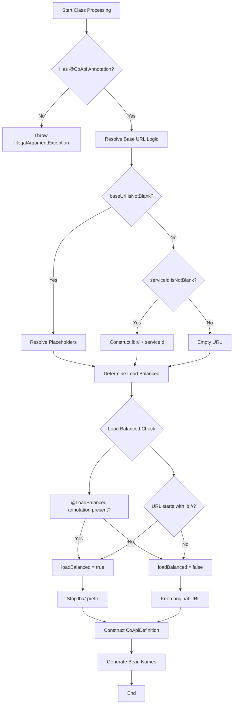
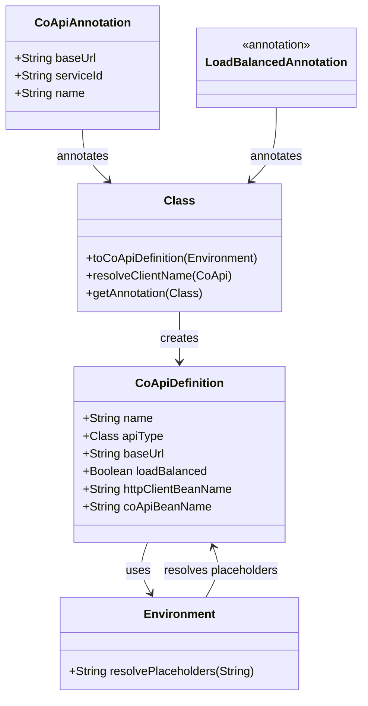
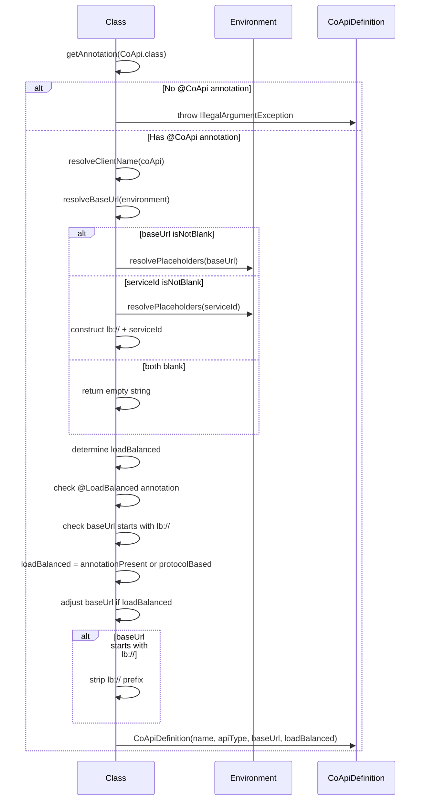
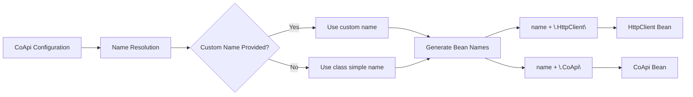

# 注解

## 概述

CoApi 提供了一套完善的基于注解的配置系统，简化了分布式服务客户端的集成。这些注解使开发者能够以最少的样板代码定义服务端点、配置负载均衡和管理服务发现。注解系统设计直观，同时为各种部署场景提供了强大的配置选项。

## 概览一览

| 注解 | 目标 | 用途 | 关键参数 | 默认行为 |
|------------|--------|---------|---------------|-----------------|
| `@CoApi` | 类 | 定义服务客户端 | `baseUrl`、`serviceId`、`name` | 自动注册为 @Component |
| `@LoadBalanced` | 类 | 标记接口为负载均衡 | （无） | 需要显式注解或 `lb://` 前缀 |

## 核心注解

### @CoApi 注解

`@CoApi` 注解是 CoApi 配置系统的基石。它将类标记为服务客户端，并提供必要的配置参数。

```kotlin
@Target(AnnotationTarget.CLASS)
@Component
annotation class CoApi(
    val baseUrl: String = "",
    val serviceId: String = "",
    val name: String = ""
)
```

**关键特性：**
- **自动组件注册**：`@Component` 元注解确保 Spring 在组件扫描时能够识别被注解的类
- **灵活的 URL 配置**：支持多种 URL 解析策略
- **占位符支持**：使用 `${...}` 语法实现环境变量替换
- **协议支持**：同时处理 `lb://`（负载均衡）和 `http://`（直连）协议

**使用示例：**

```kotlin
// Direct HTTP connection
@CoApi(baseUrl = "https://api.github.com")
interface GitHubApiClient {
    @GetExchange("repos/{owner}/{repo}/issues")
    fun getIssue(@PathVariable owner: String, @PathVariable repo: String): Flux<Issue>
}

// Load-balanced service with placeholder
@CoApi(baseUrl = "${github.url}")
interface GitHubApiClient {
    // ...
}

// Service-based load balancing
@CoApi(serviceId = "github-service")
interface GitHubApiClient {
    // ...
}

// Custom naming
@CoApi(name = "CustomApi", baseUrl = "lb://github-service")
interface CustomApiClient {
    // ...
}
```

### @LoadBalanced 注解

`@LoadBalanced` 注解提供显式的负载均衡配置：

```kotlin
@Target(AnnotationTarget.CLASS)
annotation class LoadBalanced
```

**用途：**
- 即使未使用 `lb://` 协议，也能将接口标记为负载均衡
- 优先于基于 URL 的负载均衡判断
- 适用于需要负载均衡但使用直连 HTTP 连接的服务

## URL 解析流程

CoApi 系统采用一套精密的 URL 解析算法，根据注解配置确定最终的服务端点：



## 类层次结构与关系

注解系统创建了一个清晰的组件层次结构，各组件协同工作以提供服务客户端功能：



## 参数流转与处理

注解处理遵循系统化的流程，将声明式配置转换为运行时就绪的服务定义：



## 配置示例

### 测试用例分析

CoApi 系统包含全面的测试用例，演示了各种配置场景：

```kotlin
// Test Case 1: lb:// protocol
@CoApi(baseUrl = "lb://order-service")
interface LBMockApi

// Result: loadBalanced=true, baseUrl="http://order-service"

// Test Case 2: serviceId configuration
@CoApi(serviceId = "order-service")
interface MockServiceApi

// Result: loadBalanced=true, baseUrl="http://order-service"

// Test Case 3: Empty configuration with @LoadBalanced
@CoApi
@LoadBalanced
interface MockEmptyApi

// Result: loadBalanced=true, baseUrl=""
```

### 实际使用示例

**带环境配置的 GitHub API 客户端：**
```kotlin
@CoApi(baseUrl = "${github.url}", name = "GitHubApi")
interface GitHubApiClient {
    @GetExchange("repos/{owner}/{repo}/issues")
    fun getIssue(@PathVariable owner: String, @PathVariable repo: String): Flux<Issue>
}
```

**带服务发现的服务 API 客户端：**
```kotlin
@CoApi(serviceId = "github-service")
interface ServiceApiClient {
    @GetExchange("repos/{owner}/{repo}/issues")
    fun getIssue(@PathVariable owner: String, @PathVariable repo: String): Flux<Issue>
}
```

## Bean 生成

注解系统根据配置自动生成 Spring Bean 名称：



## 最佳实践

1. **使用描述性名称**：在处理多个服务时，始终提供有意义的 `name` 参数
2. **利用环境变量**：对在不同环境间变化的配置使用 `${...}` 占位符
3. **显式负载均衡**：对需要负载均衡的服务使用 `@LoadBalanced`，无论协议如何
4. **协议选择**：使用 `lb://` 进行基于服务发现的负载均衡，使用 `http://` 进行直连
5. **错误处理**：始终确保服务客户端接口上存在 `@CoApi` 注解

## 参考文献

### 源代码文件
- [api/src/main/kotlin/me/ahoo/coapi/api/CoApi.kt](https://github.com/Ahoo-Wang/CoApi/blob/main/api/src/main/kotlin/me/ahoo/coapi/api/CoApi.kt) - 主 CoApi 注解定义
- [api/src/main/kotlin/me/ahoo/coapi/api/LoadBalanced.kt](https://github.com/Ahoo-Wang/CoApi/blob/main/api/src/main/kotlin/me/ahoo/coapi/api/LoadBalanced.kt) - 负载均衡注解
- [spring/src/main/kotlin/me/ahoo/coapi/spring/CoApiDefinition.kt](https://github.com/Ahoo-Wang/CoApi/blob/main/spring/src/main/kotlin/me/ahoo/coapi/spring/CoApiDefinition.kt) - 配置解析逻辑
- [spring/src/test/kotlin/me/ahoo/coapi/spring/CoApiDefinitionTest.kt](https://github.com/Ahoo-Wang/CoApi/blob/main/spring/src/test/kotlin/me/ahoo/coapi/spring/CoApiDefinitionTest.kt) - 测试用例
- [example/example-consumer-client/src/main/kotlin/me/ahoo/coapi/example/consumer/client/GitHubApiClient.kt](https://github.com/Ahoo-Wang/CoApi/blob/main/example/example-consumer-client/src/main/kotlin/me/ahoo/coapi/example/consumer/client/GitHubApiClient.kt) - 示例实现
- [example/example-consumer-client/src/main/kotlin/me/ahoo/coapi/example/consumer/client/ServiceApiClient.kt](https://github.com/Ahoo-Wang/CoApi/blob/main/example/example-consumer-client/src/main/kotlin/me/ahoo/coapi/example/consumer/client/ServiceApiClient.kt) - 服务发现示例

### 相关页面
- [配置](/zh/getting-started/configuration.md) - 详细配置指南
- [服务发现](/zh/deep-dive/load-balancing.md) - 负载均衡与服务发现
- [测试](/zh/deep-dive/annotations.md) - CoApi 客户端测试策略
- [示例](/zh/deep-dive/examples.md) - 完整使用示例
