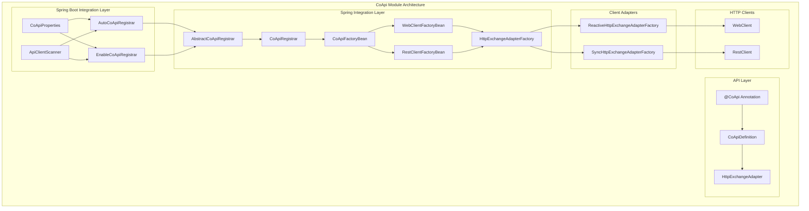
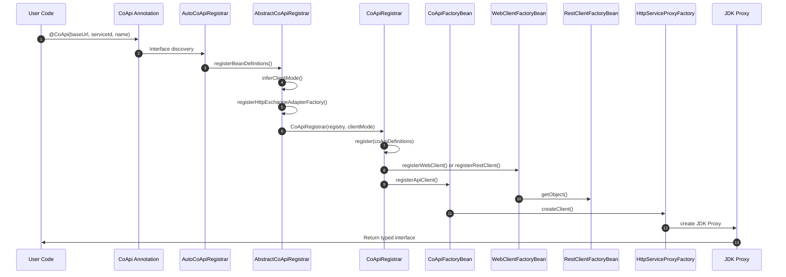
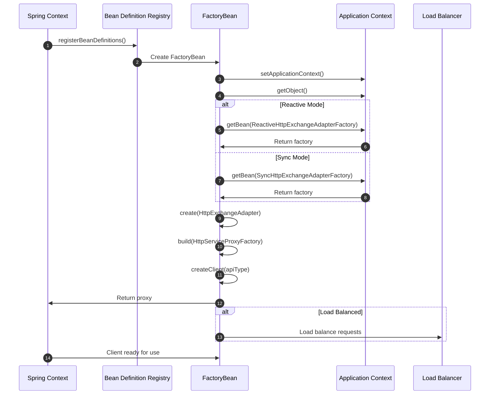
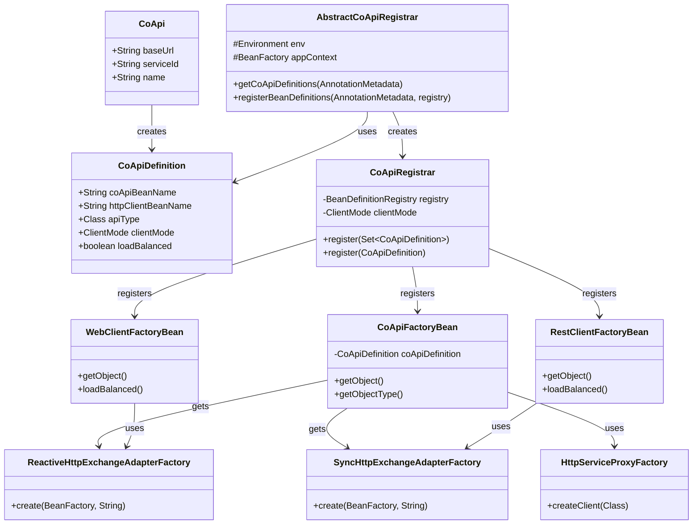
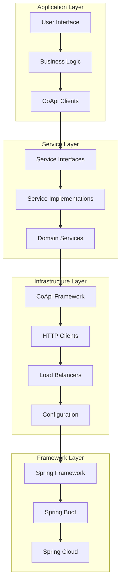

# 架构概览

CoApi 的架构旨在提供一个无缝的、类型安全的 HTTP 客户端框架，该框架与 Spring 生态系统深度集成，同时保持对各种部署场景的灵活性。该架构通过提供自动发现、配置管理以及对响应式和同步编程模型的支持，解决了 REST API 客户端开发中的常见挑战。

## 概述

CoApi 的存在是为了解决一个根本问题：在 Spring 应用程序中创建类型安全的 HTTP 客户端，而无需通常与手动 HTTP 客户端配置相关的样板代码。通过利用 Spring 的自动配置能力和注解驱动的编程模型，CoApi 降低了与外部服务集成的复杂性，同时提供了企业级特性，如负载均衡、熔断和配置管理。

该架构遵循模块化设计，将关注点分离到三个主要层：API 层（用于接口定义）、Spring 集成层（用于依赖注入和生命周期管理）以及 Spring Boot 集成层（用于自动配置和合理默认值）。

## 概览一览

| 组件 | 职责 | 关键特性 | 来源 |
|----------|---------------|---------------|--------|
| `@CoApi` | 接口定义与配置 | 类型安全的 HTTP 客户端、服务发现、负载均衡 | [CoApi.kt](https://github.com/Ahoo-Wang/CoApi/blob/main/api/src/main/kotlin/me/ahoo/coapi/api/CoApi.kt#L61) |
| `AbstractCoApiRegistrar` | 基础注册逻辑 | 客户端模式推断、工厂注册 | [AbstractCoApiRegistrar.kt](https://github.com/Ahoo-Wang/CoApi/blob/main/spring/src/main/kotlin/me/ahoo/coapi/spring/AbstractCoApiRegistrar.kt#L28) |
| `CoApiRegistrar` | 单个客户端注册 | Bean 定义创建、工厂 Bean 注册 | [CoApiRegistrar.kt](https://github.com/Ahoo-Wang/CoApi/blob/main/spring/src/main/kotlin/me/ahoo/coapi/spring/CoApiRegistrar.kt#L22) |
| `CoApiFactoryBean` | 代理创建 | JDK 代理生成、服务代理工厂 | [CoApiFactoryBean.kt](https://github.com/Ahoo-Wang/CoApi/blob/main/spring/src/main/kotlin/me/ahoo/coapi/spring/CoApiFactoryBean.kt#L21) |
| `HttpClientFactoryBean` | HTTP 客户端配置 | WebClient/RestClient 创建、过滤器应用 | [WebClientFactoryBean.kt](https://github.com/Ahoo-Wang/CoApi/blob/main/spring/src/main/kotlin/me/ahoo/coapi/spring/client/reactive/WebClientFactoryBean.kt#L20) |

## 模块架构

## 注册流程

注册过程是 CoApi 架构的核心，它根据注解和配置自动发现和配置 HTTP 客户端。以下序列图展示了完整的注册流程：

<!-- Sources: [AutoCoApiRegistrar.kt](https://github.com/Ahoo-Wang/CoApi/blob/main/spring-boot-starter/src/main/kotlin/me/ahoo/coapi/spring/boot/starter/AutoCoApiRegistrar.kt#L28), [AbstractCoApiRegistrar.kt](https://github.com/Ahoo-Wang/CoApi/blob/main/spring/src/main/kotlin/me/ahoo/coapi/spring/AbstractCoApiRegistrar.kt#L42), [CoApiRegistrar.kt](https://github.com/Ahoo-Wang/CoApi/blob/main/spring/src/main/kotlin/me/ahoo/coapi/spring/CoApiRegistrar.kt#L27), [CoApiFactoryBean.kt](https://github.com/Ahoo-Wang/CoApi/blob/main/spring/src/main/kotlin/me/ahoo/coapi/spring/CoApiFactoryBean.kt#L26), [WebClientFactoryBean.kt](https://github.com/Ahoo-Wang/CoApi/blob/main/spring/src/main/kotlin/me/ahoo/coapi/spring/client/reactive/WebClientFactoryBean.kt#L23) -->

## Bean 生命周期

Spring Bean 的生命周期经过精心管理，以确保正确的初始化和依赖注入：

<!-- Sources: [CoApiFactoryBean.kt](https://github.com/Ahoo-Wang/CoApi/blob/main/spring/src/main/kotlin/me/ahoo/coapi/spring/CoApiFactoryBean.kt#L40), [AbstractCoApiRegistrar.kt](https://github.com/Ahoo-Wang/CoApi/blob/main/spring/src/main/kotlin/me/ahoo/coapi/spring/AbstractCoApiRegistrar.kt#L52), [CoApiFactoryBean.kt](https://github.com/Ahoo-Wang/CoApi/blob/main/spring/src/main/kotlin/me/ahoo/coapi/spring/CoApiFactoryBean.kt#L26) -->

## 类图

类层次结构展示了关键组件之间的关系：

<!-- Sources: [CoApi.kt](https://github.com/Ahoo-Wang/CoApi/blob/main/api/src/main/kotlin/me/ahoo/coapi/api/CoApi.kt#L63), [CoApiDefinition.kt](https://github.com/Ahoo-Wang/CoApi/blob/main/spring/src/main/kotlin/me/ahoo/coapi/spring/CoApiDefinition.kt), [AbstractCoApiRegistrar.kt](https://github.com/Ahoo-Wang/CoApi/blob/main/spring/src/main/kotlin/me/ahoo/coapi/spring/AbstractCoApiRegistrar.kt#L28), [CoApiRegistrar.kt](https://github.com/Ahoo-Wang/CoApi/blob/main/spring/src/main/kotlin/me/ahoo/coapi/spring/CoApiRegistrar.kt#L22), [CoApiFactoryBean.kt](https://github.com/Ahoo-Wang/CoApi/blob/main/spring/src/main/kotlin/me/ahoo/coapi/spring/CoApiFactoryBean.kt#L21), [WebClientFactoryBean.kt](https://github.com/Ahoo-Wang/CoApi/blob/main/spring/src/main/kotlin/me/ahoo/coapi/spring/client/reactive/WebClientFactoryBean.kt#L20), [RestClientFactoryBean.kt](https://github.com/Ahoo-Wang/CoApi/blob/main/spring/src/main/kotlin/me/ahoo/coapi/spring/client/sync/RestClientFactoryBean.kt#L21) -->

## 分层架构

该架构遵循清晰的分层方法，各层职责分明：

<!-- Sources: [CoApi.kt](https://github.com/Ahoo-Wang/CoApi/blob/main/api/src/main/kotlin/me/ahoo/coapi/api/CoApi.kt#L14), [AbstractCoApiRegistrar.kt](https://github.com/Ahoo-Wang/CoApi/blob/main/spring/src/main/kotlin/me/ahoo/coapi/spring/AbstractCoApiRegistrar.kt#L14), [CoApiRegistrar.kt](https://github.com/Ahoo-Wang/CoApi/blob/main/spring/src/main/kotlin/me/ahoo/coapi/spring/CoApiRegistrar.kt#L14) -->

## 关键设计模式

CoApi 的架构实现了多种设计模式，以确保可维护性和可扩展性：

### 1. 工厂模式
工厂 Bean 用于创建复杂的对象，如 HTTP 客户端和代理，并进行正确的配置。

### 2. 策略模式
不同的客户端模式（响应式与同步）使用策略模式，配合不同的工厂实现进行处理。

### 3. 模板方法模式
抽象工厂类提供通用功能，同时允许特定的实现。

### 4. 代理模式
JDK 代理用于创建委托给 HTTP 客户端的类型安全接口。

### 5. 建造者模式
HttpServiceProxyFactory 和客户端构建器使用建造者模式进行流式配置。

## 交叉引用

- [快速入门](/zh/getting-started/index.md) - CoApi 基础介绍
- [配置参考](/zh/getting-started/configuration.md) - 完整配置指南
- [客户端模式](/zh/deep-dive/client-modes.md) - 响应式与同步客户端
- [Spring Boot 集成](/zh/deep-dive/auto-configuration.md) - Spring Boot 特定模式
- [注解](/zh/deep-dive/annotations.md) - 基于注解的配置

## 参考文献

### 源代码文件

- [CoApi.kt](https://github.com/Ahoo-Wang/CoApi/blob/main/api/src/main/kotlin/me/ahoo/coapi/api/CoApi.kt) - 主注解接口
- [AutoCoApiRegistrar.kt](https://github.com/Ahoo-Wang/CoApi/blob/main/spring-boot-starter/src/main/kotlin/me/ahoo/coapi/spring/boot/starter/AutoCoApiRegistrar.kt) - 自动配置注册
- [EnableCoApiRegistrar.kt](https://github.com/Ahoo-Wang/CoApi/blob/main/spring/src/main/kotlin/me/ahoo/coapi/spring/EnableCoApiRegistrar.kt) - 手动注册
- [AbstractCoApiRegistrar.kt](https://github.com/Ahoo-Wang/CoApi/blob/main/spring/src/main/kotlin/me/ahoo/coapi/spring/AbstractCoApiRegistrar.kt) - 基础注册逻辑
- [CoApiRegistrar.kt](https://github.com/Ahoo-Wang/CoApi/blob/main/spring/src/main/kotlin/me/ahoo/coapi/spring/CoApiRegistrar.kt) - 单个客户端注册
- [CoApiFactoryBean.kt](https://github.com/Ahoo-Wang/CoApi/blob/main/spring/src/main/kotlin/me/ahoo/coapi/spring/CoApiFactoryBean.kt) - 代理创建工厂
- [WebClientFactoryBean.kt](https://github.com/Ahoo-Wang/CoApi/blob/main/spring/src/main/kotlin/me/ahoo/coapi/spring/client/reactive/WebClientFactoryBean.kt) - 响应式 HTTP 客户端工厂
- [RestClientFactoryBean.kt](https://github.com/Ahoo-Wang/CoApi/blob/main/spring/src/main/kotlin/me/ahoo/coapi/spring/client/sync/RestClientFactoryBean.kt) - 同步 HTTP 客户端工厂

### 相关页面

- [模块架构](/zh/deep-dive/architecture.md)
- [注册流程](/zh/deep-dive/architecture.md) - Bean 注册流程
- [Bean 生命周期](/zh/deep-dive/architecture.md) - Bean 生命周期管理
- [设计模式](/zh/deep-dive/architecture.md) - 设计模式说明
- [性能考量](/zh/deep-dive/client-modes.md) - 性能优化指南
