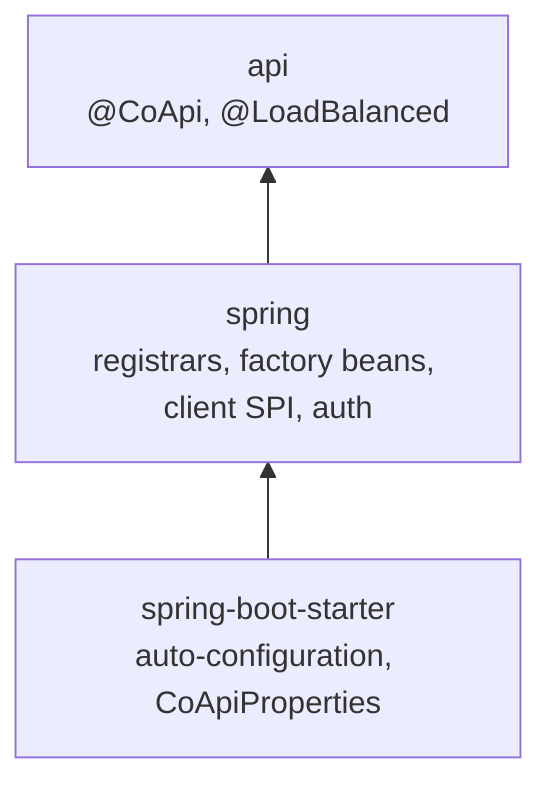
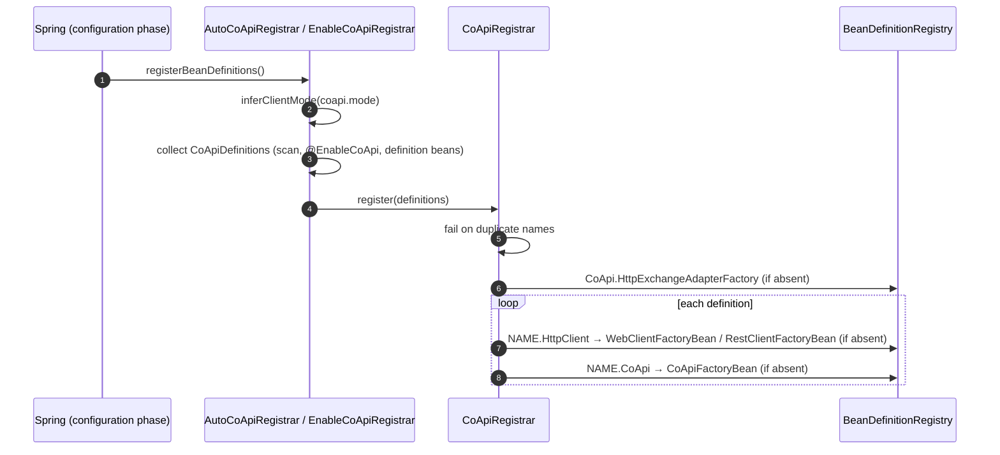

# 架构

本页面向修改 CoApi 本身的开发者。如果只是使用 CoApi，请从[快速入门](../getting-started/quick-start.md)开始。

## 模块

```mermaid
graph BT
    api["api<br>@CoApi, @LoadBalanced"]
    spring["spring<br>registrars, factory beans, client SPI, auth"]
    starter["spring-boot-starter<br>auto-configuration, CoApiProperties"]
    spring --> api
    starter --> spring
```

| 模块 | 依赖 | 负责 |
|------|------|------|
| `api` | `spring-context`（仅编译期） | 注解，仅此而已，使客户端模块保持轻量 |
| `spring` | `api`、`spring-web` | 所有不依赖 Spring Boot 的功能。可选特性变体：`reactiveSupport`（WebClient）、`lbSupport`（Spring Cloud Commons）、`jwtSupport`（java-jwt） |
| `spring-boot-starter` | `spring`、`spring-boot-starter` | classpath 扫描、`coapi.*` 绑定、收集 `CoApiDefinition` Bean。可选特性变体：`reactiveSupport`、`syncSupport` |
| `bom`、`dependencies` | | 对外发布的版本对齐，以及构建内部使用的版本平台 |

`spring` 中的可选依赖，正是负载均衡和响应式相关类只在需要时才被加载的原因。见[设计规则](#设计规则)。

## 注册流程

```mermaid
sequenceDiagram
    autonumber
    participant Boot as Spring (configuration phase)
    participant R as AutoCoApiRegistrar / EnableCoApiRegistrar
    participant CR as CoApiRegistrar
    participant Reg as BeanDefinitionRegistry
    Boot->>R: registerBeanDefinitions()
    R->>R: inferClientMode(coapi.mode)
    R->>R: collect CoApiDefinitions (scan, @EnableCoApi, definition beans)
    R->>CR: register(definitions)
    CR->>CR: fail on duplicate names
    CR->>Reg: CoApi.HttpExchangeAdapterFactory (if absent)
    loop each definition
        CR->>Reg: NAME.HttpClient → WebClientFactoryBean / RestClientFactoryBean (if absent)
        CR->>Reg: NAME.CoApi → CoApiFactoryBean (if absent)
    end
```

- `AbstractCoApiRegistrar` 是模板：子类只决定存在**哪些**定义，`CoApiRegistrar` 决定**如何**注册它们。
- `AutoCoApiRegistrar`（starter）扫描自动配置包和 `coapi.base-packages`，并使用应用的 Bean 类加载器加载类（这对 DevTools 很重要）。它还会收集静态的 `CoApiDefinition` Bean。由于它在 `CoApiProperties` 创建之前运行，所以直接用 `Binder` 绑定 `coapi.base-packages`。
- `EnableCoApiRegistrar`（spring）读取 `@EnableCoApi(clients)`。
- `CoApiDefinition.toCoApiDefinition()` 解析注解：名称、占位符解析、`serviceId` → `lb://`，然后执行 `normalize()`（`lb://` → `http://` + `loadBalanced`）。

## 每个客户端的 Bean 关系

运行时，代理首次被需要时：

1. `CoApiFactoryBean` 查找 `HttpExchangeAdapterFactory`：唯一的那个 Bean，否则取 `@Primary` 的，再否则取名为 `CoApi.HttpExchangeAdapterFactory` 的。
2. 适配器工厂获取 `<name>.HttpClient` Bean，从而触发 `WebClientFactoryBean` / `RestClientFactoryBean`：
   1. `effectiveDefinition()` = `ClientProperties.resolve(definition)` → `CoApiDefinition.withOverrides()`；
   2. Builder Bean → base URL → 配置的过滤器/拦截器（先名称后类型）→ 若 `loadBalanced` 则加负载均衡器 → 按顺序执行 `*BuilderCustomizer` Bean → `build()`。
3. 适配器包装客户端，`HttpServiceProxyFactory` 创建接口代理。

## 设计规则

这些规则是有意为之的，修改代码时请保持。

- **应用可以覆盖任何 Bean。** `CoApiRegistrar` 从不替换已存在的 Bean 定义。
- **每条规则只有一个归属。** URL 和负载均衡的优先级只在 `CoApiDefinition`（`normalize`、`withOverrides`）中实现。FactoryBean 和定制器使用生效定义，从不自行重新推导。
- **可选依赖保持可选。** Spring Cloud 类型只在 `internal` 的 `LoadBalanced*BuilderCustomizer` 中引用，而这些类只为负载均衡客户端加载。加载之前，`requireLoadBalancerSupport` 会把可能出现的 `NoClassDefFoundError` 转换为可操作的错误消息。
- **启动时快速失败**，消息中指明客户端和修复方法：非法模式、重复名称、无法解析的占位符、缺少负载均衡器、非静态 `CoApiDefinition` Bean。
- **通过组合扩展。** FactoryBean 是 final 的。行为通过定制器 Bean，以及可选的 `ClientProperties` / `ReactiveClientProperties` / `SyncClientProperties` 角色接口扩展，每个接口都有 `Empty` 兜底实现。

## 修改什么、改哪里

| 修改内容 | 文件 | 测试 |
|----------|------|------|
| URL / 负载均衡优先级 | `spring/.../CoApiDefinition.kt` | `CoApiDefinitionTest` |
| 客户端构建流程 | `spring/.../client/reactive/WebClientFactoryBean.kt`、`spring/.../client/sync/RestClientFactoryBean.kt`、`AbstractHttpClientFactoryBean.kt` | `WebClientFactoryBeanTest`、`RestClientFactoryBeanTest` |
| 模式选择 | `spring/.../ClientMode.kt` | `ClientModeTest` |
| Bean 注册 | `spring/.../CoApiRegistrar.kt` | `CoApiRegistrarTest`、`CoApiContextTest` |
| 扫描 / Boot 属性 | `spring-boot-starter/.../AutoCoApiRegistrar.kt`、`CoApiProperties.kt` | `CoApiAutoConfigurationTest`、`CoApiPropertiesTest` |
| 认证过滤器 | `spring/.../client/reactive/auth/` | `auth/*Test` |

流程、CI 门禁和发布步骤见 [CONTRIBUTING.md](https://github.com/Ahoo-Wang/CoApi/blob/main/CONTRIBUTING.md)。
