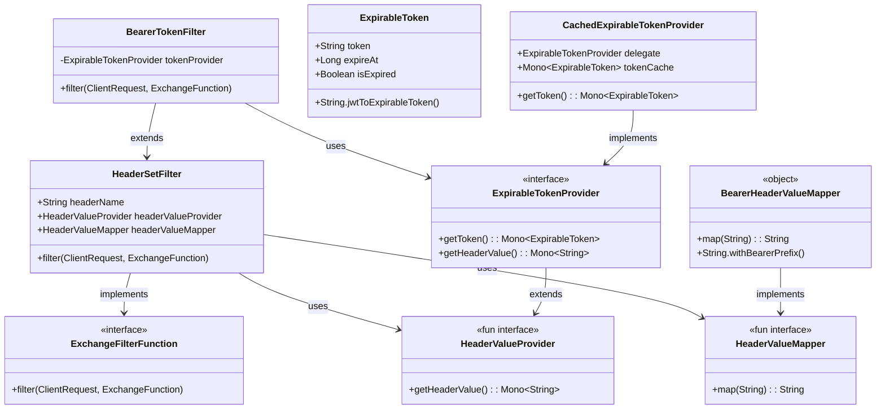
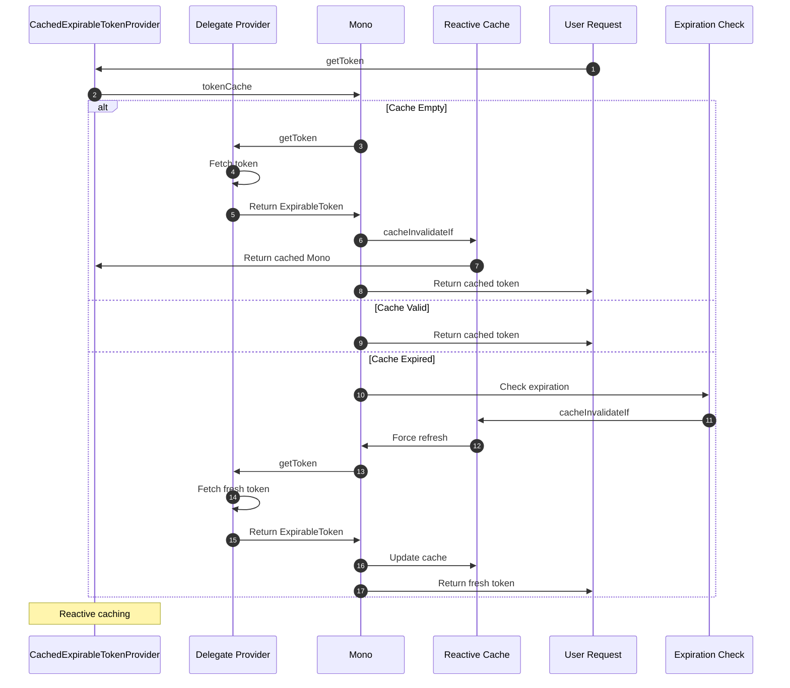
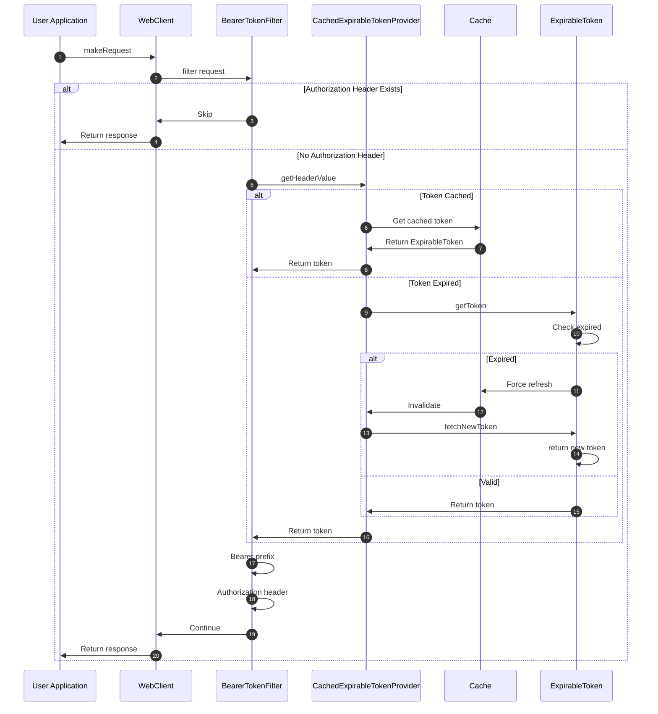
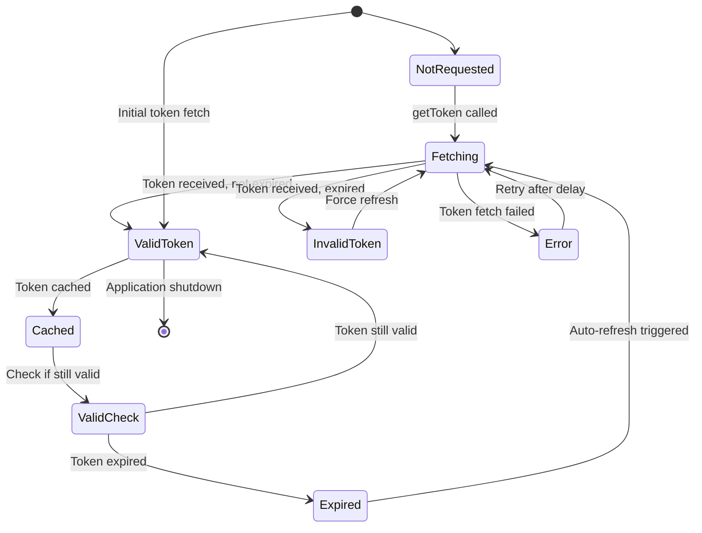

# 认证

CoApi 提供了一个健壮的认证系统，与 Spring WebFlux 响应式编程模型无缝集成。该认证框架支持基于令牌的认证，具有自动缓存和过期管理功能，确保与外部 API 的安全高效通信，同时保持类型安全和响应式原则。

## 概述

CoApi 中的认证系统旨在处理现代 API 认证的常见需求，特别是基于 JWT（JSON Web Token）的 Bearer 令牌认证。该框架提供了可复用的组件，可以轻松配置和组合以满足各种认证场景，从简单的静态令牌到具有自动刷新能力的复杂动态令牌提供者。

认证层全程利用 Spring WebFlux 的响应式编程模型，确保非阻塞操作和高效的资源利用。该架构遵循模块化设计，令牌提供者、头部映射器和请求过滤器之间职责分明。

## 概览一览

| 组件 | 职责 | 关键特性 | 来源 |
|----------|---------------|---------------|--------|
| `HeaderSetFilter` | 在请求上注入通用头部 | 可配置的头部名称、值提供者、映射器 | [HeaderSetFilter.kt:22](https://github.com/Ahoo-Wang/CoApi/blob/main/spring/src/main/kotlin/me/ahoo/coapi/spring/client/reactive/auth/HeaderSetFilter.kt#L22) |
| `BearerTokenFilter` | Authorization 头部注入 | Bearer 令牌前缀、令牌提供者集成 | [BearerTokenFilter.kt:18](https://github.com/Ahoo-Wang/CoApi/blob/main/spring/src/main/kotlin/me/ahoo/coapi/spring/client/reactive/auth/BearerTokenFilter.kt#L18) |
| `ExpirableToken` | 带过期信息的令牌 | JWT 过期检测、基于时间的验证 | [ExpirableToken.kt:19](https://github.com/Ahoo-Wang/CoApi/blob/main/spring/src/main/kotlin/me/ahoo/coapi/spring/client/reactive/auth/ExpirableTokenProvider.kt#L19) |
| `ExpirableTokenProvider` | 令牌提供者接口 | 响应式令牌获取、头部值映射 | [ExpirableTokenProvider.kt:33](https://github.com/Ahoo-Wang/CoApi/blob/main/spring/src/main/kotlin/me/ahoo/coapi/spring/client/reactive/auth/ExpirableTokenProvider.kt#L33) |
| `CachedExpirableTokenProvider` | 缓存令牌提供者 | 响应式缓存、自动过期失效 | [CachedExpirableTokenProvider.kt:19](https://github.com/Ahoo-Wang/CoApi/blob/main/spring/src/main/kotlin/me/ahoo/coapi/spring/client/reactive/auth/CachedExpirableTokenProvider.kt#L19) |

## 类层次结构

认证框架遵循清晰的继承层次结构，各组件职责分明：



## 令牌缓存流程

响应式缓存机制在保持线程安全和自动失效的同时，确保高效的令牌管理：



## 请求认证流程

完整的认证流程演示了 Bearer 令牌如何自动添加到 HTTP 请求中：



## JWT 过期检查状态图

令牌管理系统通过状态机方式处理 JWT 过期检查：



## 核心组件

### HeaderSetFilter

`HeaderSetFilter` 是一个通用的响应式过滤器，可以在 HTTP 请求上设置任意头部。它遵循 Spring WebFlux 的 `ExchangeFilterFunction` 接口，提供了将头部注入请求的灵活方式。

```kotlin
open class HeaderSetFilter(
    private val headerName: String,
    private val headerValueProvider: HeaderValueProvider,
    private val headerValueMapper: HeaderValueMapper = HeaderValueMapper.IDENTITY
) : ExchangeFilterFunction {
    override fun filter(request: ClientRequest, next: ExchangeFunction): Mono<ClientResponse> {
        if (request.headers().containsHeader(headerName)) {
            return next.exchange(request)
        }
        return headerValueProvider.getHeaderValue()
            .map { headerValue ->
                ClientRequest.from(request)
                    .headers { headers ->
                        headers[headerName] = headerValueMapper.map(headerValue)
                    }
                    .build()
            }
            .flatMap { next.exchange(it) }
    }
}
```

该过滤器首先检查请求中是否已存在该头部，以避免覆盖现有值。如果头部不存在，它从提供者获取头部值，使用配置的映射器进行映射，然后在继续下一个交换函数之前将其设置在请求上。

### BearerTokenFilter

`BearerTokenFilter` 是 `HeaderSetFilter` 的专门版本，专门处理 Bearer 令牌认证。它使用为 `Authorization` 头部和 Bearer 令牌前缀预配置的值扩展了基础过滤器。

```kotlin
class BearerTokenFilter(tokenProvider: ExpirableTokenProvider) :
    HeaderSetFilter(
        headerName = HttpHeaders.AUTHORIZATION,
        headerValueProvider = tokenProvider,
        headerValueMapper = BearerHeaderValueMapper
    )
```

`BearerHeaderValueMapper` 确保所有令牌值都根据 OAuth 2.0 Bearer 令牌规范添加 "Bearer " 前缀。

### ExpirableToken

`ExpirableToken` 数据类将令牌字符串与其过期时间戳包装在一起，提供了检查令牌是否过期的便捷方法。

```kotlin
data class ExpirableToken(val token: String, val expireAt: Long) {
    val isExpired: Boolean
        get() = System.currentTimeMillis() > expireAt

    companion object {
        private val jwtParser = JWT()
        fun String.jwtToExpirableToken(): ExpirableToken {
            val decodedJWT = jwtParser.decodeJwt(this)
            val expiresAt = checkNotNull(decodedJWT.expiresAt)
            return ExpirableToken(this, expiresAt.time)
        }
    }
}
```

伴生对象提供了一个便捷的扩展函数，通过解码 JWT 并提取过期时间戳，将 JWT 字符串转换为 `ExpirableToken` 实例。

### CachedExpirableTokenProvider

`CachedExpirableTokenProvider` 使用 Project Reactor 的 `Mono.cacheInvalidateIf` 操作符实现响应式缓存。这提供了线程安全的缓存，当令牌过期时自动失效。

```kotlin
class CachedExpirableTokenProvider(tokenProvider: ExpirableTokenProvider) : ExpirableTokenProvider {
    private val tokenCache: Mono<ExpirableToken> = tokenProvider.getToken()
        .cacheInvalidateIf {
            log.debug { "CacheInvalidateIf - isExpired:${it.isExpired}" }
            it.isExpired
        }

    override fun getToken(): Mono<ExpirableToken> {
        return tokenCache
    }
}
```

缓存在令牌过期时自动失效并刷新令牌，确保始终使用有效令牌，无需手动干预。

## 配置示例

### 基本 Bearer 令牌认证

```kotlin
@Configuration
class AuthenticationConfig {
    
    @Bean
    fun tokenProvider(): ExpirableTokenProvider {
        return object : ExpirableTokenProvider {
            override fun getToken(): Mono<ExpirableToken> {
                return Mono.just(
                    ExpirableToken(
                        token = "your.jwt.token",
                        expireAt = System.currentTimeMillis() + 3600000 // 1 hour
                    )
                )
            }
        }
    }
    
    @Bean
    fun authenticationFilter(): BearerTokenFilter {
        return BearerTokenFilter(tokenProvider())
    }
}
```

### 带 JWT 解码的动态令牌提供者

```kotlin
@Configuration
class DynamicAuthenticationConfig {
    
    @Bean
    fun jwtTokenProvider(): ExpirableTokenProvider {
        return object : ExpirableTokenProvider {
            override fun getToken(): Mono<ExpirableToken> {
                return Mono.fromCallable {
                    // Fetch token from external source (e.g., OAuth service)
                    val jwtToken = fetchTokenFromAuthService()
                    jwtToken.jwtToExpirableToken()
                }
            }
            
            private fun fetchTokenFromAuthService(): String {
                // Implementation to fetch JWT from authentication service
                return "dynamic.jwt.token"
            }
        }
    }
    
    @Bean
    fun cachedTokenProvider(): ExpirableTokenProvider {
        return CachedExpirableTokenProvider(jwtTokenProvider())
    }
}
```

### WebClient 集成

```kotlin
@Configuration
class WebClientConfig {
    
    @Bean
    fun webClient(builder: WebClient.Builder): WebClient {
        return builder
            .filter(authenticationFilter())
            .build()
    }
    
    @Bean
    fun authenticationFilter(): ExchangeFilterFunction {
        return BearerTokenFilter(cachedTokenProvider())
    }
}
```

## 交叉引用

- [快速入门](/zh/getting-started/index.md) - CoApi 基础介绍
- [客户端模式](/zh/deep-dive/client-modes.md) - 了解响应式与同步操作
- [Spring Boot 集成](/zh/deep-dive/auto-configuration.md) - Spring Boot 特定模式
- [配置参考](/zh/getting-started/configuration.md) - 完整配置指南
- [注解](/zh/deep-dive/annotations.md) - 基于注解的配置

## 参考文献

### 源代码文件

- [HeaderSetFilter.kt](https://github.com/Ahoo-Wang/CoApi/blob/main/spring/src/main/kotlin/me/ahoo/coapi/spring/client/reactive/auth/HeaderSetFilter.kt) - 通用头部注入过滤器
- [BearerTokenFilter.kt](https://github.com/Ahoo-Wang/CoApi/blob/main/spring/src/main/kotlin/me/ahoo/coapi/spring/client/reactive/auth/BearerTokenFilter.kt) - Bearer 令牌认证过滤器
- [ExpirableToken.kt](https://github.com/Ahoo-Wang/CoApi/blob/main/spring/src/main/kotlin/me/ahoo/coapi/spring/client/reactive/auth/ExpirableTokenProvider.kt) - 支持过期的令牌
- [CachedExpirableTokenProvider.kt](https://github.com/Ahoo-Wang/CoApi/blob/main/spring/src/main/kotlin/me/ahoo/coapi/spring/client/reactive/auth/CachedExpirableTokenProvider.kt) - 响应式缓存实现
- [BearerHeaderValueMapper.kt](https://github.com/Ahoo-Wang/CoApi/blob/main/spring/src/main/kotlin/me/ahoo/coapi/spring/client/reactive/auth/BearerTokenFilter.kt) - Bearer 令牌前缀映射

### 相关页面

- [客户端模式](/zh/deep-dive/client-modes.md) - 了解响应式与同步操作
- [配置参考](/zh/getting-started/configuration.md) - 完整配置指南
- [Spring Boot 集成](/zh/deep-dive/auto-configuration.md) - Spring Boot 特定模式
- [负载均衡](/zh/deep-dive/load-balancing.md) - 负载均衡集成
- [架构概览](/zh/deep-dive/architecture.md) - 系统架构与设计
