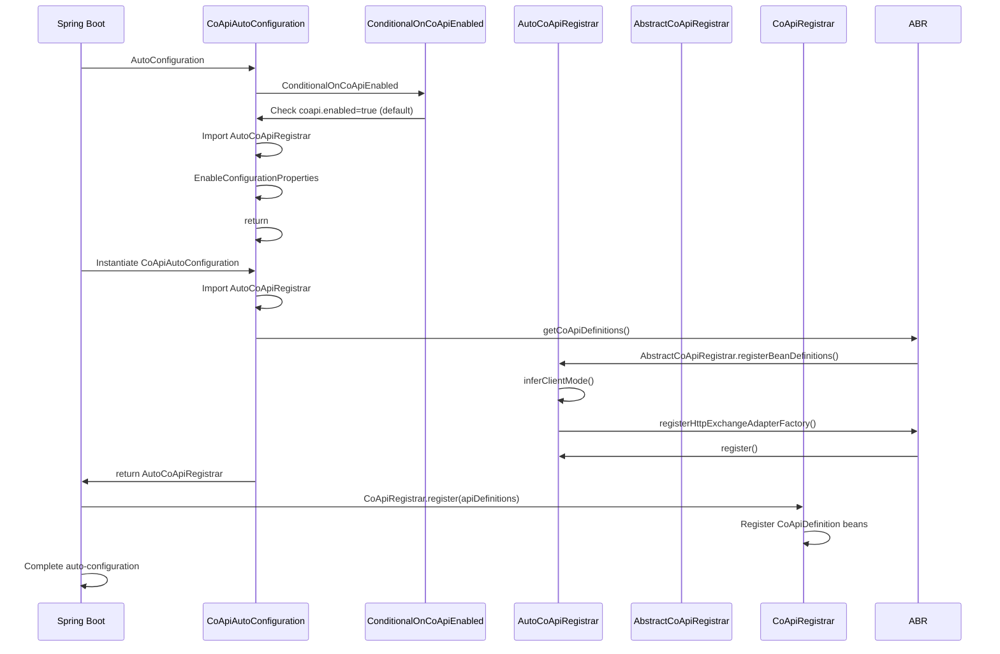
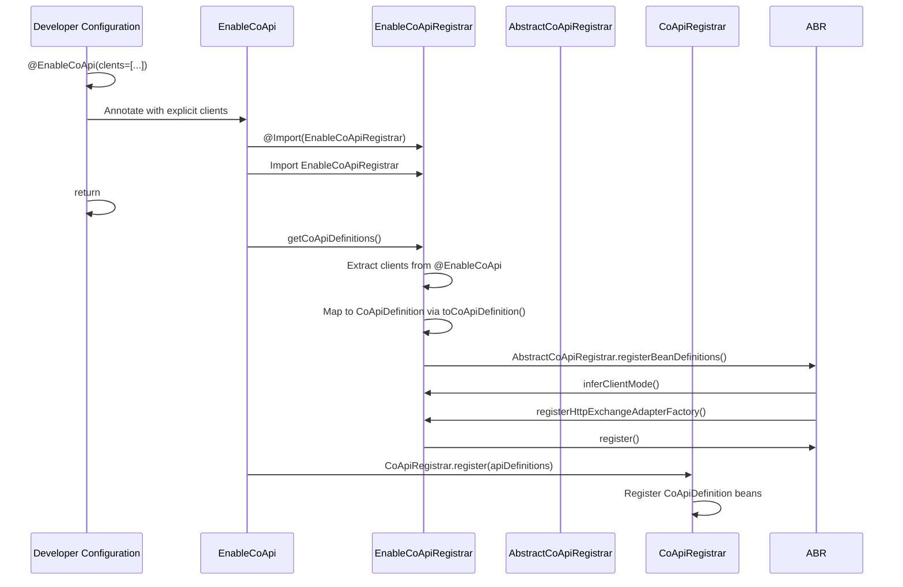
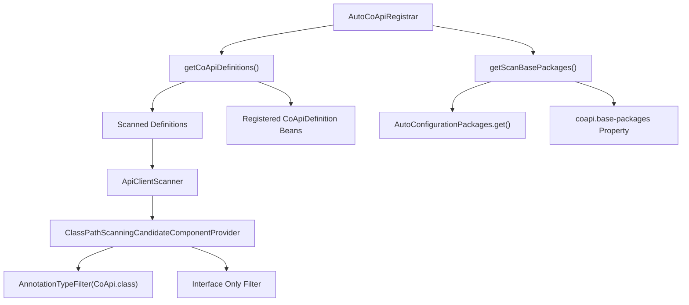
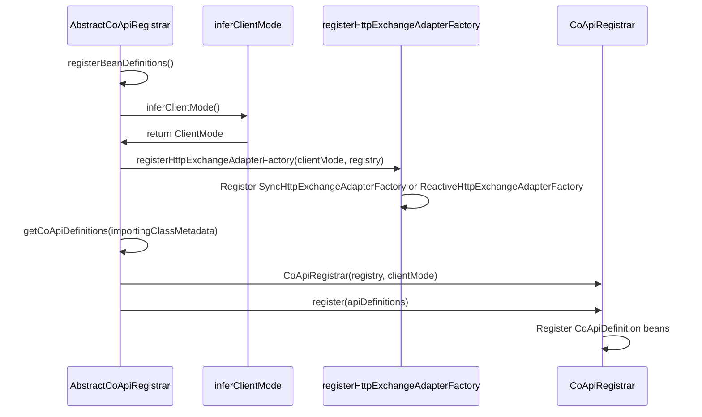
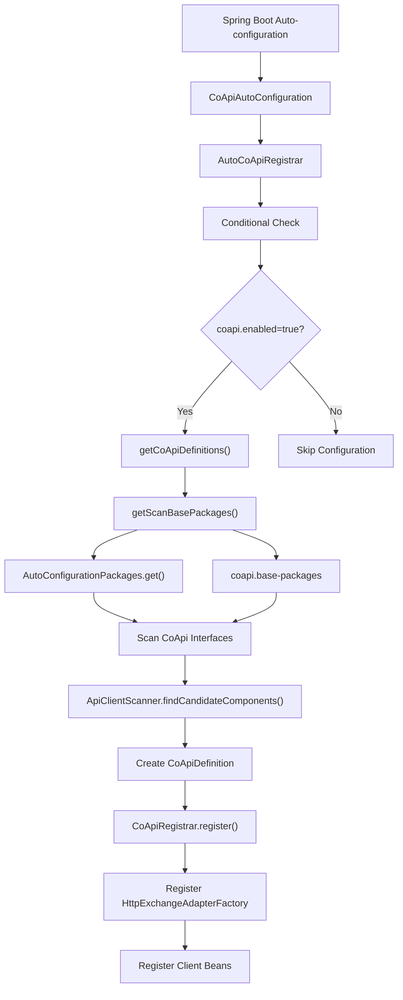

# 自动配置

CoApi 提供了全面的 Spring Boot 自动配置，在保持灵活性以支持自定义配置的同时简化了设置过程。该框架支持两种不同的激活路径，以适应不同的使用场景和开发偏好。

## 概述

CoApi 的自动配置系统旨在基于类路径扫描和显式配置自动检测和配置 CoApi 客户端。该系统利用 Spring Boot 的条件配置机制，确保 CoApi 组件仅在需要时注册，提供无缝的集成体验。

自动配置围绕模块化架构构建，将自动扫描与手动配置选项相结合，允许开发者选择最适合其应用架构的方式。

## 概览一览

| 特性 | 自动配置 | 手动配置 |
|---------|-------------------|---------------------|
| **激活方式** | Spring Boot 自动配置 | `@EnableCoApi` 注解 |
| **扫描方式** | 自动类路径扫描 | 显式客户端指定 |
| **基础包** | `@SpringBootApplication` + `coapi.base-packages` | 注解属性 |
| **灵活性** | 高（扫描 + 注册 Bean 结合） | 中（显式控制） |
| **设置复杂度** | 低（零配置） | 低（最少注解设置） |

## 激活路径

### 自动（Spring Boot）配置路径



### 手动配置路径



## 自动配置组件

### CoApiAutoConfiguration

主自动配置类，协调整个设置过程：

```kotlin
@AutoConfiguration
@ConditionalOnCoApiEnabled
@Import(AutoCoApiRegistrar::class)
@EnableConfigurationProperties(CoApiProperties::class)
class CoApiAutoConfiguration
```

该类作为自动配置的入口点，将实际注册委托给专门的组件。

[`spring-boot-starter/src/main/kotlin/me/ahoo/coapi/spring/boot/starter/CoApiAutoConfiguration.kt:20`](https://github.com/Ahoo-Wang/CoApi/blob/main/spring-boot-starter/src/main/kotlin/me/ahoo/coapi/spring/boot/starter/CoApiAutoConfiguration.kt#L20)

### ConditionalOnCoApiEnabled

控制是否启用 CoApi 自动配置：

```kotlin
@ConditionalOnProperty(
    value = [ConditionalOnCoApiEnabled.ENABLED_KEY],
    matchIfMissing = true,
    havingValue = "true",
)
annotation class ConditionalOnCoApiEnabled {
    companion object {
        const val ENABLED_KEY: String = COAPI_PREFIX + ENABLED_SUFFIX_KEY
    }
}
```

该配置默认启用，可通过在应用属性中设置 `coapi.enabled=false` 来禁用。

[`spring-boot-starter/src/main/kotlin/me/ahoo/coapi/spring/boot/starter/ConditionalOnCoApiEnabled.kt:18`](https://github.com/Ahoo-Wang/CoApi/blob/main/spring-boot-starter/src/main/kotlin/me/ahoo/coapi/spring/boot/starter/ConditionalOnCoApiEnabled.kt#L18)

### AutoCoApiRegistrar

处理 CoApi 客户端的自动扫描和注册：



注册器将自动扫描的接口定义与任何显式注册的 `CoApiDefinition` Bean 结合在一起。

```kotlin
private fun getScanBasePackages(): Set<String> {
    val coApiBasePackages = getCoApiBasePackages()
    if (AutoConfigurationPackages.has(appContext).not()) {
        return coApiBasePackages
    }
    return AutoConfigurationPackages.get(appContext).toSet() + coApiBasePackages
}
```

[`spring-boot-starter/src/main/kotlin/me/ahoo/coapi/spring/boot/starter/AutoCoApiRegistrar.kt:48`](https://github.com/Ahoo-Wang/CoApi/blob/main/spring-boot-starter/src/main/kotlin/me/ahoo/coapi/spring/boot/starter/AutoCoApiRegistrar.kt#L48)

### EnableCoApiRegistrar

处理通过 `@EnableCoApi` 注解进行的手动配置：

```kotlin
@Suppress("UNCHECKED_CAST")
override fun getCoApiDefinitions(importingClassMetadata: AnnotationMetadata): Set<CoApiDefinition> {
    val enableCoApi =
        importingClassMetadata.getAnnotationAttributes(EnableCoApi::class.java.name) ?: return emptySet()
    val clients = enableCoApi[EnableCoApi::clients.name] as Array<Class<*>>
    return clients.map { clientType ->
        clientType.toCoApiDefinition(env)
    }.toSet()
}
```

[`spring/src/main/kotlin/me/ahoo/coapi/spring/EnableCoApiRegistrar.kt:22`](https://github.com/Ahoo-Wang/CoApi/blob/main/spring/src/main/kotlin/me/ahoo/coapi/spring/EnableCoApiRegistrar.kt#L22)

### AbstractCoApiRegistrar

提供 Bean 注册的模板方法模式：



该抽象类实现了 Spring 的 `ImportBeanDefinitionRegistrar` 接口，为 Bean 注册提供了结构化的方法。

```kotlin
override fun registerBeanDefinitions(importingClassMetadata: AnnotationMetadata, registry: BeanDefinitionRegistry) {
    val clientMode = inferClientMode {
        env.getProperty(it)
    }
    registerHttpExchangeAdapterFactory(clientMode, registry)
    val coApiRegistrar = CoApiRegistrar(registry, clientMode)
    val apiDefinitions = getCoApiDefinitions(importingClassMetadata)
    coApiRegistrar.register(apiDefinitions)
}
```

[`spring/src/main/kotlin/me/ahoo/coapi/spring/AbstractCoApiRegistrar.kt:42`](https://github.com/Ahoo-Wang/CoApi/blob/main/spring/src/main/kotlin/me/ahoo/coapi/spring/AbstractCoApiRegistrar.kt#L42)

## 类路径扫描过程

自动扫描过程使用专门的组件扫描器来查找带有 `@CoApi` 注解的接口：

```kotlin
class ApiClientScanner(useDefaultFilters: Boolean, environment: Environment) :
    ClassPathScanningCandidateComponentProvider(useDefaultFilters, environment) {
    init {
        addIncludeFilter(AnnotationTypeFilter(CoApi::class.java))
    }

    override fun isCandidateComponent(beanDefinition: AnnotatedBeanDefinition): Boolean {
        return beanDefinition.metadata.isInterface
    }
}
```

[`spring-boot-starter/src/main/kotlin/me/ahoo/coapi/spring/boot/starter/AutoCoApiRegistrar.kt:72`](https://github.com/Ahoo-Wang/CoApi/blob/main/spring-boot-starter/src/main/kotlin/me/ahoo/coapi/spring/boot/starter/AutoCoApiRegistrar.kt#L72)

扫描过程结合了多个基础包来源：

1. **Spring Boot 自动配置包**：从主应用类自动检测
2. **CoApi 特定包**：通过 `coapi.base-packages` 属性配置
3. **支持单字符串和数组表示法**：
   - 单个包：`coapi.base-packages=com.example.clients`
   - 多个包：`coapi.base-packages[0]=com.example.clients,coapi.base-packages[1]=com.example.external`

## Bean 注册序列



## 配置属性

自动配置通过 `CoApiProperties` 支持多个属性：

| 属性 | 默认值 | 描述 |
|----------|---------|-------------|
| `coapi.enabled` | `true` | 启用/禁用 CoApi 自动配置 |
| `coapi.base-packages` | （空） | 以逗号分隔的基础包列表用于扫描 |
| `coapi.client-mode` | `reactive` | 客户端模式：`sync` 或 `reactive` |

## Spring Boot 自动配置注册

自动配置在 Spring Boot 自动配置元数据中注册：

```properties
# META-INF/spring/org.springframework.boot.autoconfigure.AutoConfiguration.imports
me.ahoo.coapi.spring.boot.starter.CoApiAutoConfiguration
```

[`spring-boot-starter/src/main/resources/META-INF/spring/org.springframework.boot.autoconfigure.AutoConfiguration.imports:1`](https://github.com/Ahoo-Wang/CoApi/blob/main/spring-boot-starter/src/main/resources/META-INF/spring/org.springframework.boot.autoconfigure.AutoConfiguration.imports#L1)

这确保当 starter 依赖存在于类路径中时，Spring Boot 会自动发现并包含 CoApi 自动配置。

## 参考文献

1. [Spring Boot 自动配置文档](https://docs.spring.io/spring-boot/docs/current/reference/htmlsingle/#boot-features-auto-configuration)
2. [Spring Boot @Conditional 注解](https://docs.spring.io/spring-boot/docs/current/reference/htmlsingle/#boot-features-conditional-on-property)
3. [Spring ClassPathScanningCandidateComponentProvider](https://docs.spring.io/spring-framework/docs/current/javadoc-api/org/springframework/context/annotation/ClassPathScanningCandidateComponentProvider.html)
4. [Spring ImportBeanDefinitionRegistrar 接口](https://docs.spring.io/spring-framework/docs/current/javadoc-api/org/springframework/context/annotation/ImportBeanDefinitionRegistrar.html)
5. [CoApi @EnableCoApi 注解](/zh/deep-dive/annotations.md)
6. [CoApi 客户端配置](/zh/deep-dive/customization.md)

## 相关页面

- [客户端配置](/zh/deep-dive/customization.md)
- [Api 注解](/zh/deep-dive/annotations.md) - 使用 @CoApi 注解
- [属性配置](/zh/getting-started/configuration.md) - CoApi 属性配置
- [Spring 集成](/zh/deep-dive/auto-configuration.md) - 高级 Spring 集成模式
