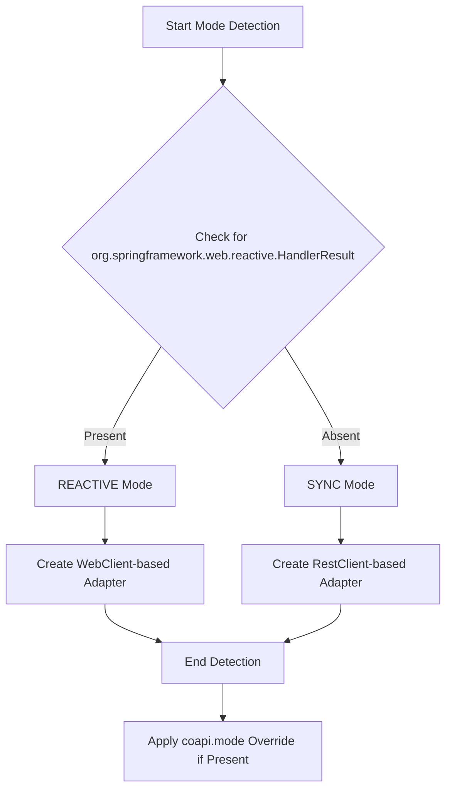
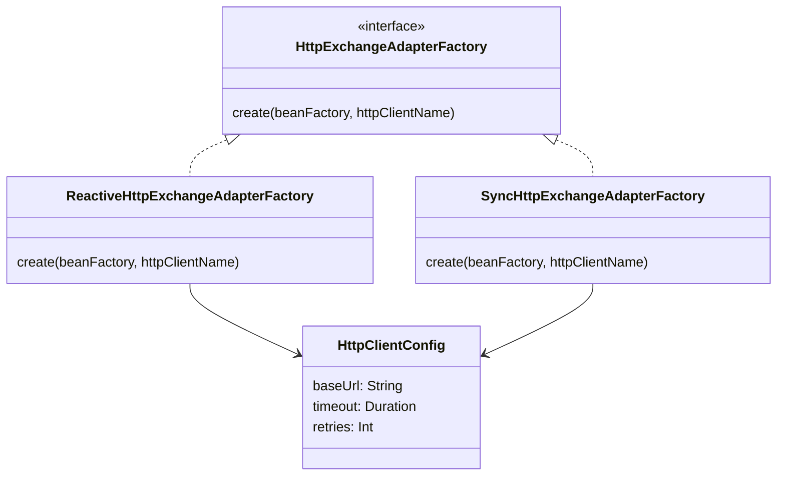
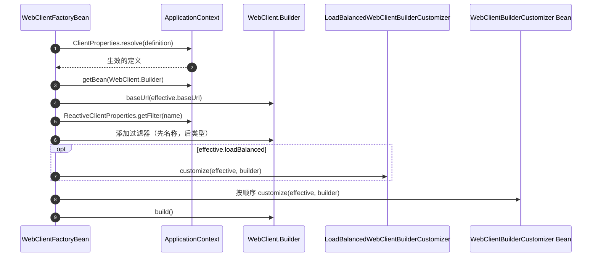
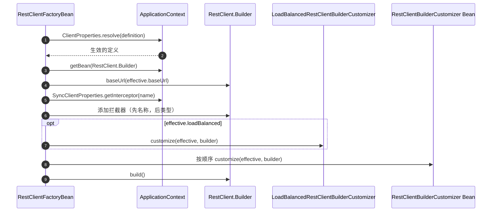
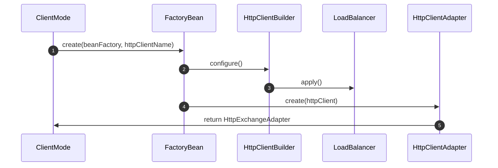

# 客户端模式

CoApi 提供了灵活的客户端模式，以支持不同的编程范式和性能需求。框架会根据类路径自动检测合适的模式，也支持显式配置。

## 概述

ClientMode 决定了 CoApi 应用中 HTTP 请求的执行和管理方式。框架支持三种模式：

- **REACTIVE（响应式）**：基于 WebClient 的异步、非阻塞 HTTP 请求
- **SYNC（同步）**：基于 RestClient 的同步、阻塞 HTTP 请求
- **AUTO（自动）**：基于类路径检测的智能模式推断

AUTO 模式是默认行为，它会适应可用的 Spring Web 依赖，非常适合需要在不同环境中工作而无需手动配置的应用程序。

## 一览

| 模式 | HTTP 客户端 | 类型 | 依赖 | 性能 |
|------|-------------|------|------|------|
| REACTIVE | WebClient | 异步 | spring-boot-webclient | 高吞吐量 |
| SYNC | RestClient | 同步 | spring-boot-web | 低延迟 |
| AUTO | WebClient/RestClient | 混合 | 两者 | 视情况而定 |

## 模式检测逻辑

AUTO 模式使用智能检测来根据可用依赖确定合适的客户端类型：



### 检测流程

AUTO 模式检测在 [ClientMode.kt](https://github.com/Ahoo-Wang/CoApi/blob/main/spring/src/main/kotlin/me/ahoo/coapi/spring/ClientMode.kt) 中实现：

```kotlin
enum class ClientMode {
    REACTIVE, SYNC, AUTO;

    companion object {
        fun detect(): ClientMode {
            return try {
                Class.forName("org.springframework.web.reactive.HandlerResult")
                REACTIVE
            } catch (e: ClassNotFoundException) {
                SYNC
            }
        }
    }
}
```

## 架构概述

客户端模式架构遵循 SPI（服务提供者接口）模式，包含工厂适配器：



HttpExchangeAdapterFactory 接口提供了一种统一的方式来创建 HTTP 交换适配器，无论底层客户端实现如何：

```kotlin
// spring/src/main/kotlin/me/ahoo/coapi/spring/HttpExchangeAdapterFactory.kt
interface HttpExchangeAdapterFactory {
    fun create(beanFactory: BeanFactory, httpClientName: String): HttpExchangeAdapter
}
```

## 响应式堆栈实现

响应式堆栈通过 [WebClientFactoryBean](https://github.com/Ahoo-Wang/CoApi/blob/main/spring/src/main/kotlin/me/ahoo/coapi/spring/client/reactive/WebClientFactoryBean.kt#L30) 为每个 CoApi 客户端构建一个 `WebClient`：


<!-- Sources: spring/src/main/kotlin/me/ahoo/coapi/spring/client/reactive/WebClientFactoryBean.kt:32-45 -->

## 同步堆栈实现

同步堆栈通过 [RestClientFactoryBean](https://github.com/Ahoo-Wang/CoApi/blob/main/spring/src/main/kotlin/me/ahoo/coapi/spring/client/sync/RestClientFactoryBean.kt#L30) 为每个 CoApi 客户端构建一个 `RestClient`：


<!-- Sources: spring/src/main/kotlin/me/ahoo/coapi/spring/client/sync/RestClientFactoryBean.kt:32-50 -->

### 工厂 Bean 结构

自 v3.0.0 起，每种客户端只有一个扁平的工厂 Bean：

- **[AbstractHttpClientFactoryBean](https://github.com/Ahoo-Wang/CoApi/blob/main/spring/src/main/kotlin/me/ahoo/coapi/spring/client/AbstractHttpClientFactoryBean.kt#L29)**——共享的基础逻辑：解析生效的定义（`ClientProperties` 可选）、解析过滤器/拦截器 Bean、收集有序的定制器 Bean；负载均衡的客户端缺少 Spring Cloud LoadBalancer 时立即失败。
- **`WebClientFactoryBean`** / **`RestClientFactoryBean`**——final 类，按上图顺序构建客户端。
- **`LoadBalancedWebClientBuilderCustomizer`** / **`LoadBalancedRestClientBuilderCustomizer`**——内部类，只作用于负载均衡的客户端（见[负载均衡](./load-balancing.md)）。

两个工厂 Bean 都要求按类型恰好能解析出一个 `WebClient.Builder` / `RestClient.Builder` Bean。扩展客户端请注册 `WebClientBuilderCustomizer` / `RestClientBuilderCustomizer` Bean（见[自定义配置](./customization.md)），工厂 Bean 不是为继承而设计的。

## 适配器创建

响应式和同步堆栈都实现各自的工厂适配器：



工厂适配器创建相应的适配器：

```kotlin
// spring/src/main/kotlin/me/ahoo/coapi/spring/client/reactive/ReactiveHttpExchangeAdapterFactory.kt
class ReactiveHttpExchangeAdapterFactory : HttpExchangeAdapterFactory {
    override fun create(beanFactory: BeanFactory, httpClientName: String): HttpExchangeAdapter {
        val webClient = WebClientFactoryBean().create(beanFactory, httpClientName)
        return WebClientAdapter.create(webClient)
    }
}

// spring/src/main/kotlin/me/ahoo/coapi/spring/client/sync/SyncHttpExchangeAdapterFactory.kt
class SyncHttpExchangeAdapterFactory : HttpExchangeAdapterFactory {
    override fun create(beanFactory: BeanFactory, httpClientName: String): HttpExchangeAdapter {
        val restClient = RestClientFactoryBean().create(beanFactory, httpClientName)
        return RestClientAdapter.create(restClient)
    }
}
```

## 配置属性

CoApi 通过属性支持全面配置：

```properties
# 客户端模式（AUTO、REACTIVE、SYNC）；自 v2.2.0 起，非法值会在启动期报错，
# 消息中包含非法值与合法选项列表
coapi.mode=auto

# 启用/禁用 CoApi 自动配置
coapi.enabled=true

# 额外扫描 @CoApi 接口的包（逗号分隔或索引形式）
coapi.base-packages=com.example.clients

# 每客户端覆盖配置 - 完整属性见配置参考页
coapi.clients.MyApiClient.base-url=https://api.example.com
coapi.clients.MyApiClient.load-balanced=false
```

## 特性变体

Gradle 特性变体支持选择性依赖包含：

```kotlin
// spring/build.gradle.kts
features {
    reactiveSupport {
        usingSourceSet(sourceSets.getByName("main"))
        api("org.springframework.boot:spring-boot-starter-webflux")
    }
    lbSupport {
        usingSourceSet(sourceSets.getByName("main"))
        api("org.springframework.cloud:spring-cloud-starter-loadbalancer")
    }
    jwtSupport {
        usingSourceSet(sourceSets.getByName("main"))
        api("io.jsonwebtoken:jjwt-api:0.11.5")
    }
}
```

### 可用特性

- **reactiveSupport**：使用 `spring-boot-webclient` 启用基于 WebClient 的响应式客户端
- **lbSupport**：使用 `spring-cloud-commons` 添加负载均衡器支持
- **jwtSupport**：使用 `java.jwt` 包含 JWT 认证支持

## 性能特性

### 响应式模式优势

- **高吞吐量**：非阻塞 I/O 可处理数千个并发连接
- **资源效率**：高负载下线程使用最少
- **背压支持**：内置响应式流流量控制
- **响应式生态系统集成**：与 Project Reactor、RxJava 无缝集成

### 同步模式优势

- **低延迟**：简单用例的直接阻塞 I/O
- **简单性**：传统编程模型
- **更好的调试**：直接的堆栈跟踪
- **更低的学习曲线**：大多数 Java 开发人员熟悉

## 模式间迁移

由于适配器模式，模式间迁移非常简单：

1. **从 SYNC 切换到 REACTIVE**：
   - 添加 `spring-boot-starter-webflux` 依赖
   - 如有需要，更新客户端配置
   - 应用逻辑无需代码更改

2. **从 REACTIVE 切换到 SYNC**：
   - 移除 `spring-boot-starter-webflux`
   - 添加 `spring-boot-starter-web`（如果尚未存在）
   - 应用逻辑无需代码更改

3. **使用 AUTO 模式以获得兼容性**：
   - 适用于两种依赖集
   - 自动选择合适的模式
   - 最适合库和多环境应用程序

## 最佳实践

### 模式选择指南

- **选择 REACTIVE 当**：
  - 构建高吞吐量微服务
  - 使用响应式数据库（R2DBC）
  - 需要处理数千个并发连接
  - 与响应式 API 集成

- **选择 SYNC 当**：
  - 构建简单的 CRUD 应用程序
  - 需要最大请求性能
  - 使用同步数据库（JDBC）
  - 开发传统 Web 应用程序

- **选择 AUTO 当**：
  - 构建需要广泛兼容性的库
  - 在不同部署环境中工作
  - 希望避免依赖冲突
  - 需要同时支持响应式和同步消费者

### 配置技巧

- 生产环境始终指定超时
- 分布式系统使用负载均衡器功能
- 为不可靠服务实现重试策略
- 启用日志记录以便调试 HTTP 交互
- 使用连接池以获得更好的性能

## 参考资料

1. [ClientMode.kt](https://github.com/Ahoo-Wang/CoApi/blob/main/spring/src/main/kotlin/me/ahoo/coapi/spring/ClientMode.kt) - 客户端模式检测和枚举定义
2. [HttpExchangeAdapterFactory.kt](https://github.com/Ahoo-Wang/CoApi/blob/main/spring/src/main/kotlin/me/ahoo/coapi/spring/HttpExchangeAdapterFactory.kt) - 适配器工厂的 SPI 接口
3. [ReactiveHttpExchangeAdapterFactory.kt](https://github.com/Ahoo-Wang/CoApi/blob/main/spring/src/main/kotlin/me/ahoo/coapi/spring/client/reactive/ReactiveHttpExchangeAdapterFactory.kt) - WebClient 适配器工厂实现
4. [WebClientFactoryBean.kt](https://github.com/Ahoo-Wang/CoApi/blob/main/spring/src/main/kotlin/me/ahoo/coapi/spring/client/reactive/WebClientFactoryBean.kt) - WebClient 配置基类
5. [RestClientFactoryBean.kt](https://github.com/Ahoo-Wang/CoApi/blob/main/spring/src/main/kotlin/me/ahoo/coapi/spring/client/sync/RestClientFactoryBean.kt) - RestClient 配置基类
6. [Spring build.gradle.kts](https://github.com/Ahoo-Wang/CoApi/blob/main/spring/build.gradle.kts) - Gradle 特性变体配置

## 相关页面

- [HTTP 客户端配置](/zh/getting-started/configuration.md) - 详细的配置选项和属性
- [负载均衡](/zh/deep-dive/load-balancing.md) - 负载均衡器集成和配置
- [重试机制](/zh/deep-dive/client-modes.md) - 重试策略和退避算法
- [认证](/zh/deep-dive/authentication.md) - JWT 和其他认证方法
- [监控](/zh/deep-dive/client-modes.md) - HTTP 客户端的指标和日志记录
