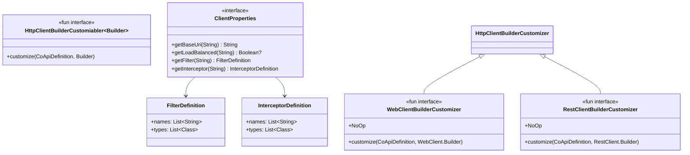
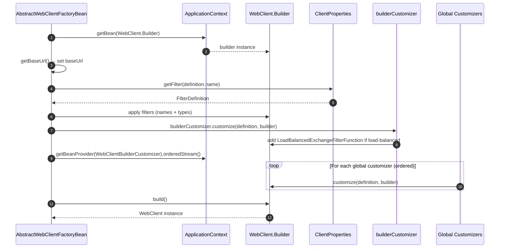
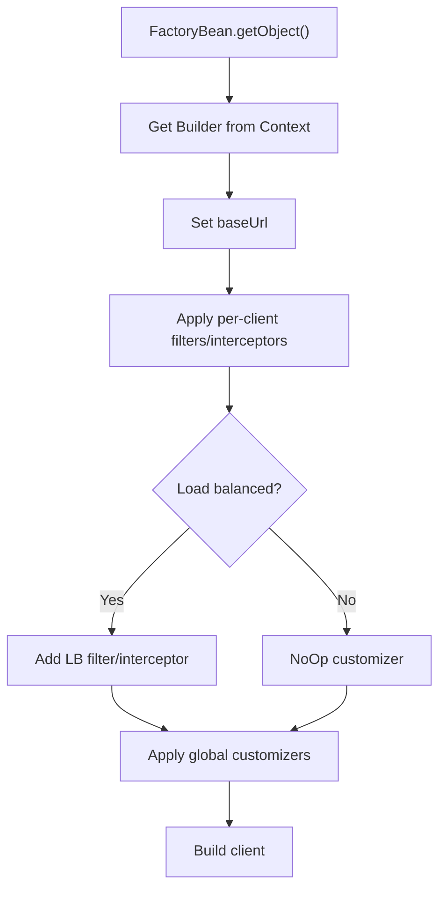

# 自定义和扩展

## 概述

CoApi 的 HTTP 客户端不是黑盒。该库公开了分层自定义 SPI，允许在三个时间点拦截和修改客户端构建器：（1）用于过滤器和拦截器的每客户端 YAML 配置，（2）用于负载均衡和协议特定调整的每类型构建器自定义器，（3）应用于所有客户端的全局自定义器 bean。这种设计意味着通用关注点（连接池、指标、追踪）可以全局应用，而特定于客户端的覆盖（认证头、超时）可以针对各个接口。

## 一览

| 自定义点 | 接口 | 范围 | 关键文件 | 来源 |
|---------------------|-----------|-------|----------|--------|
| 基础 SPI | `HttpClientBuilderCustomizer<Builder>` | 所有客户端 | [HttpClientBuilderCustomizer.kt](https://github.com/Ahoo-Wang/CoApi/blob/main/spring/src/main/kotlin/me/ahoo/coapi/spring/client/HttpClientBuilderCustomizer.kt) | [spring/.../HttpClientBuilderCustomizer.kt:18](https://github.com/Ahoo-Wang/CoApi/blob/main/spring/src/main/kotlin/me/ahoo/coapi/spring/client/HttpClientBuilderCustomizer.kt#L18) |
| 响应式自定义器 | `WebClientBuilderCustomizer` | WebClient 客户端 | [WebClientBuilderCustomizer.kt](https://github.com/Ahoo-Wang/CoApi/blob/main/spring/src/main/kotlin/me/ahoo/coapi/spring/client/reactive/WebClientBuilderCustomizer.kt) | [spring/.../WebClientBuilderCustomizer.kt:20](https://github.com/Ahoo-Wang/CoApi/blob/main/spring/src/main/kotlin/me/ahoo/coapi/spring/client/reactive/WebClientBuilderCustomizer.kt#L20) |
| 同步自定义器 | `RestClientBuilderCustomizer` | RestClient 客户端 | [RestClientBuilderCustomizer.kt](https://github.com/Ahoo-Wang/CoApi/blob/main/spring/src/main/kotlin/me/ahoo/coapi/spring/client/sync/RestClientBuilderCustomizer.kt) | [spring/.../RestClientBuilderCustomizer.kt:20](https://github.com/Ahoo-Wang/CoApi/blob/main/spring/src/main/kotlin/me/ahoo/coapi/spring/client/sync/RestClientBuilderCustomizer.kt#L20) |
| 每客户端配置 | `ClientProperties` | 各个客户端 | [ClientProperties.kt](https://github.com/Ahoo-Wang/CoApi/blob/main/spring/src/main/kotlin/me/ahoo/coapi/spring/client/ClientProperties.kt) | [spring/.../ClientProperties.kt:19](https://github.com/Ahoo-Wang/CoApi/blob/main/spring/src/main/kotlin/me/ahoo/coapi/spring/client/ClientProperties.kt#L19) |
| 每客户端过滤器 | `FilterDefinition` / `InterceptorDefinition` | 各个客户端 | [ClientProperties.kt](https://github.com/Ahoo-Wang/CoApi/blob/main/spring/src/main/kotlin/me/ahoo/coapi/spring/client/ClientProperties.kt) | [spring/.../ClientProperties.kt:25](https://github.com/Ahoo-Wang/CoApi/blob/main/spring/src/main/kotlin/me/ahoo/coapi/spring/client/ClientProperties.kt#L25) |

## 自定义器类层次结构


<!-- Sources: spring/src/main/kotlin/me/ahoo/coapi/spring/client/HttpClientBuilderCustomizer.kt:18, spring/src/main/kotlin/me/ahoo/coapi/spring/client/reactive/WebClientBuilderCustomizer.kt:20, spring/src/main/kotlin/me/ahoo/coapi/spring/client/sync/RestClientBuilderCustomizer.kt:20, spring/src/main/kotlin/me/ahoo/coapi/spring/client/ClientProperties.kt:19 -->

## 自定义器调用顺序

创建 `WebClient` 或 `RestClient` bean 时，自定义器按严格顺序应用：


<!-- Sources: spring/src/main/kotlin/me/ahoo/coapi/spring/client/reactive/AbstractWebClientFactoryBean.kt:38-54, spring/src/main/kotlin/me/ahoo/coapi/spring/client/reactive/WebClientFactoryBean.kt:30-43 -->

[AbstractWebClientFactoryBean.getObject()](https://github.com/Ahoo-Wang/CoApi/blob/main/spring/src/main/kotlin/me/ahoo/coapi/spring/client/reactive/AbstractWebClientFactoryBean.kt#L38) 中的调用顺序：

| 顺序 | 步骤 | 内容 | 可配置？ |
|-------|------|------|---------------|
| 1 | 获取构建器 | 从 ApplicationContext 获取 `WebClient.Builder` | 否 |
| 2 | 设置基础 URL | `getBaseUrl()` — 属性覆盖注解 | 通过 `coapi.clients.<name>.base-url` |
| 3 | 应用过滤器 | 来自 `ClientProperties` 的 `FilterDefinition` | 通过 YAML |
| 4 | 每类型自定义器 | 负载均衡过滤器或 `NoOp` | 自动 |
| 5 | 全局自定义器 | 所有 `WebClientBuilderCustomizer` bean，按顺序 | 注册为 Spring bean |

## 自定义器决策流程


<!-- Sources: spring/src/main/kotlin/me/ahoo/coapi/spring/client/reactive/AbstractWebClientFactoryBean.kt:38-54, spring/src/main/kotlin/me/ahoo/coapi/spring/client/sync/AbstractRestClientFactoryBean.kt:34-56 -->

## 每客户端过滤器配置

过滤器和拦截器通过 YAML 属性按客户端配置。`ClientProperties` 接口提供类型化访问：

**响应式（WebClient）过滤器：**
```yaml
coapi:
  clients:
    MyApiClient:
      reactive:
        filter:
          names:
            - myAuthFilter
          types:
            - com.example.LoggingExchangeFilterFunction
```

**同步（RestClient）拦截器：**
```yaml
coapi:
  clients:
    MyApiClient:
      sync:
        interceptor:
          names:
            - myAuthInterceptor
          types:
            - com.example.LoggingInterceptor
```

[AbstractWebClientFactoryBean](https://github.com/Ahoo-Wang/CoApi/blob/main/spring/src/main/kotlin/me/ahoo/coapi/spring/client/reactive/AbstractWebClientFactoryBean.kt) 中的过滤器解析：
- **names** → 按名称从 `ApplicationContext` 解析为 bean
- **types** → 按类类型从 `ApplicationContext` 解析为 bean

## 示例：连接池自定义器

消费者服务器中的一个真实示例演示了每客户端连接池：

```kotlin
@Service
class ConsumerWebClientBuilderCustomizer : WebClientBuilderCustomizer {
    override fun customize(
        coApiDefinition: CoApiDefinition,
        builder: WebClient.Builder
    ) {
        val connectionProvider = ConnectionProvider.builder(coApiDefinition.name)
            .maxConnections(500)
            .maxIdleTime(Duration.ofSeconds(20))
            .maxLifeTime(Duration.ofSeconds(60))
            .pendingAcquireTimeout(Duration.ofSeconds(60))
            .evictInBackground(Duration.ofSeconds(120))
            .build()
        val httpClient = HttpClient.create(connectionProvider)
        builder.clientConnector(ReactorClientHttpConnector(httpClient))
    }
}
```
<!-- Source: example/example-consumer-server/src/main/kotlin/me/ahoo/coapi/example/consumer/ConsumerWebClientBuilderCustomizer.kt:26-46 -->

关键要点：
- 注册为 `@Service`，以便 Spring 将其发现为全局自定义器
- 使用 `coApiDefinition.name` 为每个客户端创建命名连接池
- 通过 `getBeanProvider().orderedStream()` 应用于所有 `@CoApi` 客户端

## 示例：每客户端认证过滤器

为特定客户端配置过滤器而不影响其他客户端：

```yaml
coapi:
  clients:
    SecureApiClient:
      base-url: https://api.example.com
      reactive:
        filter:
          types:
            - com.example.BearerTokenFilter
```

或按 bean 名称注册过滤器：

```yaml
coapi:
  clients:
    SecureApiClient:
      reactive:
        filter:
          names:
            - bearerTokenFilter
```

## YAML 配置参考

| 属性 | 类型 | 默认 | 描述 |
|----------|------|---------|-------------|
| `coapi.clients.<name>.base-url` | String | `""` | 覆盖注解的 baseUrl |
| `coapi.clients.<name>.load-balanced` | Boolean | `null` | 覆盖负载均衡 |
| `coapi.clients.<name>.reactive.filter.names` | List | `[]` | 过滤器 bean 名称 |
| `coapi.clients.<name>.reactive.filter.types` | List | `[]` | 过滤器类类型 |
| `coapi.clients.<name>.sync.interceptor.names` | List | `[]` | 拦截器 bean 名称 |
| `coapi.clients.<name>.sync.interceptor.types` | List | `[]` | 拦截器类类型 |

## 相关页面

- [客户端模式（响应式和同步）](/zh/deep-dive/client-modes.md) — WebClient 与 RestClient 内部原理
- [负载均衡](/zh/deep-dive/load-balancing.md) — LB 过滤器/拦截器集成
- [认证](/zh/deep-dive/authentication.md) — BearerTokenFilter 和 JWT 缓存
- [配置参考](/zh/getting-started/configuration.md) — 所有 YAML 属性

## 参考资料

1. [HttpClientBuilderCustomizer.kt](https://github.com/Ahoo-Wang/CoApi/blob/main/spring/src/main/kotlin/me/ahoo/coapi/spring/client/HttpClientBuilderCustomizer.kt) — `spring/src/main/kotlin/me/ahoo/coapi/spring/client/HttpClientBuilderCustomizer.kt`
2. [WebClientBuilderCustomizer.kt](https://github.com/Ahoo-Wang/CoApi/blob/main/spring/src/main/kotlin/me/ahoo/coapi/spring/client/reactive/WebClientBuilderCustomizer.kt) — `spring/src/main/kotlin/me/ahoo/coapi/spring/client/reactive/WebClientBuilderCustomizer.kt`
3. [RestClientBuilderCustomizer.kt](https://github.com/Ahoo-Wang/CoApi/blob/main/spring/src/main/kotlin/me/ahoo/coapi/spring/client/sync/RestClientBuilderCustomizer.kt) — `spring/src/main/kotlin/me/ahoo/coapi/spring/client/sync/RestClientBuilderCustomizer.kt`
4. [ClientProperties.kt](https://github.com/Ahoo-Wang/CoApi/blob/main/spring/src/main/kotlin/me/ahoo/coapi/spring/client/ClientProperties.kt) — `spring/src/main/kotlin/me/ahoo/coapi/spring/client/ClientProperties.kt`
5. [AbstractWebClientFactoryBean.kt](https://github.com/Ahoo-Wang/CoApi/blob/main/spring/src/main/kotlin/me/ahoo/coapi/spring/client/reactive/AbstractWebClientFactoryBean.kt) — `spring/src/main/kotlin/me/ahoo/coapi/spring/client/reactive/AbstractWebClientFactoryBean.kt`
6. [AbstractRestClientFactoryBean.kt](https://github.com/Ahoo-Wang/CoApi/blob/main/spring/src/main/kotlin/me/ahoo/coapi/spring/client/sync/AbstractRestClientFactoryBean.kt) — `spring/src/main/kotlin/me/ahoo/coapi/spring/client/sync/AbstractRestClientFactoryBean.kt`
7. [ConsumerWebClientBuilderCustomizer.kt](https://github.com/Ahoo-Wang/CoApi/blob/main/example/example-consumer-server/src/main/kotlin/me/ahoo/coapi/example/consumer/ConsumerWebClientBuilderCustomizer.kt) — `example/example-consumer-server/src/main/kotlin/.../ConsumerWebClientBuilderCustomizer.kt`
