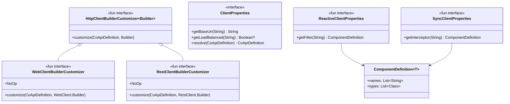
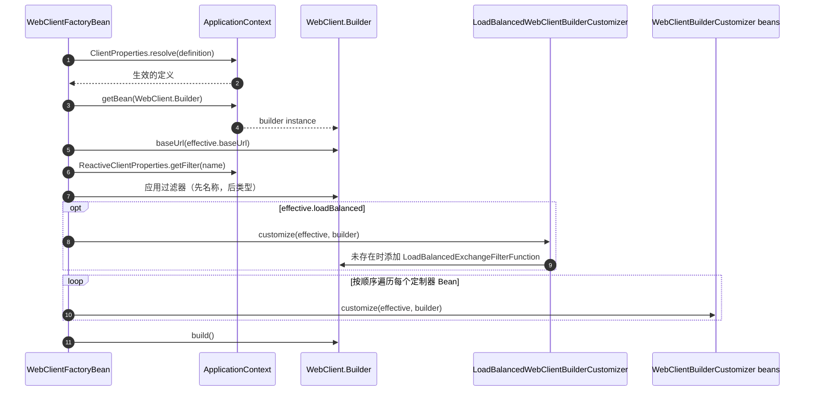
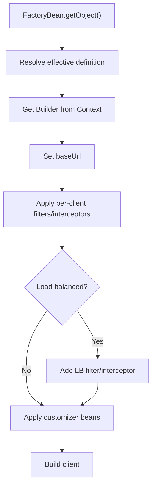

# 自定义和扩展

## 概述

CoApi 的 HTTP 客户端不是黑盒。该库公开了分层自定义 SPI，允许在三个时间点拦截和修改客户端构建器：（1）用于过滤器和拦截器的每客户端 YAML 配置，（2）用于负载均衡和协议特定调整的每类型构建器自定义器，（3）应用于所有客户端的全局自定义器 bean。这种设计意味着通用关注点（连接池、指标、追踪）可以全局应用，而特定于客户端的覆盖（认证头、超时）可以针对各个接口。

## 一览

| 自定义点 | 接口 | 范围 | 关键文件 | 来源 |
|---------------------|-----------|-------|----------|--------|
| 基础 SPI | `HttpClientBuilderCustomizer<Builder>` | 所有客户端 | [HttpClientBuilderCustomizer.kt](https://github.com/Ahoo-Wang/CoApi/blob/main/spring/src/main/kotlin/me/ahoo/coapi/spring/client/HttpClientBuilderCustomizer.kt) | [HttpClientBuilderCustomizer.kt](https://github.com/Ahoo-Wang/CoApi/blob/main/spring/src/main/kotlin/me/ahoo/coapi/spring/client/HttpClientBuilderCustomizer.kt#L18) |
| 响应式自定义器 | `WebClientBuilderCustomizer` | WebClient 客户端 | [WebClientBuilderCustomizer.kt](https://github.com/Ahoo-Wang/CoApi/blob/main/spring/src/main/kotlin/me/ahoo/coapi/spring/client/reactive/WebClientBuilderCustomizer.kt) | [WebClientBuilderCustomizer.kt](https://github.com/Ahoo-Wang/CoApi/blob/main/spring/src/main/kotlin/me/ahoo/coapi/spring/client/reactive/WebClientBuilderCustomizer.kt#L20) |
| 同步自定义器 | `RestClientBuilderCustomizer` | RestClient 客户端 | [RestClientBuilderCustomizer.kt](https://github.com/Ahoo-Wang/CoApi/blob/main/spring/src/main/kotlin/me/ahoo/coapi/spring/client/sync/RestClientBuilderCustomizer.kt) | [RestClientBuilderCustomizer.kt](https://github.com/Ahoo-Wang/CoApi/blob/main/spring/src/main/kotlin/me/ahoo/coapi/spring/client/sync/RestClientBuilderCustomizer.kt#L20) |
| 每客户端端点 | `ClientProperties` | 各个客户端 | [ClientProperties.kt](https://github.com/Ahoo-Wang/CoApi/blob/main/spring/src/main/kotlin/me/ahoo/coapi/spring/client/ClientProperties.kt) | [ClientProperties.kt](https://github.com/Ahoo-Wang/CoApi/blob/main/spring/src/main/kotlin/me/ahoo/coapi/spring/client/ClientProperties.kt#L24) |
| 每客户端过滤器 | `ReactiveClientProperties` → `ComponentDefinition<ExchangeFilterFunction>` | WebClient 客户端 | [ReactiveClientProperties.kt](https://github.com/Ahoo-Wang/CoApi/blob/main/spring/src/main/kotlin/me/ahoo/coapi/spring/client/reactive/ReactiveClientProperties.kt) | [ReactiveClientProperties.kt](https://github.com/Ahoo-Wang/CoApi/blob/main/spring/src/main/kotlin/me/ahoo/coapi/spring/client/reactive/ReactiveClientProperties.kt#L24) |
| 每客户端拦截器 | `SyncClientProperties` → `ComponentDefinition<ClientHttpRequestInterceptor>` | RestClient 客户端 | [SyncClientProperties.kt](https://github.com/Ahoo-Wang/CoApi/blob/main/spring/src/main/kotlin/me/ahoo/coapi/spring/client/sync/SyncClientProperties.kt) | [SyncClientProperties.kt](https://github.com/Ahoo-Wang/CoApi/blob/main/spring/src/main/kotlin/me/ahoo/coapi/spring/client/sync/SyncClientProperties.kt#L24) |

## 自定义器类层次结构


```mermaid
classDiagram
    class HttpClientBuilderCustomizer~Builder~ {
        <<fun interface>>
        +customize(CoApiDefinition, Builder)
    }
    class WebClientBuilderCustomizer {
        <<fun interface>>
        +customize(CoApiDefinition, WebClient.Builder)
        +NoOp
    }
    class RestClientBuilderCustomizer {
        <<fun interface>>
        +customize(CoApiDefinition, RestClient.Builder)
        +NoOp
    }
    class ClientProperties {
        <<interface>>
        +getBaseUri(String) String
        +getLoadBalanced(String) Boolean?
        +resolve(CoApiDefinition) CoApiDefinition
    }
    class ReactiveClientProperties {
        <<fun interface>>
        +getFilter(String) ComponentDefinition
    }
    class SyncClientProperties {
        <<fun interface>>
        +getInterceptor(String) ComponentDefinition
    }
    class ComponentDefinition~T~ {
        +names: List~String~
        +types: List~Class~
    }

    HttpClientBuilderCustomizer <|-- WebClientBuilderCustomizer
    HttpClientBuilderCustomizer <|-- RestClientBuilderCustomizer
    ReactiveClientProperties --> ComponentDefinition
    SyncClientProperties --> ComponentDefinition
```
<!-- Sources: spring/src/main/kotlin/me/ahoo/coapi/spring/client/HttpClientBuilderCustomizer.kt:24, spring/src/main/kotlin/me/ahoo/coapi/spring/client/ClientProperties.kt:24, spring/src/main/kotlin/me/ahoo/coapi/spring/client/reactive/ReactiveClientProperties.kt:22, spring/src/main/kotlin/me/ahoo/coapi/spring/client/sync/SyncClientProperties.kt:22, spring/src/main/kotlin/me/ahoo/coapi/spring/client/ComponentDefinition.kt:20 -->

自 v3.0.0 起，模式相关的配置拆到了各自的角色接口中：只用同步模式的应用不会在 `ClientProperties` 里看到任何响应式类型。三个接口都是可选 Bean：Spring Boot 下由 `CoApiProperties` 统一实现；不使用 Spring Boot 时，各自回退到 `Empty` 实现。

## 自定义器调用顺序

创建 `WebClient` 或 `RestClient` bean 时，自定义器按严格顺序应用：


```mermaid
sequenceDiagram
    autonumber
    participant FB as WebClientFactoryBean
    participant CTX as ApplicationContext
    participant Builder as WebClient.Builder
    participant LB as LoadBalancedWebClientBuilderCustomizer
    participant Global as WebClientBuilderCustomizer beans

    FB->>CTX: ClientProperties.resolve(definition)
    CTX-->>FB: 生效的定义
    FB->>CTX: getBean(WebClient.Builder)
    CTX-->>Builder: builder instance
    FB->>Builder: baseUrl(effective.baseUrl)
    FB->>CTX: ReactiveClientProperties.getFilter(name)
    FB->>Builder: 应用过滤器（先名称，后类型）
    opt effective.loadBalanced
        FB->>LB: customize(effective, builder)
        LB->>Builder: 未存在时添加 LoadBalancedExchangeFilterFunction
    end
    loop 按顺序遍历每个定制器 Bean
        FB->>Global: customize(effective, builder)
    end
    FB->>Builder: build()
```
<!-- Sources: spring/src/main/kotlin/me/ahoo/coapi/spring/client/reactive/WebClientFactoryBean.kt:32-45 -->

[WebClientFactoryBean.getObject()](https://github.com/Ahoo-Wang/CoApi/blob/main/spring/src/main/kotlin/me/ahoo/coapi/spring/client/reactive/WebClientFactoryBean.kt#L32) 中的调用顺序（`RestClientFactoryBean` 与之对称，使用拦截器）：

| 顺序 | 步骤 | 内容 | 是否可配置 |
|------|------|------|-----------|
| 1 | 解析生效的定义 | `ClientProperties.resolve(definition)`——`coapi.clients.<name>.*` 覆盖注解 | 通过 YAML |
| 2 | 获取 Builder | 从 ApplicationContext 获取 `WebClient.Builder` | 否 |
| 3 | 设置基础 URL | `effective.baseUrl` | 通过 `coapi.clients.<name>.base-url` |
| 4 | 应用过滤器 | 来自 `ReactiveClientProperties` 的 `ComponentDefinition` | 通过 YAML |
| 5 | 负载均衡 | 仅当 `effective.loadBalanced` 时 | 自动 |
| 6 | 定制器 Bean | 所有 `WebClientBuilderCustomizer` Bean，按顺序 | 注册为 Spring Bean |

定制器收到的是**生效的**定义（自 v3.0.0 起）：`coApiDefinition.baseUrl` 和 `coApiDefinition.loadBalanced` 已经反映了 `coapi.clients.<name>.*` 的覆盖配置。

## 自定义器决策流程


```mermaid
flowchart TD
    A["FactoryBean.getObject()"] --> A2["Resolve effective definition"]
    A2 --> B["Get Builder from Context"]
    B --> C[Set baseUrl]
    C --> D[Apply per-client filters/interceptors]
    D --> E{Load balanced?}
    E -->|Yes| F[Add LB filter/interceptor]
    E -->|No| H[Apply customizer beans]
    F --> H
    H --> I[Build client]

```
<!-- Sources: spring/src/main/kotlin/me/ahoo/coapi/spring/client/reactive/WebClientFactoryBean.kt:32-45, spring/src/main/kotlin/me/ahoo/coapi/spring/client/sync/RestClientFactoryBean.kt:32-50 -->

## 每客户端过滤器配置

过滤器和拦截器通过 YAML 属性按客户端配置；`ReactiveClientProperties` 和 `SyncClientProperties` 提供类型化访问：

**响应式（WebClient）过滤器：**
```yaml
coapi:
  clients:
    MyApiClient:
      reactive:
        filter:
          names:
            - myAuthFilter
          types:
            - com.example.LoggingExchangeFilterFunction
```

**同步（RestClient）拦截器：**
```yaml
coapi:
  clients:
    MyApiClient:
      sync:
        interceptor:
          names:
            - myAuthInterceptor
          types:
            - com.example.LoggingInterceptor
```

[AbstractHttpClientFactoryBean](https://github.com/Ahoo-Wang/CoApi/blob/main/spring/src/main/kotlin/me/ahoo/coapi/spring/client/AbstractHttpClientFactoryBean.kt) 中的解析（先全部名称，后全部类型）：
- **names** → 按名称从 `ApplicationContext` 解析为 bean
- **types** → 按类类型从 `ApplicationContext` 解析为 bean

## 示例：连接池自定义器

消费者服务器中的一个真实示例演示了每客户端连接池：

```kotlin
@Service
class ConsumerWebClientBuilderCustomizer : WebClientBuilderCustomizer {
    override fun customize(
        coApiDefinition: CoApiDefinition,
        builder: WebClient.Builder
    ) {
        val connectionProvider = ConnectionProvider.builder(coApiDefinition.name)
            .maxConnections(500)
            .maxIdleTime(Duration.ofSeconds(20))
            .maxLifeTime(Duration.ofSeconds(60))
            .pendingAcquireTimeout(Duration.ofSeconds(60))
            .evictInBackground(Duration.ofSeconds(120))
            .build()
        val httpClient = HttpClient.create(connectionProvider)
        builder.clientConnector(ReactorClientHttpConnector(httpClient))
    }
}
```
<!-- Source: example/example-consumer-server/src/main/kotlin/me/ahoo/coapi/example/consumer/ConsumerWebClientBuilderCustomizer.kt:26-46 -->

关键要点：
- 注册为 `@Service`，以便 Spring 将其发现为全局自定义器
- 使用 `coApiDefinition.name` 为每个客户端创建命名连接池
- 通过 `getBeanProvider().orderedStream()` 应用于所有 `@CoApi` 客户端

## 示例：每客户端认证过滤器

为特定客户端配置过滤器而不影响其他客户端：

```yaml
coapi:
  clients:
    SecureApiClient:
      base-url: https://api.example.com
      reactive:
        filter:
          types:
            - com.example.BearerTokenFilter
```

或按 bean 名称注册过滤器：

```yaml
coapi:
  clients:
    SecureApiClient:
      reactive:
        filter:
          names:
            - bearerTokenFilter
```

## 自定义 HttpExchangeAdapterFactory

`HttpExchangeAdapterFactory` 决定如何把 HTTP 客户端 bean（WebClient 或 RestClient）转换为驱动接口代理的 `HttpExchangeAdapter`。你可以用自己的 bean 替换默认工厂——例如为适配器包装指标或链路追踪：

```kotlin
@Configuration(proxyBeanMethods = false)
class MyCoApiConfiguration {
    @Bean
    fun customHttpExchangeAdapterFactory(): HttpExchangeAdapterFactory =
        HttpExchangeAdapterFactory { beanFactory, httpClientName ->
            val webClient = beanFactory.getBean(httpClientName, WebClient::class.java)
            MetricsWebClientAdapter.wrap(WebClientAdapter.create(webClient))
        }
}
```

[CoApiFactoryBean](https://github.com/Ahoo-Wang/CoApi/blob/main/spring/src/main/kotlin/me/ahoo/coapi/spring/CoApiFactoryBean.kt) 中的解析顺序（自 v2.1.1 起）：

| 场景 | 使用的工厂 |
|----------|--------------|
| 只有一个 `HttpExchangeAdapterFactory` bean | 该 bean |
| 多个候选且其中一个标了 `@Primary` | `@Primary` bean |
| 多个候选且无 primary | 按标准 bean 名 `CoApi.HttpExchangeAdapterFactory` 注册的 bean（注册器默认值） |

以标准 bean 名注册自定义工厂可直接整体替换默认工厂；以其他名称注册的自定义工厂只有在它是唯一候选或标了 `@Primary` 时才会生效。在 v2.1.1 之前，多个非 primary 候选会在启动时抛出 `NoUniqueBeanDefinitionException`。

## YAML 配置参考

| 属性 | 类型 | 默认 | 描述 |
|----------|------|---------|-------------|
| `coapi.clients.<name>.base-url` | String | `""` | 覆盖注解的 baseUrl |
| `coapi.clients.<name>.load-balanced` | Boolean | `null` | 覆盖负载均衡（`true` 启用 / `false` 禁用；未设置时回退注解） |
| `coapi.clients.<name>.reactive.filter.names` | List | `[]` | 过滤器 bean 名称 |
| `coapi.clients.<name>.reactive.filter.types` | List | `[]` | 过滤器类类型 |
| `coapi.clients.<name>.sync.interceptor.names` | List | `[]` | 拦截器 bean 名称 |
| `coapi.clients.<name>.sync.interceptor.types` | List | `[]` | 拦截器类类型 |

## 相关页面

- [客户端模式（响应式和同步）](/zh/deep-dive/client-modes.md) — WebClient 与 RestClient 内部原理
- [负载均衡](/zh/deep-dive/load-balancing.md) — LB 过滤器/拦截器集成
- [认证](/zh/deep-dive/authentication.md) — BearerTokenFilter 和 JWT 缓存
- [配置参考](/zh/getting-started/configuration.md) — 所有 YAML 属性

## 参考资料

1. [HttpClientBuilderCustomizer.kt](https://github.com/Ahoo-Wang/CoApi/blob/main/spring/src/main/kotlin/me/ahoo/coapi/spring/client/HttpClientBuilderCustomizer.kt) — `spring/src/main/kotlin/me/ahoo/coapi/spring/client/HttpClientBuilderCustomizer.kt`
2. [WebClientBuilderCustomizer.kt](https://github.com/Ahoo-Wang/CoApi/blob/main/spring/src/main/kotlin/me/ahoo/coapi/spring/client/reactive/WebClientBuilderCustomizer.kt) — `spring/src/main/kotlin/me/ahoo/coapi/spring/client/reactive/WebClientBuilderCustomizer.kt`
3. [RestClientBuilderCustomizer.kt](https://github.com/Ahoo-Wang/CoApi/blob/main/spring/src/main/kotlin/me/ahoo/coapi/spring/client/sync/RestClientBuilderCustomizer.kt) — `spring/src/main/kotlin/me/ahoo/coapi/spring/client/sync/RestClientBuilderCustomizer.kt`
4. [ClientProperties.kt](https://github.com/Ahoo-Wang/CoApi/blob/main/spring/src/main/kotlin/me/ahoo/coapi/spring/client/ClientProperties.kt) — `spring/src/main/kotlin/me/ahoo/coapi/spring/client/ClientProperties.kt`
5. [WebClientFactoryBean.kt](https://github.com/Ahoo-Wang/CoApi/blob/main/spring/src/main/kotlin/me/ahoo/coapi/spring/client/reactive/WebClientFactoryBean.kt) — `spring/src/main/kotlin/me/ahoo/coapi/spring/client/reactive/WebClientFactoryBean.kt`
6. [RestClientFactoryBean.kt](https://github.com/Ahoo-Wang/CoApi/blob/main/spring/src/main/kotlin/me/ahoo/coapi/spring/client/sync/RestClientFactoryBean.kt) — `spring/src/main/kotlin/me/ahoo/coapi/spring/client/sync/RestClientFactoryBean.kt`
7. [ConsumerWebClientBuilderCustomizer.kt](https://github.com/Ahoo-Wang/CoApi/blob/main/example/example-consumer-server/src/main/kotlin/me/ahoo/coapi/example/consumer/ConsumerWebClientBuilderCustomizer.kt) — `example/example-consumer-server/src/main/kotlin/.../ConsumerWebClientBuilderCustomizer.kt`
