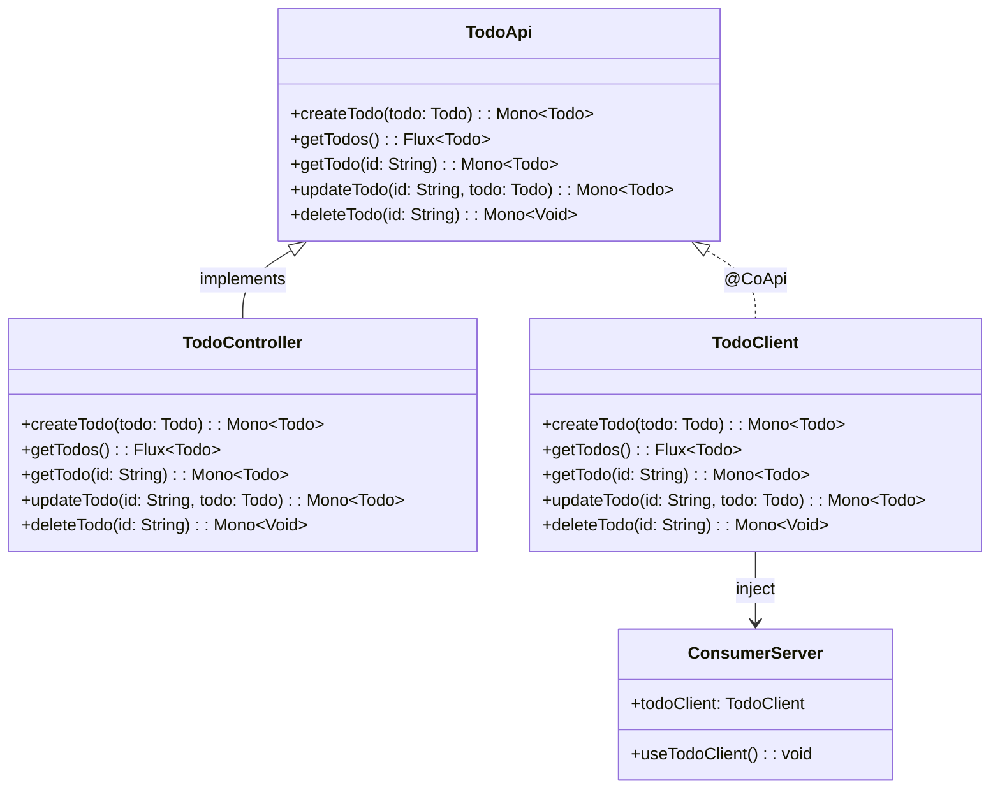
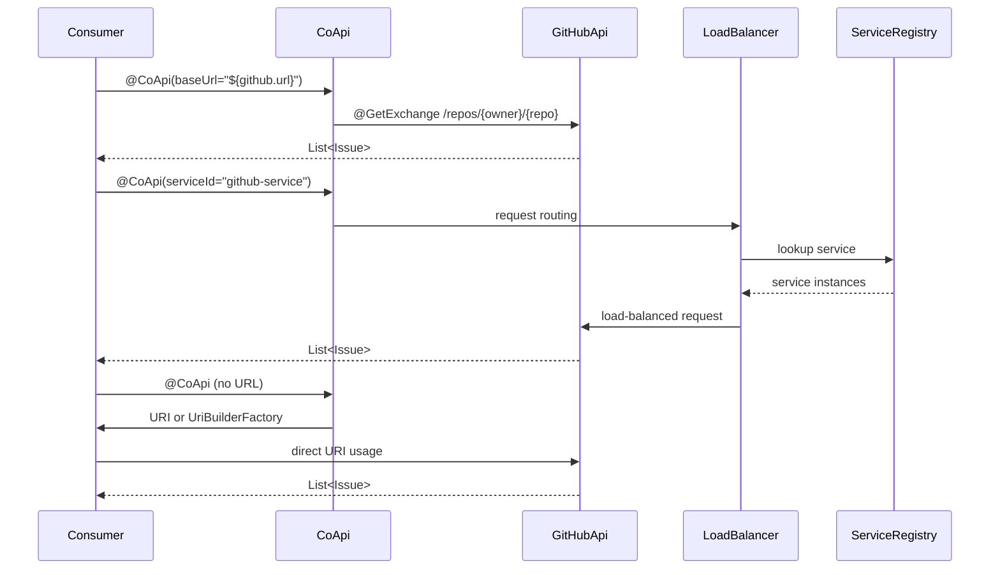
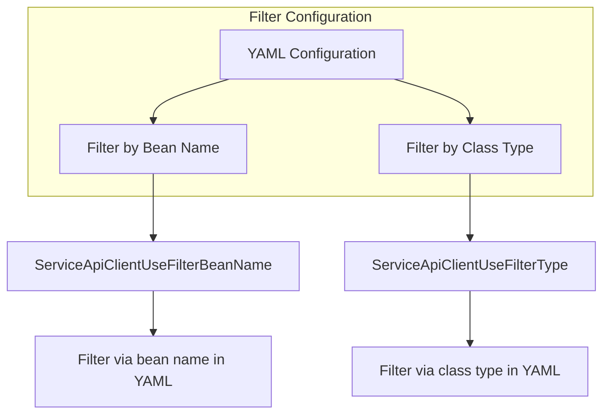
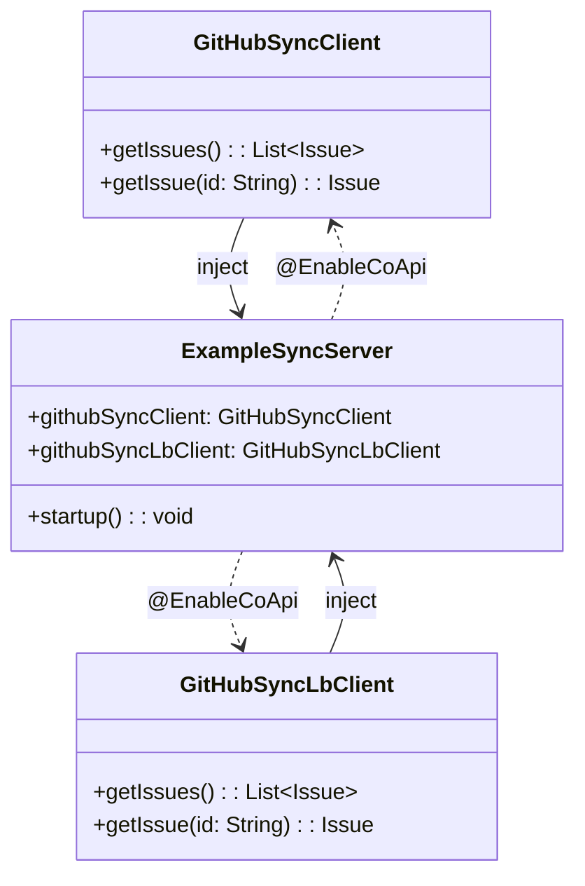
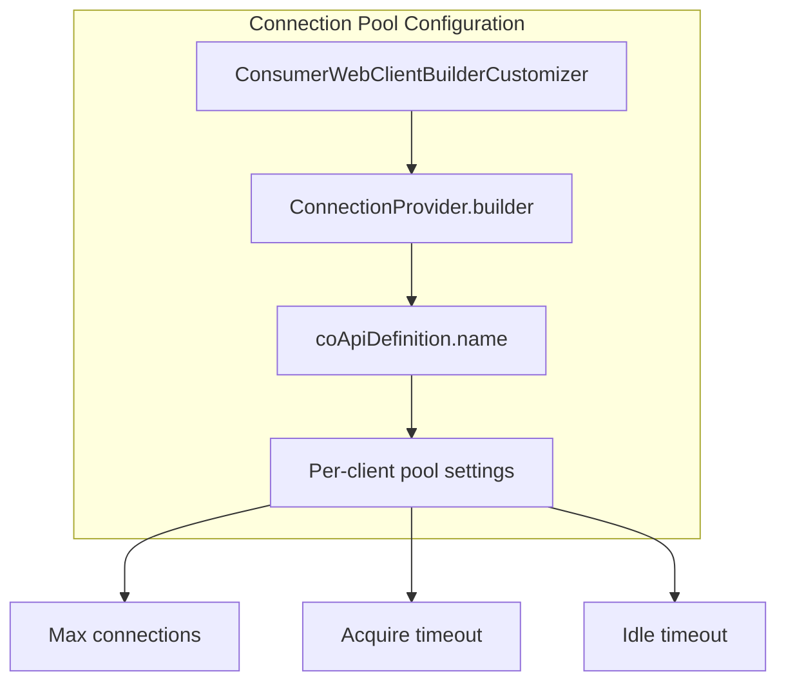

# 示例与模式

## 概述

CoApi 提供了构建类型安全 HTTP 客户端和服务器的灵活模式。本页面探讨了涵盖提供者-消费者架构、第三方 API 集成、过滤器配置、同步客户端和连接池自定义的实用示例。这些模式展示了 CoApi 如何在支持各种部署场景的同时保持契约和实现之间的一致性。

## 一览

| 模式 | 关键组件 | 用例 | 关键优势 |
|---------|---------------|----------|-------------|
| 提供者-消费者 | 共享 API、提供者服务器、消费者服务器 | 内部微服务 | 单一契约防止不一致 |
| 第三方 API | 使用不同配置的 @CoApi | 外部服务集成 | 灵活的 URL 和负载均衡选项 |
| 过滤器配置 | 基于 YAML 的过滤 | 服务选择 | 细粒度客户端路由控制 |
| 同步 Java | @EnableCoApi 与 Java 客户端 | 同步操作 | 传统 Java 集成 |
| 连接池 | WebClientBuilderCustomizer | 性能调优 | 每客户端资源优化 |

## 提供者-消费者模式

主要模式涉及共享 API 契约，防止提供者服务和消费者服务之间出现不一致。

**组件：**

1. **共享 API 模块**（`example-provider-api`）- 定义契约
   - 使用 `@HttpExchange` 注解的 [`TodoApi.kt`](https://github.com/Ahoo-Wang/CoApi/blob/main/example/example-provider-api/src/main/kotlin/me/ahoo/coapi/example/provider/api/TodoApi.kt)

2. **提供者服务器**（`example-provider-server`）- 实现契约
   - [`TodoController.kt`](https://github.com/Ahoo-Wang/CoApi/blob/main/example/example-provider-server/src/main/kotlin/me/ahoo/coapi/example/provider/TodoController.kt) 实现 `TodoApi`

3. **消费者服务器**（`example-consumer-server`）- 使用客户端
   - 注入 `TodoClient` 并调用 `TodoApi` 中定义的方法

**优势：** 单一契约防止提供者实现和消费者实现之间出现不一致。

## 第三方 API 客户端

CoApi 支持多种集成第三方 API 的方法：

**客户端类型：**

1. **GitHubApiClient** - 直接基础 URL 配置
   - [`GitHubApiClient.kt`](https://github.com/Ahoo-Wang/CoApi/blob/main/example/example-consumer-client/src/main/kotlin/me/ahoo/coapi/example/consumer/client/GitHubApiClient.kt)
   - 带 `@GetExchange` 的 `@CoApi(baseUrl = "${github.url}")`

2. **ServiceApiClient** - 负载均衡服务发现
   - [`ServiceApiClient.kt`](https://github.com/Ahoo-Wang/CoApi/blob/main/example/example-consumer-client/src/main/kotlin/me/ahoo/coapi/example/consumer/client/ServiceApiClient.kt)
   - `@CoApi(serviceId = "github-service", name = "GitHubApi")`

3. **UriApiClient** - 直接 URI 使用
   - [`UriApiClient.kt`](https://github.com/Ahoo-Wang/CoApi/blob/main/example/example-consumer-client/src/main/kotlin/me/ahoo/coapi/example/consumer/client/UriApiClient.kt)
   - `@CoApi`（无 URL）- 直接使用 `URI` 或 `UriBuilderFactory`

## 过滤器配置模式

CoApi 提供了灵活的服务选择过滤机制：

**过滤器类型：**

1. **ServiceApiClientUseFilterBeanName** - 通过 YAML 按 bean 名称过滤
2. **ServiceApiClientUseFilterType** - 通过 YAML 按类类型过滤

两种模式都允许在复杂部署中对服务选择进行细粒度控制。

## 同步 Java 示例

CoApi 支持响应式和同步 Java 客户端：

**组件：**

1. **GitHubSyncClient**（Java）- 直接 URL 配置
   - 返回 `List<Issue>`

2. **GitHubSyncLbClient**（Java）- 负载均衡配置
   - 返回 `List<Issue>`

3. **ExampleSyncServer** - 配置
   - [`GitHubSyncClient.java`](https://github.com/Ahoo-Wang/CoApi/blob/main/example/example-sync/src/main/java/me/ahoo/coapi/example/sync/GitHubSyncClient.java)
   - `@EnableCoApi(clients = [GitHubSyncClient::class])`

## 连接池自定义

为了性能优化，CoApi 允许每客户端连接池配置：

**实现：**
- [`ConsumerWebClientBuilderCustomizer.kt`](https://github.com/Ahoo-Wang/CoApi/blob/main/example/example-consumer-server/src/main/kotlin/me/ahoo/coapi/example/consumer/ConsumerWebClientBuilderCustomizer.kt)
- 使用 `ConnectionProvider.builder(coApiDefinition.name)` 进行每客户端配置

## 参考资料

1. [TodoApi 接口](https://github.com/Ahoo-Wang/CoApi/blob/main/example/example-provider-api/src/main/kotlin/me/ahoo/coapi/example/provider/api/TodoApi.kt) - 共享 API 契约定义
2. [TodoClient 接口](https://github.com/Ahoo-Wang/CoApi/blob/main/example/example-provider-api/src/main/kotlin/me/ahoo/coapi/example/provider/client/TodoClient.kt) - 消费者端客户端实现
3. [TodoController](https://github.com/Ahoo-Wang/CoApi/blob/main/example/example-provider-server/src/main/kotlin/me/ahoo/coapi/example/provider/TodoController.kt) - 提供者端控制器实现
4. [GitHubApiClient](https://github.com/Ahoo-Wang/CoApi/blob/main/example/example-consumer-client/src/main/kotlin/me/ahoo/coapi/example/consumer/client/GitHubApiClient.kt) - 带基础 URL 的第三方 API 客户端
5. [ServiceApiClient](https://github.com/Ahoo-Wang/CoApi/blob/main/example/example-consumer-client/src/main/kotlin/me/ahoo/coapi/example/consumer/client/ServiceApiClient.kt) - 负载均衡服务客户端
6. [UriApiClient](https://github.com/Ahoo-Wang/CoApi/blob/main/example/example-consumer-client/src/main/kotlin/me/ahoo/coapi/example/consumer/client/UriApiClient.kt) - 基于 URI 的客户端
7. [ConsumerServer](https://github.com/Ahoo-Wang/CoApi/blob/main/example/example-consumer-server/src/main/kotlin/me/ahoo/coapi/example/consumer/ConsumerServer.kt) - 消费者应用程序配置
8. [ConsumerWebClientBuilderCustomizer](https://github.com/Ahoo-Wang/CoApi/blob/main/example/example-consumer-server/src/main/kotlin/me/ahoo/coapi/example/consumer/ConsumerWebClientBuilderCustomizer.kt) - 连接池自定义
9. [GitHubSyncClient](https://github.com/Ahoo-Wang/CoApi/blob/main/example/example-sync/src/main/java/me/ahoo/coapi/example/sync/GitHubSyncClient.java) - 同步 Java 客户端

## 相关页面

- [入门指南](/zh/getting-started/index.md) - 基础设置和配置
- [配置](/zh/getting-started/configuration.md) - 详细配置选项
- [高级主题](/zh/deep-dive/examples.md) - 高级模式和自定义
- [最佳实践](/zh/deep-dive/examples.md) - 推荐的方法和模式
- [故障排除](/zh/deep-dive/examples.md) - 常见问题和解决方案
