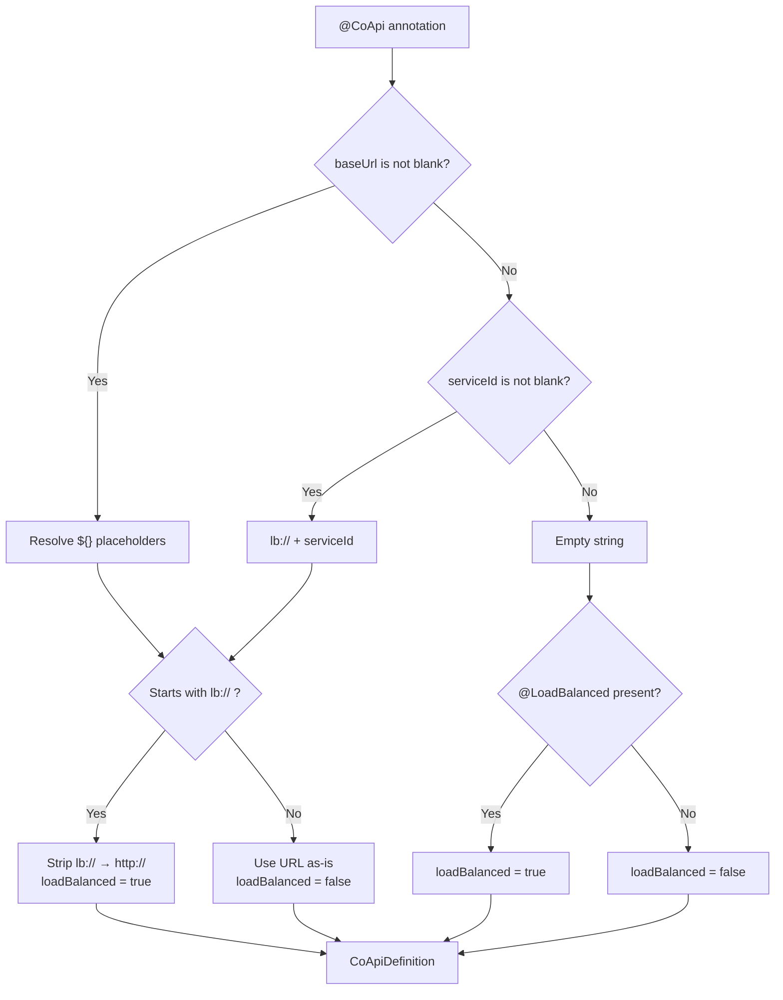
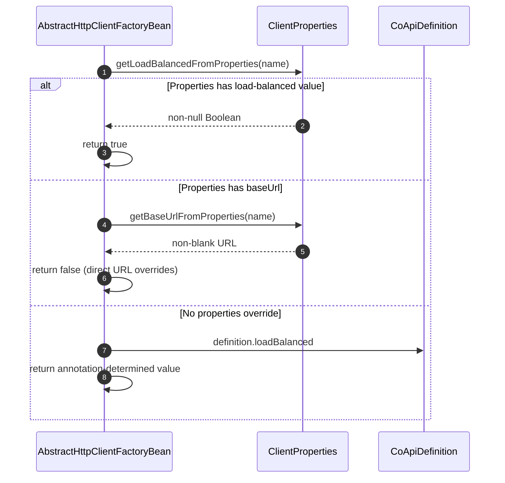
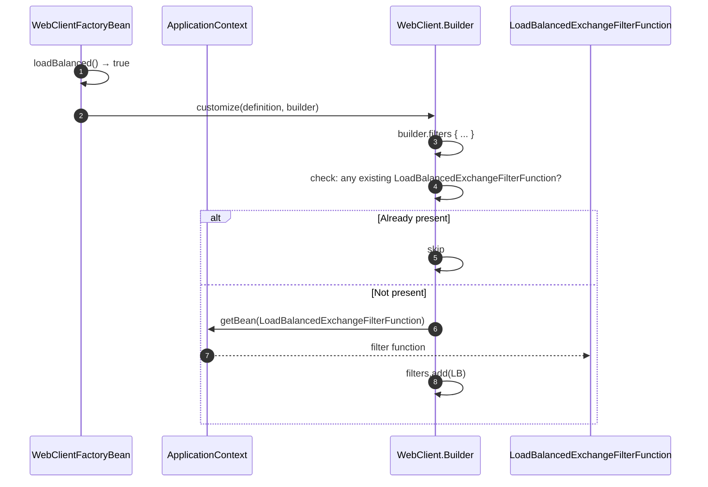
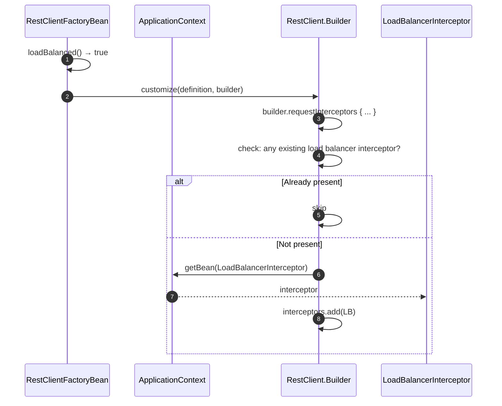

# 客户端负载均衡

## 概述

在微服务架构中，服务需要调用其他服务而无需硬编码主机名。CoApi 与 Spring Cloud LoadBalancer 集成，提供客户端负载均衡：HTTP 客户端本身选择调用哪个服务实例。这消除了对外部负载均衡器的需求，并让应用程序直接控制实例选择、重试和断路。

CoApi 提供了三种选择负载均衡的方式，都解析为相同的机制：`LoadBalancedExchangeFilterFunction`（响应式）或 `LoadBalancerInterceptor`（同步）被添加到 HTTP 客户端的过滤器/拦截器链中。

## 一览

| 机制 | 注解 | 解析后的 URL | 负载均衡 | 来源 |
|-----------|-----------|--------------|---------------|--------|
| 服务 ID | `@CoApi(serviceId = "svc")` | `http://svc` | 是 | [CoApi.kt](https://github.com/Ahoo-Wang/CoApi/blob/main/api/src/main/kotlin/me/ahoo/coapi/api/CoApi.kt#L46) |
| LB 协议 | `@CoApi(baseUrl = "lb://svc")` | `http://svc` | 是 | [CoApi.kt](https://github.com/Ahoo-Wang/CoApi/blob/main/api/src/main/kotlin/me/ahoo/coapi/api/CoApi.kt#L38) |
| 注解 | `@CoApi @LoadBalanced` | 空 | 是 | [LoadBalanced.kt](https://github.com/Ahoo-Wang/CoApi/blob/main/api/src/main/kotlin/me/ahoo/coapi/api/LoadBalanced.kt#L17) |
| 属性 | `coapi.clients.<name>.load-balanced=true` | 按属性 | 是 | [CoApiProperties.kt](https://github.com/Ahoo-Wang/CoApi/blob/main/spring-boot-starter/src/main/kotlin/me/ahoo/coapi/spring/boot/starter/CoApiProperties.kt#L54) |
| 直接 URL | `@CoApi(baseUrl = "http://...")` | 按指定 | 否 | [CoApi.kt](https://github.com/Ahoo-Wang/CoApi/blob/main/api/src/main/kotlin/me/ahoo/coapi/api/CoApi.kt#L38) |

## URL 解析流程

当 `toCoApiDefinition()` 解析注解时，它会解析基础 URL 并确定负载均衡：


<!-- Sources: spring/src/main/kotlin/me/ahoo/coapi/spring/CoApiDefinition.kt:70-97, api/src/main/kotlin/me/ahoo/coapi/api/LoadBalanced.kt:17 -->

[CoApiDefinition.kt:70-97](https://github.com/Ahoo-Wang/CoApi/blob/main/spring/src/main/kotlin/me/ahoo/coapi/spring/CoApiDefinition.kt#L70-L97) 中的解析逻辑：

| 输入 | 解析后的 URL | loadBalanced |
|-------|-------------|--------------|
| `@CoApi(baseUrl = "lb://order-service")` | `http://order-service` | `true` |
| `@CoApi(serviceId = "order-service")` | `http://order-service` | `true` |
| `@CoApi @LoadBalanced` | `""` (空) | `true` |
| `@CoApi(baseUrl = "\${github.url}")` | 解析后的值 | `false` |

## 运行时负载均衡决策

在 bean 创建时，`AbstractHttpClientFactoryBean.loadBalanced()` 应用优先级顺序：


<!-- Sources: spring/src/main/kotlin/me/ahoo/coapi/spring/client/AbstractHttpClientFactoryBean.kt:42-56 -->

**优先级**（[AbstractHttpClientFactoryBean.kt:42-56](https://github.com/Ahoo-Wang/CoApi/blob/main/spring/src/main/kotlin/me/ahoo/coapi/spring/client/AbstractHttpClientFactoryBean.kt#L42-L56)）：

| 优先级 | 来源 | 效果 |
|----------|--------|--------|
| 1（最高） | `coapi.clients.<name>.load-balanced` | 覆盖为 `true` |
| 2 | `coapi.clients.<name>.base-url`（非空） | 强制非负载均衡 |
| 3（最低） | `@CoApi` / `@LoadBalanced` 注解 | 注解的默认值 |

## WebClient 负载均衡

对于响应式堆栈，[WebClientFactoryBean](https://github.com/Ahoo-Wang/CoApi/blob/main/spring/src/main/kotlin/me/ahoo/coapi/spring/client/reactive/WebClientFactoryBean.kt) 添加 `LoadBalancedExchangeFilterFunction`：


<!-- Sources: spring/src/main/kotlin/me/ahoo/coapi/spring/client/reactive/WebClientFactoryBean.kt:30-43 -->

`LoadBalancedWebClientBuilderCustomizer` 内部类（[WebClientFactoryBean.kt:34-43](https://github.com/Ahoo-Wang/CoApi/blob/main/spring/src/main/kotlin/me/ahoo/coapi/spring/client/reactive/WebClientFactoryBean.kt#L34-L43)）在添加前检查重复项，确保幂等性。

## RestClient 负载均衡

对于同步堆栈，[RestClientFactoryBean](https://github.com/Ahoo-Wang/CoApi/blob/main/spring/src/main/kotlin/me/ahoo/coapi/spring/client/sync/RestClientFactoryBean.kt) 添加 `LoadBalancerInterceptor`：


<!-- Sources: spring/src/main/kotlin/me/ahoo/coapi/spring/client/sync/RestClientFactoryBean.kt:30-43 -->

## 每个客户端的过滤器和拦截器配置

除了负载均衡外，CoApi 还支持通过 YAML 属性配置每个客户端的过滤器/拦截器链：

```yaml
coapi:
  clients:
    ServiceApiClientUseFilterBeanName:
      reactive:
        filter:
          names:
            - loadBalancerExchangeFilterFunction
    ServiceApiClientUseFilterType:
      reactive:
        filter:
          types:
            - org.springframework.cloud.client.loadbalancer.reactive.LoadBalancedExchangeFilterFunction
```

| 属性 | 类型 | 适用于 | 来源 |
|----------|------|-----------|--------|
| `coapi.clients.<name>.reactive.filter.names` | Bean 名称 | WebClient（响应式） | [CoApiProperties.kt](https://github.com/Ahoo-Wang/CoApi/blob/main/spring-boot-starter/src/main/kotlin/me/ahoo/coapi/spring/boot/starter/CoApiProperties.kt#L59) |
| `coapi.clients.<name>.reactive.filter.types` | 类类型 | WebClient（响应式） | [CoApiProperties.kt](https://github.com/Ahoo-Wang/CoApi/blob/main/spring-boot-starter/src/main/kotlin/me/ahoo/coapi/spring/boot/starter/CoApiProperties.kt#L59) |
| `coapi.clients.<name>.sync.interceptor.names` | Bean 名称 | RestClient（同步） | [CoApiProperties.kt](https://github.com/Ahoo-Wang/CoApi/blob/main/spring-boot-starter/src/main/kotlin/me/ahoo/coapi/spring/boot/starter/CoApiProperties.kt#L62) |
| `coapi.clients.<name>.sync.interceptor.types` | 类类型 | RestClient（同步） | [CoApiProperties.kt](https://github.com/Ahoo-Wang/CoApi/blob/main/spring-boot-starter/src/main/kotlin/me/ahoo/coapi/spring/boot/starter/CoApiProperties.kt#L62) |

[AbstractWebClientFactoryBean.kt](https://github.com/Ahoo-Wang/CoApi/blob/main/spring/src/main/kotlin/me/ahoo/coapi/spring/client/reactive/AbstractWebClientFactoryBean.kt) 中的过滤器解析从 `ApplicationContext` 解析 bean 名称和类型。

## 服务发现配置

CoApi 与任何 Spring Cloud `DiscoveryClient` 配合工作。开发环境的简单内存配置：

```yaml
spring:
  cloud:
    discovery:
      client:
        simple:
          instances:
            github-service:
              - host: api.github.com
                secure: true
                port: 443
            provider-service:
              - host: localhost
                port: 8010
```

## 需求

| 需求 | 如何实现 |
|-------------|-----|
| 类路径上有 `spring-cloud-starter-loadbalancer` | Gradle/Maven 依赖 |
| 服务实例已注册 | Spring Cloud DiscoveryClient 或 SimpleDiscoveryClient |
| CoApi 中启用了负载均衡 | `serviceId`、`lb://`、`@LoadBalanced` 或属性 |

## 相关页面

- [注解（@CoApi, @LoadBalanced）](/zh/deep-dive/annotations.md) — 注解参数和 URL 解析
- [客户端模式（响应式和同步）](/zh/deep-dive/client-modes.md) — WebClient 与 RestClient 内部原理
- [自定义和扩展](/zh/deep-dive/customization.md) — 自定义 SPI 和过滤器链
- [配置参考](/zh/getting-started/configuration.md) — 所有 YAML 属性

## 参考资料

1. [CoApi.kt](https://github.com/Ahoo-Wang/CoApi/blob/main/api/src/main/kotlin/me/ahoo/coapi/api/CoApi.kt) — `api/src/main/kotlin/me/ahoo/coapi/api/CoApi.kt`
2. [LoadBalanced.kt](https://github.com/Ahoo-Wang/CoApi/blob/main/api/src/main/kotlin/me/ahoo/coapi/api/LoadBalanced.kt) — `api/src/main/kotlin/me/ahoo/coapi/api/LoadBalanced.kt`
3. [CoApiDefinition.kt](https://github.com/Ahoo-Wang/CoApi/blob/main/spring/src/main/kotlin/me/ahoo/coapi/spring/CoApiDefinition.kt) — `spring/src/main/kotlin/me/ahoo/coapi/spring/CoApiDefinition.kt`
4. [AbstractHttpClientFactoryBean.kt](https://github.com/Ahoo-Wang/CoApi/blob/main/spring/src/main/kotlin/me/ahoo/coapi/spring/client/AbstractHttpClientFactoryBean.kt) — `spring/src/main/kotlin/me/ahoo/coapi/spring/client/AbstractHttpClientFactoryBean.kt`
5. [WebClientFactoryBean.kt](https://github.com/Ahoo-Wang/CoApi/blob/main/spring/src/main/kotlin/me/ahoo/coapi/spring/client/reactive/WebClientFactoryBean.kt) — `spring/src/main/kotlin/me/ahoo/coapi/spring/client/reactive/WebClientFactoryBean.kt`
6. [RestClientFactoryBean.kt](https://github.com/Ahoo-Wang/CoApi/blob/main/spring/src/main/kotlin/me/ahoo/coapi/spring/client/sync/RestClientFactoryBean.kt) — `spring/src/main/kotlin/me/ahoo/coapi/spring/client/sync/RestClientFactoryBean.kt`
7. [CoApiProperties.kt](https://github.com/Ahoo-Wang/CoApi/blob/main/spring-boot-starter/src/main/kotlin/me/ahoo/coapi/spring/boot/starter/CoApiProperties.kt) — `spring-boot-starter/src/main/kotlin/.../CoApiProperties.kt`
8. [consumer application.yaml](https://github.com/Ahoo-Wang/CoApi/blob/main/example/example-consumer-server/src/main/resources/application.yaml) — `example/example-consumer-server/src/main/resources/application.yaml`
