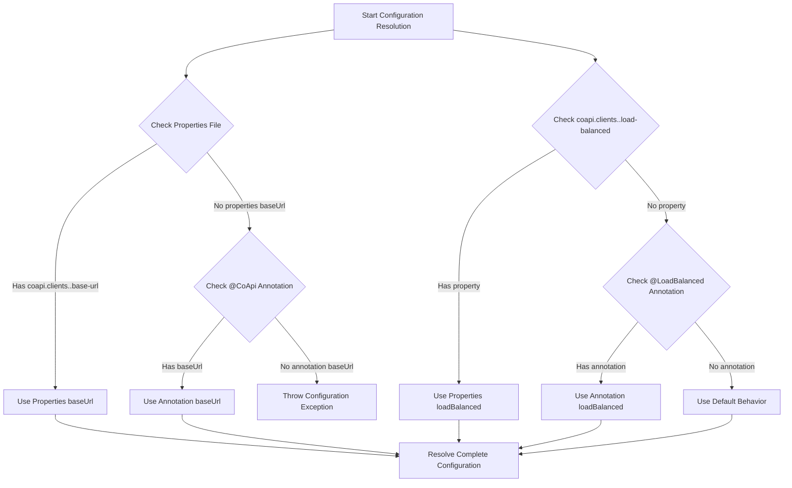
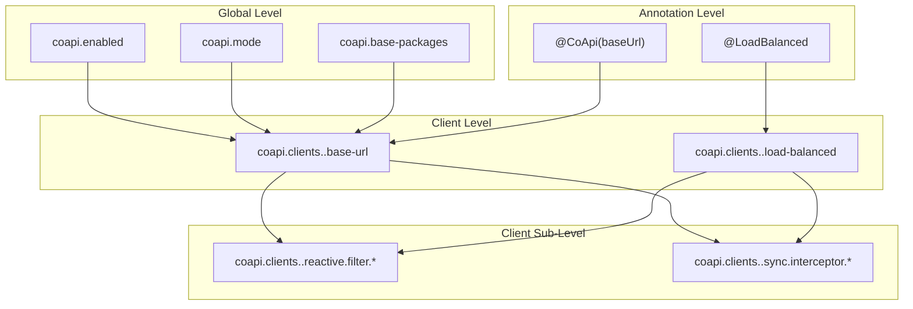
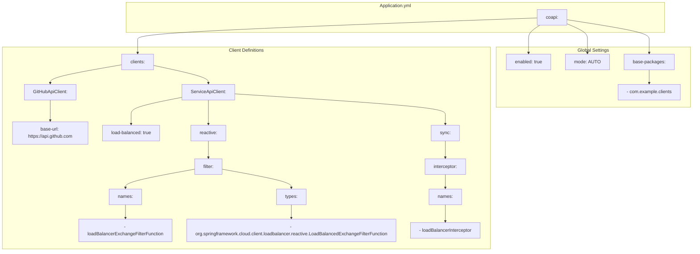
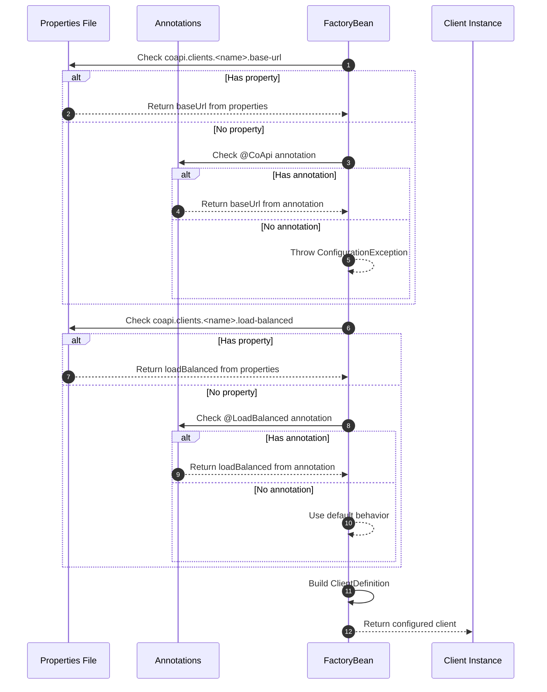

# 配置参考

CoApi 的配置系统旨在提供最大的灵活性，同时保持合理的默认值和清晰的优先级规则。配置采用分层方法，允许全局设置和特定于客户端的覆盖，使开发人员能够跨整个 API 客户端生态系统或针对各个服务自定义行为。

## 概述

CoApi 的配置架构在声明式便利性和程序化控制之间取得平衡。通过支持注解驱动和基于属性的配置，它适应不同的开发风格和部署场景。系统优先考虑显式属性声明，同时为向后兼容性和快速原型设计提供注解回退。

## 配置属性

### 全局属性

| 属性 | 类型 | 默认 | 描述 | 来源 |
|----------|------|---------|-------------|--------|
| `coapi.enabled` | `Boolean` | `true` | 启用/禁用 CoApi 功能 | [CoApiProperties.kt](https://github.com/Ahoo-Wang/CoApi/blob/main/spring-boot-starter/src/main/kotlin/me/ahoo/coapi/spring/boot/starter/CoApiProperties.kt#L1) |
| `coapi.mode` | `ClientMode` | `AUTO` | 全局客户端模式（AUTO、REACTIVE、SYNC） | [CoApiProperties.kt](https://github.com/Ahoo-Wang/CoApi/blob/main/spring-boot-starter/src/main/kotlin/me/ahoo/coapi/spring/boot/starter/CoApiProperties.kt#L2) |
| `coapi.base-packages` | `List<String>` | `[]` | 客户端发现的基础包 | [CoApiProperties.kt](https://github.com/Ahoo-Wang/CoApi/blob/main/spring-boot-starter/src/main/kotlin/me/ahoo/coapi/spring/boot/starter/CoApiProperties.kt#L3) |

### 客户端属性

| 属性 | 类型 | 默认 | 描述 | 来源 |
|----------|------|---------|-------------|--------|
| `coapi.clients.<name>.base-url` | `String` | `""` | 客户端的基础 URL | [ClientProperties.kt](https://github.com/Ahoo-Wang/CoApi/blob/main/spring/src/main/kotlin/me/ahoo/coapi/spring/client/ClientProperties.kt#L1) |
| `coapi.clients.<name>.load-balanced` | `Boolean?` | `null` | 为客户端启用负载均衡 | [ClientProperties.kt](https://github.com/Ahoo-Wang/CoApi/blob/main/spring/src/main/kotlin/me/ahoo/coapi/spring/client/ClientProperties.kt#L2) |

### 响应式客户端属性

| 属性 | 类型 | 默认 | 描述 | 来源 |
|----------|------|---------|-------------|--------|
| `coapi.clients.<name>.reactive.filter.names` | `List<String>` | `[]` | 响应式过滤器函数名称 | [ClientProperties.kt](https://github.com/Ahoo-Wang/CoApi/blob/main/spring/src/main/kotlin/me/ahoo/coapi/spring/client/ClientProperties.kt#L1) |
| `coapi.clients.<name>.reactive.filter.types` | `List<String>` | `[]` | 响应式过滤器函数类型 | [ClientProperties.kt](https://github.com/Ahoo-Wang/CoApi/blob/main/spring/src/main/kotlin/me/ahoo/coapi/spring/client/ClientProperties.kt#L2) |

### 同步客户端属性

| 属性 | 类型 | 默认 | 描述 | 来源 |
|----------|------|---------|-------------|--------|
| `coapi.clients.<name>.sync.interceptor.names` | `List<String>` | `[]` | 同步拦截器名称 | [SyncClientDefinition.kt](https://github.com/Ahoo-Wang/CoApi/blob/main/spring/src/main/kotlin/me/ahoo/coapi/spring/client/ClientProperties.kt#L2) |

## 配置解析流程

配置系统遵循严格的优先级顺序以确保可预测的行为：



## 属性层次结构

配置层次结构决定了不同配置源的合并和优先级：



## 客户端配置示例

一个完整的客户端配置示例，显示所有可用选项：



## 配置解析序列

解析过程遵循明确定义的序列以确保可预测的行为：



## YAML 配置示例

```yaml
coapi:
  enabled: true
  mode: AUTO  # AUTO, REACTIVE, SYNC
  base-packages:
    - com.example.clients
  clients:
    GitHubApiClient:
      base-url: https://api.github.com
    ServiceApiClient:
      load-balanced: true
      reactive:
        filter:
          names:
            - loadBalancerExchangeFilterFunction
          types:
            - org.springframework.cloud.client.loadbalancer.reactive.LoadBalancedExchangeFilterFunction
      sync:
        interceptor:
          names:
            - loadBalancerInterceptor
```

## 交叉引用

- [客户端模式](/zh/getting-started/overview.md) - 不同客户端操作模式的详细信息
- [架构概述](/zh/deep-dive/architecture.md) - 深入了解注册流程

## 参考资料

### 源文件

- [CoApiProperties.kt](https://github.com/Ahoo-Wang/CoApi/blob/main/spring-boot-starter/src/main/kotlin/me/ahoo/coapi/spring/boot/starter/CoApiProperties.kt) - 主配置属性类
- [AbstractHttpClientFactoryBean.kt](https://github.com/Ahoo-Wang/CoApi/blob/main/spring/src/main/kotlin/me/ahoo/coapi/spring/client/AbstractHttpClientFactoryBean.kt) - 配置解析逻辑
- [ClientProperties.kt](https://github.com/Ahoo-Wang/CoApi/blob/main/spring/src/main/kotlin/me/ahoo/coapi/spring/client/ClientProperties.kt) - 客户端配置类
- [ClientMode.kt](https://github.com/Ahoo-Wang/CoApi/blob/main/spring/src/main/kotlin/me/ahoo/coapi/spring/ClientMode.kt) - 客户端模式枚举
- [ConditionalOnCoApiEnabled.kt](https://github.com/Ahoo-Wang/CoApi/blob/main/spring-boot-starter/src/main/kotlin/me/ahoo/coapi/spring/boot/starter/ConditionalOnCoApiEnabled.kt) - 条件配置

### 相关页面

- [概述](/zh/getting-started/overview.md) - CoApi 基础介绍
- [配置参考](/zh/getting-started/configuration.md) - 完整配置指南
