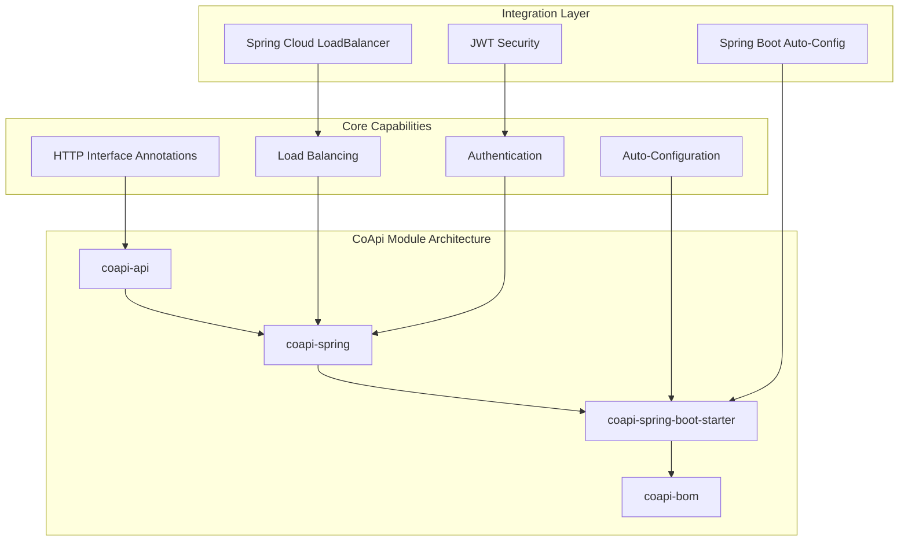
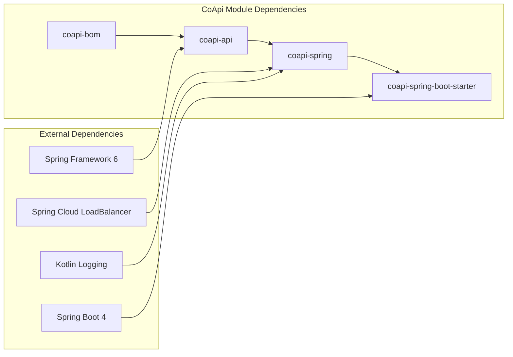
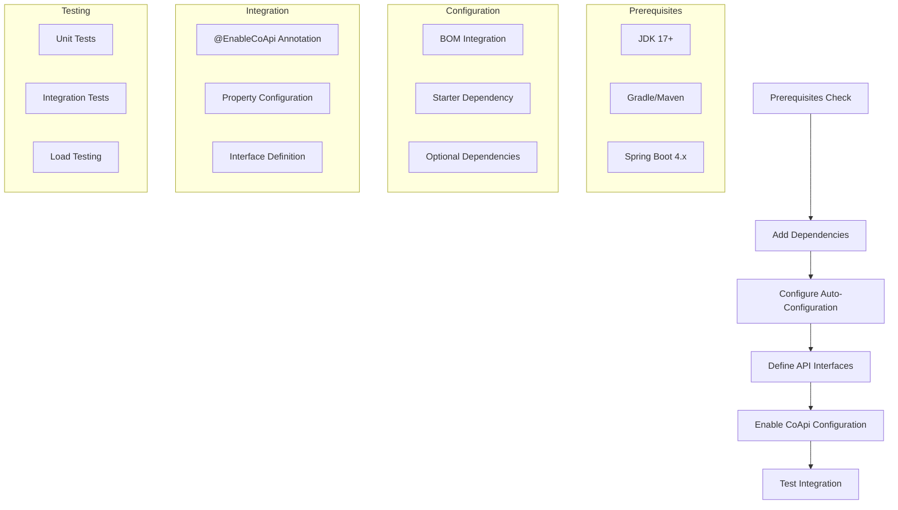

# 安装与设置

## 概述

正确安装和配置 CoApi 对于在 Spring Boot 应用程序中发挥其零样板自动配置能力至关重要。本指南提供在响应式和同步编程模型中设置 CoApi 的完整流程，确保与现代 Spring 生态系统的无缝集成，并通过自动化 HTTP 客户端管理最大化开发者生产力。

## 一览

| 组件 | 版本 | 状态 | 描述 |
|-----------|---------|--------|-------------|
| **CoApi Core** | 2.0.1 | ✅ 活跃 | 基础 HTTP 接口定义和注解 |
| **Spring Integration** | 2.0.1 | ✅ 活跃 | Spring 特定自动配置和工具 |
| **Spring Boot Starter** | 2.0.1 | ✅ 活跃 | 自动配置的 Spring Boot 集成 |
| **BOM（材料清单）** | 2.0.1 | ✅ 活跃 | 集中式版本管理 |
| **JDK 要求** | 17+ | ✅ 必需 | 需要 Java 17 或更高版本 |
| **Spring Boot** | 4.x | ✅ 兼容 | CoApi 2.x 支持 Spring Boot 4.x |

## 前置条件

### 系统要求

- **Java 开发工具包**：JDK 17 或更高版本
- **构建工具**：Gradle 8.x 或 Maven 3.8+
- **Spring Boot**：CoApi 2.x 兼容的 4.x
- **IDE**：IntelliJ IDEA、Eclipse 或支持 Java 的 VSCode

### Spring Boot 版本兼容性

> **CoApi 1.x** → Spring Boot 3.2.x  
> **CoApi 2.x** → Spring Boot 4.x

## 模块架构

CoApi 由几个关键模块组成，共同提供全面的 HTTP 客户端功能：



## 依赖管理

### BOM 使用

CoApi BOM（材料清单）提供集中式版本管理：

```xml
<!-- pom.xml -->
<dependencyManagement>
    <dependencies>
        <dependency>
            <groupId>me.ahoo.coapi</groupId>
            <artifactId>coapi-bom</artifactId>
            <version>2.0.1</version>
            <type>pom</type>
            <scope>import</scope>
        </dependency>
    </dependencies>
</dependencyManagement>
```

### Gradle Kotlin DSL

使用 CoApi BOM 与 Gradle Kotlin DSL：

```kotlin
// build.gradle.kts
dependencies {
    api(platform("me.ahoo.coapi:coapi-bom:2.0.1"))
    implementation("me.ahoo.coapi:coapi-spring-boot-starter")
}
```

## 模块依赖



## 安装说明

### Gradle Kotlin DSL

将 CoApi starter 添加到您的依赖中：

```kotlin
// build.gradle.kts
dependencies {
    implementation("me.ahoo.coapi:coapi-spring-boot-starter")

    // Optional: Load balancing support
    implementation("org.springframework.cloud:spring-cloud-starter-loadbalancer")
}
```

### Gradle Groovy DSL

```groovy
// build.gradle
dependencies {
    implementation 'me.ahoo.coapi:coapi-spring-boot-starter'

    // Optional: Load balancing support
    implementation 'org.springframework.cloud:spring-cloud-starter-loadbalancer'
}
```

### Maven XML

```xml
<!-- pom.xml -->
<dependencies>
    <dependency>
        <groupId>me.ahoo.coapi</groupId>
        <artifactId>coapi-spring-boot-starter</artifactId>
        <version>2.0.1</version>
    </dependency>

    <!-- Optional: Load balancing support -->
    <dependency>
        <groupId>org.springframework.cloud</groupId>
        <artifactId>spring-cloud-starter-loadbalancer</artifactId>
    </dependency>
</dependencies>
```

### BOM 配置

将 BOM 添加到您的依赖管理中：

```xml
<!-- pom.xml -->
<dependencyManagement>
    <dependencies>
        <dependency>
            <groupId>me.ahoo.coapi</groupId>
            <artifactId>coapi-bom</artifactId>
            <version>2.0.1</version>
            <type>pom</type>
            <scope>import</scope>
        </dependency>
    </dependencies>
</dependencyManagement>
```

## Gradle Toolchain 配置

为获得最佳兼容性，在 Gradle 构建中配置 Java 17：

```kotlin
// build.gradle.kts
java {
    toolchain {
        languageVersion = JavaLanguageVersion.of(17)
    }
}

// Optional: Configure kotlin jvm target
kotlin {
    jvmToolchain(17)
}
```

## 设置流程



## 配置示例

### 基本设置

```kotlin
@SpringBootApplication
@EnableCoApi(clients = [GitHubApiClient::class])
class Application
```

```java
@CoApi(baseUrl = "${github.url}")
public interface GitHubApiClient {
    @GetExchange("repos/{owner}/{repo}/issues")
    Flux<Issue> getIssue(@PathVariable String owner, @PathVariable String repo);
}
```

### 负载均衡设置

```kotlin
// Add load balancer dependency
implementation("org.springframework.cloud:spring-cloud-starter-loadbalancer")

@CoApi(serviceId = "github-service")
public interface GitHubApiClient {
    @GetExchange("repos/{owner}/{repo}/issues")
    Flux<Issue> getIssue(@PathVariable String owner, @PathVariable String repo);
}
```

### 配置属性

```yaml
# application.yml
github:
  url: https://api.github.com

spring:
  cloud:
    loadbalancer:
      ribbon:
        enabled: false
```

## 可选依赖

### 负载均衡支持

为提高分布式系统弹性，包含 Spring Cloud LoadBalancer：

```kotlin
implementation("org.springframework.cloud:spring-cloud-starter-loadbalancer")
```

### 响应式 Web 支持

如果使用响应式编程模型，包含 Spring WebFlux：

```kotlin
implementation("org.springframework.boot:spring-boot-starter-webflux")
```

### JWT 认证

对于基于 JWT 的认证，包含可选的 JWT 支持：

```kotlin
implementation("org.springframework.boot:spring-boot-starter-security")
```

## 故障排除

### 常见问题

1. **版本兼容性**：确保 CoApi 2.x 与 Spring Boot 4.x 一起使用
2. **缺少依赖**：验证所有必需依赖都在构建配置中
3. **自动配置**：确认 `@EnableCoApi` 已正确配置
4. **Java 版本**：使用 JDK 17+ 以获得最佳兼容性

### 调试模式

启用调试日志以进行故障排除：

```yaml
# application.yml
logging:
  level:
    me.ahoo.coapi: DEBUG
```

## 下一步

完成安装后，继续学习：

1. [快速开始](./quick-start.md) - 定义您的第一个 HTTP 客户端
2. [配置参考](./configuration.md) - 探索详细配置选项
3. [架构概述](/zh/deep-dive/architecture.md) - 深入了解内部工作原理

## 参考资料

| 源文件 | 描述 |
|------------|-------------|
| [gradle.properties:20-21](https://github.com/Ahoo-Wang/CoApi/blob/main/gradle.properties#L20) | Group 和版本配置 |
| [bom/build.gradle.kts:14-23](https://github.com/Ahoo-Wang/CoApi/blob/main/bom/build.gradle.kts#L14) | BOM 依赖约束 |
| [dependencies/build.gradle.kts:14-23](https://github.com/Ahoo-Wang/CoApi/blob/main/dependencies/build.gradle.kts#L14) | 依赖管理设置 |
| [api/build.gradle.kts:14-16](https://github.com/Ahoo-Wang/CoApi/blob/main/api/build.gradle.kts#L14) | 核心 API 模块依赖 |
| [spring/build.gradle.kts:29-41](https://github.com/Ahoo-Wang/CoApi/blob/main/spring/build.gradle.kts#L29) | Spring 集成依赖 |
| [spring-boot-starter/build.gradle.kts:28-41](https://github.com/Ahoo-Wang/CoApi/blob/main/spring-boot-starter/build.gradle.kts#L28) | Spring Boot starter 配置 |

## 相关页面

- [概述](./overview.md) - CoApi 简介
- [快速开始](./quick-start.md) - 5 分钟设置教程
- [配置参考](./configuration.md) - 详细配置选项
