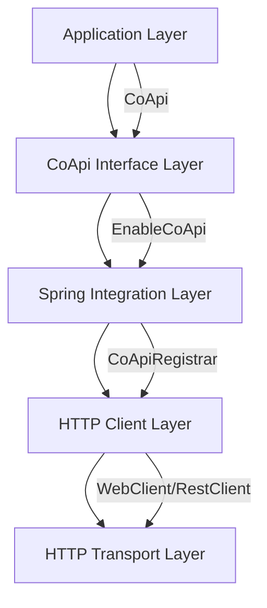
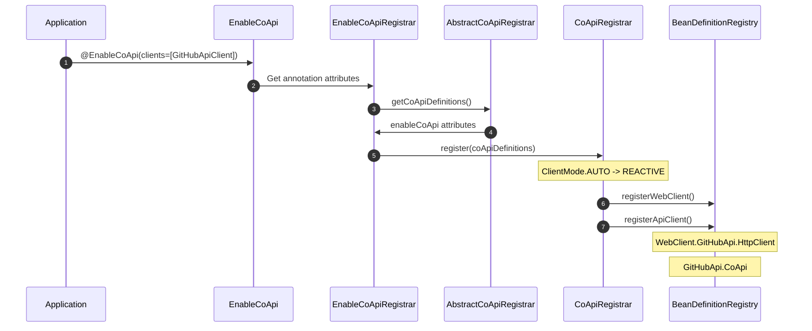

# CoApi 贡献者指南

[代码仓库](https://github.com/Ahoo-Wang/CoApi) | [主分支](https://github.com/Ahoo-Wang/CoApi/blob/main)

## 目录

- [简介](#简介)
- [第一部分：语言/框架基础](#第一部分语言框架基础)
  - [Spring Framework 6 和 Spring Boot 4.x](#spring-framework-6-和-spring-boot-4x)
  - [Kotlin 语言要点](#kotlin-语言要点)
  - [Spring HTTP Interface](#spring-http-interface)
  - [HTTP 客户端：WebClient 与 RestClient](#http-客户端webclient-与-restclient)
  - [依赖注入与配置](#依赖注入与配置)
- [第二部分：CoApi 架构与领域模型](#第二部分coapi-架构与领域模型)
  - [项目结构](#项目结构)
  - [核心架构](#核心架构)
  - [注册流程](#注册流程)
  - [客户端模式配置](#客户端模式配置)
  - [负载均衡](#负载均衡)
  - [认证](#认证)
- [第三部分：高效工作](#第三部分高效工作)
  - [开发环境设置](#开发环境设置)
  - [构建项目](#构建项目)
  - [测试策略](#测试策略)
  - [代码质量与静态分析](#代码质量与静态分析)
  - [贡献指南](#贡献指南)
  - [发布流程](#发布流程)
- [术语表](#术语表)
- [关键文件参考](#关键文件参考)
- [跨语言对比](#跨语言对比)
- [附录](#附录)
  - [附录 A：配置属性](#附录-a配置属性)
  - [附录 B：常见模式](#附录-b常见模式)
  - [附录 C：故障排除](#附录-c故障排除)

## 简介

欢迎阅读 CoApi 贡献者指南！CoApi 是一个 Spring Framework 库，为 Spring 6 HTTP Interface 客户端提供零样板自动配置。本指南旨在帮助你理解代码库、有效贡献代码，并快速上手项目开发。

CoApi 通过在支持响应式和同步编程模型的同时，为 HTTP Interface 客户端提供自动配置，填补了 Spring 生态系统的空白。无论你是经验丰富的 Spring 开发者还是 HTTP 客户端的新手，本指南都将帮助你理解 CoApi 的工作原理以及如何为其持续开发做出贡献。

### 你将学到什么

通过阅读本指南，你将了解：

- Spring Framework 6 和 Spring Boot 4.x 的基础知识
- CoApi 如何与 Spring 的 HTTP Interface 集成
- CoApi 中使用的架构和设计模式
- 如何设置开发环境
- 测试策略和贡献工作流程
- 负载均衡和认证等高级功能

### 前提条件

在深入学习本指南之前，你应该具备：

- Java/Kotlin 和 Spring Framework 的基础知识
- 理解 HTTP 客户端和 REST API
- 熟悉 Gradle 构建系统
- 使用 Git 进行版本控制的经验

---

## 第一部分：语言/框架基础

### Spring Framework 6 和 Spring Boot 4.x

CoApi 基于 Spring Framework 6 和 Spring Boot 4.x 构建，因此理解这些框架的基础知识至关重要。

#### Spring Framework 6 主要特性

Spring Framework 6 引入了几项重要的变更和改进：

- **虚拟线程支持**：Java 17+ 虚拟线程，提升并发性能
- **性能优化**：优化的 bean 创建和依赖注入
- **类型提示**：改进的类型推断和泛型支持
- **可观测性**：增强的可观测性工具集成

#### Spring Boot 4.x 兼容性

CoApi 2.x 专为 Spring Boot 4.x 设计：

```kotlin
// build.gradle.kts
dependencies {
    implementation("org.springframework.boot:spring-boot:4.0.0")
    implementation("org.springframework:spring-web:6.0.0")
}
```

Spring Boot 4.x 提供：

- **自动配置**：简化 Spring 应用程序的配置
- **Actuator**：生产级功能
- **嵌入式服务器**：便捷的部署选项

### Kotlin 语言要点

CoApi 使用 Kotlin 编写，利用其现代语言特性实现更清晰、更富有表现力的代码。

#### 使用的主要 Kotlin 特性

1. **类型安全构建器**：用于配置和 bean 定义

```kotlin
@BeanDefinitionBuilder.genericBeanDefinition(WebClientFactoryBean::class.java)
    .addConstructorArgValue(coApiDefinition)
```

2. **扩展函数**：用于工具方法

```kotlin
fun String.withBearerPrefix(): String = "Bearer $this"
```

3. **空安全**：编译时空值检查

```kotlin
val coApi = getAnnotation(CoApi::class.java)
    ?: throw IllegalArgumentException("The class must be annotated by @CoApi.")
```

4. **数据类**：用于不可变数据持有者

```kotlin
data class CoApiDefinition(
    val name: String,
    val apiType: Class<*>,
    val baseUrl: String,
    val loadBalanced: Boolean
)
```

#### Kotlin DSL for Gradle

项目使用 Kotlin DSL 进行构建脚本编写：

```kotlin
plugins {
    kotlin("jvm") version "1.8.0"
    id("org.springframework.boot") version "4.0.0"
}

dependencies {
    implementation("me.ahoo.coapi:coapi-spring-boot-starter:2.0.0")
}
```

### Spring HTTP Interface

Spring Framework 6 引入了 HTTP Interface，允许使用 `@HttpExchange` 注解将 HTTP 服务定义为 Java 接口。

#### @HttpExchange 注解

`@HttpExchange` 注解将接口标记为 HTTP 服务：

```java
@HttpExchange("https://api.github.com")
public interface GitHubApiClient {
    
    @GetExchange("repos/{owner}/{repo}/issues")
    Flux<Issue> getIssue(@PathVariable String owner, @PathVariable repo: String);
    
    @PostExchange("users/{user}/repos")
    Mono<Repository> createRepo(@PathVariable String user, @RequestBody Repository repo);
}
```

#### 支持的 HTTP 方法

CoApi 支持所有标准 HTTP 方法：

```kotlin
@GetExchange("GET /users/{user}")
fun getUser(@PathVariable user: String): Mono<User>

@PostExchange("POST /users")
fun createUser(@RequestBody user: User): Mono<User>

@PutExchange("PUT /users/{id}")
fun updateUser(@PathVariable id: String, @RequestBody user: User): Mono<User>

@DeleteExchange("DELETE /users/{id}")
fun deleteUser(@PathVariable id: String): Mono<Void>
```

#### HTTP Interface 的优势

1. **类型安全**：HTTP 方法和路径的编译时检查
2. **响应式支持**：原生支持 Project Reactor 类型
3. **简化测试**：易于模拟和测试
4. **一致的 API**：定义 HTTP 服务的标准化方式

### HTTP 客户端：WebClient 与 RestClient

CoApi 同时支持响应式（`WebClient`）和同步（`RestClient`）HTTP 客户端，可根据应用需求灵活选择。

#### WebClient（响应式）

WebClient 是 Spring 的响应式 HTTP 客户端：

```kotlin
val client = WebClient.builder()
    .baseUrl("https://api.github.com")
    .build()

client.get()
    .uri("/repos/{owner}/{repo}/issues", "Ahoo-Wang", "CoApi")
    .retrieve()
    .bodyToFlux<Issue>()
    .collectList()
```

**特性**：

- 非阻塞式响应式
- 支持流式响应
- 基于 Project Reactor 构建
- 适合高吞吐量应用

#### RestClient（同步）

RestClient 是 Spring 的现代同步 HTTP 客户端：

```kotlin
val client = RestClient.builder()
    .baseUrl("https://api.github.com")
    .build()

val issues = client.get()
    .uri("/repos/{owner}/{repo}/issues", "Ahoo-Wang", "CoApi")
    .retrieve()
    .bodyToList<Issue>()
```

**特性**：

- 简单同步
- 标准 Java 类型
- 易于使用和理解
- 适合传统应用

#### CoApi 客户端模式配置

CoApi 自动选择合适的客户端模式：

```kotlin
enum class ClientMode {
    REACTIVE, SYNC, AUTO;
    
    companion object {
        fun inferClientMode(getProperty: (propertyKey: String) -> String?): ClientMode {
            val propertyValue = getProperty(COAPI_CLIENT_MODE_PROPERTY) ?: AUTO.name
            val mode = ClientMode.valueOf(propertyValue.uppercase())
            return if (mode == AUTO) {
                INFERRED_MODED_BASED_ON_CLASS
            } else {
                mode
            }
        }
    }
}
```

### 依赖注入与配置

Spring 的依赖注入框架是 CoApi 功能的核心。

#### @Bean 定义

CoApi 使用 `@Bean` 定义来创建代理实例：

```kotlin
@Bean
fun coApiProxyFactory(): HttpServiceProxyFactory {
    return HttpServiceProxyFactory.builderFor(httpExchangeAdapter).build()
}
```

#### FactoryBean 模式

CoApi 实现 FactoryBean 模式来创建代理：

```kotlin
class CoApiFactoryBean(
    private val coApiDefinition: CoApiDefinition
) : FactoryBean<Any>, ApplicationContextAware {
    
    override fun getObject(): Any {
        val httpServiceProxyFactory = HttpServiceProxyFactory.builderFor(httpExchangeAdapter).build()
        return httpServiceProxyFactory.createClient(coApiDefinition.apiType)
    }
    
    override fun getObjectType(): Class<*> = coApiDefinition.apiType
}
```

#### Bean Definition Registry

CoApi 以编程方式注册 bean 定义：

```kotlin
fun register(coApiDefinition: CoApiDefinition) {
    val beanDefinitionBuilder = BeanDefinitionBuilder.genericBeanDefinition(CoApiFactoryBean::class.java)
    beanDefinitionBuilder.addConstructorArgValue(coApiDefinition)
    registry.registerBeanDefinition(coApiDefinition.coApiBeanName, beanDefinitionBuilder.beanDefinition)
}
```

---

## 第二部分：CoApi 架构与领域模型

### 项目结构

CoApi 采用模块化架构，职责划分清晰：

```
CoApi/
├── api/                    # 核心注解和接口
│   └── src/main/kotlin/me/ahoo/coapi/api/
│       ├── CoApi.kt       # 主注解
│       └── LoadBalanced.kt # 负载均衡注解
├── spring/                # 核心 Spring 集成
│   └── src/main/kotlin/me/ahoo/coapi/spring/
│       ├── EnableCoApi.kt          # 启用注解
│       ├── CoApiRegistrar.kt       # Bean 注册
│       ├── CoApiDefinition.kt      # 领域模型
│       ├── ClientMode.kt          # 客户端模式配置
│       └── client/                # HTTP 客户端实现
│           ├── reactive/           # WebClient 实现
│           └── sync/               # RestClient 实现
├── spring-boot-starter/   # Spring Boot 自动配置
│   └── src/main/kotlin/me/ahoo/coapi/spring/boot/
│       └── AutoCoApiConfiguration.kt
├── bom/                   # 物料清单
└── dependencies/          # 共享依赖管理
```

### 核心架构

#### 分层架构

CoApi 采用分层架构模式：



#### 组件职责

1. **api 模块**：包含核心注解和接口
   - `@CoApi`：标记接口的主注解
   - `@LoadBalanced`：启用客户端负载均衡

2. **spring 模块**：核心 Spring 集成
   - Bean 注册和配置
   - 客户端模式检测
   - 代理创建

3. **spring-boot-starter**：自动配置
   - 自动检测和设置
   - 基于属性的配置

4. **dependencies**：共享依赖管理
   - 跨模块版本对齐

### 注册流程

注册流程是 CoApi 功能的核心，将注解接口转换为代理 HTTP 客户端。

#### 注解处理

1. **@CoApi 注解**：将接口标记为 HTTP 客户端

```kotlin
@CoApi(baseUrl = "${github.url}")
public interface GitHubApiClient {
    @GetExchange("repos/{owner}/{repo}/issues")
    Flux<Issue> getIssue(@PathVariable String owner, @PathVariable String repo);
}
```

2. **@EnableCoApi 注解**：启用自动配置

```kotlin
@EnableCoApi(clients = [GitHubApiClient::class])
@SpringBootApplication
class Application
```

#### 注册流程



#### Bean 注册详情

注册流程创建两种类型的 bean：

1. **HTTP Client Bean**：实际的 HTTP 客户端（WebClient 或 RestClient）
2. **CoApi Proxy Bean**：实现该接口的代理

```kotlin
// From CoApiRegistrar.kt
fun register(coApiDefinition: CoApiDefinition) {
    if (clientMode == ClientMode.SYNC) {
        registerRestClient(registry, coApiDefinition)
    } else {
        registerWebClient(registry, coApiDefinition)
    }
    registerApiClient(registry, coApiDefinition)
}
```

### 客户端模式配置

CoApi 提供三种客户端模式以支持不同的编程范式。

#### 客户端模式选项

```kotlin
enum class ClientMode {
    REACTIVE,   // WebClient 响应式客户端
    SYNC,       // RestClient 同步客户端  
    AUTO        // 基于 classpath 自动检测
}
```

#### 模式检测逻辑

AUTO 模式根据 Spring 框架的 classpath 智能选择合适的客户端：

```kotlin
// From ClientMode.kt
private val INFERRED_MODE_BASED_ON_CLASS: ClientMode by lazy {
    try {
        Class.forName("org.springframework.web.reactive.HandlerResult")
        REACTIVE  // Spring WebFlux 可用
    } catch (ignore: ClassNotFoundException) {
        SYNC      // Spring MVC 可用
    }
}

fun inferClientMode(getProperty: (propertyKey: String) -> String?): ClientMode {
    val propertyValue = getProperty(COAPI_CLIENT_MODE_PROPERTY) ?: AUTO.name
    val mode = ClientMode.valueOf(propertyValue.uppercase())
    return if (mode == AUTO) {
        INFERRED_MODE_BASED_ON_CLASS
    } else {
        mode
    }
}
```

#### 配置示例

```kotlin
// 强制响应式模式
@CoApi(clientMode = ClientMode.REACTIVE)
interface GitHubApiClient {
    @GetExchange("repos/{owner}/{repo}/issues")
    Flux<Issue> getIssue(@PathVariable String owner, @PathVariable String repo);
}

// 强制同步模式
@CoApi(clientMode = ClientMode.SYNC)
interface GitHubApiClient {
    @GetExchange("repos/{owner}/{repo}/issues")
    List<Issue> getIssue(@PathVariable String owner, @PathVariable String repo);
}

// 自动检测（默认）
@CoApi(clientMode = ClientMode.AUTO)
interface GitHubApiClient {
    @GetExchange("repos/{owner}/{repo}/issues")
    Flux<Issue> getIssue(@PathVariable String owner, @PathVariable String repo);
}
```

### 负载均衡

CoApi 与 Spring Cloud LoadBalancer 集成，提供客户端负载均衡能力。

#### 负载均衡配置

```kotlin
@CoApi(serviceId = "github-service")
@LoadBalanced
interface GitHubApiClient {
    @GetExchange("repos/{owner}/{repo}/issues")
    Flux<Issue> getIssue(@PathVariable String owner, @PathVariable String repo);
}
```

#### 负载均衡协议支持

CoApi 支持 `lb://` 协议用于负载均衡服务：

```kotlin
@CoApi(baseUrl = "lb://github-service")
interface GitHubApiClient {
    @GetExchange("repos/{owner}/{repo}/issues")
    Flux<Issue> getIssue(@PathVariable String owner, @PathVariable String repo);
}
```

#### 负载均衡实现

负载均衡通过构建器自定义器实现：

```kotlin
// From WebClientFactoryBean.kt
private class LoadBalancedWebClientBuilderCustomizer : WebClient.Builder.() -> Unit {
    override fun invoke(builder: WebClient.Builder) {
        builder.filter(loadBalancerExchangeFilterFunction())
    }
}

// From RestClientFactoryBean.kt
private class LoadBalancedRestClientBuilderCustomizer : RestClient.Builder.() -> Unit {
    override fun invoke(builder: RestClient.Builder) {
        builder.requestInterceptor(loadBalancerInterceptor)
    }
}
```

### 认证

CoApi 提供内置认证支持，具有可扩展的令牌提供程序。

#### Bearer Token 认证

```kotlin
@CoApi(baseUrl = "https://api.github.com")
interface GitHubApiClient {
    // Bearer token 自动添加到请求中
    @GetExchange("user")
    Mono<User> getCurrentUser()
}
```

#### 认证组件

1. **BearerTokenFilter**：向请求头添加 Bearer 令牌
2. **ExpirableTokenProvider**：提供带过期处理的令牌
3. **CachedExpirableTokenProvider**：缓存令牌以提升性能

```kotlin
// From BearerTokenFilter.kt
class BearerTokenFilter(tokenProvider: ExpirableTokenProvider) :
    HeaderSetFilter(
        headerName = HttpHeaders.AUTHORIZATION,
        headerValueProvider = tokenProvider,
        headerValueMapper = BearerHeaderValueMapper
    )

object BearerHeaderValueMapper : HeaderValueMapper {
    private const val BEARER_TOKEN_PREFIX = "Bearer "
    
    override fun map(headerValue: String): String {
        return "$BEARER_TOKEN_PREFIX$headerValue"
    }
}
```

#### Token Provider 实现

```kotlin
interface ExpirableTokenProvider {
    fun getToken(): Mono<String>
    fun isExpired(): Boolean
    fun refresh(): Mono<String>
}

class CachedExpirableTokenProvider(
    private val delegate: ExpirableTokenProvider
) : ExpirableTokenProvider {
    
    private val cachedToken = AtomicReference<String>()
    private val expirationTime = AtomicReference<Long>()
    
    override fun getToken(): Mono<String> {
        return if (isExpired()) {
            refresh()
        } else {
            Mono.just(cachedToken.get())
        }
    }
}
```

---

## 第三部分：高效工作

### 开发环境设置

#### 前置条件

确保已安装以下软件：

1. **Java 17+**：CoApi 需要 Java 17 或更高版本
2. **Kotlin 1.8+**：现代 Kotlin 特性和协程
3. **Gradle 8.0+**：构建自动化和依赖管理
4. **Git 2.30+**：版本控制
5. **IDE**：IntelliJ IDEA（推荐）或带 Kotlin 插件的 VS Code

#### IDE 设置

**IntelliJ IDEA**：

1. 安装 Kotlin 插件
2. 在 IntelliJ 中打开项目
3. 导入 Gradle 项目
4. 配置 Kotlin SDK（JDK 17+）

**VS Code**：

```bash
# Install recommended extensions
code --install-extension ms-kotlin.kotlin-extension-pack
code --install-extension ms-kotlin.kotlin-debugger
code --install-extension ms-python.python
```

#### 构建环境配置

```bash
# Clone the repository
git clone https://github.com/Ahoo-Wang/CoApi.git
cd CoApi

# Set up Java 17
export JAVA_HOME=/path/to/java17
export PATH=$JAVA_HOME/bin:$PATH

# Configure Gradle (optional)
export GRADLE_OPTS="-Xmx2g -Dorg.gradle.daemon=true"
```

### 构建项目

CoApi 使用 Gradle 和 Kotlin DSL 进行构建。项目采用多模块结构，不同组件有独立的模块。

#### 构建命令

```bash
# Build all modules
./gradlew build

# Build specific module
./gradlew :spring:build
./gradlew :api:build
./gradlew :spring-boot-starter:build

# Run tests
./gradlew test

# Run tests for specific module
./gradlew :spring:test

# Run integration tests
./gradlew integrationTest

# Generate documentation
./gradlew javadoc
```

#### 构建配置文件

```bash
# Development build
./gradlew build -Pprofile=dev

# Production build with optimization
./gradlew build -Pprofile=prod

# Build with specific Java version
./gradlew build -PtargetJavaVersion=17
```

#### 模块结构构建

每个模块可以独立构建：

```bash
# Core API module
./gradlew :api:build

# Spring integration module  
./gradlew :spring:build

# Spring Boot starter
./gradlew :spring-boot-starter:build

# BOM (Bill of Materials)
./gradlew :bom:build

# Dependencies management
./gradlew :dependencies:build
```

### 测试策略

CoApi 采用全面的测试策略，覆盖单元测试、集成测试和组件测试。

#### 测试结构

```
src/
├── test/kotlin/
│   ├── unit/               # 单元测试
│   │   ├── CoApiDefinitionTest.kt
│   │   └── ClientModeTest.kt
│   ├── integration/       # 集成测试
│   │   ├── EnableCoApiIntegrationTest.kt
│   │   └── LoadBalancingIntegrationTest.kt
│   └── component/         # 组件测试
│       ├── WebClientFactoryBeanTest.kt
│       └── RestClientFactoryBeanTest.kt
```

#### 使用 FluentAssert 进行单元测试

CoApi 使用 `me.ahoo.test:fluent-assert-core` 进行简洁、类型安全的断言：

```kotlin
import me.ahoo.test.asserts.assert

@Test
fun `CoApiDefinition should resolve base URL correctly`() {
    val definition = TestApi::class.java.toCoApiDefinition(environment)
    
    assert(definition.name).isEqualTo("TestApi")
    assert(definition.baseUrl).isEqualTo("https://api.test.com")
    assert(definition.loadBalanced).isEqualTo(false)
}
```

#### 集成测试

集成测试使用 `ApplicationContextRunner` 测试 Spring 上下文设置：

```kotlin
@Test
fun `EnableCoApi should register CoApi beans`() {
    ApplicationContextRunner()
        .withUserConfiguration(Application::class.java)
        .run { context ->
            val gitHubApiClient = context.getBean(GitHubApiClient::class.java)
            assert(gitHubApiClient).isNotNull()
        }
}
```

#### 组件测试

组件测试专注于单个组件：

```kotlin
@Test
fun `WebClientFactoryBean should create WebClient`() {
    val factoryBean = WebClientFactoryBean(coApiDefinition)
    val webClient = factoryBean.getObject() as WebClient
    
    assert(webClient).isNotNull()
    assert(factoryBean.objectType).isEqualTo(GitHubApiClient::class.java)
}
```

#### 使用 MockK 进行 Mock 测试

```kotlin
@Test
fun `GitHubApiClient should use mocked responses`() {
    val mockWebClient = mockk<WebClient>()
    val mockResponse = mockk<ResponseEntity<List<Issue>>>()
    
    every { mockResponse.body } returns listOf(Issue(1, "Test Issue"))
    
    coEvery { mockWebClient.get() } returns mockk {
        every { uri(any()) } returns this
        every { retrieve() } returns mockResponse
    }
    
    val api = GitHubApiClient(mockWebClient)
    val issues = api.getIssues()
    
    assert(issues).hasSize(1)
    assert(issues[0].title).isEqualTo("Test Issue")
}
```

### 代码质量与静态分析

CoApi 通过静态分析、代码格式化和样式检查来执行高代码质量标准。

#### 静态分析工具

1. **Detekt**：Kotlin 专用静态分析
2. **Ktlint**：代码格式化和样式
3. **SpotBugs**：Java 字节码分析
4. **JaCoCo**：代码覆盖率

#### 静态分析命令

```bash
# Run all static analysis
./gradlew check

# Run detekt
./gradlew detekt

# Run ktlint
./gradlew ktlintCheck

# Run spotbugs
./gradlew spotbugs

# Generate code coverage report
./gradlew jacocoTestReport
```

#### 代码覆盖率标准

CoApi 保持高代码覆盖率标准：

```bash
# Minimum coverage requirements
./gradlew jacocoTestCoverageVerification

# HTML coverage report
./gradlew jacocoTestReport
open build/reports/jacoco/test/html/index.html
```

#### 代码样式指南

```kotlin
// Use type-safe builders
@BeanDefinitionBuilder.genericBeanDefinition(WebClientFactoryBean::class.java)
    .addConstructorArgValue(coApiDefinition)

// Use extension functions
fun String.withBearerPrefix(): String = "Bearer $this"

// Use data classes for immutable data
data class CoApiDefinition(
    val name: String,
    val apiType: Class<*>,
    val baseUrl: String,
    val loadBalanced: Boolean
)
```

### 贡献指南

CoApi 欢迎社区贡献。请遵循以下指南确保你的贡献符合项目标准。

#### 贡献工作流程

1. **Fork the Repository**：创建你的分支
2. **Create Feature Branch**：`git checkout -b feature/your-feature`
3. **Make Changes**：实现你的更改
4. **Test Changes**：运行 `./gradlew test`
5. **Update Documentation**：更新相关文档
6. **Submit Pull Request**：使用 GitHub PR 模板

#### Pull Request 流程

```bash
# Create pull request template
# .github/PULL_REQUEST_TEMPLATE.md
---
## Summary
- Brief description of changes

## Changes Made
- List of changes

## Testing
- How changes were tested

## Breaking Changes
- List of breaking changes (if any)

## Checklist
- [ ] Tests added/updated
- [ ] Documentation updated
- [ ] Code follows style guide
- [ ] CI checks pass
```

#### 代码审查标准

1. **Functionality**：代码按预期工作
2. **Readability**：清晰可维护的代码
3. **Performance**：无性能回归
4. **Testing**：全面的测试覆盖
5. **Documentation**：更新且准确的文档

#### Bug 报告

使用错误报告模板：

```markdown
## Bug Description
- Clear description of the issue

## Steps to Reproduce
1. Step one
2. Step two
3. Step three

## Expected Behavior
- What should happen

## Actual Behavior
- What actually happens

## Environment
- CoApi version
- Spring Boot version
- Java version
- OS
```

### 发布流程

CoApi 遵循语义化版本控制和自动化发布流程。

#### 版本方案

- **Major (X.0.0)**：破坏性变更
- **Minor (X.Y.0)**：新功能，向后兼容
- **Patch (X.Y.Z)**：错误修复，向后兼容

#### 发布流程

```bash
# 1. Update version numbers
./gradlew bumpVersionMajor  # or bumpVersionMinor, bumpVersionPatch

# 2. Run release tests
./gradlew releaseTest

# 3. Create release tag
git tag v2.0.0

# 4. Push to Maven Central
./gradlew publish

# 5. Create GitHub release
git push origin v2.0.0
```

#### CI/CD Pipeline

```yaml
# .github/workflows/release.yml
name: Release
on:
  push:
    tags: ['v*']

jobs:
  release:
    runs-on: ubuntu-latest
    steps:
      - uses: actions/checkout@v3
      - name: Set up JDK
        uses: actions/setup-java@v3
        with:
          java-version: '17'
      - name: Publish to Maven Central
        run: ./gradlew publish
      - name: Create GitHub Release
        uses: actions/create-release@v1
        with:
          tag_name: ${{ github.ref }}
          release_name: Release ${{ github.ref }}
```

---

## 术语表

### 核心概念

- **@CoApi**：将接口标记为 HTTP 客户端的主注解
- **@EnableCoApi**：启用 CoApi 自动配置的注解
- **HttpInterface**：Spring Framework 6 用于定义 HTTP 服务的特性
- **@HttpExchange**：定义 HTTP 方法映射的注解
- **FactoryBean**：用于创建对象的 Spring 接口
- **BeanDefinitionRegistry**：用于注册 bean 定义的 Spring 接口

### 技术术语

- **ClientMode**：响应式与同步客户端的配置
- **CoApiDefinition**：表示 CoApi 客户端的领域模型
- **LoadBalanced**：启用客户端负载均衡的注解
- **WebClient**：Spring 的响应式 HTTP 客户端
- **RestClient**：Spring 的同步 HTTP 客户端
- **ExchangeFilterFunction**：用于请求/响应处理的 WebClient 过滤器
- **HttpServiceProxyFactory**：用于创建 HTTP 接口代理的工厂

### 架构术语

- **Registrar**：负责注册 bean 的组件
- **Proxy Pattern**：用于创建动态代理的技术
- **Dependency Injection**：用于提供依赖的模式
- **Auto-configuration**：Spring Boot 的自动 bean 设置
- **Bean Factory**：用于创建和管理 bean 的 Spring 组件

---

## 关键文件参考

### 核心注解

| 文件 | 用途 | 关键类 |
|------|---------|-------------|
| [api/src/main/kotlin/me/ahoo/coapi/api/CoApi.kt](https://github.com/Ahoo-Wang/CoApi/blob/main/api/src/main/kotlin/me/ahoo/coapi/api/CoApi.kt) | HTTP 客户端主注解 | `@CoApi` |
| [api/src/main/kotlin/me/ahoo/coapi/api/LoadBalanced.kt](https://github.com/Ahoo-Wang/CoApi/blob/main/api/src/main/kotlin/me/ahoo/coapi/api/LoadBalanced.kt) | 负载均衡注解 | `@LoadBalanced` |

### Spring 集成

| 文件 | 用途 | 关键类 |
|------|---------|-------------|
| [spring/src/main/kotlin/me/ahoo/coapi/spring/EnableCoApi.kt](https://github.com/Ahoo-Wang/CoApi/blob/main/spring/src/main/kotlin/me/ahoo/coapi/spring/EnableCoApi.kt) | 启用注解 | `@EnableCoApi` |
| [spring/src/main/kotlin/me/ahoo/coapi/spring/CoApiRegistrar.kt](https://github.com/Ahoo-Wang/CoApi/blob/main/spring/src/main/kotlin/me/ahoo/coapi/spring/CoApiRegistrar.kt) | Bean 注册 | `CoApiRegistrar` |
| [spring/src/main/kotlin/me/ahoo/coapi/spring/CoApiDefinition.kt](https://github.com/Ahoo-Wang/CoApi/blob/main/spring/src/main/kotlin/me/ahoo/coapi/spring/CoApiDefinition.kt) | 领域模型 | `CoApiDefinition` |
| [spring/src/main/kotlin/me/ahoo/coapi/spring/ClientMode.kt](https://github.com/Ahoo-Wang/CoApi/blob/main/spring/src/main/kotlin/me/ahoo/coapi/spring/ClientMode.kt) | 客户端模式配置 | `ClientMode` |

### HTTP 客户端实现

| 文件 | 用途 | 关键类 |
|------|---------|-------------|
| [spring/src/main/kotlin/me/ahoo/coapi/spring/client/reactive/WebClientFactoryBean.kt](https://github.com/Ahoo-Wang/CoApi/blob/main/spring/src/main/kotlin/me/ahoo/coapi/spring/client/reactive/WebClientFactoryBean.kt) | WebClient 实现 | `WebClientFactoryBean` |
| [spring/src/main/kotlin/me/ahoo/coapi/spring/client/sync/RestClientFactoryBean.kt](https://github.com/Ahoo-Wang/CoApi/blob/main/spring/src/main/kotlin/me/ahoo/coapi/spring/client/sync/RestClientFactoryBean.kt) | RestClient 实现 | `RestClientFactoryBean` |
| [spring/src/main/kotlin/me/ahoo/coapi/spring/CoApiFactoryBean.kt](https://github.com/Ahoo-Wang/CoApi/blob/main/spring/src/main/kotlin/me/ahoo/coapi/spring/CoApiFactoryBean.kt) | 代理工厂 | `CoApiFactoryBean` |

### 认证

| 文件 | 用途 | 关键类 |
|------|---------|-------------|
| [spring/src/main/kotlin/me/ahoo/coapi/spring/client/reactive/auth/BearerTokenFilter.kt](https://github.com/Ahoo-Wang/CoApi/blob/main/spring/src/main/kotlin/me/ahoo/coapi/spring/client/reactive/auth/BearerTokenFilter.kt) | Bearer 令牌认证 | `BearerTokenFilter` |
| [spring/src/main/kotlin/me/ahoo/coapi/spring/client/reactive/auth/ExpirableTokenProvider.kt](https://github.com/Ahoo-Wang/CoApi/blob/main/spring/src/main/kotlin/me/ahoo/coapi/spring/client/reactive/auth/ExpirableTokenProvider.kt) | 令牌提供程序接口 | `ExpirableTokenProvider` |
| [spring/src/main/kotlin/me/ahoo/coapi/spring/client/reactive/auth/CachedExpirableTokenProvider.kt](https://github.com/Ahoo-Wang/CoApi/blob/main/spring/src/main/kotlin/me/ahoo/coapi/spring/client/reactive/auth/CachedExpirableTokenProvider.kt) | 缓存令牌提供程序 | `CachedExpirableTokenProvider` |

### 配置

| 文件 | 用途 | 关键类 |
|------|---------|-------------|
| [spring-boot-starter/src/main/kotlin/me/ahoo/coapi/spring/boot/AutoCoApiConfiguration.kt](https://github.com/Ahoo-Wang/CoApi/blob/main/spring-boot-starter/src/main/kotlin/me/ahoo/coapi/spring/boot/AutoCoApiConfiguration.kt) | Spring Boot 自动配置 | `AutoCoApiConfiguration` |
| [build.gradle.kts](https://github.com/Ahoo-Wang/CoApi/blob/main/build.gradle.kts) | 根构建配置 | Build script |
| [settings.gradle.kts](https://github.com/Ahoo-Wang/CoApi/blob/main/settings.gradle.kts) | 多模块设置 | Settings |

---

## 跨语言对比

### CoApi vs OpenFeign

#### 相似之处

```java
// OpenFeign
@FeignClient(name = "github", url = "https://api.github.com")
public interface GitHubApiClient {
    @GetMapping("/repos/{owner}/{repo}/issues")
    List<Issue> getIssues(@PathVariable("owner") String owner, @PathVariable("repo") String repo);
}

// CoApi
@CoApi(baseUrl = "https://api.github.com")
public interface GitHubApiClient {
    @GetExchange("repos/{owner}/{repo}/issues")
    Flux<Issue> getIssues(@PathVariable String owner, @PathVariable String repo);
}
```

#### 差异

| 特性 | OpenFeign | CoApi |
|---------|-----------|-------|
| **编程模型** | 仅同步 | 响应式 + 同步 |
| **Spring 版本** | Spring 5/6 | 仅 Spring 6 |
| **HTTP Interface** | 自定义实现 | 原生 Spring HTTP Interface |
| **负载均衡** | 通过 Ribbon/Spring Cloud LoadBalancer | 直接集成 |
| **响应式支持** | 有限 | 完整 Project Reactor 支持 |

### CoApi vs Retrofit

#### 相似之处

```kotlin
// Retrofit
@GET("/repos/{owner}/{repo}/issues")
suspend fun getIssues(
    @Path("owner") owner: String,
    @Path("repo") repo: String
): List<Issue>

// CoApi
@GetExchange("repos/{owner}/{repo}/issues")
suspend fun getIssues(
    @PathVariable String owner,
    @PathVariable String repo
): Flux<Issue>
```

#### 差异

| 特性 | Retrofit | CoApi |
|---------|----------|-------|
| **框架集成** | 独立库 | Spring Framework 集成 |
| **依赖注入** | 手动 | 通过 Spring DI 自动 |
| **配置** | 构建器模式 | 注解 + 自动配置 |
| **响应式支持** | 通过协程 | 原生 Spring 响应式 |
| **负载均衡** | 手动实现 | 内置支持 |

### CoApi vs WebClient/RestClient

#### 直接使用

```kotlin
// Direct WebClient
val webClient = WebClient.builder()
    .baseUrl("https://api.github.com")
    .build()

val issues = webClient.get()
    .uri("/repos/{owner}/{repo}/issues", "Ahoo-Wang", "CoApi")
    .retrieve()
    .bodyToFlux<Issue>()
    .collectList()
    .block()

// Direct RestClient
val restClient = RestClient.builder()
    .baseUrl("https://api.github.com")
    .build()

val issues = restClient.get()
    .uri("/repos/{owner}/{repo}/issues", "Ahoo-Wang", "CoApi")
    .retrieve()
    .bodyToFlux<Issue>()
    .collectList()
    .block()
```

#### CoApi 优势

```kotlin
// CoApi - 零样板
@CoApi(baseUrl = "https://api.github.com")
interface GitHubApiClient {
    @GetExchange("repos/{owner}/{repo}/issues")
    fun getIssues(@PathVariable owner: String, @PathVariable repo: String): Flux<Issue>
}

// Usage
@Autowired lateinit var gitHubApiClient: GitHubApiClient
val issues = gitHubApiClient.getIssues("Ahoo-Wang", "CoApi")
```

### 功能对比矩阵

| 特性 | CoApi | OpenFeign | Retrofit | WebClient | RestClient |
|---------|-------|-----------|----------|-----------|------------|
| **自动配置** | 是 | 是 | 否 | 否 | 否 |
| **响应式支持** | 是 | 否 | 是 | 是 | 否 |
| **同步支持** | 是 | 是 | 是 | 否 | 是 |
| **类型安全** | 是 | 是 | 是 | 是 | 是 |
| **Spring 集成** | 是 | 是 | 是 | 是 | 是 |
| **负载均衡** | 是 | 是 | 否 | 是 | 是 |
| **内置认证** | 是 | 是 | 否 | 否 | 否 |
| **错误处理** | 是 | 是 | 是 | 是 | 是 |
| **Mock 支持** | 是 | 是 | 是 | 是 | 是 |
| **文档** | 是 | 是 | 是 | 是 | 是 |

---

## 附录

### 附录 A：配置属性

#### CoApi 属性

```properties
# Client mode configuration
coapi.mode=REACTIVE|SYNC|AUTO

# Base URL configuration for serviceId resolution
github.url=https://api.github.com

# Load balancing configuration
spring.cloud.loadbalancer.ribbon.enabled=false
```

#### 属性参考

| 属性 | 默认值 | 描述 |
|---------|---------|-------------|
| `coapi.mode` | `AUTO` | 客户端模式：REACTIVE、SYNC 或 AUTO |
| `spring.cloud.loadbalancer.ribbon.enabled` | `false` | 使用 Spring Cloud LoadBalancer 时禁用 Ribbon |

### 附录 B：常见模式

#### 1. API 契约模式

```kotlin
// Shared API contract
@HttpExchange("todo")
interface TodoApi {
    @GetExchange
    fun getTodo(): Flux<Todo>
    
    @PostExchange
    fun createTodo(@RequestBody todo: Todo): Mono<Todo>
}

// Client implementation
@CoApi(serviceId = "todo-service")
interface TodoClient : TodoApi

// Server implementation
@RestController
class TodoController : TodoApi {
    override fun getTodo(): Flux<Todo> = Flux.just(Todo(1, "Learn CoApi"))
}
```

#### 2. 认证模式

```kotlin
@CoApi(baseUrl = "https://api.github.com")
class GitHubApiClient(
    private val tokenProvider: ExpirableTokenProvider
) {
    // Bearer token 自动添加
    @GetExchange("user")
    fun getCurrentUser(): Mono<User> = Mono.just(User("test"))
}
```

#### 3. 负载均衡模式

```kotlin
@CoApi(serviceId = "user-service")
@LoadBalanced
interface UserApiClient {
    @GetExchange("users/{id}")
    fun getUser(@PathVariable id: String): Mono<User>
    
    @GetExchange("users")
    fun getAllUsers(): Flux<User>
}
```

### 附录 C：故障排除

#### 常见问题

1. **Bean 未注册**
   ```bash
   # Check @EnableCoApi annotation
   @EnableCoApi(clients = [GitHubApiClient::class])
   @SpringBootApplication
   class Application
   ```

2. **客户端模式问题**
   ```bash
   # Explicitly set client mode
   @CoApi(clientMode = ClientMode.REACTIVE)
   interface GitHubApiClient
   ```

3. **负载均衡不工作**
   ```bash
   # Ensure Spring Cloud LoadBalancer dependency
   implementation("org.springframework.cloud:spring-cloud-starter-loadbalancer")
   ```

4. **认证问题**
   ```bash
   # Check token provider configuration
   @Bean
   fun tokenProvider(): ExpirableTokenProvider {
       return CachedExpirableTokenProvider(SimpleTokenProvider())
   }
   ```

#### 调试模式

```kotlin
// Enable debug logging
logging.level.me.ahoo.coapi=DEBUG

// Enable Spring debug
logging.level.org.springframework.web.reactive=DEBUG
```

#### 性能调优

```kotlin
// WebClient performance configuration
@Bean
fun webClient(): WebClient {
    return WebClient.builder()
        .codecs { configurer ->
            configurer.defaultCodecs.maxInMemorySize(16 * 1024 * 1024)
        }
        .build()
}
```

---

以上就是 CoApi 贡献者指南的全部内容。本指南提供了项目的全面概述，从语言基础到高级功能和贡献最佳实践。无论你是探索代码库的新开发者还是有经验的贡献者，本指南都将帮助你理解和有效地使用 CoApi。
