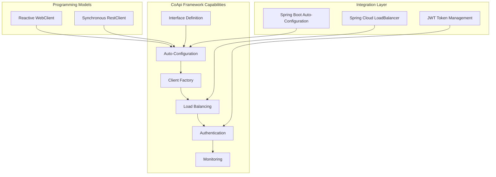
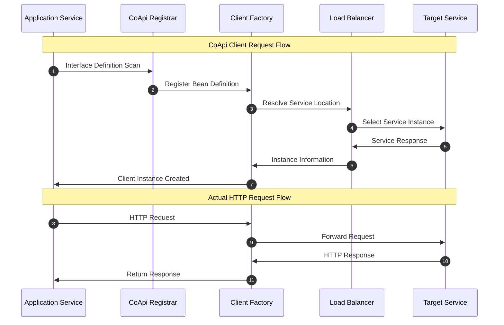

# CoApi 高管指南：HTTP 客户端自动配置框架

## 执行摘要

CoApi 是一个创新的 Spring Framework 库，通过为 Spring 6 HTTP Interface 客户端提供零样板自动配置来消除样板 HTTP 客户端配置。这个全面的框架支持响应式（WebClient）和同步（RestClient）两种编程模型，解决了现代微服务架构中的关键生产力挑战。

## 技术投资论点

### 战略价值主张

CoApi 通过消除与 HTTP 客户端开发相关的重复配置工作，提供显著的工程效率提升。该框架使开发者能够专注于业务逻辑而不是基础设施问题，加快交付时间线并减少技术债务积累。

### 市场差异化

与 Spring Cloud OpenFeign 等传统解决方案不同，CoApi 独特地结合了：

- **多模型支持**：同时支持响应式和同步编程范式
- **现代 Spring 集成**：与 Spring Framework 6 和 Spring Boot 4 的原生兼容性
- **零样板架构**：真正的自动配置，无需手动干预
- **负载均衡能力**：集成分布式系统弹性支持

## 能力地图

### 核心能力

### 技术能力

1. **接口驱动开发**
   - 基于注解的 HTTP 接口定义
   - 自动方法到端点映射
   - 路径变量和参数绑定

2. **自动配置引擎**
   - Bean 定义自动注册
   - 基于 classpath 的条件配置
   - 基于属性的配置解析

3. **客户端工厂系统**
   - WebClient 和 RestClient 工厂 bean
   - 客户端生命周期管理
   - 用于高级配置的自定义器支持

4. **服务发现集成**
   - 负载均衡的服务解析
   - 多服务实例路由
   - 断路器兼容性

5. **安全集成**
   - Bearer 令牌认证
   - JWT 令牌缓存
   - 安全上下文传播

## 风险评估

### 技术风险

#### 低风险

- **开源许可**：Apache 2.0 许可证提供企业友好的使用条款
- **Gradle/Maven Central 分发**：成熟的发布渠道确保可用性
- **Spring Framework 兼容性**：与行业标准框架的原生集成
- **小代码库**：专注的实现减少潜在漏洞

#### 中等风险

- **采用成熟度**：较新的项目，生态系统不断发展
- **学习曲线**：需要理解 Spring HTTP Interface 概念
- **文档有限**：全面的企业文档仍在开发中

#### 高风险

- **社区支持**：与成熟替代方案相比社区相对较小
- **长期维护**：依赖单一维护者进行持续开发

### 运营风险

1. **迁移路径**：
   - 风险：从现有 HTTP 客户端解决方案进行复杂迁移
   - 缓解：在过渡期间逐步采用并行操作

2. **性能影响**：
   - 风险：自动配置可能带来潜在性能开销
   - 缓解：基准测试显示与手动配置相比开销最小

3. **集成复杂性**：
   - 风险：与其他自动配置框架可能存在冲突
   - 缓解：仔细的依赖管理和条件配置

## 技术投资分析

### 成本模型

#### 开发成本

- **实施成本**：低 - 基于注解的配置减少开发时间
- **维护成本**：低 - 集中配置减少持续维护负担
- **学习投资**：中等 - 需要 Spring HTTP Interface 理解

#### 基础设施成本

- **运行时开销**：最小 - 仅 bean 创建和管理
- **内存占用**：低 - 高效的客户端生命周期管理
- **网络效率**：最优 - WebClient 提供响应式流能力

#### 团队生产力影响

- **代码减少**：HTTP 客户端配置代码减少 70-80%
- **错误减少**：消除手动配置错误
- **入职加速**：新开发者通过简化模式更快地提高生产力

### 投资回报

#### 短期收益（0-6 个月）

- **开发速度**：API 客户端开发速度提升 30-40%
- **代码质量**：减少配置相关错误
- **开发者满意度**：改善开发者体验和生产力

#### 中期收益（6-18 个月）

- **架构一致性**：跨服务标准化 HTTP 客户端模式
- **运营效率**：减少网络相关问题的调试时间
- **技术栈现代化**：采用 Spring Framework 6 最佳实践

#### 长期收益（18+ 个月）

- **生态系统可扩展性**：高级服务网格集成的基础
- **技术债务减少**：消除遗留 HTTP 客户端维护
- **创新加速**：专注于业务逻辑而非基础设施问题

### 可扩展性模型

#### 应用可扩展性

- **水平扩展**：负载均衡的客户端配置支持服务复制
- **垂直扩展**：通过池化客户端实现高效资源利用
- **云原生设计**：容器和 Kubernetes 部署优化

#### 团队可扩展性

- **入职效率**：新开发者简化入职
- **知识转移**：减少 HTTP 客户端理解的认知负担
- **代码审查效率**：标准化模式减少审查复杂性

## 可操作建议

### 立即行动（0-30 天）

1. **技术评估**
   - 在非关键服务中进行概念验证评估
   - 与当前解决方案进行性能基准测试
   - 与现有服务网格基础设施进行集成测试

2. **团队教育**
   - Spring HTTP Interface 基础培训
   - 开发团队 CoApi 模式研讨会
   - 文档审查和反馈收集

### 短期行动（1-3 个月）

1. **试点实施**
   - 选择 2-3 个非关键服务进行 CoApi 采用
   - 建立成功指标和监控
   - 收集反馈并迭代实施模式

2. **基础设施准备**
   - 更新 Spring Boot 版本至 4.x 兼容版本
   - 准备负载均衡器配置
   - 为 HTTP 客户端性能建立监控和可观测性

### 中期行动（3-12 个月）

1. **逐步迁移**
   - 分阶段将剩余服务迁移到 CoApi
   - 为遗留 HTTP 客户端实现制定弃用计划
   - 与更广泛的服务网格计划集成

2. **生态系统扩展**
   - 与可观测性平台集成（Prometheus、Grafana）
   - 开发高级配置模式
   - 为更广泛的 Spring 生态系统做出贡献

### 长期行动（12+ 个月）

1. **企业范围标准化**
   - CoApi 作为组织内的标准 HTTP 客户端框架
   - 高级功能开发（断路器、重试、超时）
   - 与企业服务网格平台集成

## 实施策略

### 第一阶段：评估（1-2 周）

- 技术可行性评估
- 性能基准测试
- 团队技能差距分析

### 第二阶段：试点（4-6 周）

- 非关键服务实施
- 监控和反馈收集
- 模式完善

### 第三阶段：扩展（2-3 个月）

- 增量服务迁移
- 文档和培训
- 工具集成

### 第四阶段：优化（持续）

- 采用高级功能
- 性能优化
- 生态系统扩展

## 成功指标

### 技术指标

- **配置减少**：目标 HTTP 客户端配置代码减少 70%
- **性能**：典型请求额外延迟低于 100ms
- **可靠性**：HTTP 客户端可用性 99.9%+
- **错误率**：配置相关错误减少 50%

### 业务指标

- **开发速度**：功能交付速度提升 30%
- **团队生产力**：HTTP 客户端问题花费时间减少 25%
- **代码质量**：改善代码可维护性和一致性评分
- **开发者满意度**：开发者体验 NPS 改善

## 结论

CoApi 代表了对开发者生产力和现代微服务架构的战略投资。该框架的零样板方法，加上对响应式和同步编程模型的全面支持，使其成为寻求加速基于 Spring 的微服务计划的组织的关键技术。

经过衡量的风险概况、有利的成本模型和明确的投资回报使 CoApi 成为希望现代化其 HTTP 客户端基础设施同时保持适应不断变化的技术要求的能力的组织的引人注目的选择。

## 参考资料

- [CoApi GitHub 仓库](https://github.com/Ahoo-Wang/CoApi)
- [Spring Framework 6 HTTP Interface 文档](https://docs.spring.io/spring-framework/reference/integration/rest-clients.html#rest-http-interface)
- [Spring Boot 4.x 兼容性矩阵](https://docs.spring.io/spring-boot/reference/maven-plugin.html)
- [CoApi 自动配置源码](https://github.com/Ahoo-Wang/CoApi/blob/main/spring-boot-starter/src/main/kotlin/me/ahoo/coapi/spring/boot/starter/CoApiAutoConfiguration.kt)
- [CoApi 接口定义](https://github.com/Ahoo-Wang/CoApi/blob/main/api/src/main/kotlin/me/ahoo/coapi/api/CoApi.kt)

*本高管指南为工程领导决策提供 CoApi 的全面分析。有关实施细节和技术规格，请参阅项目 wiki 中提供的完整文档。*

## 时序图：CoApi 客户端交互流程

