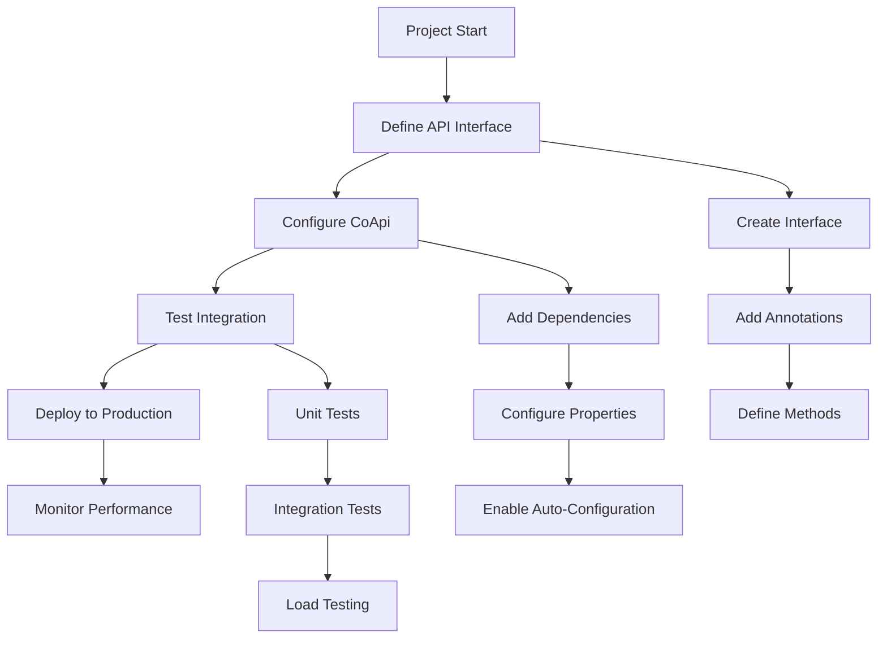
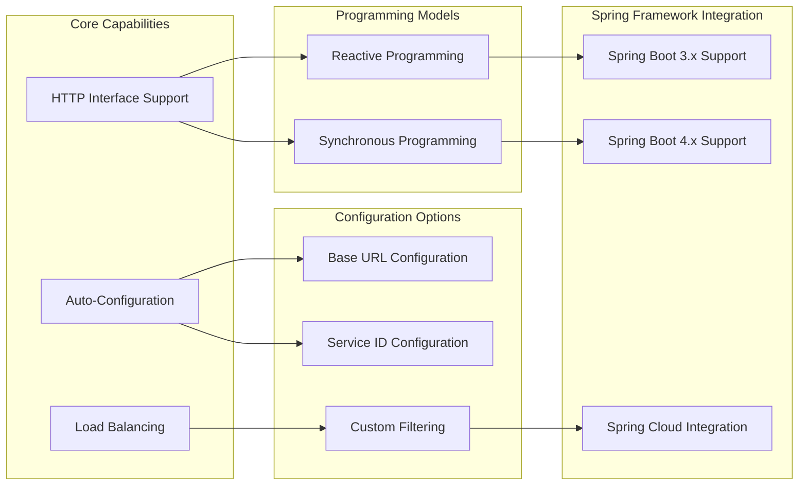
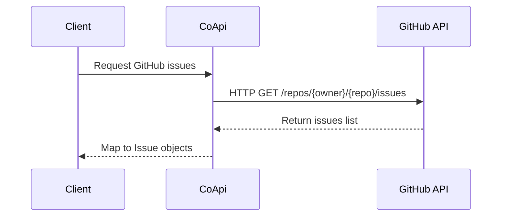
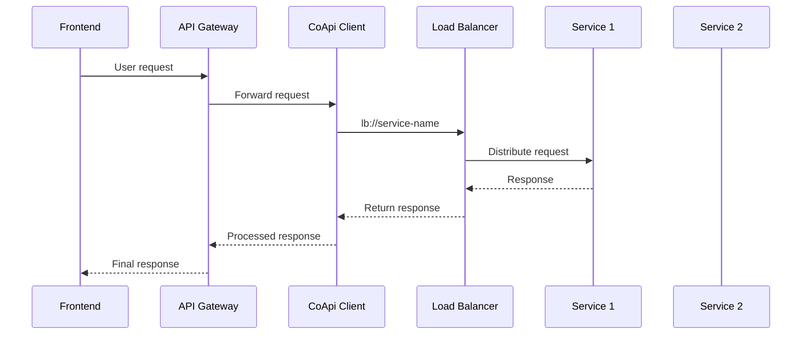
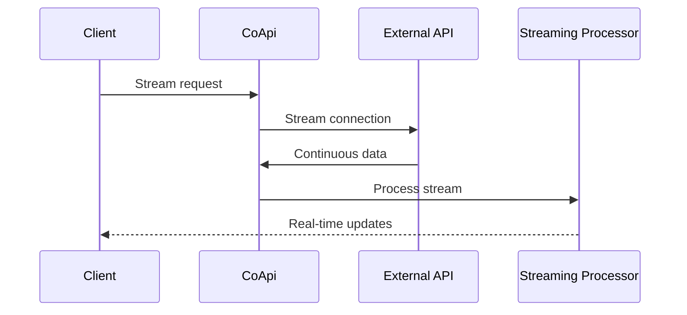

# 产品经理指南 - CoApi

## 概述

CoApi 是一个 Spring Framework 库，帮助开发者以最少设置连接到 Web 服务。将其视为一座桥梁，使应用程序能够轻松地通过互联网相互通信。

### 什么是 CoApi？

CoApi 是一个允许开发者使用简单的 Java/Kotlin 接口定义如何连接外部 Web 服务的工具。开发者无需编写复杂的连接代码，只需创建一个带有注解的接口，CoApi 就会处理所有幕后工作。

## 为组织带来的关键优势

### 更快开发

- **减少样板代码**：开发者节省重复连接设置的时间
- **简化集成**：仅需几行代码即可连接到外部服务
- **更快迭代**：API 连接变更快速且可预测

### 更高质量

- **标准化方法**：所有 API 连接遵循相同模式
- **内置负载均衡**：自动跨多个服务分发请求
- **积极维护**：定期更新和社区支持

### 成本节约

- **开源**：免费使用，无需许可费用
- **减少培训**：开发者可以快速上手
- **降低维护**：更少代码意味着更少需要修复的错误

## 用户旅程图

### 用户旅程详情

#### 1. 项目启动

- **目标**：理解服务集成需求
- **产品经理活动**：
  - 定义需要连接的外部服务
  - 确定集成时间表和依赖关系
  - 评估团队对 Spring Framework 的熟悉程度

#### 2. 定义 API 接口

- **目标**：创建服务通信契约
- **开发者活动**：
  - 使用所需方法定义接口
  - 添加注解以指定请求类型和参数
  - 使用模拟数据测试接口定义

#### 3. 配置 CoApi

- **目标**：在应用程序中设置库
- **开发者活动**：
  - 将 CoApi 依赖添加到项目
  - 配置服务 URL 或服务 ID
  - 使用注解启用自动配置

#### 4. 测试集成

- **目标**：验证集成正确工作
- **活动**：
  - 单个方法的单元测试
  - 与真实服务的集成测试
  - 负载测试以确保满足性能要求

#### 5. 部署到生产环境

- **目标**：将集成发布到生产环境
- **活动**：
  - 使用适当的监控和日志记录进行部署
  - 为生产环境配置负载均衡
  - 设置错误处理和回退机制

#### 6. 监控性能

- **目标**：确保持续集成健康
- **活动**：
  - 监控响应时间和错误率
  - 跟踪使用模式
  - 进行持续优化

## 功能能力地图

### 功能详情

#### 核心能力

**HTTP Interface 支持**

- **内容**：将 HTTP 客户端定义为 Java/Kotlin 接口
- **优势**：清晰、类型安全的 API 定义
- **用法**：使用 `@GetExchange`、`@PostExchange` 等注解定义 HTTP 方法
- **源码**：[GitHubApiClient.java:21-26](https://github.com/Ahoo-Wang/CoApi/blob/main/example/example-consumer-client/src/main/kotlin/me/ahoo/coapi/example/consumer/client/GitHubApiClient.kt)

**自动配置**

- **内容**：最少代码自动设置 HTTP 客户端
- **优势**：开发者无需编写复杂配置
- **用法**：添加 `@EnableCoApi` 注解启用自动配置
- **源码**：[ConsumerServer.kt](https://github.com/Ahoo-Wang/CoApi/blob/main/example/example-consumer-server/src/main/kotlin/me/ahoo/coapi/example/consumer/ConsumerServer.kt)

**负载均衡**

- **内容**：跨多个服务实例分发请求
- **优势**：提高可靠性和性能
- **用法**：在服务 URL 中使用 `lb://` 前缀或使用服务 ID
- **源码**：[ServiceApiClient.java:98-103](https://github.com/Ahoo-Wang/CoApi/blob/main/README.md#L98)

#### 编程模型

**响应式编程**

- **内容**：异步处理数据流
- **优势**：高容量操作性能更好
- **用法**：从方法返回 `Flux<T>` 或 `Mono<T>`
- **源码**：[GitHubApiClient.kt:25](https://github.com/Ahoo-Wang/CoApi/blob/main/example/example-consumer-client/src/main/kotlin/me/ahoo/coapi/example/consumer/client/GitHubApiClient.kt)

**同步编程**

- **内容**：传统的请求-响应模型
- **优势**：简单操作的代码更简单
- **用法**：返回标准 Java/Kotlin 集合
- **源码**：[GitHubSyncClient.java:26](https://github.com/Ahoo-Wang/CoApi/blob/main/example/example-sync/src/main/java/me/ahoo/coapi/example/sync/GitHubSyncClient.java)

#### 配置选项

**Base URL 配置**

- **内容**：定义服务调用的基础 URL
- **优势**：集中配置管理
- **用法**：在注解中使用 `baseUrl = "${config.property}"`
- **源码**：[GitHubApiClient.kt:21](https://github.com/Ahoo-Wang/CoApi/blob/main/example/example-consumer-client/src/main/kotlin/me/ahoo/coapi/example/consumer/client/GitHubApiClient.kt)

**服务 ID 配置**

- **内容**：使用服务发现获取服务位置
- **优势**：动态服务位置管理
- **用法**：在注解中使用 `serviceId = "service-name"`
- **源码**：[ServiceApiClient.java:98](https://github.com/Ahoo-Wang/CoApi/blob/main/README.md#L98)

**自定义过滤**

- **内容**：添加用于请求/响应处理的自定义过滤器
- **优势**：高级请求处理和转换
- **用法**：实现过滤器 bean 并注册
- **源码**：[ServiceApiClientUseFilterBeanName.kt](https://github.com/Ahoo-Wang/CoApi/blob/main/example/example-consumer-client/src/main/kotlin/me/ahoo/coapi/example/consumer/client/ServiceApiClientUseFilterBeanName.kt)

#### Spring Framework 集成

**Spring Boot 3.x 支持**

- **内容**：与 Spring Boot 3.x 兼容
- **优势**：访问最新 Spring Framework 特性
- **用法**：CoApi 1.x 配合 Spring Boot 3.x 使用
- **源码**：[README.md:33-34](https://github.com/Ahoo-Wang/CoApi/blob/main/README.md#L33)

**Spring Boot 4.x 支持**

- **内容**：与 Spring Boot 4.x 兼容
- **优势**：与最新 Spring 版本的未来保障集成
- **用法**：CoApi 2.x 配合 Spring Boot 4.x 使用
- **源码**：[README.md:33-34](https://github.com/Ahoo-Wang/CoApi/blob/main/README.md#L34)

**Spring Cloud 集成**

- **内容**：与 Spring Cloud 服务集成
- **优势**：企业级微服务特性
- **用法**：结合 Spring Cloud LoadBalancer 使用
- **源码**：[GitHubApiClient.java:91-92](https://github.com/Ahoo-Wang/CoApi/blob/main/README.md#L91)

## 使用场景

### 场景 1：简单 REST API 集成

**业务价值**：快速与第三方服务集成
**实施时间**：30 分钟
**维护工作量**：低

### 场景 2：微服务通信

**业务价值**：可靠的微服务通信
**实施时间**：2 小时
**维护工作量**：中等

### 场景 3：响应式数据处理

**业务价值**：实时数据处理能力
**实施时间**：4 小时
**维护工作量**：中高

## 已知限制

### 技术限制

1. **框架依赖**
   - CoApi 需要 Spring Boot 3.x 或 4.x
   - 与其他 Java Web 框架不兼容
   - **影响**：使用其他框架的项目无法使用 CoApi

2. **编程模型知识**
   - 需要理解响应式编程概念
   - 开发团队需要 Spring Framework 经验
   - **影响**：对 Spring 生态系统新手团队有学习曲线

3. **服务发现**
   - 负载均衡需要额外的 Spring Cloud LoadBalancer 依赖
   - 对其他服务发现机制支持有限
   - **影响**：复杂微服务设置需要额外配置

### 业务限制

1. **第三方 API 变更**
   - 外部 API 变更需要接口更新
   - 多个 API 版本需要版本管理
   - **影响**：API 变更时的维护开销

2. **性能考虑**
   - 响应式编程学习曲线较高
   - 同步与响应式性能权衡
   - **影响**：性能关键应用需要仔细设计

3. **企业特性**
   - 内置安全特性有限
   - 高级用例需要额外配置
   - **影响**：企业需求可能需要自定义开发

### 支持限制

1. **社区规模**
   - 与成熟框架相比社区较小
   - 可用的第三方集成较少
   - **影响**：可能需要更多自定义开发

2. **文档**
   - 主要是技术文档
   - 面向业务的文档有限
   - **影响**：对非技术利益相关者学习曲线较高

## 数据与隐私概述

### 数据处理

**处理哪些数据**

- HTTP 请求和响应数据
- 配置设置
- 负载均衡指标
- 错误日志信息

**数据存储**

- 配置数据存储在应用程序属性中
- 日志数据存储在应用程序日志中
- 指标存储在监控系统中
- 不存储用户数据的持久化数据

### 安全考虑

**数据保护**

- 所有数据传输使用标准 HTTP/HTTPS 协议
- 传输中的敏感数据应加密
- 默认不加密静态数据

**访问控制**

- 标准 Spring Security 集成
- 身份验证和授权由 Spring Security 管理
- CoApi 本身没有内置访问控制

**隐私合规**

- GDPR 合规取决于实现
- CCPA 合规取决于实现
- CoApi 本身不处理个人数据

### 最佳实践

1. **数据最小化**
   - 仅收集必要的配置数据
   - 避免在日志中存储敏感数据
   - 使用环境变量进行敏感配置

2. **安全配置**
   - 始终使用 HTTPS 进行外部 API 调用
   - 实施适当的身份验证和授权
   - 定期安全更新和补丁

3. **合规**
   - 审查您的用例的特定合规要求
   - 根据监管要求实施必要的控制
   - 定期安全审计和评估

## 常见问题

### 一般问题

**Q：CoApi 支持哪些编程语言？**

A：CoApi 专为使用 Spring Framework 的 Java 和 Kotlin 应用程序设计。

**Q：CoApi 可以免费使用吗？**

A：是的，CoApi 采用 Apache 2.0 许可证开源，这意味着它可以免费用于商业和非商业项目。

**Q：支持哪些 Spring Boot 版本？**

A：CoApi 1.x 支持 Spring Boot 3.x，CoApi 2.x 支持 Spring Boot 4.x。

### 技术问题

**Q：如何将 CoApi 添加到我的项目？**

A：将依赖添加到构建配置文件：

- Gradle：`implementation("me.ahoo.coapi:coapi-spring-boot-starter")`
- Maven：添加 CoApi Spring Boot starter 依赖

**Q：我可以将 CoApi 与响应式编程一起使用吗？**

A：是的，CoApi 支持响应式（Flux/Mono）和传统同步编程模型。

**Q：CoApi 支持负载均衡吗？**

A：是的，CoApi 与 Spring Cloud LoadBalancer 配合使用时具有内置负载均衡支持。

**Q：如何配置服务端点？**

A：可以使用基础 URL 或用于服务发现的服务 ID 配置端点。

### 业务问题

**Q：CoApi 在开发中节省多少时间？**

A：大多数开发者报告称节省了通常花在 HTTP 客户端配置上的 60-80% 的时间，具体取决于集成的复杂性。

**Q：CoApi 适合生产使用吗？**

A：是的，CoApi 积极维护，具有 CI/CD、代码覆盖率跟踪和自动化发布。

**Q：可以获得什么级别的支持？**

A：通过 GitHub 社区提供支持，由核心开发团队积极维护。

**Q：我可以将 CoApi 用于微服务架构吗？**

A：是的，CoApi 专为微服务通信设计，与 Spring Cloud 生态系统配合良好。

### 安全问题

**Q：CoApi 提供哪些安全特性？**

A：CoApi 本身提供基本的安全特性，但依赖 Spring Security 进行全面的安全控制。

**Q：CoApi 处理身份验证吗？**

A：CoApi 不直接处理身份验证，但与 Spring Security 无缝集成进行身份验证和授权。

**Q：CoApi 符合 GDPR 吗？**

A：CoApi 本身不处理个人数据，但您需要确保您的实现符合相关法规。

## 入门清单

### 产品经理

- [ ] 与开发团队审查集成需求
- [ ] 评估团队对 Spring Framework 的熟悉程度
- [ ] 确定需要集成的第三方服务
- [ ] 定义 API 调用的性能要求
- [ ] 规划监控和日志策略

### 开发团队

- [ ] 使用 Spring Boot 设置开发环境
- [ ] 将 CoApi 依赖添加到项目
- [ ] 使用所需方法定义 API 接口
- [ ] 配置服务端点和属性
- [ ] 编写单元和集成测试
- [ ] 配置监控和错误处理

### 运维团队

- [ ] 设置 API 性能监控
- [ ] 配置调试日志
- [ ] 规划服务配置部署策略
- [ ] 为生产设置负载均衡
- [ ] 配置备份和故障转移机制

## 成功指标

### 技术指标

- **集成时间**：从需求到工作集成的时间
- **代码减少**：消除的样板代码百分比
- **性能**：与手动实现相比的响应时间和吞吐量
- **错误率**：API 调用错误率和故障恢复时间

### 业务指标

- **开发速度**：每月完成的集成数量
- **质量**：与 API 集成相关的生产问题数量
- **维护工作量**：维护 API 集成花费的时间
- **团队满意度**：开发者对易用性的反馈

## 结论

CoApi 为 Spring 应用程序中的 HTTP 客户端开发提供了一种精简的方法，在开发速度、代码质量和可维护性方面提供了显著优势。虽然存在需要考虑的局限性，但对于使用 Spring Framework 的组织来说，整体价值主张很强。

对于产品经理来说，了解 CoApi 的能力和局限性有助于规划集成项目并为开发时间表设定适当的期望。该库对简单性和自动化的关注与现代软件开发实践很好地契合，使其成为构建健壮、可维护应用程序的宝贵工具。

在规划 CoApi 采用时，请记住考虑团队对 Spring Framework 和响应式编程的专业知识，并确保为生产使用设置适当的监控和安全措施。

---

*本指南由 CoApi 团队维护。如需更新和问题，请参阅[官方仓库](https://github.com/Ahoo-Wang/CoApi)。*
