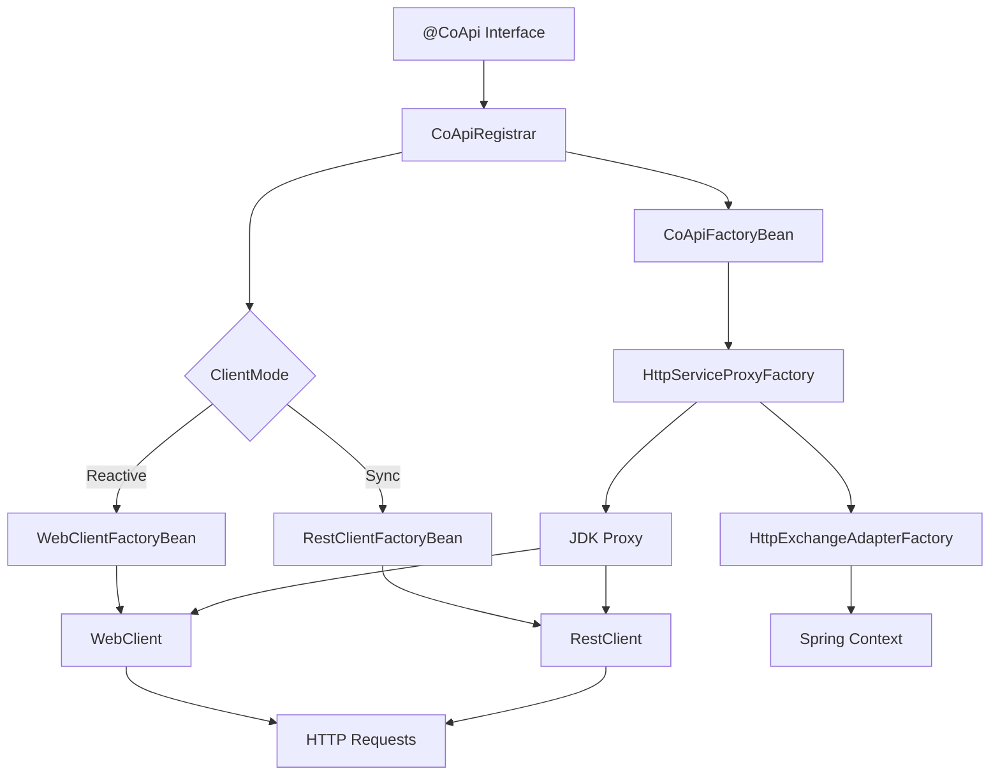
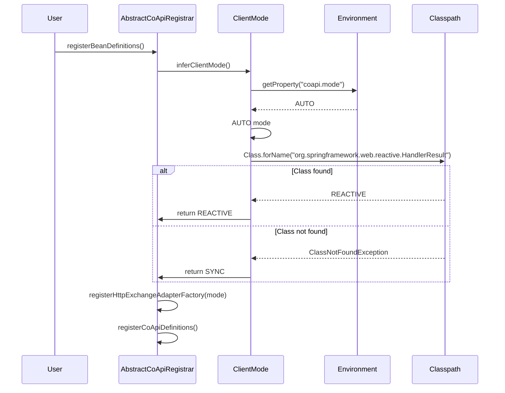
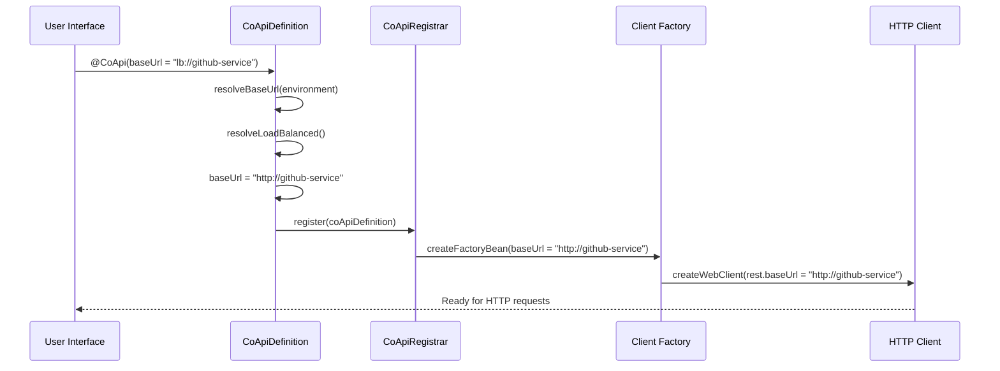

# Staff Engineer 指南：CoApi 架构

## 执行摘要

CoApi 是一个 Spring Framework 库，为 Spring 6 HTTP Interface 客户端提供零样板自动配置。该库利用 Spring 的 ImportBeanDefinitionRegistrar 机制将 @CoApi 注解的接口转换为每个接口两个 bean：（1）通过 FactoryBean 的 HTTP 客户端 bean（WebClient 或 RestClient），以及（2）通过 HttpServiceProxyFactory 的代理 bean，委托给 HTTP 客户端。SPI 模式（HttpExchangeAdapterFactory）允许在不改写用户代码的情况下切换响应式和同步模式。

## 一个核心架构洞察

CoApi 使用 Spring 的 **ImportBeanDefinitionRegistrar 机制**将声明式接口定义与命令式 HTTP 客户端实现桥接。这创建了一个编译时接口定义，在运行时被转换为具有自动发现、配置和代理生成的完全可用的 HTTP 客户端。

该架构遵循**每接口两个 bean** 模式：

1. **HTTP Client Bean** - WebClient（响应式）或 RestClient（同步）FactoryBean
2. **Proxy Bean** - 通过 HttpServiceProxyFactory 的 JDK 代理，委托给 HTTP 客户端

这种分离允许库：

- 通过接口定义保持类型安全
- 通过可配置的 HTTP 客户端提供运行时灵活性
- 通过 HttpExchangeAdapterFactory SPI 实现可插拔适配器

## 系统架构概览



## 核心组件职责

### CoApiDefinition ([source](https://github.com/Ahoo-Wang/CoApi/blob/main/spring/src/main/kotlin/me/ahoo/coapi/spring/CoApiDefinition.kt#L24))

将 @CoApi 注解解析为元数据：

- **name**：解析后的客户端名称（默认为类名）
- **apiType**：接口类
- **baseUrl**：支持 `lb://` 和 `http://` 协议，带占位符解析
- **loadBalanced**：确定是否使用服务发现

### CoApiRegistrar ([source](https://github.com/Ahoo-Wang/CoApi/blob/main/spring/src/main/kotlin/me/ahoo/coapi/spring/CoApiRegistrar.kt#L22))

向 BeanDefinitionRegistry 注册 bean：

- 根据 ClientMode 创建 HTTP 客户端 FactoryBean
- 创建用于代理生成的 CoApiFactoryBean
- 处理 bean 名称解析和冲突检测

### AbstractCoApiRegistrar ([source](https://github.com/Ahoo-Wang/CoApi/blob/main/spring/src/main/kotlin/me/ahoo/coapi/spring/AbstractCoApiRegistrar.kt#L28))

模板方法模式实现：

- 从 Spring 环境推断 ClientMode
- 注册 HttpExchangeAdapterFactory
- 委托给子类进行定义发现

### CoApiFactoryBean ([source](https://github.com/Ahoo-Wang/CoApi/blob/main/spring/src/main/kotlin/me/ahoo/coapi/spring/CoApiFactoryBean.kt#L21))

通过 HttpServiceProxyFactory 创建 JDK 代理：

- 从 SPI 解析 HttpExchangeAdapter
- 使用适配器构建 HttpServiceProxyFactory
- 创建委托给 HTTP 客户端的代理实例

### HttpExchangeAdapterFactory ([source](https://github.com/Ahoo-Wang/CoApi/blob/main/spring/src/main/kotlin/me/ahoo/coapi/spring/HttpExchangeAdapterFactory.kt#L19))

用于可插拔适配器的 SPI 接口：

- **SyncHttpExchangeAdapterFactory**：基于 RestClient 的适配器
- **ReactiveHttpExchangeAdapterFactory**：基于 WebClient 的适配器
- 支持在响应式和同步实现之间运行时切换

## 配置模式

### 自动配置模式

```kotlin
@AutoConfiguration
@ConditionalOnCoApiEnabled
class CoApiAutoConfiguration {
    // 通过 classpath 扫描自动扫描 @CoApi 接口
    // 使用 Spring Boot 的 AutoConfigurationPackages
}
```

### 手动配置模式

```kotlin
@EnableCoApi(clients = [GitHubApiClient::class, UserServiceClient::class])
@SpringBootApplication
class Application
```

## 客户端模式选择

库自动确定适当的 HTTP 客户端类型：



## 协议解析

### 负载均衡协议（`lb://`）



### 直接协议（`http://`）

```kotlin
// Direct HTTP protocol
@CoApi(baseUrl = "https://api.github.com")
interface GitHubApiClient {
    @GetExchange("repos/{owner}/{repo}")
    fun getRepository(@PathVariable owner: String, @PathVariable repo: String): Mono<Repository>
}
```

## 对比：CoApi vs 替代方案

| 特性 | CoApi | OpenFeign | 手动 HTTP Interface |
|---------|-------|-----------|---------------------|
| **设置复杂度** | 零样板 | 中等 | 高 |
| **响应式支持** | 原生支持 | 有限 | 手动 |
| **协议支持** | `lb://` + `http://` | `lb://` + `http://` | 仅 `http://` |
| **客户端模式** | 自动检测 | 仅同步 | 手动配置 |
| **Bean 注册** | 自动 | 自动 | 手动 |
| **SPI 灵活性** | HttpExchangeAdapterFactory | 有限 | 无 |
| **类型安全** | 基于接口 | 基于接口 | 基于接口 |
| **Spring 集成** | 深度集成 | 深度集成 | 手动 |

## 核心模式实现

### Go 实现（替代模式）

```go
// CoApi pattern implementation in Go
type CoApiRegistrar struct {
    registry   *BeanRegistry
    clientMode ClientMode
}

type CoApiDefinition struct {
    Name       string
    ApiType    reflect.Type
    BaseURL    string
    LoadBalanced bool
}

type CoApiFactoryBean struct {
    definition CoApiDefinition
    httpClient HTTPClient
}

func (r *CoApiRegistrar) Register(definitions []CoApiDefinition) {
    for _, def := range definitions {
        r.registerHTTPClient(def)
        r.registerProxy(def)
    }
}

func (r *CoApiRegistrar) registerHTTPClient(def CoApiDefinition) {
    if def.LoadBalanced {
        httpClient := NewLoadBalancedClient(def.BaseURL)
        r.registry.Register(def.Name+"HttpClient", httpClient)
    } else {
        httpClient := NewDirectClient(def.BaseURL)
        r.registry.Register(def.Name+"HttpClient", httpClient)
    }
}

func (r *CoApiRegistrar) registerProxy(def CoApiDefinition) {
    httpClient := r.registry.Get(def.Name + "HttpClient")
    proxy := NewProxy(def.ApiType, httpClient)
    r.registry.Register(def.Name+"Proxy", proxy)
}
```

### Python 实现（替代模式）

```python
# CoApi pattern implementation in Python
from abc import ABC, abstractmethod
from dataclasses import dataclass
from typing import Type, Any
import inspect

@dataclass
class CoApiDefinition:
    name: str
    api_type: Type
    base_url: str
    load_balanced: bool = False

class HttpExchangeAdapter(ABC):
    @abstractmethod
    def create_client(self, definition: CoApiDefinition) -> Any:
        pass

class CoApiRegistrar:
    def __init__(self, registry, client_mode):
        self.registry = registry
        self.client_mode = client_mode
    
    def register(self, definitions):
        for definition in definitions:
            self._register_http_client(definition)
            self._register_proxy(definition)
    
    def _register_http_client(self, definition):
        adapter = self._create_adapter(definition)
        client = adapter.create_client(definition)
        self.registry.register(f"{definition.name}.HttpClient", client)
    
    def _create_adapter(self, definition):
        if self.client_mode == "reactive":
            return ReactiveHttpAdapter()
        else:
            return SyncHttpAdapter()
```

## 设计权衡

### 灵活性 vs 复杂性

**CoApi 方法：**

- 单接口定义
- 运行时客户端选择
- 需要 Spring 容器
- 仅限于 Spring 生态系统

**手动方法：**

- 框架无关
- 冗长的配置
- 无自动发现

### 响应式 vs 同步

**响应式优势：**

- 非阻塞 I/O
- 背压支持
- 学习曲线较陡
- 错误处理更复杂

**同步优势：**

- 简单的思维模型
- 直接的错误处理
- 阻塞 I/O
- 可扩展性有限

### 自动配置 vs 手动控制

**自动配置：**

- 零样板设置
- 约定优于配置
- 对细节的控制较少
- 难以调试

**手动配置：**

- 完全控制 bean
- 更容易调试
- 更冗长的设置
- 容易出现配置错误

## 决策日志

### 版本 1.0.0 - 核心架构

- **决策**：实现 ImportBeanDefinitionRegistrar 模式
- **理由**：在运行时灵活性的同时提供编译时安全性
- **权衡**：需要 Spring 框架依赖
- **实现**：[spring/src/main/kotlin/me/ahoo/coapi/spring/CoApiRegistrar.kt](https://github.com/Ahoo-Wang/CoApi/blob/main/spring/src/main/kotlin/me/ahoo/coapi/spring/CoApiRegistrar.kt)

### 版本 1.1.0 - 响应式支持

- **决策**：添加 HttpExchangeAdapterFactory SPI
- **理由**：允许在响应式和同步客户端之间切换
- **权衡**：bean 注册复杂性增加
- **实现**：[spring/src/main/kotlin/me/ahoo/coapi/spring/HttpExchangeAdapterFactory.kt](https://github.com/Ahoo-Wang/CoApi/blob/main/spring/src/main/kotlin/me/ahoo/coapi/spring/HttpExchangeAdapterFactory.kt)

### 版本 1.2.0 - 负载均衡

- **决策**：支持 `lb://` 协议前缀
- **理由**：启用服务发现集成
- **权衡**：需要额外的协议解析逻辑
- **实现**：[spring/src/main/kotlin/me/ahoo/coapi/spring/CoApiDefinition.kt:84-88](https://github.com/Ahoo-Wang/CoApi/blob/main/spring/src/main/kotlin/me/ahoo/coapi/spring/CoApiDefinition.kt#L84)

### 版本 2.0.0 - 自动配置

- **决策**：添加带有 classpath 扫描的 Spring Boot starter
- **理由**：通过零配置设置改善开发者体验
- **权衡**：魔术配置可能更难调试
- **实现**：[spring-boot-starter/src/main/kotlin/me/ahoo/coapi/spring/boot/starter/AutoCoApiRegistrar.kt](https://github.com/Ahoo-Wang/CoApi/blob/main/spring-boot-starter/src/main/kotlin/me/ahoo/coapi/spring/boot/starter/AutoCoApiRegistrar.kt)

## 使用模式

### 基本用法

```kotlin
@CoApi(baseUrl = "https://api.github.com")
interface GitHubApiClient {
    @GetExchange("repos/{owner}/{repo}")
    fun getRepository(@PathVariable owner: String, @PathVariable repo: String): Mono<Repository>
    
    @PostExchange("users")
    fun createUser(@RequestBody user: User): Mono<User>
}

@Service
class GitHubService(
    private val gitHubApi: GitHubApiClient
) {
    fun fetchRepository(owner: String, repo: String): Mono<Repository> {
        return gitHubApi.getRepository(owner, repo)
    }
}
```

### 负载均衡用法

```kotlin
@CoApi(serviceId = "user-service") // Resolves to lb://user-service
interface UserApiClient {
    @GetExchange("users/{id}")
    fun getUser(@PathVariable id: String): Mono<User>
    
    @GetExchange("users")
    fun getUsers(): Flux<User>
}

@LoadBalanced // 显式负载均衡注解
@CoApi(baseUrl = "lb://order-service")
interface OrderApiClient {
    // 负载均衡订单服务调用
}
```

### 配置属性

```yaml
# application.yml
coapi:
  mode: reactive  # AUTO, REACTIVE, SYNC
  base-packages:
    - com.example.clients
    - com.example.services
```

## 性能考虑

### 内存开销

- 每个 @CoApi 接口创建 2 个 bean（HTTP 客户端 + 代理）
- 使用 JDK 动态代理的代理创建是轻量级的
- FactoryBean 支持延迟初始化

### 网络配置

- WebClient 默认池化 HTTP 连接
- RestClient 使用 Java 内置 HTTP 客户端
- 负载均衡与 Spring Cloud LoadBalancer 集成

### 线程安全

- 所有 bean 是无状态和线程安全的
- WebClient 实例是共享和线程安全的
- 代理实例是线程安全的委托

## 扩展点

### 自定义 HttpExchangeAdapter

```kotlin
class CustomHttpExchangeAdapterFactory : HttpExchangeAdapterFactory {
    override fun create(beanFactory: BeanFactory, httpClientName: String): HttpExchangeAdapter {
        val httpClient = beanFactory.getBean(httpClientName)
        return CustomHttpExchangeAdapter(httpClient)
    }
}
```

### 自定义协议解析

```kotlin
class CustomCoApiDefinition : CoApiDefinition {
    override fun resolveBaseUrl(environment: Environment): String {
        // Custom protocol resolution logic
        return customResolve(environment)
    }
}
```

## 故障排除

### 常见问题

1. **Bean 未找到**
   ```
   Bean creation failed; nested exception is org.springframework.beans.factory.NoSuchBeanDefinitionException
   ```
   - 检查 @CoApi 注解是否存在
   - 验证包在组件扫描路径中

2. **客户端模式不匹配**
   ```
   Cannot create bean of type WebClient when mode is SYNC
   ```
   - 检查 `coapi.mode` 属性
   - 确保正确的 Spring WebFlux 依赖

3. **协议解析问题**
   ```
   Unknown protocol: lb://
   ```
   - 验证服务发现已配置
   - 检查 LoadBalancer 依赖是否存在

### 调试模式

```kotlin
@Configuration
@ConditionalOnProperty(name = "coapi.debug", havingValue = "true")
class CoApiDebugConfiguration {
    // 启用调试日志记录和额外诊断
}
```

## 未来路线图

### 短期目标

- [ ] OpenTelemetry 集成
- [ ] 请求/响应拦截器
- [ ] 断路器支持
- [ ] 指标收集

### 长期愿景

- [ ] 多框架支持（Quarkus、Micronaut）
- [ ] Protocol buffer 支持
- [ ] GraphQL 集成
- [ ] gRPC 客户端支持

## 结论

CoApi 展示了如何利用 Spring 强大的扩展机制来创建复杂的客户端库。ImportBeanDefinitionRegistrar 模式为自动配置 HTTP 客户端问题提供了一个优雅的解决方案，同时保持类型安全和灵活性。

每接口两个 bean 模式和基于 SPI 的适配器系统创建了一个可以随 Spring 生态系统发展同时保持向后兼容性的基础。通过专注于零样板 HTTP 客户端配置的核心问题，CoApi 为开发者提供了一个构建微服务应用程序的强大而简单的工具。

CoApi 中做出的架构决策反映了灵活性和简单性之间的平衡，每个权衡都经过仔细考虑，以在保持系统完整性和性能的同时提供最佳开发者体验。

---

*本指南从 CoApi 代码库生成，反映了截至[current_date]对架构的最新理解。有关最新信息，请参阅[GitHub](https://github.com/Ahoo-Wang/CoApi)上的源代码。*
